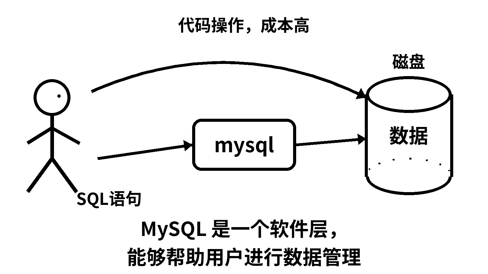
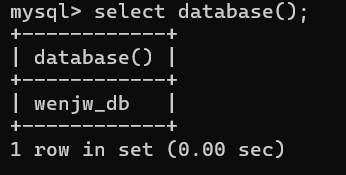
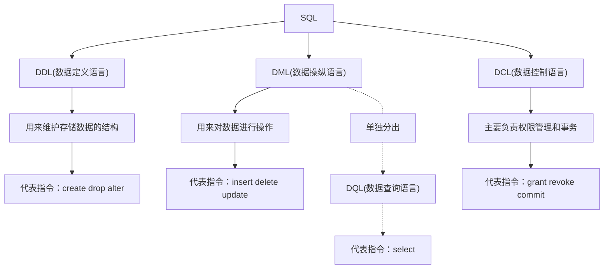

# 01 数据库基础

## 一、什么是数据库

mysql——数据库的客户端

mysqld——数据库的服务端

狭义：以特定格式保存好的文件，叫做数据库。

广义：提供较为便捷的数据存取服务的软件集合，解决方案，叫做数据库。

存储数据用文件就可以了。为什么还要弄个数据库？

文件或数据库，都可以进行数据的存储，但是，如果选择文件的方式，数据内容的管理工作需要程序员自己做。数据库的本质是对文件提供基本的内容操作，不用程序员手动进行数据管理。

文件保存数据有如下几个缺点：

- 文件安全性问题
- 文件不利于数据查询和管理
- 文件不利于存储海量数据
- 文件在程序中控制不方便



数据库其实也是一种”文件系统“。

数据库存储介质：

- 磁盘
- 内存

为了解决上述问题，专家们设计出更加利于数据内容管理的东西——数据库，他能更有效的管理数据。**数据库的水平是衡量一个程序员水平的重要指标。**

## 二、主流数据库

- SQL Sever： 微软的产品，.Net程序员的最爱，中大型项目。
- Oracle： 甲骨文产品，适合大型项目，复杂的业务逻辑，并发一般来说不如MySQL。
- MySQL：世界上最受欢迎的数据库，属于甲骨文，并发性好，不适合做复杂的业务。主要用在电商，SNS，论坛。对简单的SQL处理效果好。
- PostgreSQL :加州大学伯克利分校计算机系开发的关系型数据库，不管是私用，商用，还是学术研究使用，可以免费使用，修改和分发。
- SQLite： 是一款轻型的数据库，是遵守ACID的关系型数据库管理系统，它包含在一个相对小的C库中。它的设计目标是嵌入式的，而且目前已经在很多嵌入式产品中使用了它，它占用资源非常的低，在嵌入式设备中，可能只需要几百K的内存就够了。
- H2： 是一个用Java开发的嵌入式数据库，它本身只是一个类库，可以直接嵌入到应用项目中。

## 三、基本使用

### 1.连接服务器

mysql的默认端口号是3306，它是一套网络服务。

```shell
[bbjsxl@VM-20-8-centos mysql]$ mysql -h 127.0.0.1 -P 3306 -u bbjsxl -p
Enter password: 
```


**注意：**

> 如果没有写 -h 127.0.0.1 默认是连接本地
> 如果没有写 -P 3306 默认是连接3306端口号

### 2.服务器管理

- 执行 win+r 输入 services.msc 打开服务管理器
- 通过下图左侧停止，暂停，重启动按钮进行服务管理


### 3.服务器，数据库，表关系

- 所谓安装数据库服务器，只是在机器上安装了一个数据库管理系统程序，这个管理程序可以管理多个数据库，一般开发人员会针对每一个应用创建一个数据库。

- 为保存应用中实体的数据，一般会在数据库中创建多个表，以保存程序中实体的数据。

- 数据库服务器、数据库和表的关系如下：

  
  
  - MySQL就是一个命令行的client。
  - 当然未来也有图形化界面的访问数据库软件。
  - MySQL的生态中，也会提供第三方库，让语言也能直接访问MySQL。

### 4.使用案例

- 创建数据库

  ```sql
  mysql> create database ahweiDB;
  Query OK, 1 row affected (0.00 sec)
  ```
  


**创建一个数据库本质是在Linux上建立了一个目录。**

本质上：在客户端构建一个sql，sql通过网络或本地进程间通信交给服务端进程。服务端进程收到了这条sql指令，在他的进程内部，一定有它的系统调用，帮我们创建了目录。

- 使用数据库

  ```sql
  mysql> use ahweiDB;
  Database changed
  ```

  怎么知道进入了呢？

  ```sql
  select database();
  ```

  

  这里的进入，就相当于Linux中的`cd`。

  查看建好的数据库：

  ```sql
  mysql> show databases;
  +--------------------+
  | Database           |
  +--------------------+
  | film               |
  | information_schema |
  | mysql              |
  | performance_schema |
  | ssm                |
  | sys                |
  | wenjw_db           |
  | yn                 |
  +--------------------+
  8 rows in set (0.00 sec)
  ```

- 创建数据库表

  ```sql
  CREATE TABLE wenjw_Stu (
      Sno INT PRIMARY KEY,
      Sname VARCHAR(100),
      Sdept VARCHAR(100),
      Stel VARCHAR(20),
      Sex VARCHAR(10),
      Sage INT,
      Saddr VARCHAR(200),
      Spost VARCHAR(10)
  );
  ```
  查看建好的表：
  ```sql
  mysql> show tables;
  +--------------------+
  | Tables_in_wenjw_db |
  +--------------------+
  | wenjw_cou          |
  | wenjw_sc           |
  | wenjw_stu          |
  +--------------------+
  3 rows in set (0.00 sec)
  ```

  **创建表本质是在Linux里创建对应的文件。**

- 表中插入数据

  ```sql
  INSERT INTO wenjw_Stu (Sno, Sname, Sdept, Stel, Sex, Sage, Saddr, Spost) VALUES 
  (2101, '温家伟', '理学院', '19858180826', '男', 19, '山西省', '037000'),
  (2102, '金娇薄', '计院', '19157934071', '女', 20, '浙江省', '315000'),
  (2103, '毛假发', '法学院', '15678901234', '女', 21, '美国', '510000'),
  (2104, '曾辽远', '理学院', '13609876543', '男', 20, '山东市', '518000'),
  (2005, '秋晓荷', '理学院', '13789012345', '女', 21, '浙江省', '610000'),
  (2006, '朱甜甜', '计院', '15908765432', '女', 20, '吉林省', '311100');
  ```
  插入数据——向文件写入数据，但mysqld不会立刻写入，mysql有自己的缓存。
- 查询表中数据

  ```sql
  mysql> select * from wenjw_stu;
  +------+--------+--------+-------------+------+------+--------+--------+
  | Sno  | Sname  | Sdept  | Stel        | Sex  | Sage | Saddr  | Spost  |
  +------+--------+--------+-------------+------+------+--------+--------+
  | 2005 | 秋晓荷 | 理学院 | 13789012345 | 女   |   21 | 浙江省 | 610000 |
  | 2006 | 朱甜甜 | 计院   | 15908765432 | 女   |   20 | 吉林省 | 311100 |
  | 2101 | 温家伟 | 理学院 | 19858180826 | 男   |   19 | 山西省 | 037000 |
  | 2102 | 金娇薄 | 计院   | 19157934071 | 女   |   20 | 浙江省 | 315000 |
  | 2103 | 毛假发 | 法学院 | 15678901234 | 女   |   21 | 美国   | 510000 |
  | 2104 | 曾辽远 | 理学院 | 13609876543 | 男   |   20 | 山东市 | 518000 |
  | 2105 | 张宇   | 理学院 | 15935231685 | 男   |   19 | 辽宁省 | 025000 |
  | 2106 | 周宇浪 | 计院   | 13118722410 | 男   |   20 | 河南省 | 014500 |
  | 2111 | 陈王子 | 理学院 | 12345670890 | 男   |   19 | 北京市 | 037000 |
  | 2112 | 张三   | 计院   | 18914160052 | 男   |   19 | 上海市 | 062000 |
  +------+--------+--------+-------------+------+------+--------+--------+
  10 rows in set (0.00 sec)
  ```
  查看表结构`desc`
  ```sql
  mysql> desc wenjw_stu;
  +-------+--------------+------+-----+---------+-------+
  | Field | Type         | Null | Key | Default | Extra |
  +-------+--------------+------+-----+---------+-------+
  | Sno   | int          | NO   | PRI | NULL    |       |
  | Sname | varchar(100) | YES  |     | NULL    |       |
  | Sdept | varchar(100) | YES  |     | NULL    |       |
  | Stel  | varchar(20)  | YES  |     | NULL    |       |
  | Sex   | varchar(10)  | YES  |     | NULL    |       |
  | Sage  | int          | YES  |     | NULL    |       |
  | Saddr | varchar(200) | YES  |     | NULL    |       |
  | Spost | varchar(10)  | YES  |     | NULL    |       |
  +-------+--------------+------+-----+---------+-------+
  8 rows in set (0.02 sec)
  ```

- 清屏

  MySQL没有清屏命令，他的内容又比较多，很容易占满屏幕。用system执行系统命令。

  ```sql
  system clear
  ```


### 5.数据逻辑存储

MySQL是以行和列的形式存储数据的，方便信息的筛选。


## 四、Mysql架构

MySQL 是一个可移植的数据库，几乎能在当前所有的操作系统上运行，如 Unix/Linux、Windows、Mac 和 Solaris。各种系统在底层实现方面各有不同，但是 MySQL 基本上能保证在各个平台上的物理体系结构的一致性。


MySQL宏观上分三层：

- 链接认证层：

  链接管理（比如长时间联网但不访问，把链接关掉），鉴权安全，MySQL底层其实是多线程。

- 编译优化层：

  词法语法分析，性能调优。

- 存储引擎层：

  负责数据的存储和提取，与文件系统的管理是大同小异的。

> 从系统的角度看：MySQL架构是应用进程的代码
>
> 从网络的角度看：MySQL架构是应用层协议的一种

## 五、SQL分类



- 数据库的基本功能
  - DDL：对数据库和表结构，更多的是属性操作
  - DML：对数据库和表结构，更多的是内容操作

- 数据库的高级功能
  - DCL：整个Mysql的系统安全、账户管理工作，主动和被动下都是比较可靠的

## 六、 存储引擎

### 1.存储引擎

存储引擎是：数据库管理系统如何存储数据、如何为存储的数据建立索引和如何更新、查询数据等技术的实现方法。
**MySQL的核心就是插件式存储引擎，支持多种存储引擎。**

### 2.查看存储引擎

```sql
show engines;
```

```sql
mysql> show engines;
+--------------------+---------+----------------------------------------------------------------+--------------+------+------------+
| Engine             | Support | Comment                                                        | Transactions | XA   | Savepoints |
+--------------------+---------+----------------------------------------------------------------+--------------+------+------------+
| MEMORY             | YES     | Hash based, stored in memory, useful for temporary tables      | NO           | NO   | NO         |
| MRG_MYISAM         | YES     | Collection of identical MyISAM tables                          | NO           | NO   | NO         |
| CSV                | YES     | CSV storage engine                                             | NO           | NO   | NO         |
| FEDERATED          | NO      | Federated MySQL storage engine                                 | NULL         | NULL | NULL       |
| PERFORMANCE_SCHEMA | YES     | Performance Schema                                             | NO           | NO   | NO         |
| MyISAM             | YES     | MyISAM storage engine                                          | NO           | NO   | NO         |
| InnoDB             | DEFAULT | Supports transactions, row-level locking, and foreign keys     | YES          | YES  | YES        |
| ndbinfo            | NO      | MySQL Cluster system information storage engine                | NULL         | NULL | NULL       |
| BLACKHOLE          | YES     | /dev/null storage engine (anything you write to it disappears) | NO           | NO   | NO         |
| ARCHIVE            | YES     | Archive storage engine                                         | NO           | NO   | NO         |
| ndbcluster         | NO      | Clustered, fault-tolerant tables                               | NULL         | NULL | NULL       |
+--------------------+---------+----------------------------------------------------------------+--------------+------+------------+
11 rows in set (0.00 sec)
```

**default：**默认存储引擎，这是我们配置过的。


