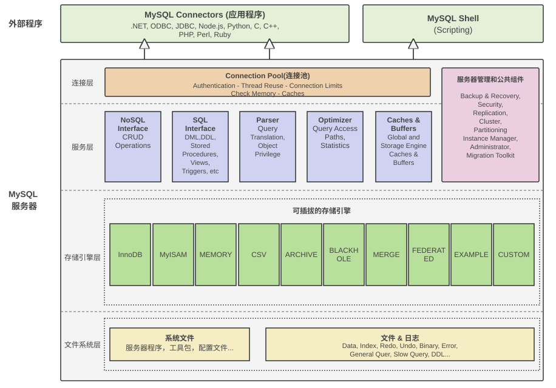
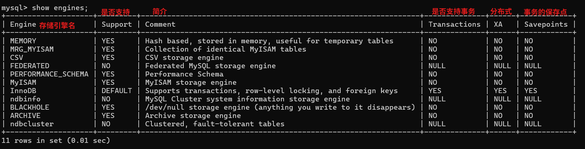

# MySQL架构和存储引擎

## 一、MySQL架构

MySQL8.0服务器是由连接池、服务管理工具和公共组件、NoSQL 接口、SQL 接口、解析器、优化器、缓存、存储引擎、文件系统组成。MySQL 还为各种编程语言提供了一套用于外部程序访问服务器的连接器。



- MySQL Connectors：编程语言 API 接口；
- MySQL Shell：是一个高级客户端和代码编辑器，以组件的形式提供，需要单独安装。除了提供类似于 mysql 客户端的功能，还可以用 JavaScript 和 python 调用 MySQL 的 API，一般为开发人员使用；
- 连接层：对客户端连接进行权限校验并保存客户端的连接信息，通过池化技术实现线程重用，以及根据具体的配置限制连接数量；
- 服务管理和公共组件：提供了数据备份与恢复，安全组件，主从复制和集群管理，表分区等实用功能；
- 服务层：提供了 NoSQL API，SQL API，SQL 语句解析，SQL 语句优化，SQL 语句缓存等组件，并将优化后的 SQL 语句发送至存储引擎执行相应的操作并返回结果；
- 存储引擎层：一系列可插拔的存储引擎，主要负责数据的写入和读取，与底层的数据和日志文件进行交互，可以根据具体的业务需求选择不同的存储引擎；
- 文件系统层：包含了 MySQL 发行版的文件和程序，以及具体数据库文件和日志。

### 1.1 连接层

处理客户端的连接。

### 1.2 服务层

### 1.3 存储引擎

查看存储引擎：

```sql
show engines;
```

