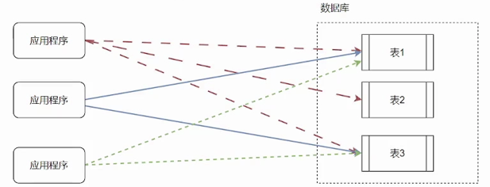
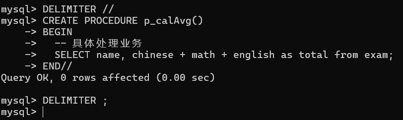
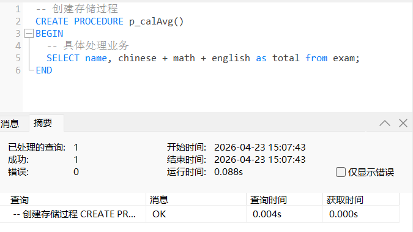
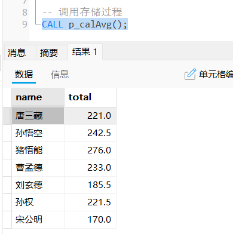
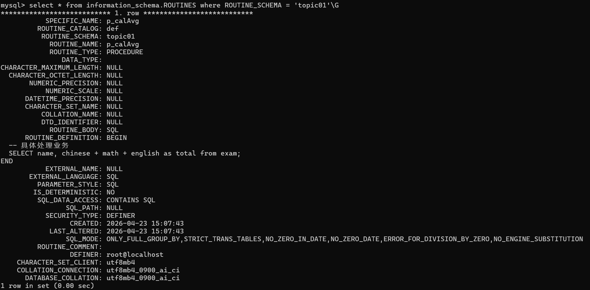
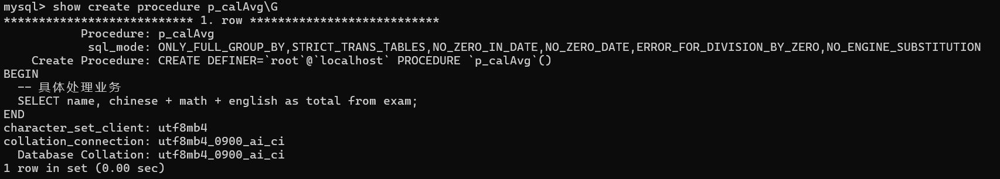
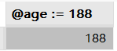
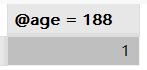

# 存储过程与触发器

## 一、存储过程

存储过程是⼀组为了完成特定功能的 SQL 语句集，经编译后存储在数据库中，用户通过指定存储 过程的名字和参数来执行，并获取相应的结果。可以理解为 SQL 语言实现的方法。

### 1.特点

应用程序直接操作表 vs 应用程序通过存储过程操作表：

- 应用程序直接操作表：应用程序处理业务逻辑时可以分散压力，从而提高性能，这时数据库主要用于数据的存储和检索

  

- 通过存储过程操作表：将业务逻辑封装在数据库内部，减少应用程序的复杂性；集中管理数据库操作，便于维护和更新；可以被多次调用，提高代码的重用性

  

  

### 2.优缺点

#### 2.1 优点

- 性能优化：存储过程在创建时编译并存储在数据库中，执行速度比单个 SQL 语句快
- 代码重用：存储过程可以重复调用，减少重复代码，提高代码的可维护性
- 安全性：可以限制用户直接访问数据库，通过存储过程简介访问，从而保证系统安全性
- 事务管理：可以在存储过程中实现复杂的事务逻辑
- 降低耦合：当表结构发生变化时，只需要修改相应的存储过程

#### 2.2 缺点

- 可移植性差：不同种类数据库存储过程语法有差别，更换数据库时需要重新编写
- 调试困难：只有少数数据库管理系统支持存储过程的调试，开发和维护困难
- 不适合高并发场景：在高并发场景下，存储过程可能会增加数据库的压力，难以维护

### 3.语法

我们首先使用 [sql脚本](sql\16.sql) 创建数据库表。

#### 3.1 创建

```sql
-- 修改SQL语句结束标识符为 //
DELIMITER //

-- 创建存储过程
CREATE PROCEDURE 存储过程名 (参数列表)
BEGIN
    -- SQL 语句
END //

-- 修改SQL语句结束标识符为 ;
DELIMITER ;
```

命令行和 `navicat` 不同，`;` 代表 `sql` 语句的结束，所以要修改结束标识符。

```sql
DELIMITER //
CREATE PROCEDURE p_calAvg()
BEGIN
  -- 具体处理业务
  SELECT name, chinese + math + english as total from exam;
END//
DELIMITER ;
```



#### 3.2 调用

```sql
-- 调⽤存储过程
CALL 存储过程名(参数列表);
```

#### 3.3 查看

```sql
-- 查看指定数据库中创建的存储过程
SELECT * FROM information_schema.ROUTINES WHERE ROUTINE_SCHEMA = '数据库名';

-- 查看存储过程的定义
SHOW CREATE PROCEDURE 存储过程名;
```

#### 3.4 删除

```sql
DROP PROCEDURE [IF EXISTS] 存储过程名;
```

#### 3.5 示例

- 计算所有学生总分

  ```sql
  -- 创建存储过程
  CREATE PROCEDURE p_calAvg()
  BEGIN
    -- 具体处理业务
    SELECT name, chinese + math + english as total from exam;
  END
  
  -- 调用存储过程
  CALL p_calAvg();
  ```

  运行后会编译并存储到数据库中：

  

  此时在函数中已有 `p_calAvg`。

  使用 `CALL` 关键字调用存储过程：

  

  查看存储过程：

  

  查看存储过程定义：

  

### 4.变量

在 Mysql 中变量可以i分为三类：系统变量、用户自定义变量、以及局部变量。

#### 4.1 系统变量

是 Mysql 服务器的配置变量，控制着服务器的行为和性能，分为全局变量和会话变量。

- 全局变量（GLOBAL）：是服务器级别的设置，影响的是整个 MySQL 实例。通常对后面新建立的连接生效；
- 会话变量（SESSION）：是当前连接级别的设置，只影响你现在这个客户端的连接，不影响别人。

##### 4.1.1 查看系统变量

```sql
-- 查看所有系统变量（不指定，默认是session）
SHOW [GLOBAL|SESSION] VARIABLES;

-- 查看指定的系统变量
SHOW [GLOBAL|SESSION] VARIABLES LIKE 'xxx';

-- 查看指定的系统变量，可以通过LIKE进行模糊查询
SHOW [GLOBAL|SESSION] VARIABLES LIKE '%xxx%';

-- 使用SELECT查看指定系统变量
SELECT @@[GLOBAL|SESSION].系统变量名;

-- ------------------------------------
-- 示例: 查看以auto开头的全局系统变量
SHOW GLOBAL VARIABLES LIKE 'auto%';

-- 示例: 查看以char开头的会话系统变量
SHOW SESSION VARIABLES LIKE 'char%';

-- 示例: 查看事务自动提交全局系统变量
SELECT @@GLOBAL.autocommit;
```

##### 4.1.2 设置系统变量

```sql
-- 系统变量设置语法
SET [GLOBAL|SESSION] 系统变量名 = 值;

SET @@SESSION.系统变量名 = 值;

----------------------------------------
-- 示例: 设置事务自动提交会话变量 关闭/开启
SET @@SESSION.autocommit = 0;

SET autocommit = 1;
```

**修改会话级别的值不影响全局变量的值，下一个会话开启之后还是读取全局变量的值。且如果想要全局变量重启后仍生效，需修改选项文件。**

#### 4.2 用户自定义变量

用户自定义变量是在 SQL 会话中定义的变量，不用提前声明，作用域为当前会话。

**保存查询的中间结果，方便后续使用。**

##### 4.2.1 赋值

```sql
-- 方式一
SET @var_name = expr [, @var_name]...;

-- 方式二【推荐】(因为 = 有赋值和判等两重含义)
SET @var_name := expr [, @var_name]...;

-- 方式三: 在SELECT语句中
SELECT @var_name := expr [, @var_name]...;

-- 方式四: 查询结果赋值给自定义变量
SELECT 列名 INTO @var_name FROM 表名 WHERE ...;
```

##### 4.2.2 使用

```sql
-- 声明 + 赋值
SET @age := 18;
SELECT @age;

-- 修改
SET @age := 108;
SELECT @age;

-- 赋值 + 查询
SELECT @age := 188;

-- 查询结果赋值
SELECT COUNT(*) INTO @stu_count FROM student;
SELECT @stu_count;

-- 访问未赋值的变量，返回 NULL
SELECT @ahwei;
```

比较赋值和判等：

| 赋值                   | 判等                   |
| ---------------------- | ---------------------- |
| `SELECT @age := 188;`  | `SELECT @age = 188;`   |
|  |  |

#### 4.3 局部变量

局部变量只在存储过程、函数或触发器的范围内生效。需要使用 `DECLARE` 声明，作用域的范围在声明的 `BEGIN ... END` 块内。

##### 4.3.1 声明

- 变量可以是任何有效的 Mysql 数据类型，如 `INT`、`VARCHAR`、`DATETIME` 等

  ```sql
  DECLARE 变量名 变量类型 [DEFAULT 默认值] ...;
  ```

##### 4.3.2 赋值

```sql
-- 方式一
SET var_name = 值;

-- 方式二 【推荐】
SET var_name := 值;

-- 方式三: 查询结果赋值给自定义变量
SELECT 列名 INTO var_name FROM 表名 WHERE ...;
```

##### 4.3.3 使用

```sql
-- 示例: 在存储过程中定义局部变量记录学生表的总记录数
delimiter //

-- 创建存储过程
CREATE PROCEDURE p1()
BEGIN
  -- 定义局部变量
  DECLARE stu_count INT DEFAULT 0;
  -- 把查询结果赋值给局部变量
  SELECT count(*) INTO stu_count FROM student;
  -- 使用局部变量
  SELECT stu_count;
END//

delimiter ;

-- 调用存储过程
CALL p1();
```

