# 存储过程与触发器

## 一、存储过程

存储过程是一组为了完成特定功能的 SQL 语句集，经编译后存储在数据库中，用户通过指定存储过程的名字和参数来执行，并获取相应的结果。可以理解为 SQL 语言实现的方法。

### 1.特点

应用程序直接操作表 vs 应用程序通过存储过程操作表：

- 应用程序直接操作表：应用程序处理业务逻辑时可以分散压力，从而提高性能，这时数据库主要用于数据的存储和检索

  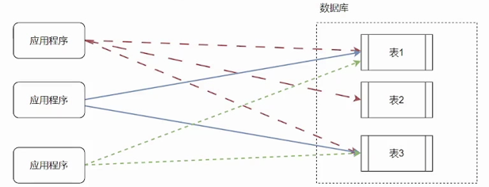

- 通过存储过程操作表：将业务逻辑封装在数据库内部，减少应用程序的复杂性；集中管理数据库操作，便于维护和更新；可以被多次调用，提高代码的重用性

  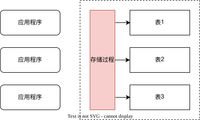


### 2.优缺点

#### 2.1 优点

- 性能优化：存储过程在创建时编译并存储在数据库中，执行速度比单个 SQL 语句快
- 代码重用：存储过程可以重复调用，减少重复代码，提高代码的可维护性
- 安全性：可以限制用户直接访问数据库，通过存储过程简介访问，从而保证系统安全性
- 事务管理：可以在存储过程中实现复杂的事务逻辑
- 降低耦合：当表结构发生变化时，只需要修改相应的存储过程

#### 2.2 缺点

- 可移植性差：不同种类数据库存储过程语法有差别，更换数据库时需要重新编写
- 调试困难：只有少数数据库管理系统支持存储过程的调试，开发和维护困难
- 不适合高并发场景：在高并发场景下，存储过程可能会增加数据库的压力，难以维护

### 3.语法

我们首先使用 [sql脚本](sql\16.sql) 创建数据库表。

#### 3.1 创建

```sql
-- 修改SQL语句结束标识符为 //
DELIMITER //

-- 创建存储过程
CREATE PROCEDURE 存储过程名 (参数列表)
BEGIN
    -- SQL 语句
END //

-- 修改SQL语句结束标识符为 ;
DELIMITER ;
```

命令行和 `navicat` 不同，`;` 代表 `sql` 语句的结束，所以要修改结束标识符。

```sql
DELIMITER //
CREATE PROCEDURE p_calAvg()
BEGIN
  -- 具体处理业务
  SELECT name, chinese + math + english as total from exam;
END//
DELIMITER ;
```

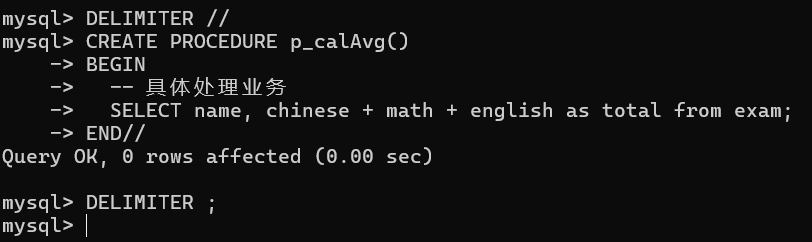

#### 3.2 调用

```sql
-- 调⽤存储过程
CALL 存储过程名(参数列表);
```

#### 3.3 查看

```sql
-- 查看指定数据库中创建的存储过程
SELECT * FROM information_schema.ROUTINES WHERE ROUTINE_SCHEMA = '数据库名';

-- 查看存储过程的定义
SHOW CREATE PROCEDURE 存储过程名;
```

#### 3.4 删除

```sql
DROP PROCEDURE [IF EXISTS] 存储过程名;
```

#### 3.5 示例

- 计算所有学生总分

  ```sql
  -- 创建存储过程
  CREATE PROCEDURE p_calAvg()
  BEGIN
    -- 具体处理业务
    SELECT name, chinese + math + english as total from exam;
  END
  
  -- 调用存储过程
  CALL p_calAvg();
  ```

  运行后会编译并存储到数据库中：

  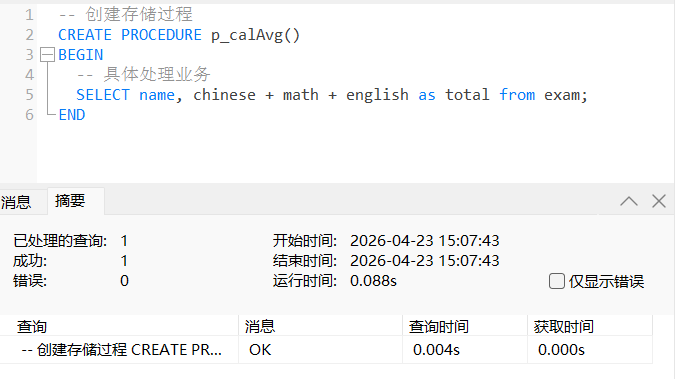

  此时在函数中已有 `p_calAvg`。

  使用 `CALL` 关键字调用存储过程：

  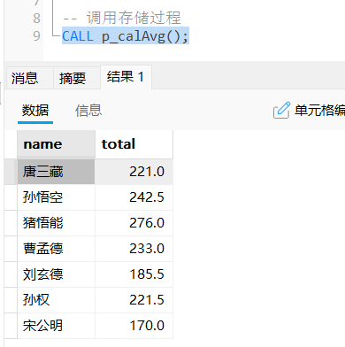

  查看存储过程：

  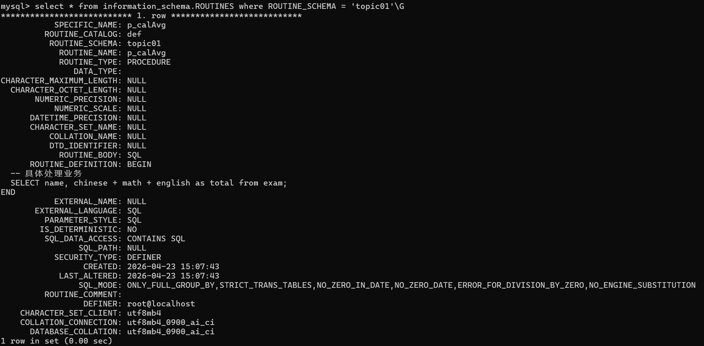

  查看存储过程定义：

  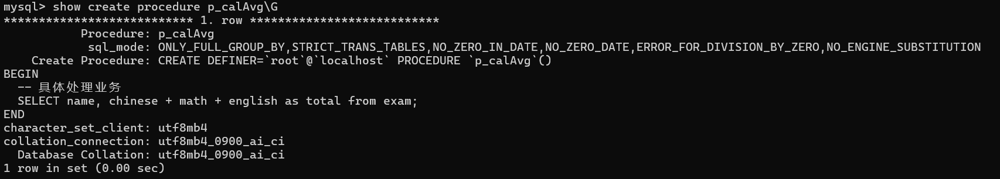

### 4.变量

在 Mysql 中变量可以i分为三类：系统变量、用户自定义变量、以及局部变量。

#### 4.1 系统变量

是 Mysql 服务器的配置变量，控制着服务器的行为和性能，分为全局变量和会话变量。

- 全局变量（GLOBAL）：是服务器级别的设置，影响的是整个 MySQL 实例。通常对后面新建立的连接生效；
- 会话变量（SESSION）：是当前连接级别的设置，只影响你现在这个客户端的连接，不影响别人。

##### 4.1.1 查看系统变量

```sql
-- 查看所有系统变量（不指定，默认是session）
SHOW [GLOBAL|SESSION] VARIABLES;

-- 查看指定的系统变量
SHOW [GLOBAL|SESSION] VARIABLES LIKE 'xxx';

-- 查看指定的系统变量，可以通过LIKE进行模糊查询
SHOW [GLOBAL|SESSION] VARIABLES LIKE '%xxx%';

-- 使用SELECT查看指定系统变量
SELECT @@[GLOBAL|SESSION].系统变量名;

-- ------------------------------------
-- 示例: 查看以auto开头的全局系统变量
SHOW GLOBAL VARIABLES LIKE 'auto%';

-- 示例: 查看以char开头的会话系统变量
SHOW SESSION VARIABLES LIKE 'char%';

-- 示例: 查看事务自动提交全局系统变量
SELECT @@GLOBAL.autocommit;
```

##### 4.1.2 设置系统变量

```sql
-- 系统变量设置语法
SET [GLOBAL|SESSION] 系统变量名 = 值;

SET @@SESSION.系统变量名 = 值;

----------------------------------------
-- 示例: 设置事务自动提交会话变量 关闭/开启
SET @@SESSION.autocommit = 0;

SET autocommit = 1;
```

**修改会话级别的值不影响全局变量的值，下一个会话开启之后还是读取全局变量的值。且如果想要全局变量重启后仍生效，需修改选项文件。**

#### 4.2 用户自定义变量

用户自定义变量是在 SQL 会话中定义的变量，不用提前声明，作用域为当前会话。

**保存查询的中间结果，方便后续使用。**

##### 4.2.1 赋值

```sql
-- 方式一
SET @var_name = expr [, @var_name]...;

-- 方式二【推荐】(因为 = 有赋值和判等两重含义)
SET @var_name := expr [, @var_name]...;

-- 方式三: 在SELECT语句中
SELECT @var_name := expr [, @var_name]...;

-- 方式四: 查询结果赋值给自定义变量
SELECT 列名 INTO @var_name FROM 表名 WHERE ...;
```

##### 4.2.2 使用

```sql
-- 声明 + 赋值
SET @age := 18;
SELECT @age;

-- 修改
SET @age := 108;
SELECT @age;

-- 赋值 + 查询
SELECT @age := 188;

-- 查询结果赋值
SELECT COUNT(*) INTO @stu_count FROM student;
SELECT @stu_count;

-- 访问未赋值的变量，返回 NULL
SELECT @ahwei;
```

比较赋值和判等：

| 赋值                   | 判等                   |
| ---------------------- | ---------------------- |
| `SELECT @age := 188;`  | `SELECT @age = 188;`   |
| 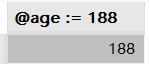 | 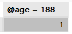 |

#### 4.3 局部变量

局部变量只在存储过程、函数或触发器的范围内生效。需要使用 `DECLARE` 声明，作用域的范围在声明的 `BEGIN ... END` 块内。

##### 4.3.1 声明

- 变量可以是任何有效的 Mysql 数据类型，如 `INT`、`VARCHAR`、`DATETIME` 等

  ```sql
  DECLARE 变量名 变量类型 [DEFAULT 默认值] ...;
  ```

##### 4.3.2 赋值

```sql
-- 方式一
SET var_name = 值;

-- 方式二 【推荐】
SET var_name := 值;

-- 方式三: 查询结果赋值给自定义变量
SELECT 列名 INTO var_name FROM 表名 WHERE ...;
```

##### 4.3.3 使用

```sql
-- 示例: 在存储过程中定义局部变量记录学生表的总记录数
delimiter //

-- 创建存储过程
CREATE PROCEDURE p1()
BEGIN
  -- 定义局部变量
  DECLARE stu_count INT DEFAULT 0;
  -- 把查询结果赋值给局部变量
  SELECT count(*) INTO stu_count FROM student;
  -- 使用局部变量
  SELECT stu_count;
END//

delimiter ;

-- 调用存储过程
CALL p1();
```

### 5.sql 编程

#### 5.1 条件判断

##### 5.1.1 语法

```sql
IF 条件1 THEN
    ......
[ELSIF 条件2 THEN
    ......
ELSE
    ......]
END IF;
```

逻辑运算符：`AND` `OR` `NOT`

根据分数值，判断当前分数对应等级：

```sql
delimiter //

CREATE PROCEDURE p2()
BEGIN
  -- 定义初始分数变量
  DECLARE score INT DEFAULT 86;
  -- 定义结果变量
  DECLARE result VARCHAR(10);
  
  -- 判断
  IF score >= 90 THEN
    SET result := '优秀';
  ELSEIF score >= 80 AND score < 90 THEN
    SET result := '良好';
  ELSEIF score >= 70 AND score < 80 THEN
    SET result := '中等';
  ELSEIF score >= 60 AND score < 70 THEN
    SET result := '及格';
  ELSE
    SET result := '不及格';
  END IF;
  
  -- 查询结果
  SELECT result;

END//

-- 调用存储过程 
CALL p2();

DELIMITER ;
```

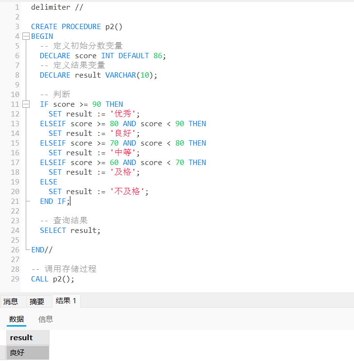

#### 5.2 参数

##### 5.2.1 分类

| 类型  | 描述         |
| ----- | ------------ |
| IN    | 输入类型     |
| OUT   | 输出类型     |
| INOUT | 输入输出类型 |

##### 5.2.2 语法

```sql
-- 修改SQL语句结束标识符为 //
DELIMITER //

-- 创建存储过程
CREATE PROCEDURE 存储过程名 ([IN/OUT/INOUT 参数名 参数类型] [,...])
BEGIN
    -- SQL 语句
END //

-- 修改SQL语句结束标识符为 ;
DELIMITER ;
```

还是之前根据分数值判断等级，但是要传参：

```sql
delimiter //

CREATE PROCEDURE p3(IN score INT, OUT result VARCHAR(10))
BEGIN
  -- 判断
  IF score >= 90 THEN
    SET result := '优秀';
  ELSEIF score >= 80 AND score < 90 THEN
    SET result := '良好';
  ELSEIF score >= 70 AND score < 80 THEN
    SET result := '中等';
  ELSEIF score >= 60 AND score < 70 THEN
    SET result := '及格';
  ELSE
    SET result := '不及格';
  END IF;
  
  -- 查询结果
  SELECT result;

END//

DELIMITER ;

-- 调用存储过程 
CALL p3(86, @result);

-- 查看结果
select @result;
```

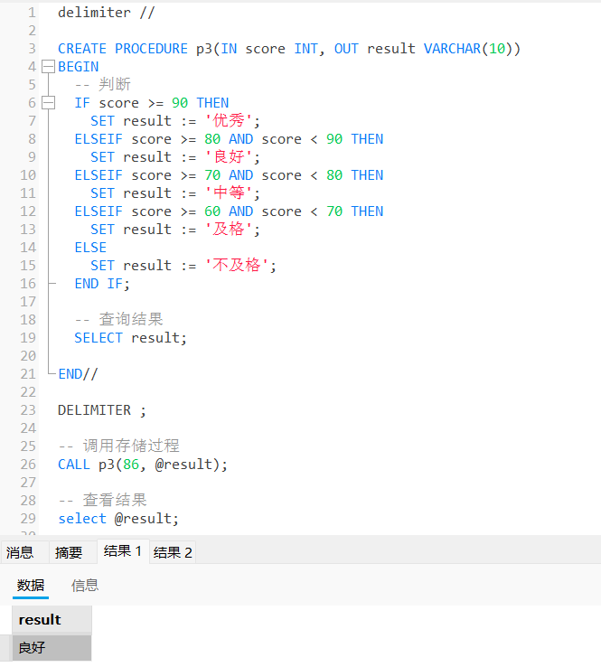

传入一个分数的值，在传入分数的基础上加10分 ，然后返回

```sql
delimiter //

CREATE PROCEDURE p4(INOUT score INT)
BEGIN
  SET score := score + 10;
END//

delimiter ;

SET @score = 66;
CALL p4 (@score);
select @score;
```

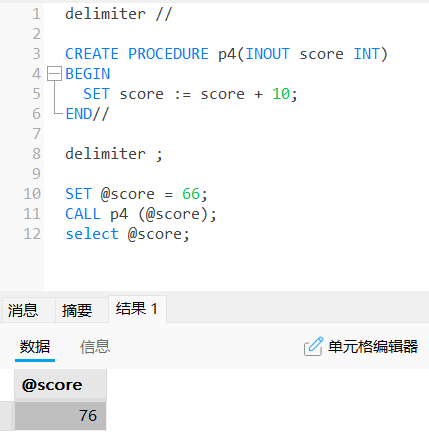

#### 5.3 case

##### 5.3.1 语法

- 语法1

  - `case` 后的 `case_value` 是一个表达式，该表达式的值与每一个 `WHEN` 子句中的 `when_value` 比较，当找到一个相等的 `when_value` 时，执行相应的 `THEN` 子句的 `statement_list`
  - 如果没有相等的 `when_value`，则执行 `ELSE` 子句 `statement_list`（如果存在 `ELSE`）

  ```sql
  CASE case_value
      WHEN when_value THEN statement_list
      [WHEN when_value THEN statement_list]
      ...
      [ELSE statement_list]
  END CASE
  ```

  传入一个状态码，输出该状态码表示的含义：

  ```sql
  delimiter //
  CREATE PROCEDURE p5 (IN CODE INT, OUT result VARCHAR (50))
  BEGIN
    CASE
      CODE
      WHEN 0 THEN
        SET result := '成功';
      WHEN 10001 THEN
        SET result := '用户名或密码错误';
      WHEN 10002 THEN
        SET result := '您没有对应的权限，请联系管理员';
      WHEN 20001 THEN
        SET result := '你传入的参数有误';
      WHEN 20002 THEN
        SET result := '没有找到相应的结果';
      ELSE
        SET result := '服务器错误，请联系管理员';
    END CASE;
  END//
  
  CALL p5(10001, @result);
  SELECT @result;
  ```

  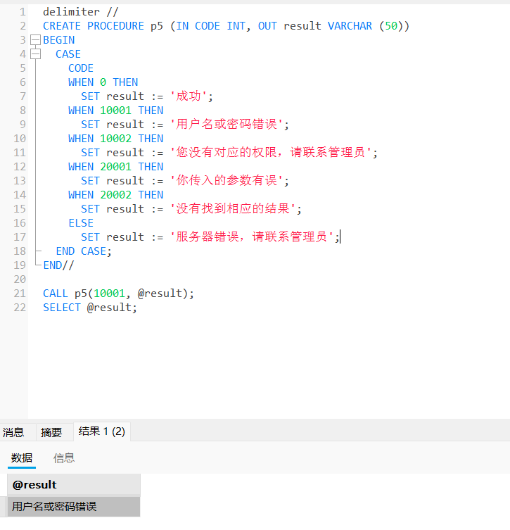

- 语法2

  - 计算每个 `WHEN` 子句 `search_condition` 表达式，直到其中一个表达式为真，此时执行相应的 `THEN` 子句的 `statement_list`
  - 如果 `search_condition` 都不相等，则执行 `ELSE` 子句 `statement_list`（如果存在 `ELSE`）

  ```sql
  CASE
      WHEN search_condition THEN statement_list
      [WHEN search_condition THEN statement_list] ...
      [ELSE statement_list]
  END CASE
  ```

  根据传入的月份，输出该月份属于哪个季度

  ```sql
  delimiter //
  CREATE PROCEDURE p6 (IN month INT, OUT result VARCHAR (50))
  BEGIN
    CASE
      WHEN month >= 1 AND month <=3 THEN
        SET result := '第一季度';
      WHEN month >= 4 AND month <=6 THEN
        SET result := '第二季度';
      WHEN month >= 7 AND month <=9 THEN
        SET result := '第三季度';
      WHEN month >= 10 AND month <=12 THEN
        SET result := '第四季度';
      ELSE
        SET result := '非法参数';
    END CASE;
  END//
  
  CALL p6(4, @result);
  SELECT @result;
  ```

  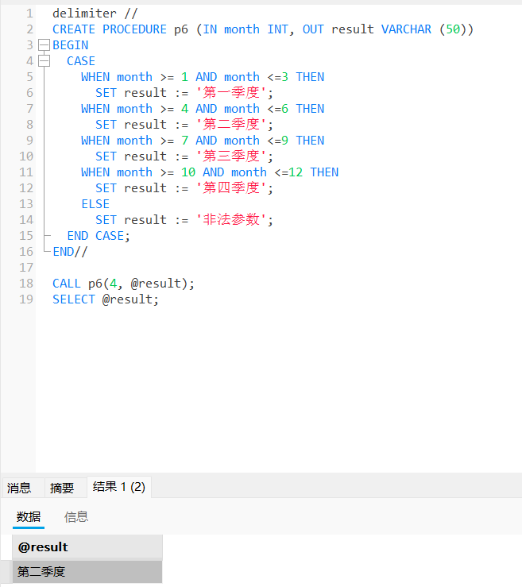

- 注意事项

  - SQL 中的 case 不具备向下穿透的特性。
  - 每个 `statement_list` 由一条或多条 SQL 语句组成且不允许为空。但可以使用 `BEGIN...END;` 块。
  - 如果没有 `when_value` 或 `search_condition` 与测试值匹配，且 `case` 语句不包含 `else` 子句，则会报错。

#### 5.4 循环

##### 5.4.1 WHILE

先判断条件表达式 `search_condition` 是否为 `TRUE`，如果条件成立，则执行循环体中的`statement_list`

```sql
WHILE search_condition DO
	statement_list
END WHILE;
```

传入一个数 `n`，计算从1累加到 `n` 的值：

```sql
delimiter //

CREATE PROCEDURE p7 (IN n INT)

BEGIN
  -- 定义一个变量，表示结果
  DECLARE total INT DEFAULT 0;
  
  -- 累加
  WHILE n > 0 DO
    SET total := total + n;
    SET n := n - 1;
  END WHILE;
  
  -- 查询结果 
  SELECT total;
END//

delimiter;

CALL p7 (100);
```

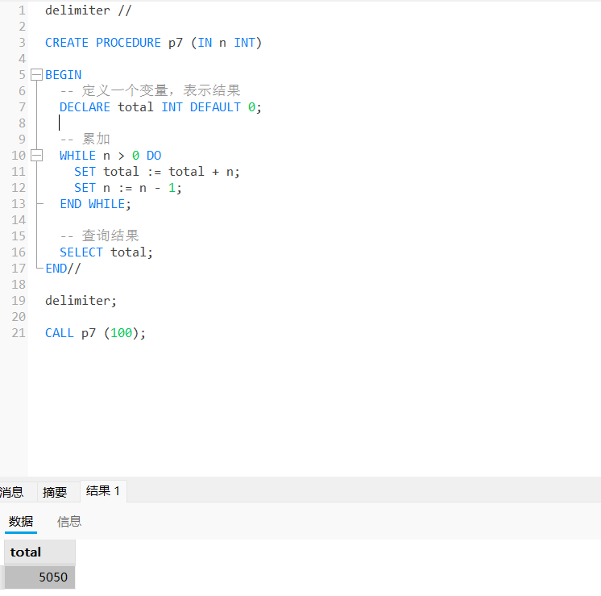

##### 5.4.2 REPEAT

- 先执行一次循环体中的 `statement_list`，再判断条件表达式 `search_condition` 是否为 `true`，如果条件成立，则继续执行循环体中的语句，如果条件不成立则退出循环
- `statement_list` 至少会执行一次，类似于  `C++` 中的 `do ... while` 循环

```sql
REPEAT
    statement_list
UNTIL search_condition
END REPEAT;
```

传入一个数 `n`，计算从 1 累加到 `n` 的值

```sql
delimiter //
CREATE PROCEDURE p8 (IN n INT)
BEGIN
  DECLARE
  res INT DEFAULT 0;
  REPEAT
    SET res := res + n;
    SET n := n - 1;
  UNTIL n = 0
  END REPEAT;
  SELECT
    res;
END //
delimiter;
```

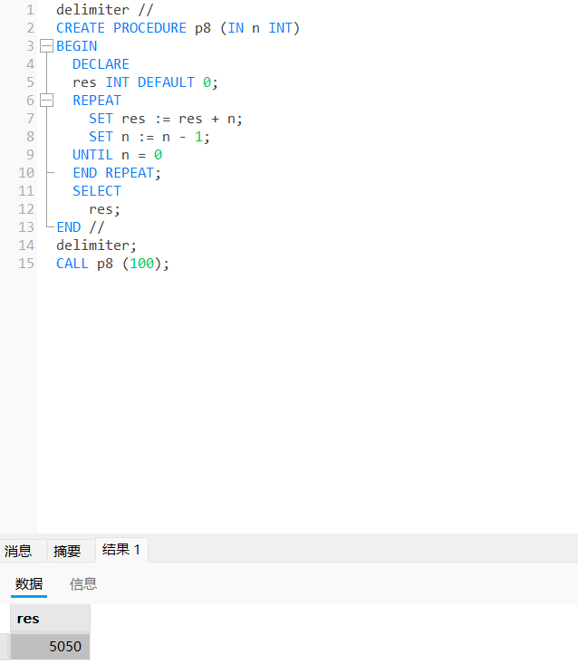

##### 5.4.3 LOOP

`LOOP` 也可以实现一个简单的循环，并且当满足某个条件时终止当前循环或退出整个循环，通常配合以下两个子句使用：

- `LEAVE label`：退出整个循环，类似于 `C++` 中的 `break`
- `ITERATE label`：终止当前循环，进入下一次循环，类似于 `C++` 中的 `continue`

```sql
[begin_label:] LOOP
    statement_list
END LOOP [end_label];
```

传入一个数 `n`，计算从1累加到 `n` 的值：

```sql
delimiter //
CREATE PROCEDURE p9 (IN n INT)
BEGIN
  DECLARE res INT DEFAULT 0;
  sum_label : LOOP
    IF n <= 0 THEN
      LEAVE sum_label;
    END IF;
    SET res := res + n;
    SET n := n - 1;
  END LOOP sum_label;
  SELECT res;
END //
delimiter;
CALL p9 (100);
```

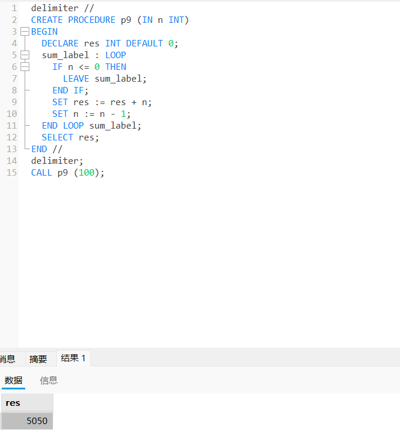

传入一个数 `n`，计算从1累加到 `n` 之间偶数的值：

```sql
delimiter //
CREATE PROCEDURE p10 (IN n INT)
BEGIN
  DECLARE res INT DEFAULT 0;
  sum_label : LOOP
    IF n <= 0 THEN
      LEAVE sum_label;
    END IF;
    
    IF n % 2 = 1 THEN
      SET n := n - 1;
      ITERATE sum_label;
    END IF;
    
    SET res := res + n;
    SET n := n - 1;
  END LOOP sum_label;
  SELECT res;
END //
delimiter;
CALL p10 (100);
```

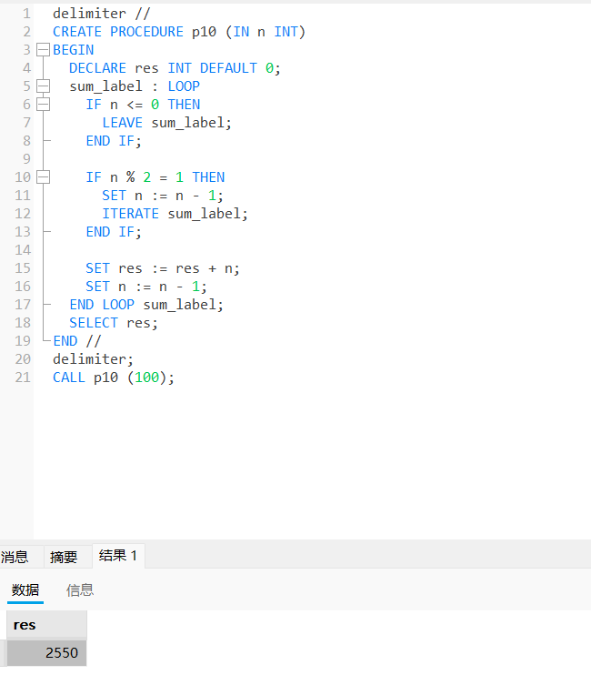

#### 5.5 游标

- MySQL 中的游标是一种数据库对象，允许在存储过程和函数中对查询到的结果集进行逐行检索

  > 平时我们写 SQL 的时候，通常是一次性处理一批数据，比如 `SELECT * FROM student;`，它会一次返回很多行。但是在存储过程里，有时候想对查询结果一行一行地处理，比如：
  >
  > ```
  > 取出第 1 行 → 处理
  > 取出第 2 行 → 处理
  > 取出第 3 行 → 处理
  > ……
  > ```
  >
  > 这时就可以使用游标

- MySQL 的游标是只读的，不能进行更新操作

**语法**

- 使用游标之前必须先声明游标，之后使用 `OPEN`、`FETCH` 和 `CLOSE` 语句来打开游标、获取游标记录和关闭游标
- 游标必须在条件处理程序之前被声明，并且变量必须在游标或条件处理程序之前被声明

```sql
-- 声明游标
DECLARE 游标名 CURSOR FOR 查询语句;

-- 打开游标
OPEN 游标名;

-- 获取游标记录
FETCH 游标名 INTO 变量[, 变量] ...;

-- 关闭游标
CLOSE 游标名;
```

传入班级编号，查询学生表中属于该班级的学生信息，并将符合条件的学生信息写入到一张新表中

- 新表及字段 `t_student_class(id, student_name, class_name)`

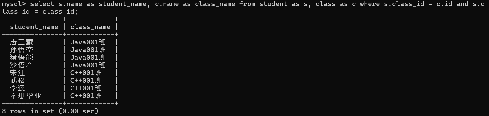

也就是把查询到的表写入一张新表。

实现逻辑

- 定义变量用于接收查询结果集中每一行中列的值
- 声明游标，用于接收查询结果集
- 创建新表
- 开启游标
- 从游标中获取结果集中的记录
- 向新表中写入数据
- 关闭游标

```sql
CREATE PROCEDURE p11(IN class_id INT)
BEGIN
  -- 声明变量
  DECLARE student_name VARCHAR(20);
  DECLARE class_name VARCHAR(20);
  
  -- 定义游标
  DECLARE s_cursor CURSOR FOR select s.name as student_name, c.name as class_name from student as s, class as c where s.class_id = c.id and s.class_id = class_id;
  
  -- 创建新表
  DROP TABLE IF EXISTS t_student_class;
  CREATE TABLE IF NOT EXISTS t_student_class (
    id BIGINT PRIMARY KEY AUTO_INCREMENT,
    student_name VARCHAR(20),
    class_name VARCHAR(20)
  );
  
  -- 开启游标
  OPEN s_cursor;
  
  -- 遍历结果集
  WHILE TRUE DO
    -- 获取游标记录
    FETCH s_cursor INTO student_name, class_name;
    -- 写入新表
    INSERT INTO t_student_class VALUES (NULL, student_name, class_name);
  END WHILE;
  
  -- 关闭游标
  CLOSE s_cursor;
  
END;

CALL p11(1);
```

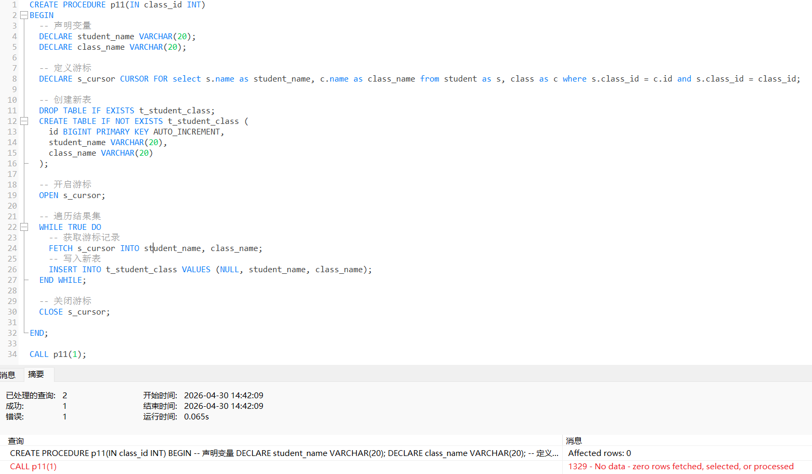

由于 `while` 循环是死循环，当游标遍历完成后继续向后遍历，发现没有记录，所以报错，可以通过条件处理程序解决

#### 5.6 条件处理程序

- 定义条件是事先定义程序执行过程中可能遇到的问题
- 处理程序定义了在遇到问题时应当采取的处理方式
- 使用条件处理程序保证存储过程或函数在遇到警告或错误时能继续执行，可以增强程序处理问题的能力，避免程序异常停止运行

```sql
DECLARE handler_action HANDLER
    FOR condition_value [, condition_value] ...
    statement;

handler_action: {
    CONTINUE   -- 继续执行当前程序
  | EXIT       -- 终止执行当前程序
}

condition_value: {
    mysql_error_code                 -- MySQL错误码
  | SQLSTATE [VALUE] sqlstate_value  -- 状态码
  | SQLWARNING                       -- 所有以01开头的SQLSTATE代码
  | NOT FOUND                        -- 所有以02开头的SQLSTATE代码
  | SQLEXCEPTION                     -- 未被前两者捕获的SQLSTATE代码
}
```

错误码参考官方网站

> [MySQL :: MySQL 8.0 Error Reference :: 2 Server Error Message Reference](https://dev.mysql.com/doc/mysql-errors/8.0/en/server-error-reference.html)

加入条件处理程序，解决游标越界问题

```sql
CREATE PROCEDURE p12(IN class_id INT)
BEGIN
  -- 声明变量
  DECLARE student_name VARCHAR(20);
  DECLARE class_name VARCHAR(20);
  -- 定义游标结束标识
  DECLARE is_done bool DEFAULT FALSE;
  
  -- 定义游标
  DECLARE s_cursor CURSOR FOR select s.name as student_name, c.name as class_name from student as s, class as c where s.class_id = c.id and s.class_id = class_id;
  
  -- 定义条件处理程序
  DECLARE CONTINUE HANDLER FOR NOT FOUND SET is_done := TRUE;
  
  -- 创建新表
  DROP TABLE IF EXISTS t_student_class;
  CREATE TABLE IF NOT EXISTS t_student_class (
    id BIGINT PRIMARY KEY AUTO_INCREMENT,
    student_name VARCHAR(20),
    class_name VARCHAR(20)
  );
  
  -- 开启游标
  OPEN s_cursor;
  
  -- 遍历结果集
  read_loop: LOOP
    -- 获取游标记录
    FETCH s_cursor INTO student_name, class_name;
    -- 退出循环
    IF is_done THEN
      LEAVE read_loop;
    END IF;
    
    -- 写入新表
    INSERT INTO t_student_class VALUES (NULL, student_name, class_name);
  END LOOP read_loop;
  
  -- 关闭游标
  CLOSE s_cursor;
  
END;

CALL p12(1);
```

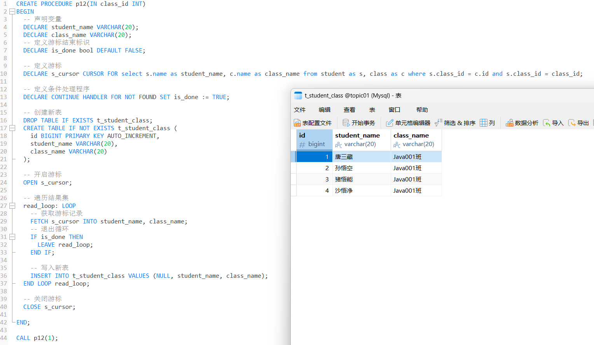

#### 5.7 存储函数

MySQL 存储函数是有返回值的存储过程，参数只能是 `IN` 类型，类似于内置参数。存储函数与存储过程的主要区别在于存储函数必须有返回值，而存储过程则不一定。

> 在 MySQL 8.0 版本中，如果 binlog 是开启的，那么在定义存储函数时，需要指定 `characteristic` 特性，否则报错

```sql
CREATE FUNCTION 存储函数名称 ([参数列表])
RETURNS type [characteristic ...]
BEGIN
    -- SQL语句
    RETURN ...;
END;

characteristic:
  [NOT] DETERMINISTIC -- 表示相同的输入参数总是产生[不同]相同的结果
| NO SQL              -- 不包含SQL语句
| READS SQL DATA      -- 包含读取数据的语句，如select
| MODIFIES SQL DATA   -- 包含写入数据的语句，如update, delete

-- 使用存储函数
SELECT 存储函数名称 ([参数列表]);
```

传入一个数 `n`，计算从 1 累加到 `n` 的值

如果未指定 `characteristic` 特性，会报错：

```sql
-- 定义存储函数
CREATE FUNCTION func1(n INT)
  RETURNS INT
BEGIN
  DECLARE total INT DEFAULT 0;
  WHILE n > 0 DO
    SET total := total + n;
    SET n := n - 1;
  END WHILE;
  RETURN total;
END;

-- 1418 - This function has none of DETERMINISTIC, NO SQL, or READS SQL DATA in its declaration and binary logging is enabled (you *might* want to use the less safe log_bin_trust_function_creators variable)
```

指定后：

```sql
-- 定义存储函数
CREATE FUNCTION func1(n INT)
  RETURNS INT DETERMINISTIC -- 指定 characteristic
BEGIN
  DECLARE total INT DEFAULT 0;
  WHILE n > 0 DO
    SET total := total + n;
    SET n := n - 1;
  END WHILE;
  RETURN total;
END;

SELECT func1(100);
```

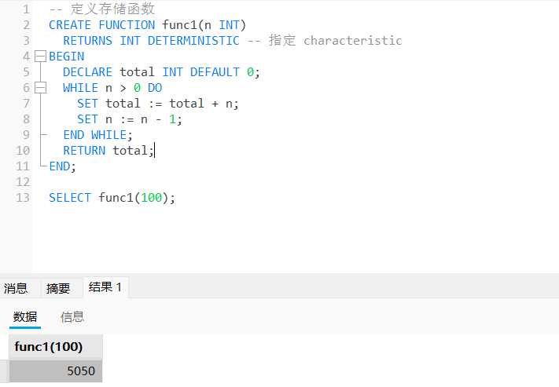

## 二、触发器

### 2.1 触发器是什么

- 触发器是一个与表关联的数据库对象，在对表进行 `insert`、`update`、`delete` 操作时，触发并执行定义触发器时指定的 `SQL` 语句

- 触发器可以在对表操作之前或之后执行，这被称为触发时间

- 触发器可以执行 `SQL` 语句或逻辑块，用于实施复杂的业务逻辑或数据验证

- MySQL 支持三种类型的触发器：`INSERT` 触发器、`UPDATE` 触发器和 `DELETE` 触发器。使用 `OLD`  和 `NEW` 关键字来引用触发器中发生变化的记录内容

  | 触发器类型    | OLD 和 NEW                                           |
  | ------------- | ---------------------------------------------------- |
  | INSERT 触发器 | NEW 表示将要或已经新增的数据                         |
  | UPDATE 触发器 | OLD 表示修改之前的数据，NEW 表示将要或已经修改的数据 |
  | DELETE 触发器 | OLD 表示将要或已经删除的数据                         |

> 行级触发器和语句级触发器：
>
> - 行级触发器：当对表中每一行进行 `INSERT`、`UPDATE` 或 `DELETE` 操作时，行级触发器都会被触发。例如，如果执行一个 `UPDATE` 语句影响了多行数据，那么行级触发器会对每一行都触发一次。行级触发器可以访问受影响的旧值和新值，常用于实现复杂业务逻辑时对新旧值的访问。
> - 语句级触发器：在 `INSERT`、`UPDATE` 或 `DELETE` 语句时只触发一次。无论该语句影响了多少行数据，语句级触发器都只在语句开始或结束时触发一次。语句级触发器主要用于实现一些全局性的操作，比如数据同步、数据清理等。
> - MySQL 只支持行级触发器，不支持语句级触发器

### 2.2 语法

```sql
-- 创建
CREATE TRIGGER [IF NOT EXISTS] trigger_name
    trigger_time trigger_event
    ON tbl_name FOR EACH ROW -- MySQL只支持行级触发器
BEGIN
    trigger_stmt;
END;

trigger_time: { BEFORE | AFTER } -- 执行修改之前或之后
trigger_event: { INSERT | UPDATE | DELETE }

-- 查看
SHOW TRIGGERS;

-- 删除，如果没有指定schema_name，默认为当前数据库
DROP TRIGGER [IF EXISTS] [schema_name.]trigger_name;
```

通过触发器记录学生表的变更日志，将变更日志写入日志表 `student_log` 中，包含增加，修改和删除操作

```sql
-- 创建学生日志表
CREATE TABLE student_log (
  id BIGINT PRIMARY KEY auto_increment,
  operation_type VARCHAR(10) NOT NULL COMMENT '操作类型：insert/update/delete',
  operation_time DATETIME NOT NULL COMMENT '操作时间',
  operation_id BIGINT NOT NULL COMMENT '操作的记录ID',
  operation_data VARCHAR(500) COMMENT '操作数据'
);
```

### 2.3 插入数据的触发器

```sql
-- 插入触发器
delimiter//
CREATE TRIGGER IF NOT EXISTS trg_student_insert
  AFTER INSERT ON student FOR EACH ROW
BEGIN
  -- 插入日志到 student_log 表
  INSERT INTO student_log (
    operation_type,
    operation_time,
    operation_id,
    operation_data
  ) VALUES (
    'insert',
    NOW(),
    new.id,
    CONCAT(new.id, ',', new.name, ',', new.sno,',', new.age, ',', new.gender, ',', new.enroll_date, ',', new.class_id)
  );
END//
delimiter;
```

向学生表中插入记录：

```sql
insert into student values (null, '曹操', '300001', 28, 1, '2024-09-01', 3);
```

于是，在 `student` 和 `student_log` 表中都插入了数据：

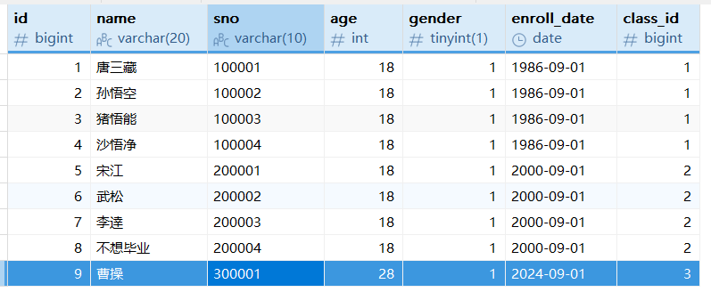

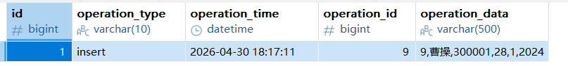

### 2.4 更新数据的触发器

```sql
-- 更新触发器
delimiter//
CREATE TRIGGER IF NOT EXISTS trg_student_update
  AFTER UPDATE ON student FOR EACH ROW
BEGIN
  -- 插入日志到 student_log 表
  INSERT INTO student_log (
    operation_type,
    operation_time,
    operation_id,
    operation_data
  ) VALUES (
    'update',
    NOW(),
    new.id,
    concat(old.id, ',', old.name, ',', old.sno,',', old.age, ',', old.gender, ',', old.enroll_date, ',', old.class_id,
      '|', new.id, ',', new.name, ',', new.sno,',', new.age, ',', new.gender, ',', new.enroll_date, ',', new.class_id)
  );
END//
delimiter;
```

- 更新单条数据：

  ```sql
  update student set age = 20, class_id = 2 where name = '曹操';
  ```

  于是，在 `student` 表中 `class_id` 改为了 2， `student_log` 表中插入了数据：

  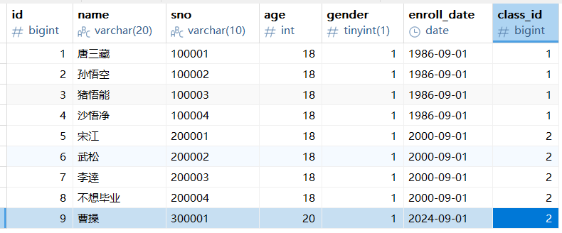

  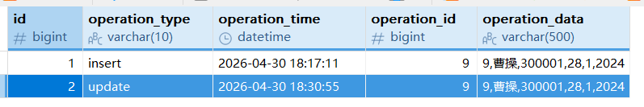

- 更新多条数据：

  ```sql
  update student set class_id = 3 where id >= 7;
  ```

  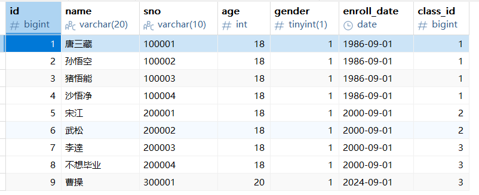

  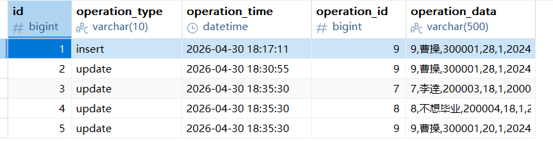

### 2.5 删除数据的触发器

```sql
-- 删除触发器
delimiter//
CREATE TRIGGER IF NOT EXISTS trg_student_delete
  AFTER DELETE ON student FOR EACH ROW
BEGIN
  -- 插入日志到 student_log 表
  INSERT INTO student_log (
    operation_type,
    operation_time,
    operation_id,
    operation_data
  ) VALUES (
    'delete',
    NOW(),
    old.id,
    concat(old.id, ',', old.name, ',', old.sno,',', old.age, ',', old.gender, ',', old.enroll_date, ',', old.class_id)
  );
END//
delimiter;
```

删除学生表中的记录：

```sql
delete from student where name = '曹操';
```

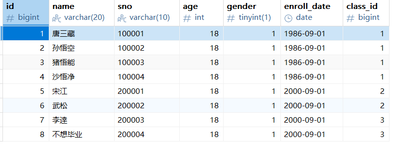

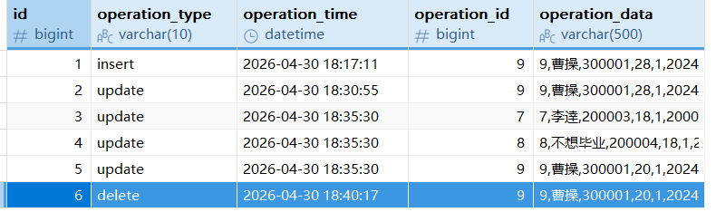

### 2.6 查看触发器

```sql
SHOW TRIGGERS;
```

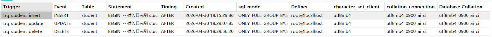

### 2.7 删除触发器

```sql
DROP TRIGGER IF EXISTS trg_student_insert;
```

