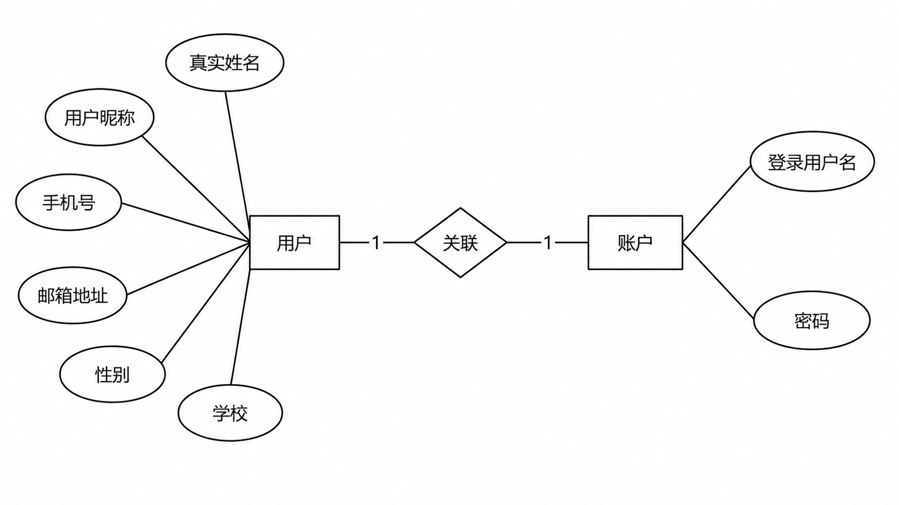
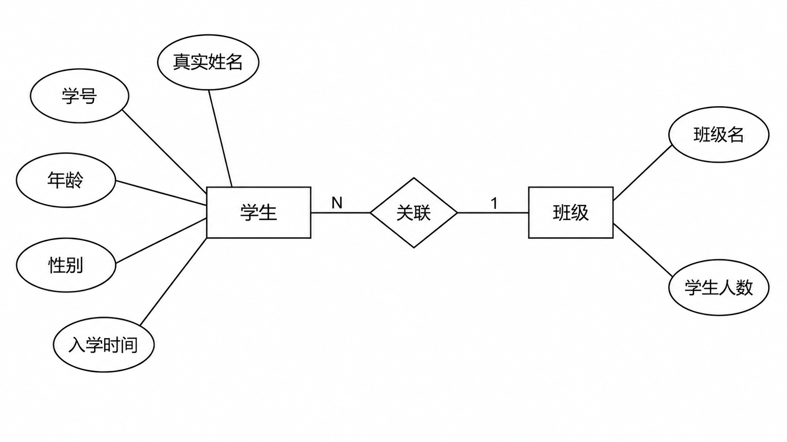
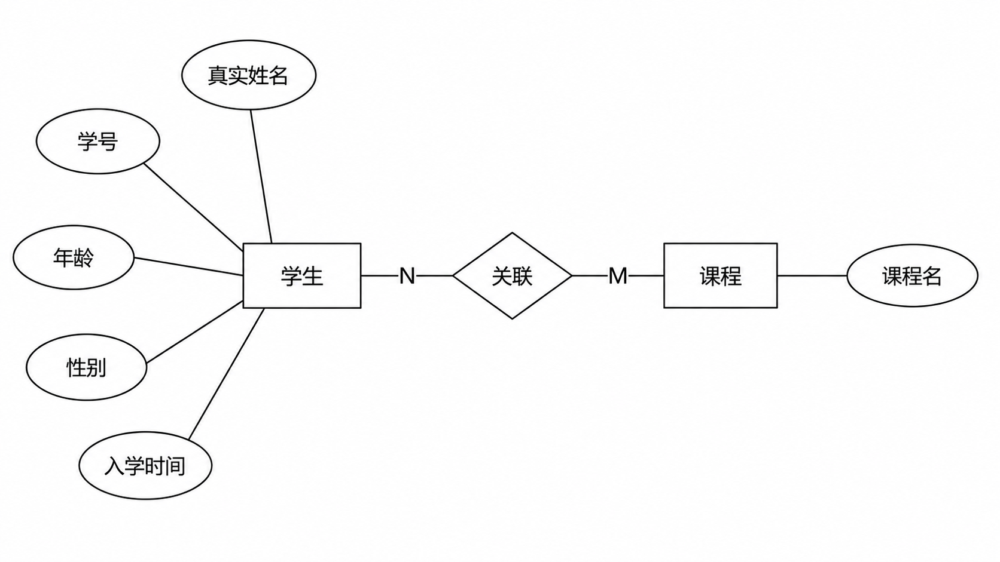
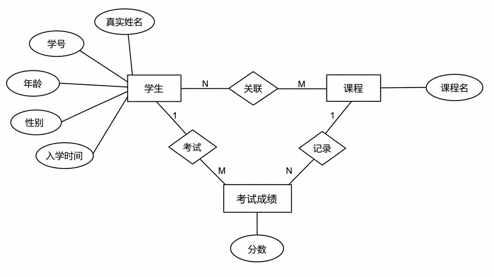

# 数据库设计

## 一、范式

数据库的范式是一组规则。

关系数据库有六种范式：第一范式（1NF）、第二范式（2NF）、第三范式（3NF）、巴斯-科德（BCNF）、第四范式（4NF）和第五范式（5NF，又称完美范式），越高的范式数据库冗余越小。然而，普遍认为范式越高虽然对数据关系有更好的约束性，但也可能导致数据库 IO 更繁忙，因此在实际应用中，数据库设计通常只需满足第三范式即可。

### 1.1 第一范式

#### 1.1.1 定义

- 数据库表的每一列都是不可分割的原子数据项，而不能是集合，数组，对象等非原子数据。

  > ENUM 符合第一范式，SET 通常不符合第一范式。

- 在关系型数据库的设计中，满足第一范式是对关系模式的基本要求。不满足第一范式的数据库就不能被称为关系数据库。

  > 在关系型数据库中，每一列都可以用基本数据类型表示，就天然满足第一范式。

### 1.2 第二范式

#### 1.2.1 定义

在满足第一范式的基础上，不存在非关键字段对候选键的部分函数依赖。存在与表中定义了复合主键的情况下。

> 候选键：可以唯一标识一行的数据列或列的组合，可以从候选键中选一个或多个当作表的主键。

#### 1.2.2 示例

学生可以选修课程，课程有对应的学分，学生考试后没门课程会产生相应的成绩。

##### 1.2.2.1 反例

用一张表记录所有信息。

<table border="1" cellspacing="0" cellpadding="8" style="border-collapse: collapse; text-align: center;">
  <caption style="font-weight: bold; font-size: 22px;">学生课程成绩表</caption>
  <thead>
    <tr>
      <th style="background-color: #b6ff9f;">学号</th>
      <th>学生姓名</th>
      <th>年龄</th>
      <th>性别</th>
      <th style="background-color: #b6ff9f;">课程名</th>
      <th>学分</th>
      <th>成绩</th>
    </tr>
  </thead>
  <tbody>
    <tr>
      <td style="background-color: #b6ff9f;">10001</td>
      <td>张三</td>
      <td>18</td>
      <td>男</td>
      <td style="background-color: #b6ff9f;">MySQL</td>
      <td>60</td>
      <td>98</td>
    </tr>
    <tr>
      <td style="background-color: #b6ff9f;">10002</td>
      <td>李四</td>
      <td>19</td>
      <td>女</td>
      <td style="background-color: #b6ff9f;">MySQL</td>
      <td>60</td>
      <td>100</td>
    </tr>
    <tr>
      <td style="background-color: #b6ff9f;">10003</td>
      <td>王五</td>
      <td>18</td>
      <td>男</td>
      <td style="background-color: #b6ff9f;">MySQL</td>
      <td>50</td>
      <td>89</td>
    </tr>
    <tr>
      <td style="background-color: #b6ff9f;">10001</td>
      <td>张三</td>
      <td>18</td>
      <td>男</td>
      <td style="background-color: #b6ff9f;">Java</td>
      <td>60</td>
      <td>100</td>
    </tr>
    <tr>
      <td style="background-color: #b6ff9f;">10002</td>
      <td>李四</td>
      <td>19</td>
      <td>女</td>
      <td style="background-color: #b6ff9f;">Java</td>
      <td>60</td>
      <td>99</td>
    </tr>
    <tr>
      <td style="background-color: #b6ff9f;">10003</td>
      <td>王五</td>
      <td>18</td>
      <td>男</td>
      <td style="background-color: #b6ff9f;">C++</td>
      <td>60</td>
      <td>98</td>
    </tr>
  </tbody>
</table>

- 这张表中使用学号+课程名定义复合主键来唯一标识一个学生某门课程的成绩，这也是这张表的主要作用
- 学生是通过学号来确定的，学生的姓名、年龄和性别和课程没有关系，即学生的信息只依赖学号，不依赖课程名；学分是通过课程来确定的，课程的学分和学生没有关系，即学分只依赖课程名，不依赖学生
- 对于使用符合主键的表，如果一行数据中的某些列只与符合主键中的一个或其中几个列有关系，那么就说他存在部分函数依赖，也就不满足第二范式

##### 1.2.2.2 正例

<table border="1" cellspacing="0" cellpadding="8" style="border-collapse: collapse; text-align: center;">
  <caption style="font-weight: bold; font-size: 22px;">学生表</caption>
  <thead>
    <tr>
      <th style="background-color: #b6ff9f;">Id</th>
      <th>学号</th>
      <th>学生姓名</th>
      <th>年龄</th>
      <th>性别</th>
    </tr>
  </thead>
  <tbody>
    <tr>
      <td style="background-color: #b6ff9f;">1</td>
      <td>10001</td>
      <td>张三</td>
      <td>18</td>
      <td>男</td>
    </tr>
    <tr>
      <td style="background-color: #b6ff9f;">2</td>
      <td>10002</td>
      <td>李四</td>
      <td>19</td>
      <td>女</td>
    </tr>
    <tr>
      <td style="background-color: #b6ff9f;">3</td>
      <td>10003</td>
      <td>王五</td>
      <td>18</td>
      <td>男</td>
    </tr>
  </tbody>
</table>

<table border="1" cellspacing="0" cellpadding="8" style="border-collapse: collapse; text-align: center;">
  <caption style="font-weight: bold; font-size: 22px;">课程表</caption>
  <thead>
    <tr>
      <th style="background-color: #b6ff9f;">Id</th>
      <th>课程名</th>
      <th>学分</th>
    </tr>
  </thead>
  <tbody>
    <tr>
      <td style="background-color: #b6ff9f;">1</td>
      <td>MySQL</td>
      <td>50</td>
    </tr>
    <tr>
      <td style="background-color: #b6ff9f;">2</td>
      <td>Java</td>
      <td>60</td>
    </tr>
    <tr>
      <td style="background-color: #b6ff9f;">3</td>
      <td>C++</td>
      <td>60</td>
    </tr>
  </tbody>
</table>

<table border="1" cellspacing="0" cellpadding="8" style="border-collapse: collapse; text-align: center;">
  <caption style="font-weight: bold; font-size: 22px;">成绩表</caption>
  <thead>
    <tr>
      <th style="background-color: #b6ff9f;">学生Id</th>
      <th style="background-color: #b6ff9f;">课程Id</th>
      <th>成绩</th>
    </tr>
  </thead>
  <tbody>
    <tr>
      <td style="background-color: #b6ff9f;">1</td>
      <td style="background-color: #b6ff9f;">1</td>
      <td>98</td>
    </tr>
    <tr>
      <td style="background-color: #b6ff9f;">2</td>
      <td style="background-color: #b6ff9f;">1</td>
      <td>100</td>
    </tr>
    <tr>
      <td style="background-color: #b6ff9f;">3</td>
      <td style="background-color: #b6ff9f;">1</td>
      <td>89</td>
    </tr>
    <tr>
      <td style="background-color: #b6ff9f;">1</td>
      <td style="background-color: #b6ff9f;">2</td>
      <td>100</td>
    </tr>
    <tr>
      <td style="background-color: #b6ff9f;">2</td>
      <td style="background-color: #b6ff9f;">2</td>
      <td>99</td>
    </tr>
    <tr>
      <td style="background-color: #b6ff9f;">3</td>
      <td style="background-color: #b6ff9f;">3</td>
      <td>98</td>
    </tr>
  </tbody>
</table>

> 第二范式强调的是部分函数依赖，当一张表中的主键只有一列时，天然满足第二范式

#### 1.2.3 不满足第二范式可能出现的问题

1. 数据冗余

   学生的姓名、年龄、性别和课程的学分在每行记录中重复出现，造成了大量数据冗余

2. 更新异常

   如果要调整 MySQL 的学分，那么久需要更新表中所有关于 MySQL 的记录，一旦执行中断导致某些记录更新成功，某些数据更新失败，就会造成表中同一门课程出现出现不同学分的情况，出现数据不一致的问题

3. 插入异常

   目前这样的设计，成绩与每一门课和学生都有对应关系，也就是说只有学生参加选修课程考试取得了成绩才能生成一条记录。当有一门新课还没有学生参加考试取得成绩之前，那么这门新课在数据库中是不存在的，因为成绩为空时记录没有意义

4. 删除异常

   把毕业学生的考试数据全部删除，此时课程和学分的信息也会被删除掉，有可能导致一段时间内，数据库里没有某门课程和学分的信息

### 1.3 第三范式

#### 1.3.1 定义

在满足第二范式的基础上，不存在非关键字段，对任一候选键的传递依赖

#### 1.3.2 示例

要求学生表中记录学生所属的学院，在满足第二范式的基础上对学生表做出修改

##### 1.3.2.1 反例

<table border="1" cellspacing="0" cellpadding="8" style="border-collapse: collapse; text-align: center;">
  <caption style="font-weight: bold; font-size: 22px;">学生表</caption>
  <thead>
    <tr>
      <th style="background-color: #b6ff9f;">Id</th>
      <th>学号</th>
      <th>学生姓名</th>
      <th>年龄</th>
      <th>性别</th>
      <th style="background-color: #fff2cc;">学院</th>
      <th>学院电话</th>
      <th>学院地址</th>
    </tr>
  </thead>
  <tbody>
    <tr>
      <td style="background-color: #b6ff9f;">1</td>
      <td>10001</td>
      <td>张三</td>
      <td>18</td>
      <td>男</td>
      <td style="background-color: #fff2cc;">计算机科学与技术学院</td>
      <td>88888888</td>
      <td>浙江省杭州市</td>
    </tr>
    <tr>
      <td style="background-color: #b6ff9f;">2</td>
      <td>10002</td>
      <td>李四</td>
      <td>19</td>
      <td>女</td>
      <td style="background-color: #fff2cc;">网络与信息安全学院</td>
      <td>66666666</td>
      <td>浙江省杭州市</td>
    </tr>
    <tr>
      <td style="background-color: #b6ff9f;">3</td>
      <td>10003</td>
      <td>王五</td>
      <td>18</td>
      <td>男</td>
      <td style="background-color: #fff2cc;">通信工程学院</td>
      <td>99999999</td>
      <td>浙江省杭州市</td>
    </tr>
  </tbody>
</table>

- 因为是要描述学生信息，并且在表中定义了 Id 为主键，Id 可以明确地标识每条学生信息

- 在这个表结构中，可以看出学生的学号、姓名、年龄、性别与主键 Id 强相关；学院电话、学院地址与学院强相关；在一个表中出现了**两个强相关**的关系，而且这两个强相关关系又存在传递现象，即通过学生 Id 可以找到学生记录，学生记录中包含学院名，每个学院又有自己的电话和地址

- 这种传递现象称为传递依赖，所以当前的表不满足第三范式

##### 1.3.2.2 正例

<table border="1" cellspacing="0" cellpadding="8" style="border-collapse: collapse; text-align: center;">
  <caption style="font-weight: bold; font-size: 22px;">学院表</caption>
  <thead>
    <tr>
      <th style="background-color: #b6ff9f;">Id</th>
      <th>所在学院</th>
      <th>学院电话</th>
      <th>学院地址</th>
    </tr>
  </thead>
  <tbody>
    <tr>
      <td style="background-color: #b6ff9f;">1</td>
      <td>计算机科学与技术学院</td>
      <td>88888888</td>
      <td>浙江省杭州市</td>
    </tr>
    <tr>
      <td style="background-color: #b6ff9f;">2</td>
      <td>网络与信息安全学院</td>
      <td>66666666</td>
      <td>浙江省杭州市</td>
    </tr>
    <tr>
      <td style="background-color: #b6ff9f;">3</td>
      <td>通信工程学院</td>
      <td>99999999</td>
      <td>浙江省杭州市</td>
    </tr>
  </tbody>
</table>

<table border="1" cellspacing="0" cellpadding="8" style="border-collapse: collapse; text-align: center;">
  <caption style="font-weight: bold; font-size: 22px;">学生表</caption>
  <thead>
    <tr>
      <th style="background-color: #b6ff9f;">Id</th>
      <th>学号</th>
      <th>学生姓名</th>
      <th>年龄</th>
      <th>性别</th>
      <th style="background-color: #fff2cc;">学院Id</th>
    </tr>
  </thead>
  <tbody>
    <tr>
      <td style="background-color: #b6ff9f;">1</td>
      <td>10001</td>
      <td>张三</td>
      <td>18</td>
      <td>男</td>
      <td style="background-color: #fff2cc;">1</td>
    </tr>
    <tr>
      <td style="background-color: #b6ff9f;">2</td>
      <td>10002</td>
      <td>李四</td>
      <td>19</td>
      <td>女</td>
      <td style="background-color: #fff2cc;">2</td>
    </tr>
    <tr>
      <td style="background-color: #b6ff9f;">3</td>
      <td>10003</td>
      <td>王五</td>
      <td>18</td>
      <td>男</td>
      <td style="background-color: #fff2cc;">3</td>
    </tr>
  </tbody>
</table>

#### 1.3.3 反范式

减少表连接操作，必须是经常查询的字段才有意义。

<table border="1" cellspacing="0" cellpadding="8" style="border-collapse: collapse; text-align: center;">
  <caption style="font-weight: bold; font-size: 22px;">学生表</caption>
  <thead>
    <tr>
      <th style="background-color: #b6ff9f;">Id</th>
      <th>学号</th>
      <th>学生姓名</th>
      <th>年龄</th>
      <th>性别</th>
      <th style="background-color: #fff2cc;">学院Id</th>
      <th style="background-color: #cfe2f3;">所在学院</th>
    </tr>
  </thead>
  <tbody>
    <tr>
      <td style="background-color: #b6ff9f;">1</td>
      <td>10001</td>
      <td>张三</td>
      <td>18</td>
      <td>男</td>
      <td style="background-color: #fff2cc;">1</td>
      <td style="background-color: #cfe2f3;">计算机科学与技术学院</td>
    </tr>
    <tr>
      <td style="background-color: #b6ff9f;">2</td>
      <td>10002</td>
      <td>李四</td>
      <td>19</td>
      <td>女</td>
      <td style="background-color: #fff2cc;">2</td>
      <td style="background-color: #cfe2f3;">网络与信息安全学院</td>
    </tr>
    <tr>
      <td style="background-color: #b6ff9f;">3</td>
      <td>10003</td>
      <td>王五</td>
      <td>18</td>
      <td>男</td>
      <td style="background-color: #fff2cc;">3</td>
      <td style="background-color: #cfe2f3;">通信工程学院</td>
    </tr>
  </tbody>
</table>

> 实际工作中通常设计到第三范式，然后根据需要加上一些冗余字段

## 二、E-R 图

### 2.1 设计过程

1. 从现实业务中抽象得到概念类

   概念类是从现实世界中抽象出来的，在需求分析阶段就需要确定下来

   - 类对应了数据库设计中的实体，实体对应了数据库中的表
   - 类中的属性对应实体中的属性，实体的属性对应了表中的列

2. 确定实体与实体之间的关系，并画出 E-R 图，方便项目参与人员理解与沟通

3. 根据 E-R 图 完成 SQL 语句的编码并创建数据库

### 2.2 实体-关系图

实体-关系图简称E-R图，也称作实体联系模型、实体关系模型，是一种用于描述数据模型的概念图，主要用于数据库设计阶段。

#### 2.2.1 E-R 图的基本组成

- 实体：即数据对象，用矩形框表示，比如用户、学生、班级
- 属性：实体的特性，用椭圆形或圆角矩形表示，如学生的姓名、年龄等
- 关系：关系实体之间的联系，用菱形框表示，并标明关系的类型，并用直线将相关实体与关系连接起来

#### 2.2.2 关系的类型

##### 2.2.2.1 一对一（1：1）



##### 2.2.2.2 一对多（1：N）



##### 2.2.2.3 多对多（M：N）



对于多对多关系，可以使用中间表进行记录，比如一个学生参加了某一门课程的考试得到了相应的成绩，用 E-R 图表示如下：



### 2.3 练习

#### 2.3.1 用户与账户的一对一关系

添加主键列并在任意一个实体中加入另一个实体的关联字段

```sql
# 在用户实体中添加对账户实体的关联
drop table if exists users;
# 从表
create table users (
  id bigint primary key auto_increment,
  name varchar(20) not null,
  nickname varchar(20),
  phone_num varchar(11),
  email varchar(50),
  gender tinyint(1),
  account_id bigint
);

drop table if exists account;
# 主表
create table account (
  id bigint primary key auto_increment,
  username varchar(20) not null,
  password varchar(32) not null
);

# 在账户实体中添加对用户实体的关联
drop table if exists users;
# 主表
create table users (
  id bigint primary key auto_increment,
  name varchar(20) not null,
  nickname varchar(20),
  phone_num varchar(11),
  email varchar(50),
  gender tinyint(1)
);

drop table if exists account;
# 从表
create table account (
  id bigint primary key auto_increment,
  username varchar(20) not null,
  password varchar(32) not null,
  users_id bigint
);
```

#### 2.3.2 学生与班级的一对多关系

分别创建学生表和班级表，在学生表中添加一列与班级表建立关联关系。（在多的一方添加）

```sql
# 班级表
drop table if exists class;
create table class (
  id bigint primary key auto_increment,
  name varchar(20)
);

# 学生表
drop table if exists student;
create table student (
  id bigint primary key auto_increment,
  name varchar(20) not null,
  sno varchar(10) not null,
  age int default 18,
  gender tinyint(1),
  enroll_date date,
  class_id bigint
);
```

#### 2.3.3 学生、课程与成绩的多对多关系

学生可以选修多门课程，每门课程考试后会产生一个成绩，两个表之间没有办法直接建立关系，所以要用到一个记录成绩的中间表。


```sql
# 学生表
drop table if exists student;
create table student (
  id bigint primary key auto_increment,
  name varchar(20) not null,
  sno varchar(10) not null,
  age int default 18,
  gender tinyint(1),
  enroll_date date,
  class_id bigint,
  foreign key (class_id) references class(id)
);

# 课程表
drop table if exists course;
create table course (
  id bigint primary key auto_increment,
  name varchar(20)
);

# 分数表
drop table if exists score;
create table score (
  id bigint primary key auto_increment,
  score float,
  student_id bigint,
  course_id bigint,
  foreign key (student_id) references student(id),
  foreign key (course_id) references course(id)
);
```

### 2.4 逆向查看EE-R 图

- EER 增强实体关系图，可以直观地以图形化的方式显示表结构以及表与表之间的关系
- 当表创建完成，并设置了正确的主外键关系之后，可以通过可视化客户端工具的逆向生成数据库模型（EE-R图）
- 客户端工具可以使用 Workbench 或 Navicat（收费功能）

```sql
-- 创建数据库
create database if not exists practice_db CHARACTER SET utf8mb4 collate utf8mb4_0900_ai_ci;

use practice_db;

# 在账户实体中添加对用户实体的关联
drop table if exists users;
create table users (
  id bigint primary key auto_increment,
  name varchar(20) not null, 
  nickname varchar(20),
  phone_num varchar(11), 
  email varchar(50),
  gender tinyint(1)
);

drop table if exists account;
create table account (
  id bigint primary key auto_increment,
  username varchar(20) not null,
  password varchar(32) not null,
  users_id bigint
);


# 班级表
drop table if exists class;
create table class (
  id bigint primary key auto_increment,
  name varchar(20)
);

# 学生表
drop table if exists student;
create table student (
  id bigint primary key auto_increment,
  name varchar(20) not null, 
  sno varchar(10) not null,
  age int default 18,
  gender tinyint(1), 
  enroll_date date,
  class_id bigint,
  foreign key (class_id) references class(id)
);

# 课程表
drop table if exists course;
create table course (
  id bigint primary key auto_increment,
  name varchar(20)
);

# 分数表
drop table if exists score;
create table score (
  id bigint primary key auto_increment,
  score float,
  student_id bigint,
  course_id bigint,
  foreign key (student_id) references student(id),
  foreign key (course_id) references course(id)
);
```

