# 事务和锁

## 一、事务

### 1.1 什么是事务

事务就是一组 `DML` 语句组成，这些语句在逻辑上存在相关性，这一组 `DML` 语句要么全部成功，要么全部失败，是一个整体。

一个完整的事务，还需要满足如下四个属性：

- 原子性（<span style="color:red;">A</span>）：一个事务（`transaction`）中的所有操作，要么全部完成，要么全部不完成，不会结束在中间某个环节。事务在执行过程中发生错误，会被回滚（`Rollback`）到事务开始前的状态，就像这个事务从来没有执行过一样；

- 一致性（<span style="color:red;">C</span>）：在事务开始之前和事务结束以后，数据库的完整性没有被破坏。这表示写入的资料必须完全符合所有的预设规则，这包含资料的精确度、串联性以及后续数据库可以自发性地完成预定的工作。

- 隔离性（<span style="color:red;">I</span>）：数据库允许多个并发事务同时对其数据进行读写和修改的能力，隔离性可以防止多个事务并发执行时由于交叉执行而导致数据的不一致。事务隔离分为不同级别，包括读未提交（`Read uncommitted`）、读提交（`read committed`）、可重复读（`repeatable read `）和串行化（`Serializable`）

- 持久性（<span style="color:red;">D</span>）：事务处理结束后，对数据的修改就是永久的，即便系统故障也不会丢失。

上面四个属性，可以简称为 `ACID`。而事务本质上是数据库对 ACID 模型的一个实现，是为应用层服务的。

  > 原子性（`Atomicity`，或称不可分割性）
  > 一致性（`Consistency`）
  > 隔离性（`Isolation`，又称独立性）
  > 持久性（`Durability`）。

### 1.2 使用事务

要使用事务首先数据库要支持事务，在 MySQL 中支持事务的存储引擎是 InnoDB，可以通过 `show engines;` 语句查看：

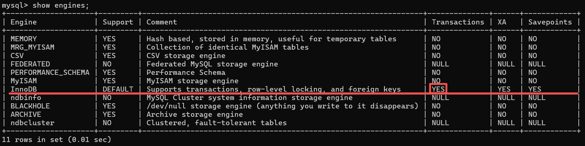

通过以下语句可以完成对事务的控制：

- `STRAT` 或 `BEGIN TRANSACTION` 开始一个新的事务；

- `COMMIT` 提交当前事务，并对更改持久化保存；

- `ROLLBACK` 回滚当前事务，取消其更改；

- `SET autocommit` 禁用或启用当前会话的默认提交模式，`autocommit` 是一个系统变量，可以通过选项指定，也可以通过命令行设置。

  通过 `SET autocommit` 设置自动提交或手动提交

  ```sql
  # 查看当前事务的提交方式
  show variables like 'autocommit';
  ```

  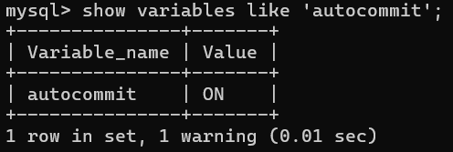

  ```sql
  # 设置为手动提交
  SET AUTOCOMMIT=0; 	# 方式1
  SET AUTOCOMMIT=OFF; # 方式2
  
  # 再次查看事务的提交方式
  show variables like 'autocommit';
  ```

  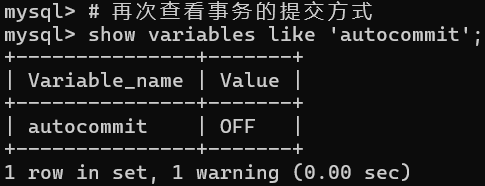

  > <span style="color:red">注意：</span>
  >
  > - 只要使用 `START TRANSACTION` 或 `BEGIN` 开启事务，必须要通过 `COMMIT` 提交才会持久化，与是否设置 `autocommit` 无关；
  > - 默认情况下 MySQL 启用事务自动提交，也就是说每个语句都是一个事务。

我们首先创建数据库和表，并插入一些数据。

```sql
# ===================创建数据库===================
create database transaction;
use transaction;

# ====================账户表====================
CREATE TABLE `account` (
  `id` bigint PRIMARY KEY AUTO_INCREMENT,
  `name` varchar(255) NOT NULL,    # 姓名
  `balance` decimal(10, 2) NOT NULL # 余额
);

INSERT INTO account(`name`, balance) VALUES('张三', 1000);
INSERT INTO account(`name`, balance) VALUES('李四', 1000);
```

- 开启一个事务，执行修改后回滚：

  ```sql
  # 开启事务
  START TRANSACTION;
  
  # 在修改前查看表中的数据
  SELECT * FROM account;
  ```

  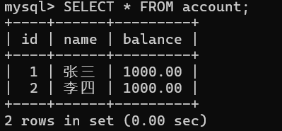

  ```sql
  # 张三余额减少100
  UPDATE account set balance = balance - 100 where name = '张三';
  
  # 李四余额增加100
  UPDATE account set balance = balance + 100 where name = '李四';
  
  # 在修改后，提交前查看数据
  SELECT * FROM account;
  ```

  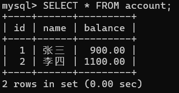

  ```sql
  # 回滚事务
  rollback;
  
  # 再查询发现修改没有生效
  SELECT * FROM account;
  ```

  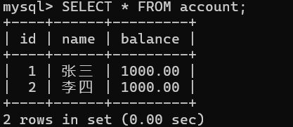

- 开启一个事务，执行修改后提交

  ```sql
  # 开启事务
  START TRANSACTION;
  
  # 在修改前查看表中的数据
  SELECT * FROM account;
  ```

  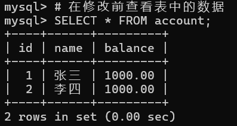

  ```sql
  # 张三余额减少100
  UPDATE account set balance = balance - 100 where name = '张三';
  
  # 李四余额增加100
  UPDATE account set balance = balance + 100 where name = '李四';
  
  # 在修改后，提交前查看数据
  SELECT * FROM account;
  ```

  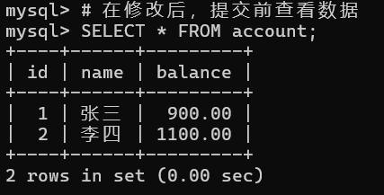

  ```sql
  # 提交事务
  commit;
  
  # 再次查询发现数据已被修改
  SELECT * FROM account;
  ```

  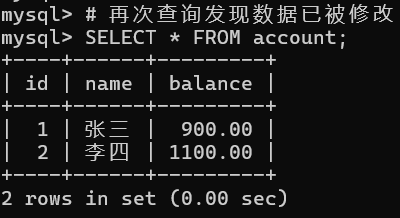

### 1.3 如何实现 ACID

- 如何实现原子性？

  todo

- 如何实现持久性？

  提交的事务要把数据写入存储介质，比如磁盘。在正常情况下大多没有问题，可是在服务器崩溃或突然断电的情况下，一个事务中的多个修改操作，只有一部分写入了数据文件，另一部分没有。

  在真正写入数据文件之前，MySQL 会把事务中的所有 DML 操作以日志的形式记录下来，以便在服务器下次启动的时候进行恢复操作。恢复操作的过程就是把日志（Redo Log）中没有写到数据文件的记录重新执行一遍。此外，在持久化处理过程中，还包括缓冲池、双写缓冲区，二进制日志等。

- 如何实现隔离性？

  事务的隔离性是通过[锁](#lock)策略联合多版本并发控制实现的。

  

## 二、锁

<a id="lock"></a>

### 2.1 锁信息

查看锁信息：

```sql
SELECT * FROM performance_schema.data_locks\G
```

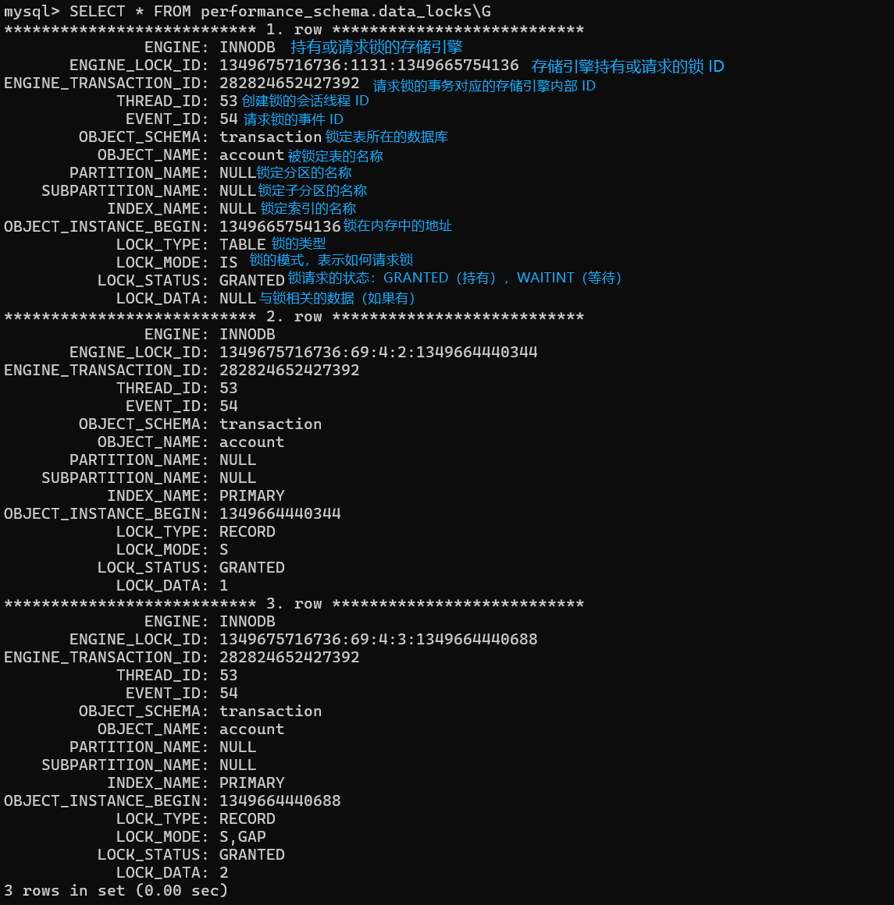

- 锁类型

  锁类型依赖于存储引擎，在 InnoDB 存储引擎中按照锁粒度分为：行级锁（record）和表级锁（table）

  - 行级锁也叫行锁，是对表中某些具体数据行进行加锁；
  - 表级锁也叫表锁，是对整个数据表进行加锁；
  - 在之前版本的 BDB 存储引擎中还支持页级锁，锁定的是一个数据页，MySQL8 中没有页级锁。

- 锁模式

  用来表述如何请求（申请）锁，分为共享锁（S）、独占锁（X）、意向共享锁（IS）、意向独占锁（IX）、记录锁、间隙锁、Next-Key 锁、AUTO-INC 锁和空间索引的谓词锁等

### 2.2 共享锁和独占锁

InnoDB 实现了标准的行级锁，分别是共享锁（S锁）和独占锁（X锁），独占锁也称为排他锁

- 共享锁：允许持有该锁的事务读取表中的一行记录，同时允许其他事务在锁定行上加另一个共享锁并读取被锁定的对象，但是不能对其进行写操作；
- 独占锁：允许持有该锁的事务对数据进行更新或删除，其他任何事务都不能再加任何锁（不管 S 还是 X）。

如果事务1持有R行上的共享锁，那么事务2请求R行上的锁会有如下处理：

- 事务2请求S锁会立即授予，此时事务1和事务2都对R行持有S锁；
- 事务2请求X锁不能立即被授予，阻塞到事务1释放持有的锁。

<table border="1" cellpadding="8" cellspacing="0" style="width:100%;border-collapse:collapse;text-align:center;vertical-align:middle;">
  <tr>
    <th style="width:100px;background:#f5f5f5;"></th>
    <th style="width:50%;background:#f5f5f5;">事务1</th>
    <th style="width:50%;background:#f5f5f5;">事务2</th>
  </tr>
  <tr>
    <td style="width:100px;vertical-align:middle;">开启事务</td>
    <td style="vertical-align:middle;"></td>
    <td style="vertical-align:middle;"></td>
  </tr>
  <tr>
    <td style="width:100px;vertical-align:middle;">加共享锁</td>
    <td style="vertical-align:middle;">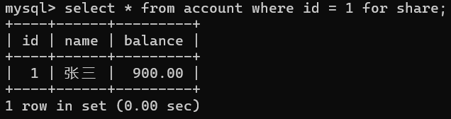</td>
    <td style="vertical-align:middle;">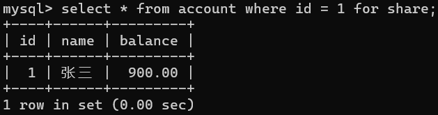</td>
  </tr>
  <tr>
    <td style="width:100px;vertical-align:middle;">加排他锁</td>
    <td style="vertical-align:middle;"></td>
    <td style="vertical-align:middle;"></td>
  </tr>
</table>

如果事务1持有R行上的独占锁，那么事务2请求R行上的任意类型的锁都不能被立即授予，事务2必须等待事务1释放R行上的锁。

|          |                事务1                 |                   事务2                   |
| :------: | :----------------------------------: | :---------------------------------------: |
| 开启事务 |  |       |
| 加排他锁 |   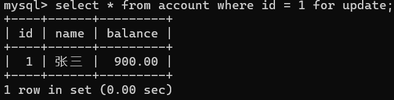   |                                           |
| 加共享锁 |                                      |  |
| 加排他锁 |                                      |      |

### 2.3 意向锁

InnoDB 支持多粒度锁，允许行锁和表锁共存。意向锁是表级别的锁，它并不是真正意义上的加锁，而只是在 `data_locks` 中记录事务以后要对表中的哪一行加哪种类型的锁（共享锁或排他锁），意向锁分为两种：

- 意向共享锁（IS）：表示事务打算对表中的单个行设置共享锁；
- 意向排他锁（IX）：表示事务打算对表中的单个行设置排他锁。

> 没有意向锁行不行？
>
> InnoDB 是行锁 + 表锁混合粒度锁，当有人要加表级锁时，如果没有意向锁，数据库必须逐行遍历整张表，检查每一行有没有被加上行锁，效率极低。
>
> 因此意向锁可以提高加锁性能，在真正加锁之前不需要遍历表中的行是否加锁，只需要查看以下表中的意向锁即可。

在获取意向锁时有如下协议：

- 在事务获得表中某一行的共享锁（S）之前，它必须首先获得该表上的IS锁或更强的锁
- 在事务获得表中某一行的排他锁（X）之前，它必须首先获得该表上的IX锁或更强的锁

> `IS` ＜ `IX` ＜ 表级 S 锁 ＜ 表级 X 锁

**意向锁不会和行级锁冲突，它只可能阻止某些表级锁**

|  | X                 | IX                | S                 | IS                |
|:----------------:|:-----------------:|:-----------------:|:-----------------:|:-----------------:|
| **X**            | <span style="color:red;">冲突</span> | <span style="color:red;">冲突</span> | <span style="color:red;">冲突</span> | <span style="color:red;">冲突</span> |
| **IX**           | <span style="color:red;">冲突</span> | <span style="color:green;">兼容</span> | <span style="color:red;">冲突</span> | <span style="color:green;">兼容</span> |
| **S**            | <span style="color:red;">冲突</span> | <span style="color:red;">冲突</span> | <span style="color:green;">兼容</span> | <span style="color:green;">兼容</span> |
| **IS**           | <span style="color:red;">冲突</span> | <span style="color:green;">兼容</span> | <span style="color:green;">兼容</span> | <span style="color:green;">兼容</span> |

|                     |                 事务1                 |                    事务2                     |
| :-----------------: | :-----------------------------------: | :------------------------------------------: |
|      开启事务       |   |          |
|      加 IX 锁       |       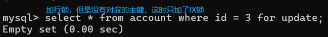        |                                              |
|       加行锁        |                                       |        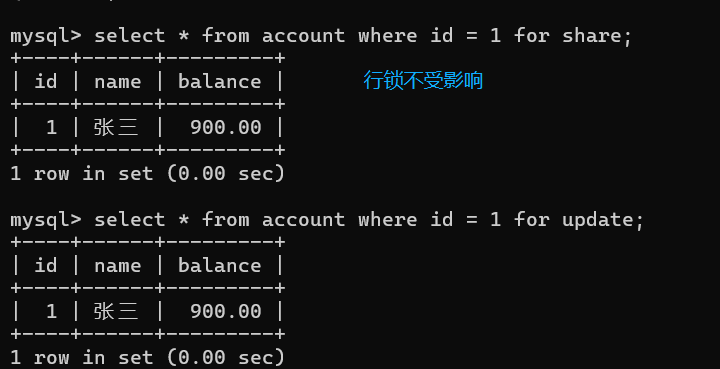        |
|   加表锁（阻塞）    |                                       |                    |
|      提交事务       | 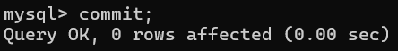 |                                              |
|     解锁并提交      |                                       | 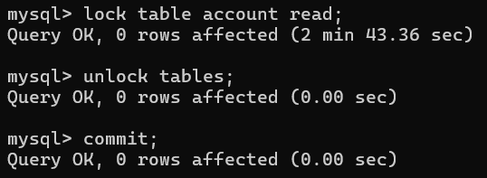 |
|      开启事务       |   |          |
|      加 IS 锁       |   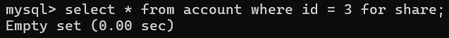   |                                              |
|       加行锁        |                                       |                |
|     加表级 S 锁     |                                       |           |
| 加表级 X 锁（阻塞） |                                       |          |

### 2.4 索引记录锁

行级锁都是索引记录锁

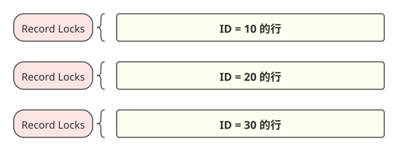

### 2.5 间隙锁

间隙锁锁定的是索引记录之间的间隙，或第一个索引记录之前，再或者最后一个索引记录之后的间隙：

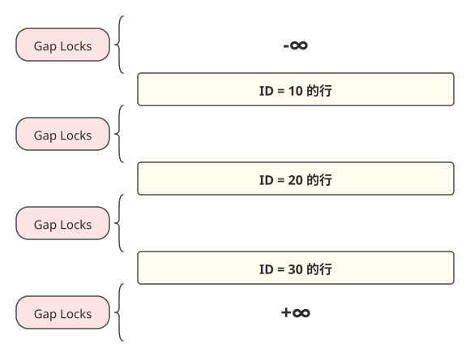

例如如下 `SQL`，锁定的是 ID（10, 20）之间的间隙，目的是防止其他事务将 ID = 15 的列插入到 `account` 表中，无论是否已经存在要插入的数据列，因为指定范围之间的间隙被锁定了。

```sql
SELECT * FROM account WHERE id BETWEEN 10 AND 20 FOR UPDATE;
```

间隙可以跨越单个或多个索引值：

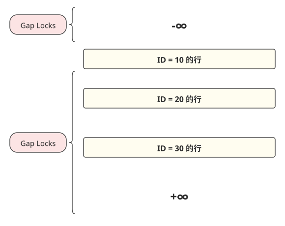

间隙锁特性：

- 仅在 RR 隔离级别生效：RC（读已提交）级别没有间隙锁，可能发生幻读，但是并发性能更高；

- 间隙锁是左开右开区间：比如 id=10 和 id=20 之间的间隙是 `(10, 20)`，不包含 10 和 20 本身；

- 间隙锁之间完全兼容：多个事务可以同时对同一个间隙加间隙锁，互不阻塞；

  | 已持有锁 \ 申请锁 |                 间隙锁                 |                 记录锁                 |              插入意向锁              |
  | :---------------: | :------------------------------------: | :------------------------------------: | :----------------------------------: |
  |    **间隙锁**     | <span style="color:green;">兼容</span> | <span style="color:green;">兼容</span> | <span style="color:red;">冲突</span> |

- 间隙锁没有 S/X 之分：共享间隙锁和排他间隙锁效果完全一样，都只阻止插入；

- 只有当用 **唯一索引** 做 **等值查询** 并且 **刚好查到了一条数据** 时，InnoDB 才会只加索引记录锁，不加间隙锁；其他所有情况，都会加间隙锁或临键锁。

  假设我们有一张表，主键索引`id`有三条记录：`90`、`100`、`110`。

  索引间隙划分：`(-∞,90)` → `(90,100)` → `(100,110)` → `(110,+∞)`

  - 唯一索引 + 等值查询 + 命中记录

    ```sql
    -- age是普通索引（非唯一）
    BEGIN;
    SELECT * FROM account WHERE age = 100 FOR UPDATE;
    ```

    只锁`id=100`这一行，不锁任何间隙

  - 非唯一索引 + 等值查询 + 命中记录

    ```sql
    -- age是普通索引（非唯一）
    BEGIN;
    SELECT * FROM account WHERE age = 100 FOR UPDATE;
    ```

    加临键锁，锁定`(90,100]`这个区间

    > 因为普通索引不能保证唯一性，未来可能插入第二条 `age = 100` 的记录，不加间隙锁会出现幻读

  - 没有索引 + 等值查询

    ```sql
    -- name没有索引
    BEGIN;
    SELECT * FROM account WHERE name = '张三' FOR UPDATE;
    ```

    全表加临键锁，相当于表锁

    > 为什么会变成表锁？
    >
    > 因为没有索引，InnoDB 无法定位到具体的索引记录，只能进行全表扫描。扫描过程中，会给所有扫描过的索引记录和间隙都加锁，最终整个表都被锁住。

### 2.6 临键锁

`Next-key` 锁是索引记录锁和索引记录之前间隙上间隙锁的组合，它的锁定范围是一个左开右闭区间：

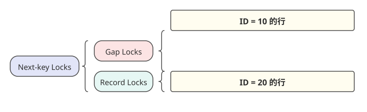

|   索引类型   | 查询类型 | 记录是否存在 |    加的锁    |     锁定范围示例      |
| :----------: | :------: | :----------: | :----------: | :-------------------: |
| **唯一索引** | 等值查询 |     存在     | 退化为记录锁 |   只锁`id=20`这一行   |
| **唯一索引** | 等值查询 |    不存在    | 退化为间隙锁 | 只锁`(10,20)`这个间隙 |
| **普通索引** | 任何查询 |   任何情况   |  完整临键锁  |  锁`(10,20]`这个区间  |
| **任何索引** | 范围查询 |   任何情况   |  完整临键锁  |  锁所有扫描到的区间   |

### 2.7 插入意向锁

插入意向锁是一个特殊的间隙锁，在向索引记录之前的间隙进行 insert 操作插入数据时使用。间隙锁并不阻止插入，真正阻止插入的是普通间隙锁和插入意向锁之间的互斥关系。

| 已持有锁 \ 申请锁 |          普通间隙锁（无标志）          |          插入意向锁（有标志）          |
| :---------------: | :------------------------------------: | :------------------------------------: |
|  **普通间隙锁**   | <span style="color:green;">兼容</span> |  <span style="color:red;">冲突</span>  |
|  **插入意向锁**   |  <span style="color:red;">冲突</span>  | <span style="color:green;">兼容</span> |

读写互锁，读读或写写兼容

```sql
-- 1. 创建测试表
CREATE TABLE IF NOT EXISTS user (
  id INT PRIMARY KEY,
  name VARCHAR(20)
);

-- 2. 插入初始数据（id=10、20、30）
TRUNCATE TABLE user;
INSERT INTO user(id, name) VALUES (10, '张三'), (20, '李四'), (30, '王五');

-- 3. 确认隔离级别（默认是REPEATABLE-READ）
SELECT @@transaction_isolation;
```

- 普通间隙锁之间完全兼容（查询不阻塞查询）

  | 步骤 |     会话 A 执行      |     会话 B 执行      |                解释                 |
  | :--: | :------------------: | :------------------: | :---------------------------------: |
  |  1   |  |                      |                                     |
  |  2   |  |                      |     给 (10,20) 间隙加普通间隙锁     |
  |  3   |                      | 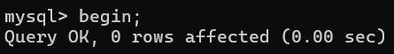 |                                     |
  |  4   |                      |  | 也给 (10,20) 间隙加普通间隙锁，兼容 |
  |  5   | 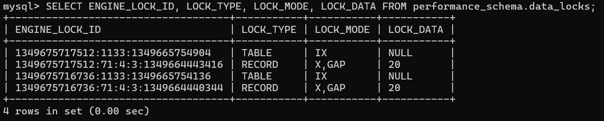 | 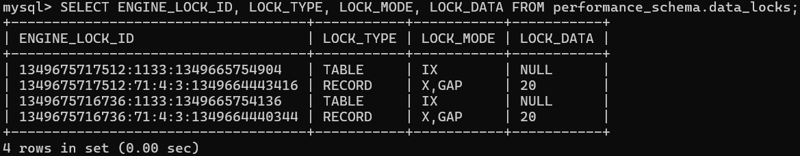 |  `LOCK_MODE='X,GAP'`表示普通间隙锁  |
  |  6   | 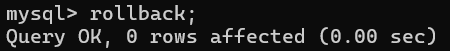 |  |             释放所有锁              |

- 插入意向锁之间完全兼容（插入不阻塞插入）

  | 步骤 |      会话 A 执行       |      会话 B 执行       |                             解释                             |
  | :--: | :--------------------: | :--------------------: | :----------------------------------------------------------: |
  |  1   |  |                        |                                                              |
  |  2   | 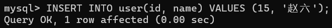 |                        | 申请 (10,20) 的插入意向锁；插入记录；加 id=15 的记录锁；立即释放插入意向锁 |
  |  3   |                        | 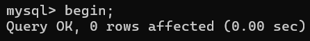 |                                                              |
  |  4   |                        | 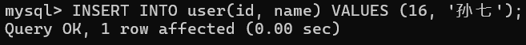 |             同样申请 (10,20) 的插入意向锁，兼容              |
  |  5   | 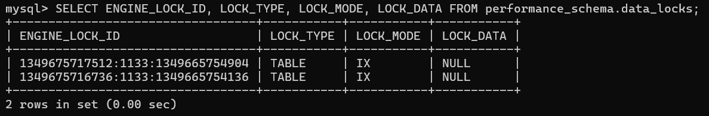 | 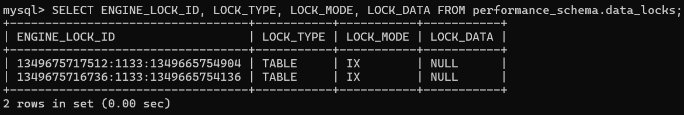 |                      插入意向锁已经释放                      |
  |  6   |      `ROLLBACK;`       |      `ROLLBACK;`       |                      数据恢复到初始状态                      |

- 普通间隙锁与插入意向锁互斥（查询阻塞插入）

  | 步骤 |      会话 A 执行       |      会话 B 执行       |                        解释                        |
  | :--: | :--------------------: | :--------------------: | :------------------------------------------------: |
  |  1   |        `BEGIN;`        |                        |                                                    |
  |  2   |  |                        |            给 (10,20) 间隙加普通间隙锁             |
  |  3   |                        |        `BEGIN;`        |                                                    |
  |  4   |                        |  |    申请 (10,20) 的插入意向锁，与普通间隙锁互斥     |
  |  5   | 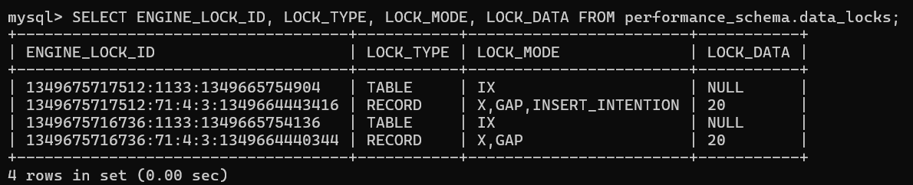 |                        | `LOCK_MODE='X,GAP,INSERT_INTENTION'`表示插入意向锁 |
  |  6   |      `ROLLBACK;`       |                        |                   释放普通间隙锁                   |
  |  7   |                        |    |    会话 A 释放锁后，会话 B 的插入意向锁申请成功    |
  |  8   |                        |      `ROLLBACK;`       |                 数据恢复到初始状态                 |

- 插入意向锁导致的经典死锁

  | 步骤 |      会话 A 执行       |      会话 B 执行       |                             解释                             |
  | :--: | :--------------------: | :--------------------: | :----------------------------------------------------------: |
  |  1   |        `BEGIN;`        |        `BEGIN;`        |                                                              |
  |  2   |  |                        |                会话 A 加 (10,20) 的普通间隙锁                |
  |  3   |                        |  |            会话 B 也加 (10,20) 的普通间隙锁，兼容            |
  |  4   |    |                        |                     申请插入意向锁，互斥                     |
  |  5   |                        |  | 申请插入意向锁，互斥。InnoDB 自动检测到循环等待，回滚代价较小的事务 |
  |  7   |      `ROLLBACK;`       |      `ROLLBACK;`       |                      数据恢复到初始状态                      |

### 2.8 AUTO-INC Locks

AUTO-INC Locks 锁也叫自增锁，是一个表级锁。在插入数据时会在表上加自增锁，并生成自增值，同时阻塞其他事务操作，保证值的唯一性。需要注意的是插入失败也会消耗自增值。因此表中会出现自增值不连续的情况。

### 2.9 死锁

每个事务都持有另一个事务所需的锁，导致事务无法继续进行的情况称为死锁：

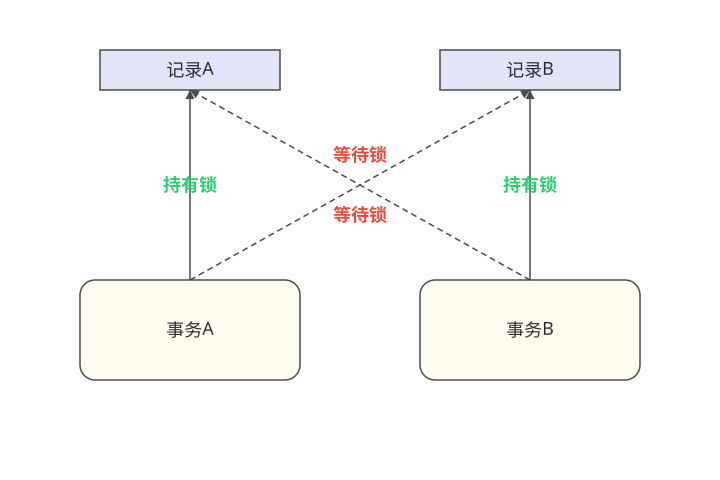

## 三、隔离级别