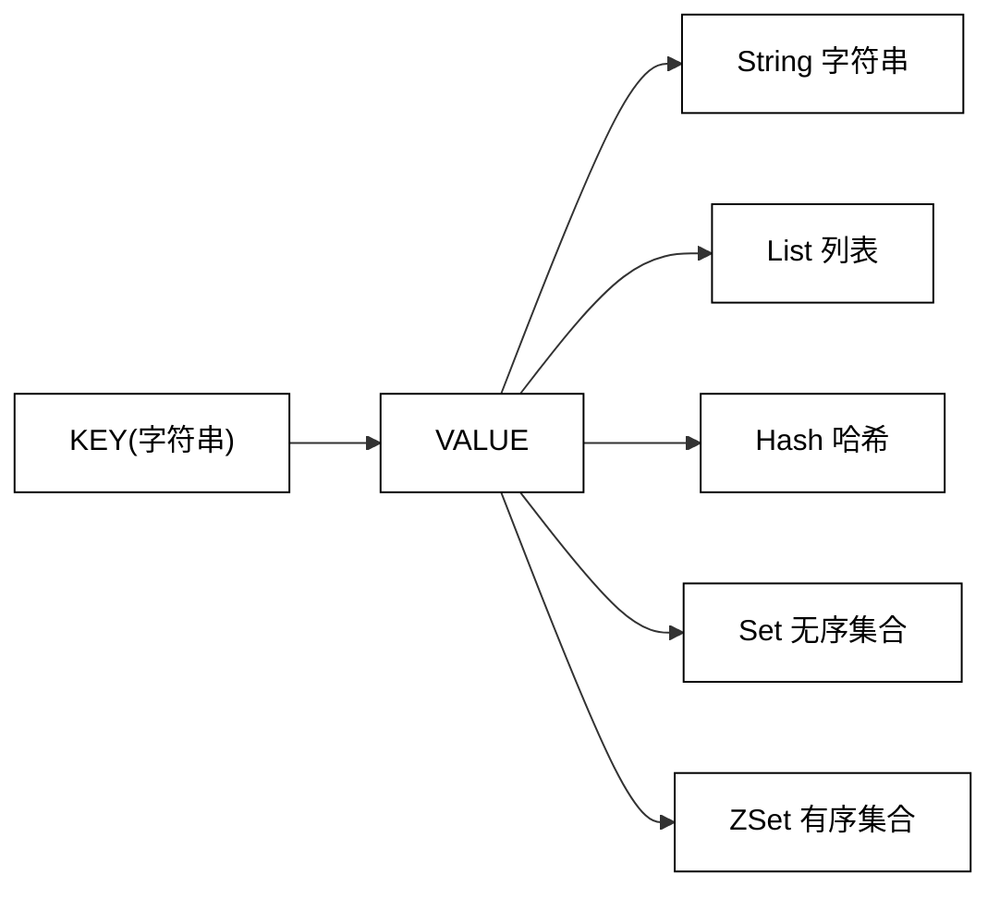
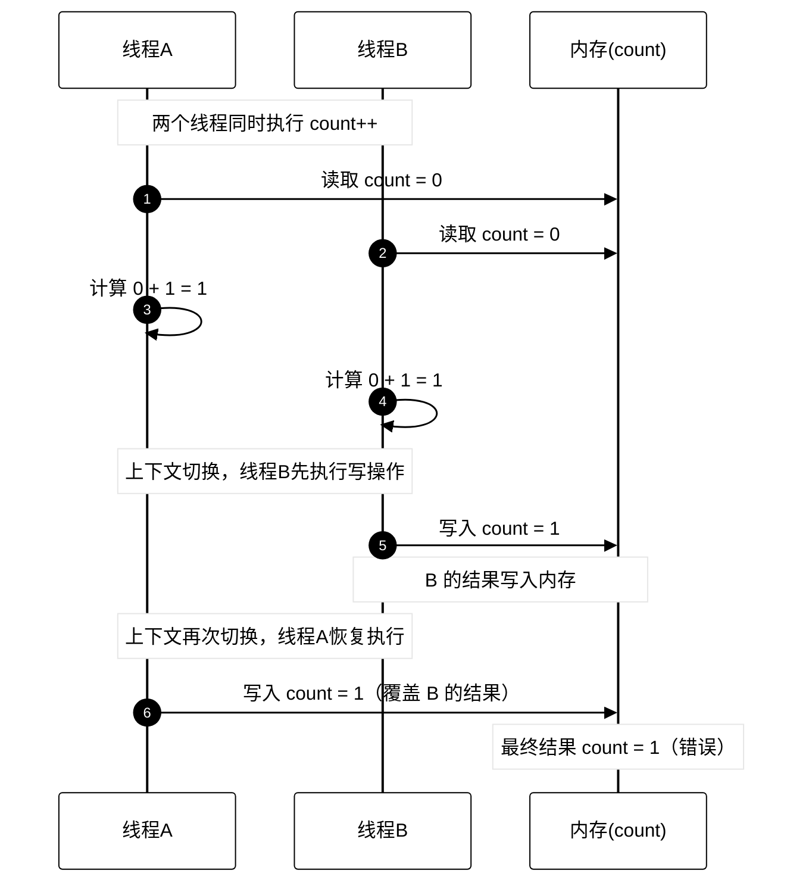

# 常见数据类型

## 1.预备知识

### 1.1 全局命令



Redis 有5种数据结构，它们都是键值对中的值，对于键来说有一些通用命令：

- KEYS

  返回所有满足样式的 key，匹配规则如下：

  - ?：匹配任意一个字符
  - *：匹配0个或多个任意字符
  - [ae]：匹配固定选项ae
  - [^e]：除了e，其他都匹配
  - [a-e]：匹配 `[a, e]` 这个范围内的选项，闭区间

  

  语法：`KEYS pattern`

  时间复杂度： $O(n)$

  > 生产环境，一般禁止使用 `keys`，尤其是大杀器 `keys *`
  >
  > redis 是单线程服务器，执行 `keys*` 时间很长，当 redis 服务器被阻塞时，无法给其他客户端提供服务

  返回值：匹配 `pattern` 的所有 `key`

- EXISTS

  判断某个 `key` 是否存在

  语法：`EXISTS key [key]` 

  时间复杂度： $O(1)$

  > 分开的写法：会产生更多轮次的网络通信
  >
  > 
  >
  > ```mermaid
  > sequenceDiagram
  >     participant Client
  >     participant Redis
  > 
  >     Client->>Redis: EXISTS hello
  >     Redis-->>Client: (integer) 1
  > 
  >     Client->>Redis: EXISTS hallo
  >     Redis-->>Client: (integer) 1
  > ```
  >
  > 合并的写法：
  >
  > 
  >
  > ```mermaid
  > sequenceDiagram
  >     participant Client
  >     participant Redis
  > 
  >     Client->>Redis: EXISTS hello hallo
  >     Redis-->>Client: (integer) 2
  > ```

  返回值：key 存在的个数

- DEL

  删除指定的 key

  

  - 语法：`DEL key [key ...]`
  - 时间复杂度： $O(1)$
  - 返回值：删除掉的 key 的个数

- EXPIRE：

  为指定的 key 添加秒级的过期时间（Time To Live, TTL）

  > 超过这个时间 key 会被自动删除，应用场景：手机验证码，redis 分布式锁

  

  - 语法：`EXPIRE key seconds`

    > 毫秒级：`PEXPIRE key ms`

  - 时间复杂度： $O(1)$
  - 返回值：1 表示设置成功，0 表示设置失败

- TTL

  获取指定 key 的过期时间，秒级

  - 语法：`TTL key`

    > 毫秒级：`pttl key`

  - 时间复杂度： $O(1)$

  - 返回值：剩余过期时间，-1 表示没有关联过期时间，-2 表示 key 不存在

  键的过期机制：

  

  定期删除 vs 惰性删除

  - 定期删除：

    定期删除过期的 key，每次抽取一部分验证过期时间，保证这个抽取检查的速度足够快

  - 惰性删除：假设这个 key 已经到过期时间了，但暂时还没删它，key 还存在。紧接着，后面又一次访问，正好用到了这个 key，这时 redis 会删除这个 key 同时返回一个 nil。

  redis 没有采用类似于定时器的方式处理过期键，而是采用定期删除和惰性删除相结合的方式，但是这样也不能保证完全没问题，当内存满了的时候，redis 不得不删，这属于主动删除（内存淘汰策略[后面](./9.Redis%20典型应用.md#anchor)讲）

  > 定时器：在某个时间到达之后，执行指定的任务
  >
  > - 基于优先级队列：
  >
  >   正常队列先进先出，优先级队列按照优先级先进先出。在 redis 设置过期 key 的场景中，定义过期时间越早，优先级越高。现假定很多 key 设置了过期时间，就可以把这些 key 加入到一个优先级队列中，其中队首元素就是最早要过期的 key，此时定时器中只要分配一个线程，让这个线程去检查队首元素看是否过期即可。
  >
  >   > 扫描线程不需要遍历所有 key，只需要盯住队首这个元素。另外扫描线程也不必检查太过频繁，根据当前时刻和标记的过期时间，设置一个等待，时间快到了再唤醒这个线程（休眠期间来了新任务，可以先唤醒扫描线程，重新设置等待时间）
  >
  > - 基于时间轮的定时器：
  >
  >   把时间划分成许多小段（划分粒度看实际需求）
  >
  >   
  >
  >   每个小段上挂着一个链表，每个链表都代表一个要执行的任务，假设需要添加一个 key，这个 key 在 300ms 之后才过期，就会把删除的任务挂在第三个格子。
  >
  >   每走到一个格子，就会把这个格子上的链表上挂载的任务尝试执行一下
  >
  > **Redis 没有采用上述两种方案**
  >
  > - 优先级队列的方案时间复杂度高（设置过期时间 $O(log N)$，key 过期弹出堆顶 $O(log N)$）；而且过期键数量巨大，优先级队列会极度膨胀；此外，如果队首到期的 key 过多，瞬间清理大量 key 可能导致阻塞。
  > - 时间轮的定时器很好用，Linux 内核定时器，Kafka 等都使用了它，但是时间轮适合短时定时任务，不适合超长 TTL（时间轮如果用于长时间，则需要极大尺寸或分层，过于笨重）；并且，时间轮适合大量定时任务，触发时间相对密集，而 redis 过期 key 分布随机；Redis 采用单线程模型，不适合维护复杂时间轮结构。
  >
  > **Redis 采用了三种算法结合的方案：**
  >
  > - 惰性删除：`get` 某个过期 key 的时候才删除
  > - 定期删除：定期抽样删除过期 key
  > - 主动删除：内存压力触发时，优先删除过期 key，若不够，再根据淘汰策略删除其他 key

- TYPE

  返回 key 对应的 value 数据类型

  - 语法：`TYPE key`
  - 时间复杂度： $O(1)$
  - 返回值：none、string、list、set、zset、hash、stream

### 1.2 数据结构和内部编码

<table>
  <thead>
    <tr>
      <th>数据结构</th>
      <th>内部编码</th>
      <th>说明</th>
    </tr>
  </thead>
  <tbody>
    <!-- string -->
    <tr>
      <td rowspan="3">string</td>
      <td>raw</td>
      <td>最基本的字符串</td>
    </tr>
    <tr>
      <td>int</td>
      <td>整数编码</td>
    </tr>
    <tr>
      <td>embstr</td>
      <td>针对短字符串的特殊优化</td>
    </tr>
    <!-- hash -->
    <tr>
      <td rowspan="2">hash</td>
      <td>hashtable</td>
      <td>最基础的哈希表</td>
    </tr>
    <tr>
      <td>ziplist</td>
      <td>哈希表元素较少时，优化为ziplist，因为元素少，也视为 O(1)</td>
    </tr>
    <!-- list -->
    <tr>
      <td rowspan="2">list</td>
      <td>linkedlist</td>
      <td>链表</td>
    </tr>
    <tr>
      <td>ziplist</td>
      <td>压缩列表</td>
    </tr>
    <!-- set -->
    <tr>
      <td rowspan="2">set</td>
      <td>hashtable</td>
      <td>哈希表实现的集合</td>
    </tr>
    <tr>
      <td>intset</td>
      <td>存储整数的紧凑集合结构</td>
    </tr>
    <!-- zset -->
    <tr>
      <td rowspan="2">zset</td>
      <td>skiplist</td>
      <td>跳表，查询时间 O(log n)</td>
    </tr>
    <tr>
      <td>ziplist</td>
      <td>小集合时使用的压缩列表</td>
    </tr>
  </tbody>
</table>

通过 `object encoding` 命令查询内部编码


Redis 这样做有两个好处：

1) 可以改进内部编码，而对外的数据结构和命令没有任何影响，这样一旦开发出更优秀的内部编码，无需改动外部数据结构和命令。例如 Redis 3.2 提供了 quicklist，结合了 ziplist 和 linkedlist 两者的优势，为列表类型提供了一种更为优秀的内部编码实现，而对用户来说基本无感知。

2) 多种内部编码实现可以在不同场景下发挥各自的优势。例如 ziplist 比较节省内存，但是在列表元素比较多的情况下，性能会下降。这时候 Redis 会根据配置选项将列表类型的内部实现转换为 linkedlist，整个过程用户同样无感知。

### 1.3 单线程架构

> Redis 只用一个线程处理所有命令请求，不是说一个 Redis 服务器内部真的就只有一个线程，其实也有多个线程，多个线程是处理网络 IO、RDB/AOF 等。
>
> **Redis 采用单线程执行命令以保证并发安全和性能，但为了避免主线程阻塞，会把耗时 I/O 和后台任务交给多线程或子进程执行。**

#### 1.3.1 多线程的线程安全问题


多线程中，两个线程同时修改一个变量，表面上是自增两次，实际上可能只自增一次。当前两个客户端，也相当于“并发”地发起请求，是否会有线程安全问题？

> 不会，Redis 单线程模型保证了当前收到的多个请求是串行的。

**线程安全问题：**

自增操作不是原子的，它实际上分为三步：读取变量，加一，写回变量。那么考虑以下情况：



因此一般多线程的情况下，对公共资源操作前要加锁，而 redis 是单线程模型，自然也不用担心上述问题。

#### 1.3.2 redis 的单线程模型

**虽然 redis 是单线程模型，但是它为什么快？**

- redis 访问内存，数据库访问磁盘，而且 redis 核心功能比数据库的核心功能简单

- 单线程模型避免了一些不必要的线程竞争开销，redis 每个操作都是短平快，简单操作下内存数据，搞成多线程也提升不大

- 处理网络 IO 时，使用了 epoll 这样的 IO 多路复用机制

  

  > IO 多路复用：一个线程可以管理多个 socket
  >
  > 对于 TCP 来说，服务器每服务一个客户端，都需要给这个客户端安排一个 socket，一个服务器对应多个 socket，但是这些 socket 上不是无时无刻地传输数据。也就是说， **同一时刻，只有少数 socket 是活跃的。** Linux 提供了三套 API：select、poll、epoll

**单线程的坏处：**

对于单个命令的执行时间都是有要求的，如果某个命令执行时间过长，会导致其他命令全处于等待队列中，迟迟得不到响应，造成客户端的阻塞。

## 2.String 字符串

### 2.1 常见命令

## 3.Hash 哈希

## 4.List 列表

## 5.Set 集合

## 6.Zset 有序集合

## 7.渐进式遍历

