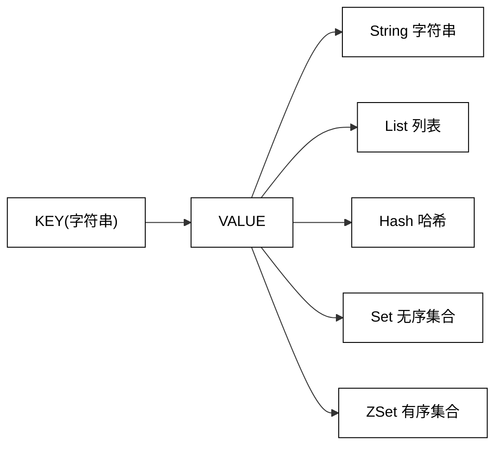
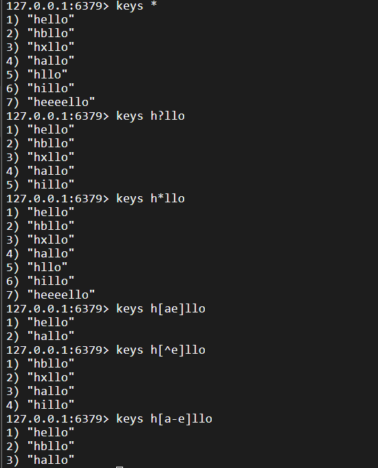
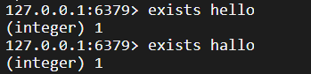
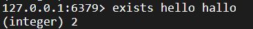
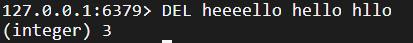
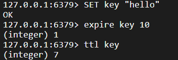

# 常见数据类型

## 1.预备知识

### 1.1 全局命令



Redis 有5种数据结构，它们都是键值对中的值，对于键来说有一些通用命令：

- KEYS

  返回所有满足样式的 key，匹配规则如下：

  - ?：匹配任意一个字符
  - *：匹配0个或多个任意字符
  - [ae]：匹配固定选项ae
  - [^e]：除了e，其他都匹配
  - [a-e]：匹配 `[a, e]` 这个范围内的选项，闭区间

  

  语法：`KEYS pattern`

  时间复杂度： $O(n)$

  > 生产环境，一般禁止使用 `keys`，尤其是大杀器 `keys *`
  >
  > redis 是单线程服务器，执行 `keys*` 时间很长，当 redis 服务器被阻塞时，无法给其他客户端提供服务

  返回值：匹配 `pattern` 的所有 `key`

- EXISTS

  判断某个 `key` 是否存在

  语法：`EXISTS key [key]` 

  时间复杂度： $O(1)$

  > 分开的写法：会产生更多轮次的网络通信
  >
  > 
  >
  > ```mermaid
  > sequenceDiagram
  >     participant Client
  >     participant Redis
  > 
  >     Client->>Redis: EXISTS hello
  >     Redis-->>Client: (integer) 1
  > 
  >     Client->>Redis: EXISTS hallo
  >     Redis-->>Client: (integer) 1
  > ```
  >
  > 合并的写法：
  >
  > 
  >
  > ```mermaid
  > sequenceDiagram
  >     participant Client
  >     participant Redis
  > 
  >     Client->>Redis: EXISTS hello hallo
  >     Redis-->>Client: (integer) 2
  > ```

  返回值：key 存在的个数

- DEL

  删除指定的 key

  

  - 语法：`DEL key [key ...]`
  - 时间复杂度： $O(1)$
  - 返回值：删除掉的 key 的个数

- EXPIRE：

  为指定的 key 添加秒级的过期时间（Time To Live, TTL）

  > 超过这个时间 key 会被自动删除，应用场景：手机验证码，redis 分布式锁

  

  - 语法：`EXPIRE key seconds`

    > 毫秒级：`PEXPIRE key ms`

  - 时间复杂度： $O(1)$
  - 返回值：1 表示设置成功，0 表示设置失败

- TTL

  获取指定 key 的过期时间，秒级

  - 语法：`TTL key`

    > 毫秒级：`pttl key`

  - 时间复杂度： $O(1)$

  - 返回值：剩余过期时间，-1 表示没有关联过期时间，-2 表示 key 不存在

  键的过期机制：

  
  
  定期删除 vs 惰性删除

  - 定期删除：

    定期删除过期的 key，每次抽取一部分验证过期时间，保证这个抽取检查的速度足够快

  - 惰性删除：假设这个 key 已经到过期时间了，但暂时还没删它，key 还存在。紧接着，后面又一次访问，正好用到了这个 key，这时 redis 会删除这个 key 同时返回一个 nil。

  redis 没有采用类似于定时器的方式处理过期键，而是采用定期删除和惰性删除相结合的方式，但是这样也不能保证完全没问题，当内存满了的时候，redis 不得不删，这属于淘汰删除（内存淘汰策略[后面](./9.Redis%20典型应用.md#13-%E7%BC%93%E5%AD%98%E7%9A%84%E6%9B%B4%E6%96%B0%E7%AD%96%E7%95%A5)讲）

- TYPE

- 

  

  