# 常见数据类型

## 1.预备知识

### 1.1 全局命令

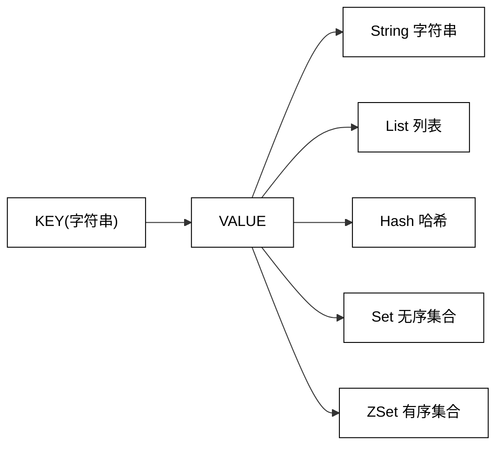
```mermaid
graph LR
    %% --- 黑白配色定义 ---
    classDef bw fill:#ffffff,stroke:#000000,color:#000000,stroke-width:1px;

    A0["KEY(字符串)"]-->A[VALUE]
    A--> B[String 字符串]
    A --> C[List 列表]
    A --> D[Hash 哈希]
    A --> E[Set 无序集合]
    A --> F[ZSet 有序集合]

    %% --- 应用黑白样式 ---
    class A0,A,B,C,D,E,F bw;

```

Redis 有5种数据结构，它们都是键值对中的值，对于键来说有一些通用命令：

- KEYS

  返回所有满足样式的 key，匹配规则如下：

  - ?：匹配任意一个字符
  - *：匹配0个或多个任意字符
  - [ae]：匹配固定选项ae
  - [^e]：除了e，其他都匹配
  - [a-e]：匹配 `[a, e]` 这个范围内的选项，闭区间

  

  语法：`KEYS pattern`

  时间复杂度： $O(n)$

  > 生产环境，一般禁止使用 `keys`，尤其是大杀器 `keys *`
  >
  > redis 是单线程服务器，执行 `keys*` 时间很长，当 redis 服务器被阻塞时，无法给其他客户端提供服务

  返回值：匹配 `pattern` 的所有 `key`

- EXISTS

  判断某个 `key` 是否存在

  语法：`EXISTS key [key]` 

  时间复杂度： $O(1)$

  > 分开的写法：会产生更多轮次的网络通信
  >
  > 
  >
  > ```mermaid
  > sequenceDiagram
  >     participant Client
  >     participant Redis
  > 
  >     Client->>Redis: EXISTS hello
  >     Redis-->>Client: (integer) 1
  > 
  >     Client->>Redis: EXISTS hallo
  >     Redis-->>Client: (integer) 1
  > ```
  >
  > 合并的写法：
  >
  > 
  >
  > ```mermaid
  > sequenceDiagram
  >     participant Client
  >     participant Redis
  > 
  >     Client->>Redis: EXISTS hello hallo
  >     Redis-->>Client: (integer) 2
  > ```

  返回值：key 存在的个数

- DEL

  删除指定的 key

  

  - 语法：`DEL key [key ...]`
  - 时间复杂度： $O(1)$
  - 返回值：删除掉的 key 的个数

- EXPIRE：

  为指定的 key 添加秒级的过期时间（Time To Live, TTL）

  > 超过这个时间 key 会被自动删除，应用场景：手机验证码，redis 分布式锁

  

  - 语法：`EXPIRE key seconds`

    > 毫秒级：`PEXPIRE key ms`

  - 时间复杂度： $O(1)$
  - 返回值：1 表示设置成功，0 表示设置失败

- TTL

  获取指定 key 的过期时间，秒级

  - 语法：`TTL key`

    > 毫秒级：`pttl key`

  - 时间复杂度： $O(1)$

  - 返回值：剩余过期时间，-1 表示没有关联过期时间，-2 表示 key 不存在

  键的过期机制：

  

  定期删除 vs 惰性删除

  - 定期删除：

    定期删除过期的 key，每次抽取一部分验证过期时间，保证这个抽取检查的速度足够快

  - 惰性删除：假设这个 key 已经到过期时间了，但暂时还没删它，key 还存在。紧接着，后面又一次访问，正好用到了这个 key，这时 redis 会删除这个 key 同时返回一个 nil。

  redis 没有采用类似于定时器的方式处理过期键，而是采用定期删除和惰性删除相结合的方式，但是这样也不能保证完全没问题，当内存满了的时候，redis 不得不删，这属于主动删除（内存淘汰策略[后面](./9.Redis%20典型应用.md#anchor)讲）

  > 定时器：在某个时间到达之后，执行指定的任务
  >
  > - 基于优先级队列：
  >
  >   正常队列先进先出，优先级队列按照优先级先进先出。在 redis 设置过期 key 的场景中，定义过期时间越早，优先级越高。现假定很多 key 设置了过期时间，就可以把这些 key 加入到一个优先级队列中，其中队首元素就是最早要过期的 key，此时定时器中只要分配一个线程，让这个线程去检查队首元素看是否过期即可。
  >
  >   > 扫描线程不需要遍历所有 key，只需要盯住队首这个元素。另外扫描线程也不必检查太过频繁，根据当前时刻和标记的过期时间，设置一个等待，时间快到了再唤醒这个线程（休眠期间来了新任务，可以先唤醒扫描线程，重新设置等待时间）
  >
  > - 基于时间轮的定时器：
  >
  >   把时间划分成许多小段（划分粒度看实际需求）
  >
  >   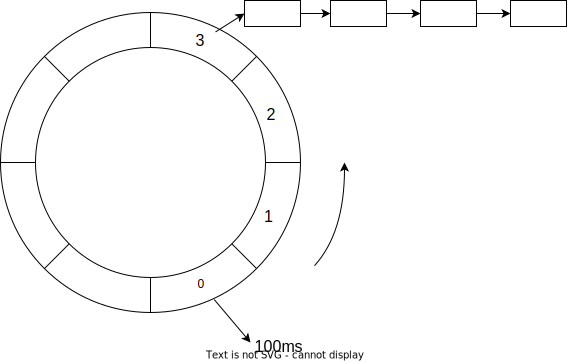
  >
  >   每个小段上挂着一个链表，每个链表都代表一个要执行的任务，假设需要添加一个 key，这个 key 在 300ms 之后才过期，就会把删除的任务挂在第三个格子。
  >
  >   每走到一个格子，就会把这个格子上的链表上挂载的任务尝试执行一下
  >
  > **Redis 没有采用上述两种方案**
  >
  > - 优先级队列的方案时间复杂度高（设置过期时间 $O(log N)$，key 过期弹出堆顶 $O(log N)$）；而且过期键数量巨大，优先级队列会极度膨胀；此外，如果队首到期的 key 过多，瞬间清理大量 key 可能导致阻塞。
  > - 时间轮的定时器很好用，Linux 内核定时器，Kafka 等都使用了它，但是时间轮适合短时定时任务，不适合超长 TTL（时间轮如果用于长时间，则需要极大尺寸或分层，过于笨重）；并且，时间轮适合大量定时任务，触发时间相对密集，而 redis 过期 key 分布随机；Redis 采用单线程模型，不适合维护复杂时间轮结构。
  >
  > **Redis 采用了三种算法结合的方案：**
  >
  > - 惰性删除：`get` 某个过期 key 的时候才删除
  > - 定期删除：定期抽样删除过期 key
  > - 主动删除：内存压力触发时，优先删除过期 key，若不够，再根据淘汰策略删除其他 key

- TYPE

  返回 key 对应的 value 数据类型

  - 语法：`TYPE key`
  - 时间复杂度： $O(1)$
  - 返回值：none、string、list、set、zset、hash、stream
  
- FLUSHALL

  清除 redis 上所有数据（删库）

  - 语法：`flushall`

### 1.2 数据结构和内部编码

<table>
  <thead>
    <tr>
      <th>数据结构</th>
      <th>内部编码</th>
      <th>说明</th>
    </tr>
  </thead>
  <tbody>
    <!-- string -->
    <tr>
      <td rowspan="3">string</td>
      <td>raw</td>
      <td>最基本的字符串</td>
    </tr>
    <tr>
      <td>int</td>
      <td>整数编码</td>
    </tr>
    <tr>
      <td>embstr</td>
      <td>针对短字符串的特殊优化</td>
    </tr>
    <!-- hash -->
    <tr>
      <td rowspan="2">hash</td>
      <td>hashtable</td>
      <td>最基础的哈希表</td>
    </tr>
    <tr>
      <td>ziplist</td>
      <td>哈希表元素较少时，优化为ziplist，因为元素少，也视为 O(1)</td>
    </tr>
    <!-- list -->
    <tr>
      <td rowspan="2">list</td>
      <td>linkedlist</td>
      <td>链表</td>
    </tr>
    <tr>
      <td>ziplist</td>
      <td>压缩列表</td>
    </tr>
    <!-- set -->
    <tr>
      <td rowspan="2">set</td>
      <td>hashtable</td>
      <td>哈希表实现的集合</td>
    </tr>
    <tr>
      <td>intset</td>
      <td>存储整数的紧凑集合结构</td>
    </tr>
    <!-- zset -->
    <tr>
      <td rowspan="2">zset</td>
      <td>skiplist</td>
      <td>跳表，查询时间 O(log n)</td>
    </tr>
    <tr>
      <td>ziplist</td>
      <td>小集合时使用的压缩列表</td>
    </tr>
  </tbody>
</table>

通过 `object encoding` 命令查询内部编码

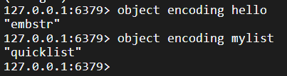

Redis 这样做有两个好处：

1) 可以改进内部编码，而对外的数据结构和命令没有任何影响，这样一旦开发出更优秀的内部编码，无需改动外部数据结构和命令。例如 Redis 3.2 提供了 quicklist，结合了 ziplist 和 linkedlist 两者的优势，为列表类型提供了一种更为优秀的内部编码实现，而对用户来说基本无感知。

2) 多种内部编码实现可以在不同场景下发挥各自的优势。例如 ziplist 比较节省内存，但是在列表元素比较多的情况下，性能会下降。这时候 Redis 会根据配置选项将列表类型的内部实现转换为 linkedlist，整个过程用户同样无感知。

### 1.3 单线程架构

> Redis 只用一个线程处理所有命令请求，不是说一个 Redis 服务器内部真的就只有一个线程，其实也有多个线程，多个线程是处理网络 IO、RDB/AOF 等。
>
> **Redis 采用单线程执行命令以保证并发安全和性能，但为了避免主线程阻塞，会把耗时 I/O 和后台任务交给多线程或子进程执行。**

#### 1.3.1 多线程的线程安全问题

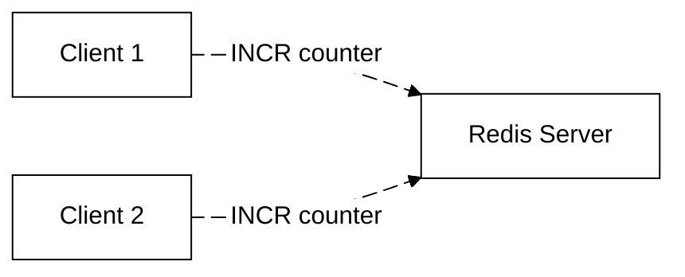
```mermaid
%%{init: {
  "theme": "base",
  "themeVariables": {
    "primaryColor": "#ffffff",
    "primaryTextColor": "#000000",
    "primaryBorderColor": "#000000",
    "lineColor": "#000000"
  }
}}%%
graph LR
    C1["Client 1"] 
    C2["Client 2"]
    R["Redis Server"]

    C1 e1@-- "INCR counter" --> R
    C2 e2@-- "INCR counter" --> R
    e1@{ animation: fast }
    e2@{ animation: fast }

```

多线程中，两个线程同时修改一个变量，表面上是自增两次，实际上可能只自增一次。当前两个客户端，也相当于“并发”地发起请求，是否会有线程安全问题？

> 不会，Redis 单线程模型保证了当前收到的多个请求是串行的。

**线程安全问题：**

自增操作不是原子的，它实际上分为三步：读取变量，加一，写回变量。那么考虑以下情况：

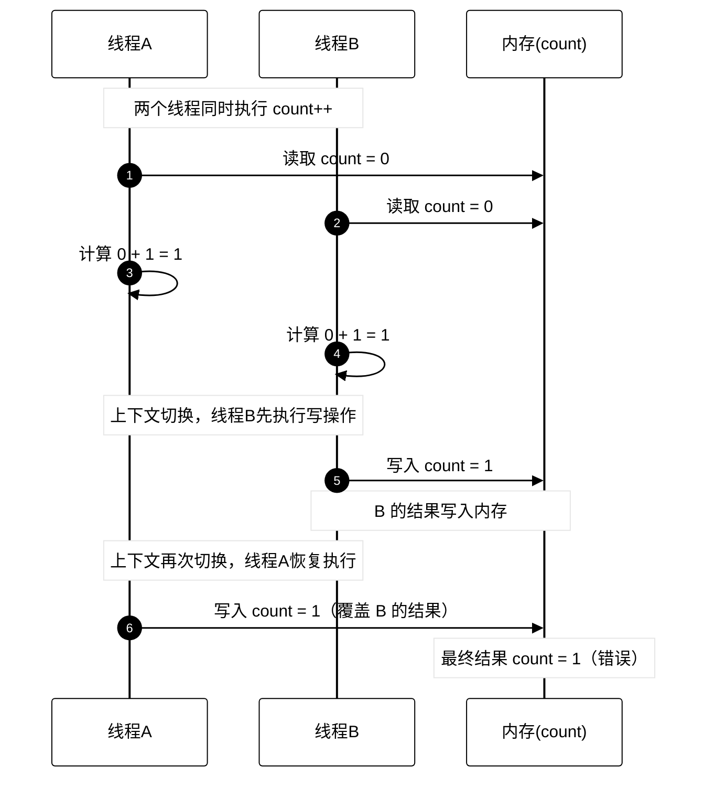
```mermaid
%%{init: {
  "theme": "base",
  "themeVariables": {
    "primaryColor": "#ffffff",
    "primaryTextColor": "#000000",
    "primaryBorderColor": "#000000",
    "lineColor": "#000000",
    "noteBkgColor": "#ffffff",
    "noteTextColor": "#000000"
  }
}}%%
sequenceDiagram
    autonumber
    participant A as 线程A
    participant B as 线程B
    participant M as 内存(count)

    Note over A,B: 两个线程同时执行 count++

    A->>M: 读取 count = 0
    B->>M: 读取 count = 0

    A->>A: 计算 0 + 1 = 1
    B->>B: 计算 0 + 1 = 1

    Note over A,B: 上下文切换，线程B先执行写操作

    B->>M: 写入 count = 1
    Note over B,M: B 的结果写入内存

    Note over A,B: 上下文再次切换，线程A恢复执行

    A->>M: 写入 count = 1（覆盖 B 的结果）

    Note over M: 最终结果 count = 1（错误）

```

因此一般多线程的情况下，对公共资源操作前要加锁，而 redis 是单线程模型，自然也不用担心上述问题。

#### 1.3.2 redis 的单线程模型

**虽然 redis 是单线程模型，但是它为什么快？**

- redis 访问内存，数据库访问磁盘，而且 redis 核心功能比数据库的核心功能简单

- 单线程模型避免了一些不必要的线程竞争开销，redis 每个操作都是短平快，简单操作下内存数据，搞成多线程也提升不大

- 处理网络 IO 时，使用了 epoll 这样的 IO 多路复用机制

  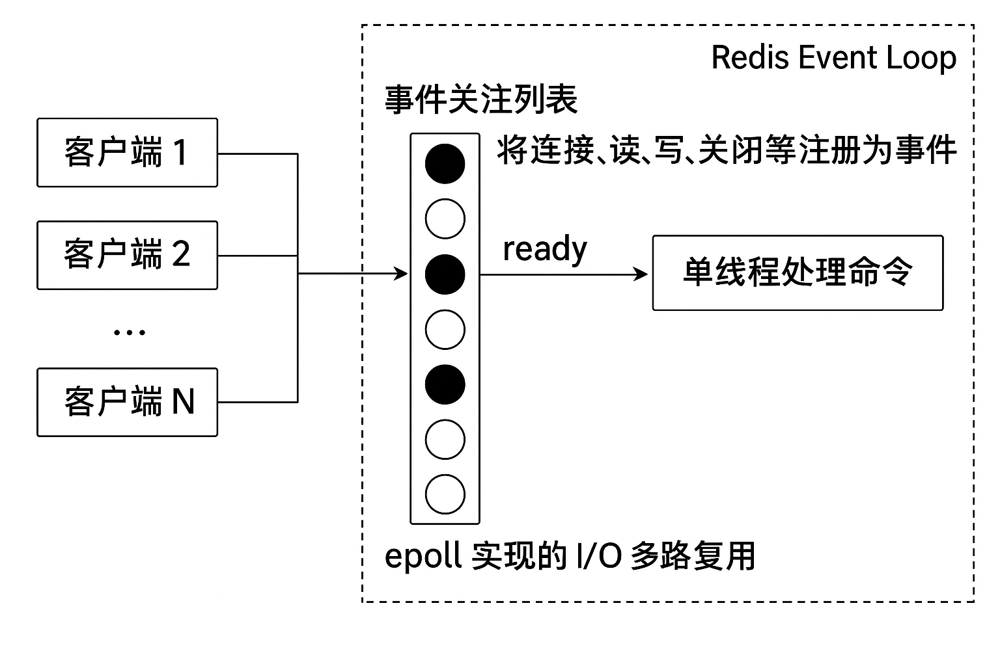

  > IO 多路复用：一个线程可以管理多个 socket
  >
  > 对于 TCP 来说，服务器每服务一个客户端，都需要给这个客户端安排一个 socket，一个服务器对应多个 socket，但是这些 socket 上不是无时无刻地传输数据。也就是说， **同一时刻，只有少数 socket 是活跃的。** Linux 提供了三套 API：select、poll、epoll

**单线程的坏处：**

对于单个命令的执行时间都是有要求的，如果某个命令执行时间过长，会导致其他命令全处于等待队列中，迟迟得不到响应，造成客户端的阻塞。

## 2.String 字符串

- Redis 的键的类型是字符串

- 字符串类型的值可能是字符串（包含一般字符串或者类似于 json、xml 格式的字符串）、数字（整型或浮点型）、二进制流数据（图片、音频和视频等）

  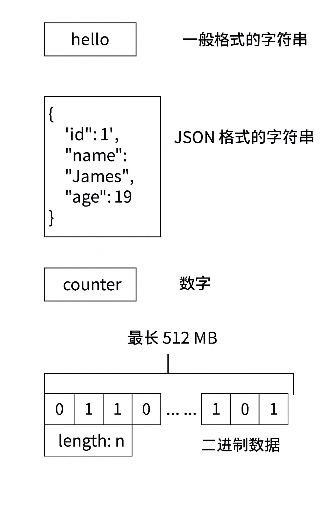

- 一个字符串的最大值不能超过 512MB

- Redis 内部存储字符串完全是按照二进制流的形式保存的，所以 Redis 不处理字符集编码问题，客户端传入的命令中使用的是什么字符集编码，就储存什么字符集编码

### 2.1 常见命令

- SET

  将 string 类型的 value 设置到 key 中，如果 key 之前存在，则覆盖，无论原来的数据类型是什么，且之前关于此 key 的 TTL 全部失效

  - 语法：`SET key value [expiration EX seconds | PX milliseconds] [NX|XX]`

  - 时间复杂度： $O(1)$

  - 选项：

    - EX/PX：设置过期时间（s/ms）

      > `set key value ex 10` 相当于 `set key value` + `expire key 10`

    - NX：只在 key 不存在时才进行设置

    - XX：只在 key 存在时才进行设置

  - 返回值：

    - 如果设置成功，返回 OK
    - 如果由于 SET 指定了 NX 或者 XX 但条件不满足，SET 不会执行，并返回 nil

- MSET

  一次性设置多个 key 的值

  - 语法：`MSET key value [key value]`
  - 时间复杂度： $O(N)$，$N$ 是 key 的数量
  - 返回值：永远是 OK

- GET 

  获取 key 对应的 value

  - 语法：`GET key`
  - 时间复杂度： $O(1)$
  - 返回值：key 对应的 value，如果 key 不存在，则返回 nil，如果 value 的数据类型不是 string，则报错

- MGET

  一次性获取多个 key 的值

  - 语法：`MGET key`
  - 时间复杂度： $O(N)$，$N$ 是 key 的数量
  - 返回值：对应的 value 列表，如果对应的 key 不存在或者对应的数据类型不是 string，则返回 nil

  | 操作                | 时间                                  |
  | ------------------- | ------------------------------------- |
  | 1000 次 get         | 1000 × 1 + 1000 × 0.1 = **1100 毫秒** |
  | 1 次 mget 1000 个键 | 1 × 1 + 1000 × 0.1 = **101 毫秒**     |

  每次批量设置的键的数量也不是无节制的，否则可能造成单一命令执行时间过长，导致 redis 阻塞。

- SETNX

  在 key 不存在的情况下设置 value

  - 语法：`SETNX key value`
  - 时间复杂度： $O(1)$
  - 返回值：1 表示设置成功，0 表示没有设置

### 2.2 计数命令

- INCR

  将 key 对应的 string 表示的数字加一，如果 key 不存在，则视为 key 对应的 value 是 0。如果 key 对应的 string 不是一个整形或者范围超过了 64 位有符号整型，则报错

  - 语法：`INCR key`
  - 时间复杂度： $O(1)$
  - 返回值：integer 类型加完后的数值

- INCRBY

  将 key 对应的 string 表示的数字加上对应的值，如果 key 不存在，则视为 key 对应的 value 是 0。如果 key 对应的 string 不是一个整形或者范围超过了 64 位有符号整型，则报错

  - 语法：`INCRBY key decrement`
  - 时间复杂度： $O(1)$
  - 返回值：integer 类型加完后的数值

- DECR

  将 key 对应的 string 表示的数字减一。如果 key 不存在，则视为 key 对应的 value 是 0。如果 key 对应的 string 不是一个整型或者范围超过了 64 位有符号整型，则报错。

  - 语法：`DECR key`
  - 时间复杂度： $O(1)$
  - 返回值：integer 类型的减完后的数值

- DECRBY

  将 key 对应的 string 表示的数字减去对应的值。如果 key 不存在，则视为 key 对应的 value 是 0。如果 key 对应的 string 不是一个整型或者范围超过了 64 位整型，则报错

  - 语法：`DECRBY key decrement`
  - 时间复杂度： $O(1)$
  - 返回值：integer 类型的减完后的数值

- INCRBYFLOAT

  将 key 对应的 string 表示的浮点数加上对应的值。如果对应的值是负数，则视为减去对应的值，如果 key 不存在，则视为 key 对应的 value 是 0。如果 key 对应的不是 string，或者不是一个浮点数，则报错。允许使用科学计数法表示浮点数。

  - 语法：`INCRBYFLOAT key increment`
  - 时间复杂度： $O(1)$
  - 返回值：加/减完的数值

> 很多系统和编程语言内部使用 CAS 机制实现计数功能，因为有多线程的场景，这回导致一定的 CPU 开销。
>
> Redis 完全不存在这个问题，因为 redis 是单线程架构，任何命令到了 redis 服务器端都要顺序执行

### 2.3 其他命令

- APPEND

  如果 key 已经存在并且是一个 string，命令会将 value 追加到原有 string 后面。如果 key 不存在，则效果等同于 SET 命令

  - 语法：`APPEND KEY VALUE`

  - 时间复杂度：追加的字符串一般较短，可视为 $O(1)$

  - 返回值：追加完成之后 string 的长度

    > 单位是字节，中文一个汉字通常 3 个字节（utf8）

  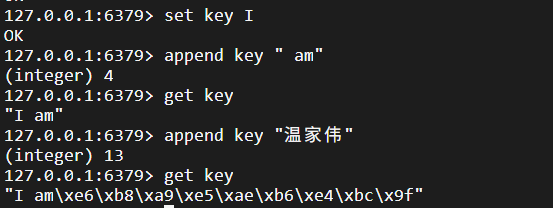

  可以看到，中文默认是按编码显示的，如果想要查看中文，在启动客户端的时候加上一个 `--raw` 的选项，就可以使 redis 客户端能自动地把二进制数据尝试翻译：

  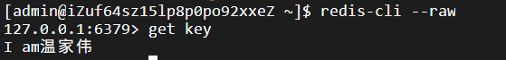

- GETRANGE

  返回 key 对应的 string 子串，由 start 和 end 确定（左闭右闭）。负数表示倒数，例如 -1 表示倒数第一个字符。超过范围的偏移量会根据 string 的长度调整成正确的值

  - 语法：`GETRANGE key start end`

  - 时间复杂度： $O(N)$， $N$ 为 `[start, end]` 区间的长度，由于 string 通常比较段，可以视为是 $O(1)$

    > 这里是左闭右闭，但是在编程中，大部分是左闭右开

  - 返回值：string 类型的子串

  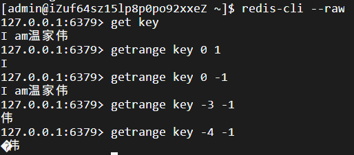

  > 如果字符串中保存的是汉字，很有可能切出来不完整的汉字，C++ 中同样有此问题，Java 和 Mysql 中的 varchar(N) 不存在此问题，因为 Java 中字符串基本单位是字符

- SETRANGE

  覆盖字符串的一部分，从指定的偏移开始

  - 语法：`SETRANGE key offset value`
  - 时间复杂度： $O(N)$， $N$ 为 value 的长度，由于一般给的 value 比较短，所以可以视作 $O(1)$
  - 返回值：替换后 string 的长度

  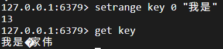

  "我是" 占6个字节，所以 "温" 的前两个字节被覆盖了

  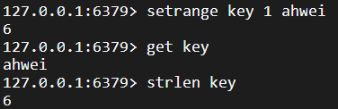

  删除之前的 key 后，重新设置，`key` 是一个不存在的键。这时会凭空生成一个字节 `\x00`（一个空字节）

- STRLEN

  获取 key 对应的 string 长度，单位是字节。当 key 中存放的类型不是 string 时，报错

  - 语法：`STRLEN key`
  - 时间复杂度： $O(1)$
  - 返回值：string 的长度，当 key 不存在时，返回 0

### 2.4 String 命令总结

| 命令                      | 执行效果                     | 时间复杂度                             |
|---------------------------|------------------------------|----------------------------------------|
| set key value [key value...] | 设置 key 的值是 value         | $O(k)$, $k$ 是键个数                   |
| get key                   | 获取 key 的值                 | $O(1)$                                 |
| del key [key ...]         | 删除指定的 key                | $O(k)$， $k$ 是键个数                  |
| mset key value [key value ...] | 批量设置指定的 key 和 value   | $O(k)$， $k$ 是键个数                     |
| mget key [key ...]        | 批量获取 key 的值             | $O(k)$， $k$ 是键个数                     |
| incr key                  | 指定的 key 的值 +1            | $O(1)$                                 |
| decr key                  | 指定的 key 的值 -1            | $O(1)$                                 |
| incrby key n              | 指定的 key 的值 +n            | $O(1)$                                 |
| decrby key n              | 指定的 key 的值 -n            | $O(1)$                                 |
| incrbyfloat key n         | 指定的 key 的值 +n            | $O(1)$                                |
| append key value          | 指定的 key 的值追加 value     | $O(1)$                                 |
| strlen key                | 获取指定 key 的值的长度       | $O(1)$                                 |
| setrange key offset value | 覆盖指定 key 的从 offset 开始的部分值 | $O(n)$，$n$ 是字符串长度，通常视为 $O(1)$ |
| getrange key start end    | 获取指定 key 的从 start 到 end 的部分值 | $O(n)$，$n$ 是字符串长度，通常视为 $O(1)$ |

### 2.5 内部编码

字符串类型的内部编码有 3 种：

- int：8 个字节的长整型。
- embstr：小于等于 39 个字节的字符串。
- raw：大于 39 个字节的字符串。

Redis 会根据当前值的类型和长度动态决定使用哪种内部编码实现。 

### 2.6 典型使用场景

#### 2.6.1 缓存功能

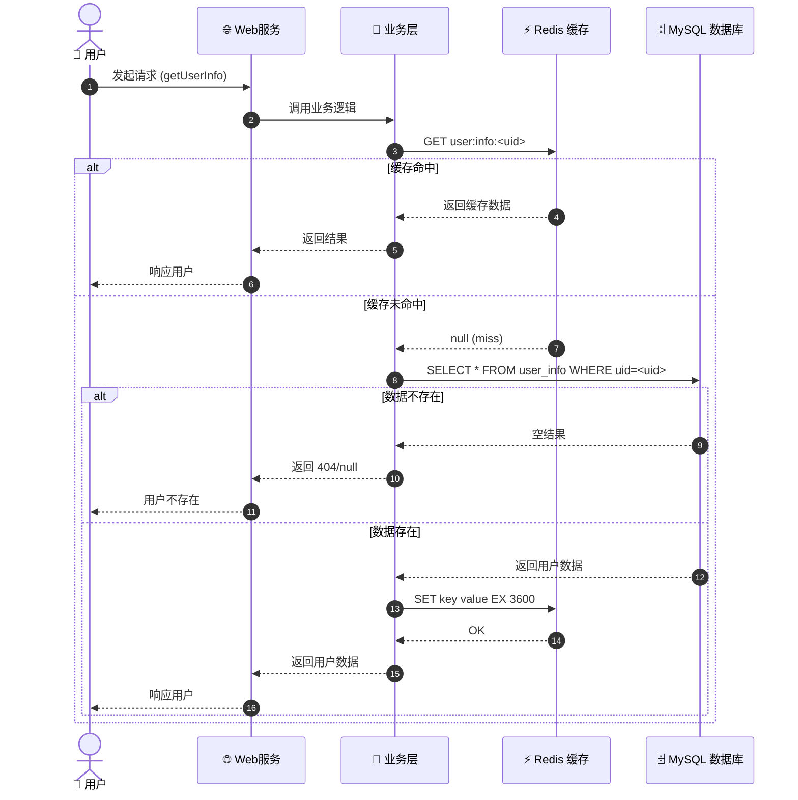
```mermaid
sequenceDiagram
    autonumber
    actor User as 🧑 用户
    participant Web as 🌐 Web服务
    participant Biz as 🧩 业务层
    participant Cache as ⚡ Redis 缓存
    participant DB as 🗄️ MySQL 数据库

    User ->> Web: 发起请求 (getUserInfo)
    Web ->> Biz: 调用业务逻辑

    Biz ->> Cache: GET user:info:<uid>
    alt 缓存命中
        Cache -->> Biz: 返回缓存数据
        Biz -->> Web: 返回结果
        Web -->> User: 响应用户
    else 缓存未命中
        Cache -->> Biz: null (miss)
        Biz ->> DB: SELECT * FROM user_info WHERE uid=<uid>

        alt 数据不存在
            DB -->> Biz: 空结果
            Biz -->> Web: 返回 404/null
            Web -->> User: 用户不存在
        else 数据存在
            DB -->> Biz: 返回用户数据
            Biz ->> Cache: SET key value EX 3600
            Cache -->> Biz: OK
            Biz -->> Web: 返回用户数据
            Web -->> User: 响应用户
        end
    end

```

> 与 MySQL 等关系型数据库不同，Redis 没有“表、字段”这样的命名空间，也没有强制的键名格式（仅要求不能使用特殊字符）。但是，**合理的键名设计非常关键**，可以有效避免键冲突，并提升项目的可维护性。
>
> 比较推荐的是：<font color="red">业务名:对象名:唯一标识:属性</font>
>
> 如果 MySQL 的：
> - 数据库名为：`vs`
> - 用户表名为：`user_info`
> - 用户 ID 为：`6379`
>
> 1. 则可在 Redis 中设计键名为：
>
>    - `vs:user_info:6379`
>
>    - `vs:user_info:6379:name`
>
> 2. 若 Redis 实例只服务一个业务，可以省略业务名前缀，例如：
>
>    - `user_info:6379`
>
>    - `user_info:6379:name`
>
>
> 3. 为了提高 Redis 性能，应尽量避免非常长的 key。团队内部可约定缩写形式，例如：
>
>    `user:6379:friends:messages:5217` 可以缩写为：`u:6379:fr:m:5217`
>
>    > 键名为什么不能太长？
>    >
>    > - Redis 是 **单线程** 的（命令执行顺序单线程）
>    > - 键名越长，**网络传输成本越高**
>    > - 序列化、比较、内存占用也会变高
>

#### 2.6.2 计数功能

许多应用都会使用 Redis 作为计数的基础工具，它可以实现**快速计数**、**查询缓存**，同时数据可以以异步方式写回其他数据源（如统计数据库）。图示中（视频播放计数示例）：每当用户播放一次视频，其对应的播放次数就会在 Redis 中自增 1。

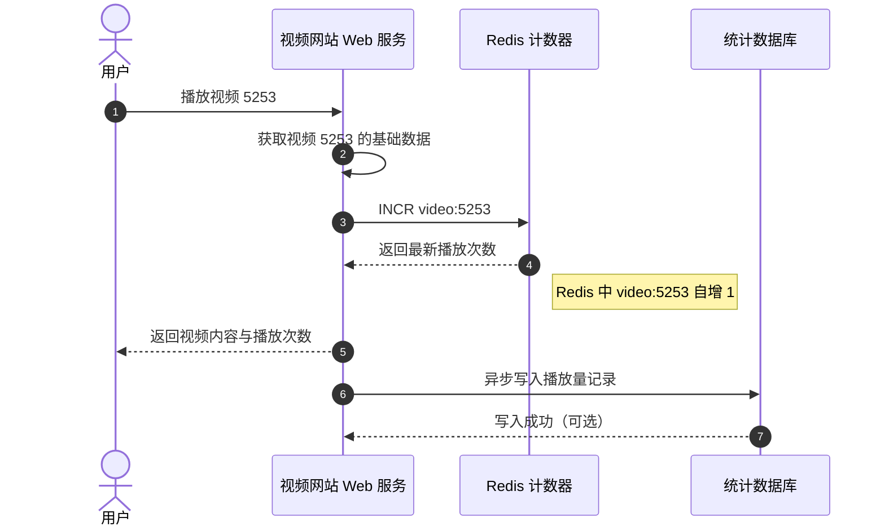
```mermaid
sequenceDiagram
    autonumber
    actor User as 用户
    participant Web as 视频网站 Web 服务
    participant Redis as Redis 计数器
    participant Stats as 统计数据库

    User ->> Web: 播放视频 5253
    Web ->> Web: 获取视频 5253 的基础数据

    Web ->> Redis: INCR video:5253
    Redis -->> Web: 返回最新播放次数

    Note right of Redis: Redis 中 video:5253 自增 1

    Web -->> User: 返回视频内容与播放次数

    Web ->> Stats: 异步写入播放量记录
    Stats -->> Web: 写入成功（可选）

```

#### 2.6.3 共享会话

在分布式 Web 服务中，用户的 Session（例如登录态信息）如果存储在各自服务器上，会导致：Session 分散存储带来的不一致

**分布式 Web 应用架构：**

- 用户请求经过负载均衡（Load Balancer）
- 请求可能被分发到 **任意一台 Web 服务器**
- 每台服务器维护自己的 Session

**问题：Session 不一致**

由于 Session 不共享，可能会发生：

- 用户第一次访问落在 Web1 → 登录成功 → Session1 创建
- 用户刷新页面落在 Web2 → Session2 中没有登录态 → 被迫重新登录

这会导致 **用户体验极差**。

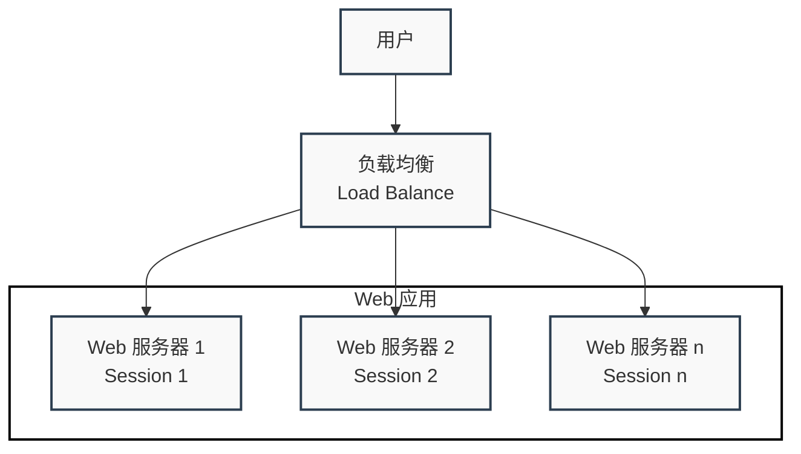
```mermaid
flowchart TB
    %% ==== 节点 ====
    User[用户]
    LB[负载均衡<br/>Load Balance]

    subgraph WebApp[Web 应用]
        S1[Web 服务器 1<br/>Session 1]
        S2[Web 服务器 2<br/>Session 2]
        SN[Web 服务器 n<br/>Session n]
    end

    %% ==== 连线 ====
    User --> LB
    LB --> S1
    LB --> S2
    LB --> SN

    %% ==== 样式 ====
    classDef web fill:#f9f9f9,stroke:#2c3e50,stroke-width:2px;
    classDef webApp fill:#ffffff,stroke:#000000,stroke-width:2px;

    class Title title;
    class User web;
    class LB web;
    class S1,S2,SN web;
    class WebApp webApp
```

**解决思路：将 Session 从本地服务器迁移到 Redis 中统一存储**

- 每台 Web 服务器不再维护本地 Session
- 用户请求被分发到任意一台 Web 服务器时
- Web 服务器都从 **Redis 中读取/更新 Session**
- 只要 Redis 高可用，整个 Session 状态就是一致的

**优点：**

- Session 一致性得到保证
- 不再依赖请求必须落到同一台服务器
- 支持水平扩展：Web 服务器可以随意扩容或缩容
- Redis 性能高，天然适合高并发 Session 管理

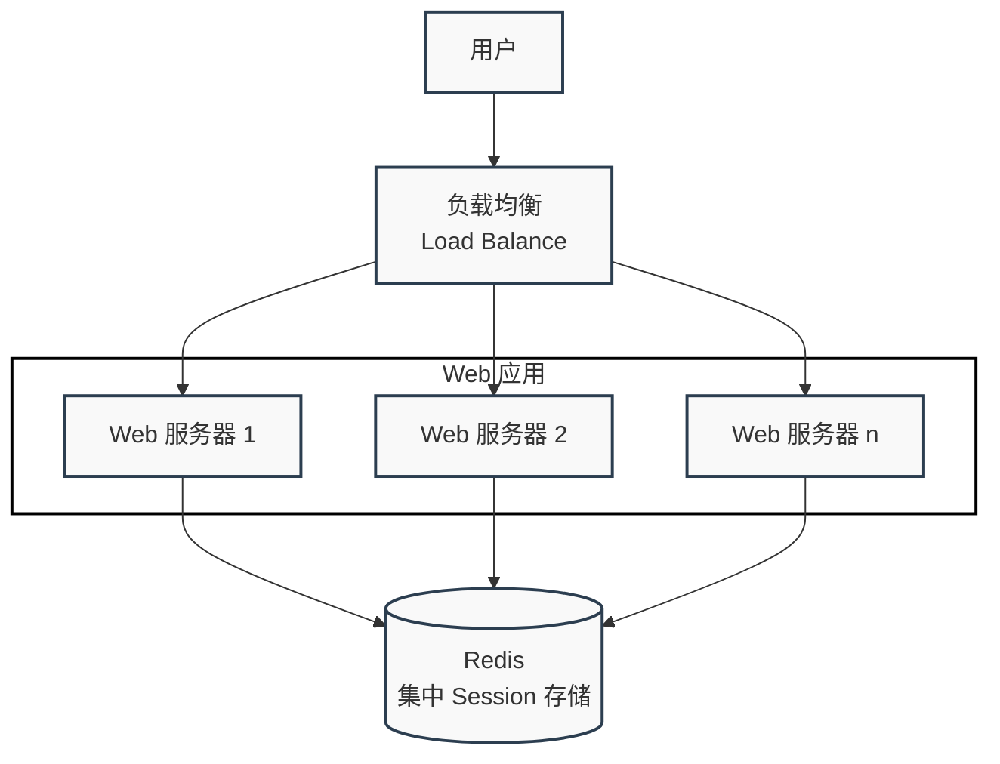
```mermaid
flowchart TB
    %% ==== 节点 ====
    User[用户]
    LB[负载均衡<br/>Load Balance]

    subgraph WebApp[Web 应用]
        W1[Web 服务器 1]
        W2[Web 服务器 2]
        WN[Web 服务器 n]
    end

    Redis[(Redis<br/>集中 Session 存储)]

    %% ==== 连线 ====
    User --> LB
    LB --> W1
    LB --> W2
    LB --> WN

    W1 --> Redis
    W2 --> Redis
    WN --> Redis

    %% ==== 样式 ====
    classDef webApp fill:#ffffff,stroke:#000000,stroke-width:2px;
    classDef web fill:#f9f9f9,stroke:#2c3e50,stroke-width:2px;
    classDef redis fill:#fff4b3,stroke:#e1a10a,stroke-width:2px;

    class User web;
    class LB web;
    class W1,W2,WN web;
    class Redis web;
    class WebApp webApp;

```

#### 2.6.4 手机验证码

许多应用为了安全，在用户登录时会让用户输入手机号，并向该手机号发送短信验证码，然后用户输入收到的验证码用于身份校验。

但为了避免短信接口被频繁调用（高成本 + 安全风险），系统必须对短信发送进行限流，例如：


## 3.Hash 哈希

Redis 自身已经是键值对结构了，它自身的键值对就是通过哈希的方式组织的。这里的 Hash 指的是值的类型仍可以是哈希。

> 哈希类型映射关系通常称为 `field-value`，用于区分 Redis 整体的键值对（key-value）。

### 3.1 命令

- HSET

  设置 hash 中指定字段的值

  - 语法：`HSET key field value [field value]`
  - 时间复杂度： 插入一组 field 为 $O(1)$，插入 $N$ 组 field 为 $O(N)$
  - 返回值：添加的字段的个数

  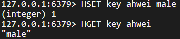

- HGET

  获取 hash 中指定字段的值

  - 语法：`HGET key field`
  - 时间复杂度： $O(1)$
  - 返回值：字段对应的值或 nil

  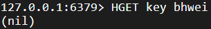

- HEXISTS

  判断 hash 中是否有指定的字段

  - 语法：`HEXISTS key field`
  - 时间复杂度： $O(1)$
  - 返回值：1 表示存在，0 表示不存在

- HDEL 

  删除 hash 中指定字段的值

  - 语法：`HDEL key field [field ...]`
  - 时间复杂度：删除一个元素为 $O(1)$，删除 $N$ 个元素为 $O(N)$
  - 本次操作删除的字段个数

- HKEYS

  获取 hash 中的所有字段

  > 这个操作存在一定的风险，类似于 `keys *`，因为我们也不知道某个 hash 中是否存在大量的 field

  - 语法：`HKEYS key`
  - 时间复杂度： $O(N)$， $N$ 为 field 的个数
  - 返回值：字段列表

  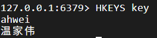

- HVALS

  获取 hash 中的所有的值

  > 存在风险

  - 语法：`HVALS key`
  - 时间复杂度： $O(N)$， $N$ 为 field 的个数
  - 返回值：所有的值

  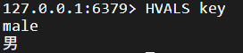

- HGETALL

  获取 hash 中的所有字段以及对应的值

  > 存在风险

  - 语法：`HGETALL key`
  - 时间复杂度： $O(N)$， $N$ 为 field 的个数
  - 返回值：字段和对应的值

  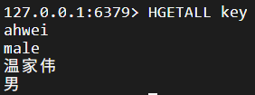

- HMGET

  一次获取 hash 中多个字段的值

  - 语法：`HMGET key field [field]`
  - 时间复杂度：只查询一个元素为 $O(1)$，查询多个元素为 $O(N)$， $N$ 为查询元素个数
  - 返回值：字段对应的值或者 nil

  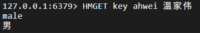

- HLEN

  获取 hash 中的所有字段个数

  - 语法：`HLEN key`
  - 时间复杂度： $O(1)$
  - 返回值：字段个数

  

- HSETNX

  在字段不存在的情况下，设置 hash 中的字段和值

  - 语法：`HSETNX key field value`
  - 时间复杂度： $O(1)$
  - 返回值：1 表示设置成功，0 表示失败

- HINCRBY/HINCRBYFLOAT

  将 hash 中字段对应的数值添加指定的值

  > hash 这里的 value 也可以当作数字处理，HINCRBY 加减整数，HINCRBYFLOAT 加减小数

  - 语法：`HINCRBY key field increment`
  - 时间复杂度： $O(1)$
  - 返回值：该字段变化之后的值

### 3.2 Hash 命令总结
| 命令                          | 执行效果                                   | 时间复杂度 |
|-------------------------------|--------------------------------------------|------------|
| hset key field value          | 设置值                                     | $O(1)$     |
| hget key field                | 获取值                                     | $O(1)$     |
| hdel key field [field ...]    | 删除 field                                 | $O(k)$（$k$ 是 field 个数） |
| hlen key                      | 计算 field 个数                            | $O(1)$     |
| hgetall key                   | 获取所有的 field-value                     | $O(k)$（$k$ 是 field 个数） |
| hmget key field [field ...]   | 批量获取 field-value                       | $O(k)$（$k$ 是 field 个数） |
| hmset field value [field value ...] | 批量设置 field-value               | $O(k)$（$k$ 是 field 个数） |
| hexists key field             | 判断 field 是否存在                        | $O(1)$     |
| hkeys key                     | 获取所有的 field                           | $O(k)$（$k$ 是 field 个数） |
| hvals key                     | 获取所有的 value                           | $O(k)$（$k$ 是 field 个数） |
| hsetnx key field value        | 设置值，但必须在 field 不存在时才能设置成功 | $O(1)$     |
| hincrby key field n           | 对应 field-value 增加 $n$（整数）           | $O(1)$     |
| hincrbyfloat key field n      | 对应 field-value 增加 $n$（浮点数）         | $O(1)$     |
| hstrlen key field             | 计算 value 的字符串长度                    | $O(1)$     |


### 3.3 内部编码

Redis 中的哈希类型（Hash）有两种内部编码方式：

#### 3.3.1 **ziplist（压缩列表）**

> 压缩的本质，是对数据进行重新编码

当满足以下条件时，Redis 会使用 `ziplist` 作为哈希的内部编码：

- 哈希类型元素个数小于 `hash-max-ziplist-entries`（默认 **512**）
- 所有 value 的长度均小于 `hash-max-ziplist-value`（默认 **64 字节**）

**特点：**

- 采用更紧凑的结构以连续存储多个元素
- 节省内存，对小哈希十分高效
- 但当元素增多或数据增大时，读写性能会下降

#### 3.3.2 **hashtable（哈希表）**

当哈希类型无法满足 ziplist 的条件时，Redis 会自动切换为 `hashtable` 编码。

**特点：**

- 使用真正的哈希表作为底层结构
- 读写性能稳定，时间复杂度为 **O(1)**
- 相比 ziplist 占用内存更多，但效率更高

### 3.4 使用场景

#### 3.4.1 哈希与关系型数据库

1. Hash 类型是稀疏的，而关系型数据库是结构化的

   - Redis Hash 的每个键可以拥有完全不同的 field 集合。

   - 关系型数据库中，一旦表结构新增一列（如新增 gender），所有行都必须填充值，即使是 `null`。

   示例：

   | uid  | name      | age  | city    | gender | favor  |
   | ---- | --------- | ---- | ------- | ------ | ------ |
   | 1    | James     | null | Beijing | null   | sports |
   | 2    | Johnathan | 30   | null    | male   | null   |

   但在 Redis 中，各用户可拥有不同的字段：

   ```structured text
   user:1 → {
       uid: 1
       name: James
       city: Beijing
       favor: sports
   }
   
   user:2 → {
       uid: 2
       name: Johnathan
       age: 30
       gender: male
   }
   ```

2. 关系型数据库支持复杂查询，而 Redis 不适合模拟复杂关系

   - 关系型数据库支持联表查询、聚合查询等复杂操作。

   - Redis 的 Hash 不能直接进行字段级的条件查询，也不适合 JOIN 或复杂检索。

   - 使用 Redis 模拟复杂关系会导致维护成本高、查询效率低。

#### 3.4.2 缓存方式对比

**方案一：原生字符串类型（每个属性一个键）**

示例：

```structured text
set user:1:name James
set user:1:age 23
set user:1:city Beijing
```

**优点**

- 实现简单。
- 修改用户某个属性时非常灵活，只需更新对应的 Key。

**缺点**

- 占用过多的键，导致 Redis 内存管理开销增大。
- 用户信息在 Redis 中分散存储，缺乏聚合性。
- 基本无实际使用意义，不便于维护。

**方案二：序列化字符串类型（如 JSON）**

示例：

```json
set user:1 "{经过序列化后的用户对象字符串}"
```

**优点**

- 更适合整体存取用户对象。
- 存储结构更加集中清晰。
- 编程实现也简单（尤其对于 Web 服务常用 JSON 来描述对象）。

**缺点**

- 序列化与反序列化存在额外开销。
- 不适合对单个字段进行频繁修改（必须整体重新序列化后写入）。
- 不灵活。

**方案三：哈希类型（推荐）**

示例：

```sql
hmset user:1 name James age 23 city Beijing
```

**优点**

- 存取简单直观。
- 灵活，可单独修改某个字段，也可批量操作。
- 相比 JSON 等方案更节省空间（结构紧凑、内部优化好）。
- 属性清晰表达用户信息，语义明确。

**缺点**

- Redis 内部可能在 ziplist 与 hashtable 编码之间来回转换，频繁变更可能导致一定的性能消耗。

## 4.List 列表

列表类型是用来存储多个有序的字符串，相当于数组或顺序表。在 Redis 中，可以对列表两端进行插入和弹出，还可以获取指定范围的元素的列表、指定索引的下标的元素等。List 内部的编码并非是一个简单的数组，而是更接近于双端队列 deque，因为当前的 List 的头和尾都能高效地插入元素，所以可以把这个 List 当作栈/队列使用

> Redis 有一个典型的应用场景就是作为消息队列，最早的时候就是通过 List 类型，只不过比较简陋，后来又提供了一个 stream 类型

<center class="half">    
	<center class="half">
    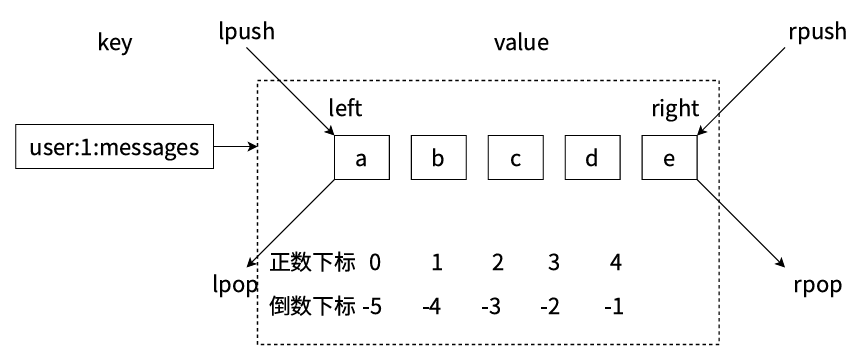
    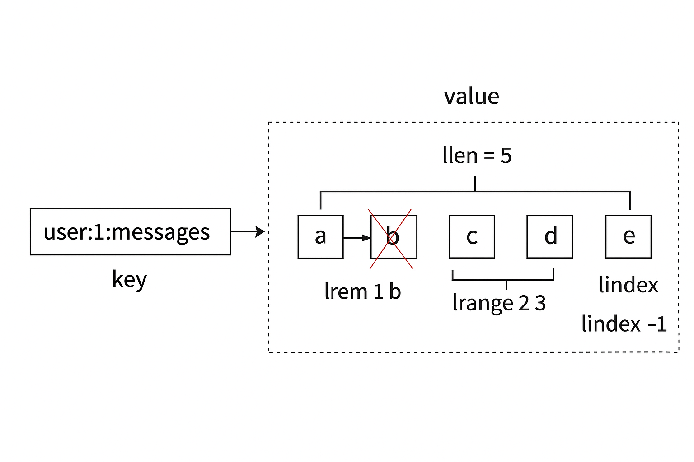
</center>
<h10>列表的插入、弹出、获取和删除操作</h10>

**列表类型的特点：**

- 列表中的元素有序

- 获取与删除不同：都可以获取到值，但是删除操作列表长度发生变化

- 列表中元素允许重复

  > Hash 这样的类型是不能重复的

### 4.1 命令

- LPUSH/RPUSH

  将一个或者多个元素从左侧/右侧放入到 list 中

  - 语法：`LPUSH/RPUSH key element [element]`
  - 时间复杂度：只插入一个元素为 $O(1)$，插入多个元素为 $O(N)$， $N$ 为插入元素个数
  - 返回值：插入后 list 的长度

  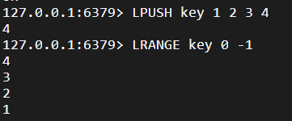

  > 1 2 3 4，全部插入完成后，4 在最前面

- LPUSHX/RPUSHX

  在 key 存在时，将一个或者多个元素从左侧/右侧放入 list 中，不存在则直接返回

  - 语法：`LPUSHX/RPUSHX key element [element]`

    > 这里 X 代表 exists

  - 时间复杂度：只插入一个元素为 $O(1)$，插入多个元素为 $O(N)$， $N$ 为插入元素个数

  - 返回值：插入后 list 的长度

  

- LRANGE

  获取从 start 到 end 区间的所有元素，左闭右闭，若超出范围则自动截断

  - 语法：`LRANGE key start stop`
  - 时间复杂度： $O(N)$
  - 返回值：指定区间内的元素

- LPOP/RPOP

  从 list 左侧/右侧弹出元素

  - 语法：`LPOP/RPOP key`
  - 时间复杂度： $O(1)$
  - 返回值：取出的元素或者 nil

- LINDEX

  获取从左数第 index 位置的元素

  - 语法：`LINDEX key index`
  - 时间复杂度： $O(N)$
  - 返回值：取出的元素或者 nil

  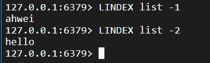

- LINSERT

  在特定位置插入元素

  > LINSERT 进行插入的时候，要根据基准值找到对应的位置，从左往右找到第一个符号基准值的位置插入

  - 语法：`LINSERT key <BEFORE | AFTER> pivot element`
  - 时间复杂度： $O(N)$
  - 返回值：插入后的 list 长度

  

- LTRIM

  保留 [start, end] 内的元素，区间外删除

  - 语法：`LTRIM key start end`
  - 时间复杂度： $O(N)$
  - 返回值：始终是 OK

  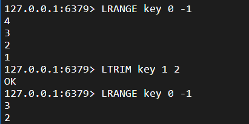

- LSET

  根据下标修改元素

  - 语法：`LSET key index element`
  - 时间复杂度： $O(N)$
  - 返回值：修改成功时返回 `OK`；若 key 不存在，返回错误：`ERR no such key`；若索引越界，返回错误：`ERR index out of range`。

  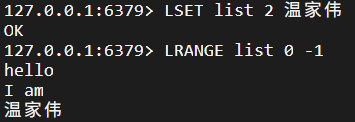

- LLEN

  获取 list 长度

  - 语法：`LLEN key`
  - 时间复杂度： $O(1)$
  - 返回值：list 的长度

  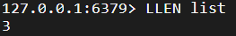

- LREM

  从列表中删除指定数量、值等于给定元素的项。删除方向由 `count` 决定：

  `count > 0`：从 **头部向尾部** 删除最多 `count` 个匹配项

  `count < 0`：从 **尾部向头部** 删除最多 `|count|` 个匹配项

  `count = 0`：删除 **所有** 匹配项

  - 语法：`LREM key count element`
  - 时间复杂度： $O(N)$
  - 返回值：被删除的元素个数

### 4.2 阻塞版本命令

- BLPOP/BRPOP

  LPOP/RPOP 的阻塞版本

  > 阻塞队列：使用队列作为中间的交易场所，队列有两个特性：
  >
  > - 线程安全
  > - 阻塞：
  >   - 如果队列为空，尝试出队列，就会产生阻塞，直到队列不空，阻塞解除
  >   - 如果队列为满，尝试入队列，也会产生阻塞，直到队列不满，阻塞接触

  Redis 中的 list 也想当于是阻塞队列，线程安全是通过单线程模型支持的，而阻塞特性只支持队列为空的情况，不考虑队列满

  - 当列表中有元素时，阻塞和非阻塞版本的命令效果一致
  - 当队列为空时，BLPOP/BRPOP 就会产生阻塞，一直到阻塞队列不空为止（阻塞版本会根据 timeout 阻塞一段时间，期间 Redis 可以执行其他命令）
  - BLPOP/BRPOP 都是可以同时去尝试获取多个 key 的元素列表的，多个 key 对应多个 list，哪个 list 有元素，就会返回哪个元素
  - 如果多个客户端同时执行 BLPOP/BRPOP，最先执行命令的客户端会得到弹出的元素

  <center class="half">    
  	<center class="half">
      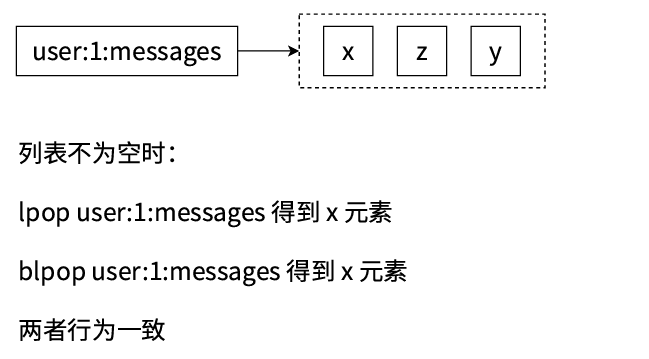
      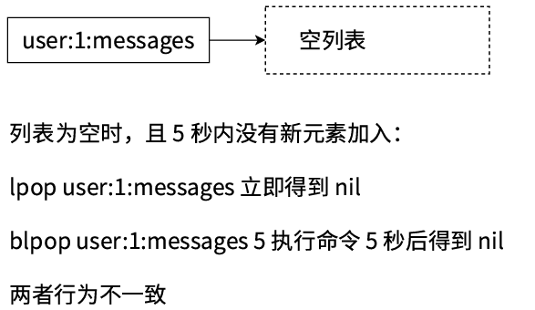
  	
  </center>
  <h10>阻塞和非阻塞版本的弹出命令</h10>
  
  
  - 语法：`BLPOP/BRPOP key [key ...] timeout`
  - 时间复杂度： $O(1)$
  - 返回值：取出的元素或者 nil
  
  队列非空时：
  
  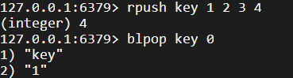
  
  > 返回的结果相当于一个二元组：一方面告诉我们当前数据来自于哪个 key，一方面告诉我们取到的数据是啥
  
  队列为空时：
  
  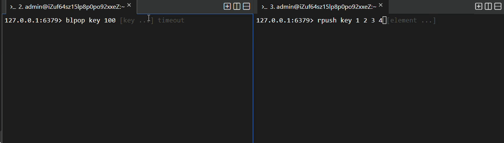
  
  多个 key：
  
  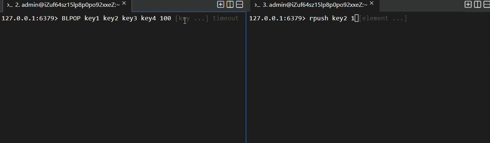
  
  这俩阻塞命令，主要用了作为消息队列，但是功能有限，一般没啥用。

### 4.3 List 命令总结

<table border="1" cellpadding="4" cellspacing="0">
  <thead>
    <tr>
      <th>操作类型</th>
      <th>命令</th>
      <th>时间复杂度</th>
    </tr>
  </thead>
  <tbody>
    <tr>
      <td rowspan="3">添加</td>
      <td>rpush key value [value ...]</td>
      <td>O(k)，k 是元素个数</td>
    </tr>
    <tr>
      <td>lpush key value [value ...]</td>
      <td>O(k)，k 是元素个数</td>
    </tr>
    <tr>
      <td>linsert key before | after pivot value</td>
      <td>O(n)，n 是 pivot 距离头尾的距离</td>
    </tr>
    <tr>
      <td rowspan="3">查找</td>
      <td>lrange key start end</td>
      <td>O(s + n)，s 是 start 偏移量，n 是 start 到 end 的范围</td>
    </tr>
    <tr>
      <td>lindex key index</td>
      <td>O(n)，n 是索引的偏移量</td>
    </tr>
    <tr>
      <td>llen key</td>
      <td>O(1)</td>
    </tr>
    <tr>
      <td rowspan="4">删除</td>
      <td>lpop key</td>
      <td>O(1)</td>
    </tr>
    <tr>
      <td>rpop key</td>
      <td>O(1)</td>
    </tr>
    <tr>
      <td>lrem key count value</td>
      <td>O(k)，k 是元素个数</td>
    </tr>
    <tr>
      <td>ltrim key start end</td>
      <td>O(k)，k 是元素个数</td>
    </tr>
    <tr>
      <td rowspan="1">修改</td>
      <td>lset key index value</td>
      <td>O(n)，n 是索引的偏移量</td>
    </tr>
    <tr>
      <td rowspan="1">阻塞操作</td>
      <td>blpop brpop</td>
      <td>O(1)</td>
    </tr>
  </tbody>
</table>
### 4.4 List 内部编码

- ziplist（压缩列表）：把数据按照更紧凑的压缩形式进行表示，节省空间。当元素个数多了，操作起来效率会降低

- linkedlist（链表）：操作效率更高，但是不能节省空间

- quicklist：相当于前两种方式的结合，整体还是一个链表，链表的每一个节点都是一个压缩列表

  > 现在 redis 已经不用前两种编码，取而代之的是第三种编码，使用 `list-max-ziplist-size -2`
  >
  > 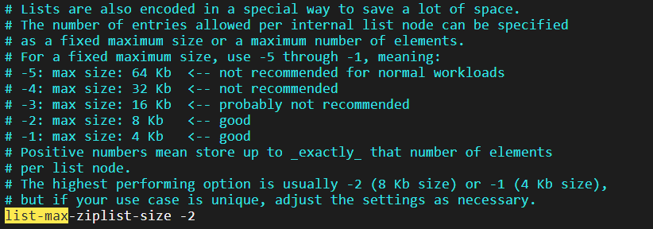

### 4.5 应用场景

#### 4.5.1 作为数组

**学生表：**

| StudentId | StudentName | age  | score | classId |
| :-------: | :---------: | :--: | :---: | :-----: |
|     1     |    张三     |  20  |  90   |    1    |
|     2     |    李四     |  19  |  89   |    1    |
|     3     |    王五     |  21  |  88   |    2    |

**班级表：**

| classId | className |
| :-----: | :-------: |
|    1    |    100    |
|    2    |    101    |

上述表结构中，MySQL 可以很方便地实现查询指定班级中有哪些同学。但是 Redis 中提供的查询功能有限：

**学生：**

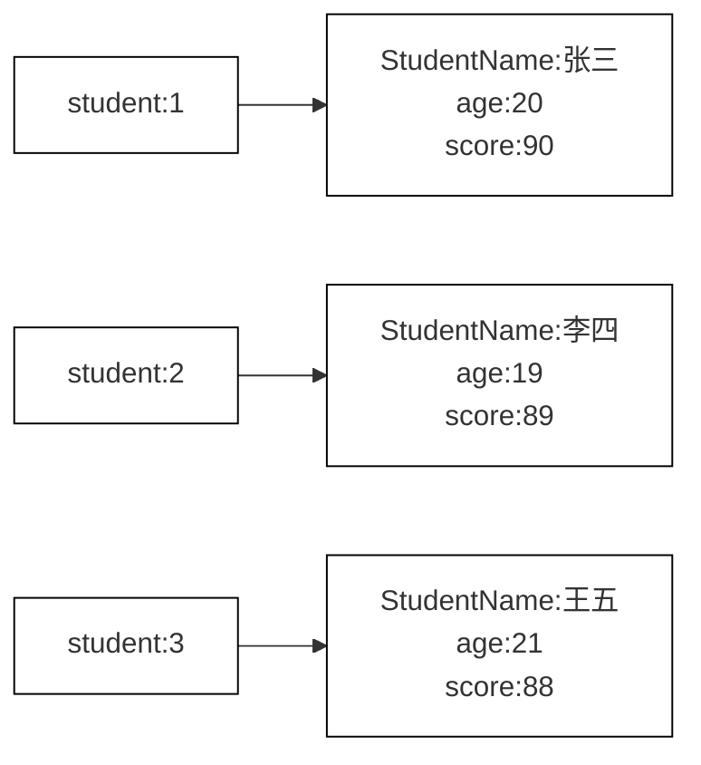
```mermaid
graph LR
key1["student:1"]
value1["StudentName:张三<br>age:20<br>score:90"]
key1-->value1

key2["student:2"]
value2["StudentName:李四<br>age:19<br>score:89"]
key2-->value2

key3["student:3"]
value3["StudentName:王五<br>age:21<br>score:88"]
key3-->value3

classDef block fill:white,stroke:black,stroke-width:1px;

class key1,key2,key3 block;
class value1,value2,value3 block;
```

**班级：**

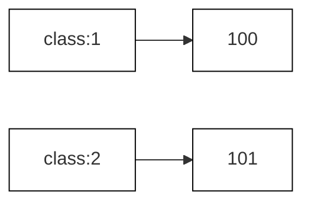
```mermaid
graph LR 
key1["class:1"]
key2["class:2"]
value1["100"]
value2["101"]
key1-->value1
key2-->value2

classDef block fill:white,stroke:black,stroke-with:1px

class key1,key2,value1,value2 block
```

**list：**

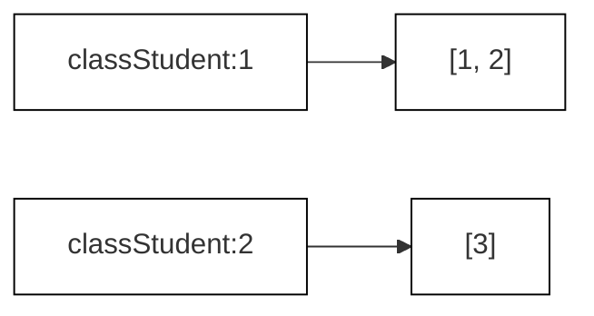
```mermaid
graph LR
key1["classStudent:1"]
value1["[1, 2]"]
key2["classStudent:2"]
value2["[3]"]
key1-->value1
key2-->value2
classDef block fill:white, stroke:black, stroke:1px
class key1,key2,value1,value2 block
```

#### 4.5.2 Redis 作为消息队列

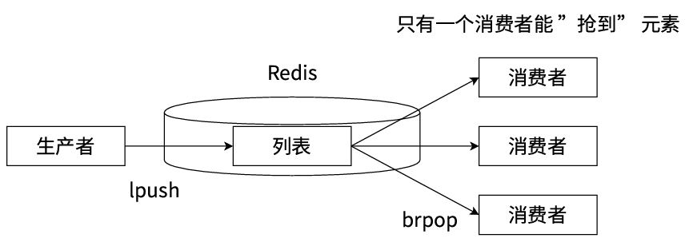

谁先执行 brpop 命令，谁就能拿到这个新来的元素。这样的设定，就能构成一个“轮询”的效果。假设消费者执行顺序是 1 2 3，当新元素到达之后，首先是消费者 1 拿到元素，拿到元素后从 brpop 中返回了，如果消费者 1 还想继续消费，就需要重新执行 brpop，这时候消费者执行顺序就变成 2 3 1 了。

#### 4.5.3 分频道的阻塞消息队列模型

多个列表/频道的这种场景是非常常见的，例如抖音短视频：

- 有一个频道，来传输短视频数据
- 还可以有一个频道，来传输弹幕
- 还可以有频道，来传输点赞、转发和收藏数据
- 还可以有频道，来传输评论数据
- ...

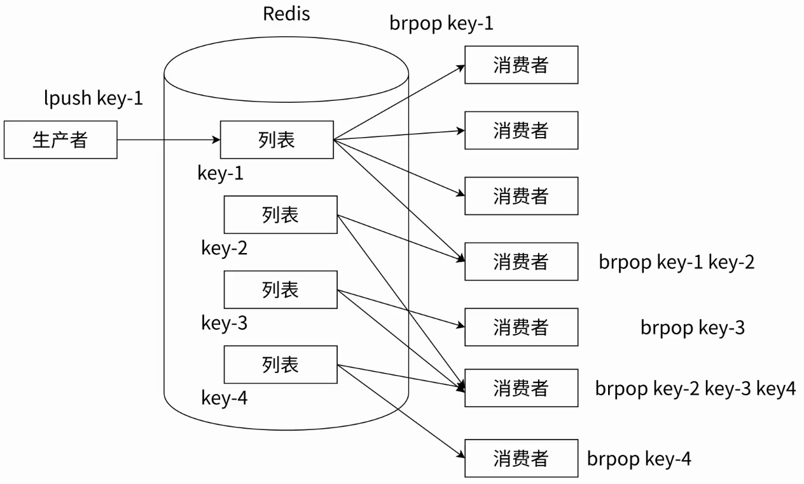

> 搞成多个频道，在某种数据出现问题时，不会对其他数据造成影响，起到解耦合的作用。

## 5.Set 集合


## 6.Zset 有序集合

## 7.渐进式遍历

