# redis 客户端

## 一、Redis 通信协议

为什么可以实现一个 redis 的客户端，能否实现 QQ 客户端？

> 客户端和服务器在网络通信过程中，需要用到许多“协议”，传输层往下的协议，是在系统内核或驱动中实现的，只能选择，不能修改；而应用层，虽然业界也有很多成熟的协议（如HTTP），但更多的时候，都会自定义应用层协议，redis 这里就是自定义应用层协议。因此，要想开发一个 Redis 客户端，就要知道 Redis 的应用层协议。
>
> 而 QQ 没有公开它们自己使用的自定义协议，所以不能实现。网上一些开源项目实现了自定制的 qq 客户端，这是因为可以通过一些抓包/逆向手段，猜测 qq 应用层协议是啥样。

**Redis resp 协议**

redis 自己定制的一种「文本化二进制混合」协议格式，传输层基于 TCP，但是和 TCP 又没有强耦合，请求和响应之间的模型是一问一答的形式。优点是简单（人类也能看懂，`\r\n` 分行）、高效（长度前缀 + 二进制安全，传输二进制数据没问题）、易实现。

命令实际发送的时候是一个数组，每个命令参数是一个 `bulk string`：

```shell
*3\r\n
$3\r\n
SET\r\n
$5\r\n
mykey\r\n
$5\r\n
hello\r\n
```

含义拆开：

- `*3`：有 3 个元素（命令 + 2 个参数）
- `$3` `SET`：第一个元素，长度 3，内容 "SET"
- `$5` `mykey`：第二个元素，长度 5，内容 "mykey"
- `$5` `hello`：第三个元素，长度 5，内容 "hello"

Redis 返回一个简单字符串：

```shell
+OK\r\n
```

返回结果被写道 TCP socket 中

这套协议公开已久，已经有很多成熟的库实现了这套协议的解析/构造，我们此处使用 `redis-plus-plus`

## 二、安装 redis-plus-plus

### 1.安装 hiredis

redis-plus-plus 是基于 hiredis 实现的，hiredis 是一个 C 语言实现的 redis 客户端。

这里直接使用包管理器安装：

```bash
# ubuntu
apt install libhiredis-dev
# centos
yum install hiredis-devel.x86_64
```

### 2.安装 redis-plus-plus

安装 redis-plus-plus 只能通过源码编译的方式

> 使用 Ubuntu 会比 Centos 简单许多，因为 Ubuntu 上许多软件更新比较及时，版本比较高

- 下载源码

  ```shell
  git clone https://github.com/sewenew/redis-plus-plus.git
  ```

- Centos 

  Centos 自带的 cmake 版本比较低，需要先安装 cmake3

  ```shell
  yum install cmake3
  ```

  然后用 cmake3 构建项目：

  ```shell
  cd redis-plus-plus
  mkdir build
  cd build
  cmake3 ..
  make
  make install
  ```

- Ubuntu

  使用 cmake 构建：

  ```shell
  cd redis-plus-plus
  mkdir build
  cd build
  cmake ..
  make
  make install
  ```

  > make install：
  >
  > 此处是我们编译生成的内容，主要就是 .a 和 .so 文件，都是当前编译的这个目录下的，后续写代码不一定能找到这里的库，更推荐把这些库拷贝到系统目录中，make install 就是完成拷贝的工作

  构建成功后，会在 `/usr/local/include/` 中多出 `sw` 目录，并且内部包含 redis-plus-plus 的一系列头文件，在 `/usr/local/lib/` 中多出一系列 `libredis`  库文件

### 3.PING-PONG

[代码](code/ping)

用 redis-plus-plus 连接 redis 服务器，再使用 ping 命令，检测一下连通性。

1. 包含头文件，因为库文件默认从 include 中搜索

   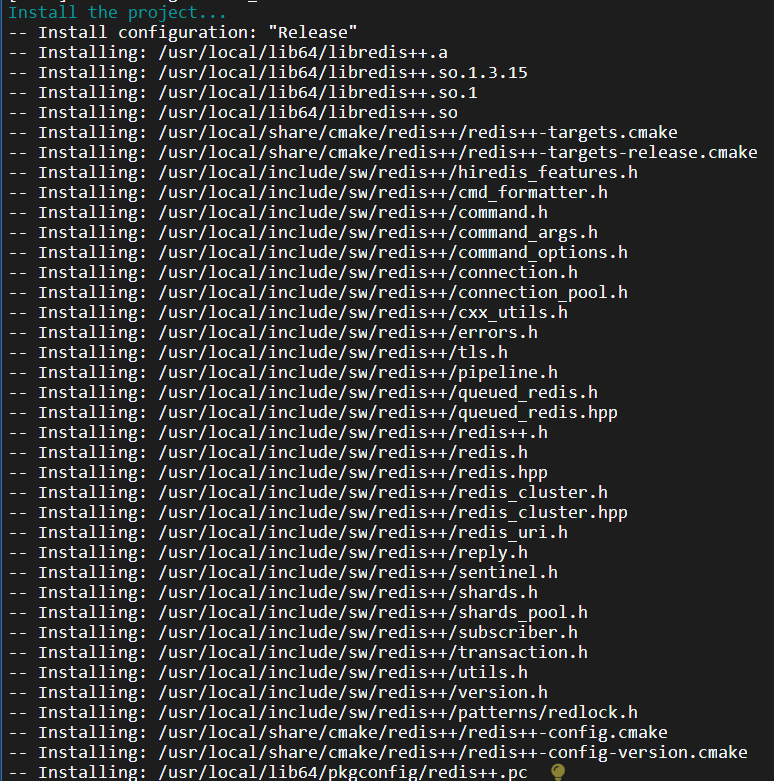

   所以这里要带上 `sw/redis++`，这里 sw 是作者名字缩写

   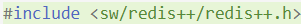

   > - #include<>：在系统目录中搜索头文件
   > - #include ""：在项目目录中搜索头文件

2. 创建一个 redis 对象

   ```c++
   // 创建 Redis对象的时候，需要在构造函数中指定 redis 服务器的地址和端口
   sw::redis::Redis redis("tcp://127.0.0.1:6379");
   ```

   > url 并非专属于 HTTP 的！

3. ping

   ```c++
   // 调用 ping 方法让客户端给服务器发一个 PING，然后服务器就会返回一个 PONG，就通过返回值获取到
   string res = redis.ping();
   // 打印 PONG
   cout << res << endl;
   ```

4. 使用 makefile 编译

   引入：

   - redis++ 自己的静态库

     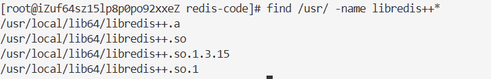

   - hiredis 的静态库

     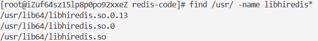

   - 线程库
   
   makefile 文件：
   
   ```makefile
   hello:hello.cc
   	g++ -std=c++17 -o $@ $^ /usr/local/lib64/libredis++.a /usr/local/lib/libhiredis.a -pthread
   
   .PHONY:clean
   clean:
   	rm hello
   ```
   
   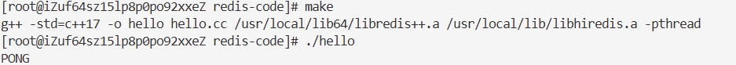

## 三、通用命令

[代码](code/general)

### 1.set/get

#### 1.1 set

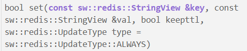

> 这里的 StringView 是只读的，而 C++ 标准库中的 std::string 是可读可写的，redis 这里设置只读，做了很多优化工作，比 std::string 效率更高。C++17 中标准库也提供了一个只读的字符串 std::string_view。

#### 1.2 get

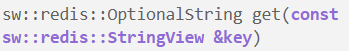

此处的 Optional 可以表示非法值/无效值，也就是 nil，如果直接使用 std::string，不方便表示这个 nil，如果使用 std::string* 是可以用 nullptr 表示无效，但是返回指针，又涉及到内存归谁管。

> boost 很早就引入了 optional 类型，在 C++14 版本中就正式纳入标准库了

```c++
// get set
void test1(Redis &redis)
{
    cout << "1. get 和 set 使用" << endl;
    // 清空数据库，避免之前的内容干扰
    redis.flushall();

    redis.set("key1", "111");
    redis.set("key2", "222");
    redis.set("key3", "333");

    auto value1 = redis.get("key1");
    auto value2 = redis.get("key2");
    auto value3 = redis.get("key3");
    auto value4 = redis.get("key4");
    cout << "value1 = " << value1.value() << endl;
    cout << "value2 = " << value2.value() << endl;
    cout << "value3 = " << value3.value() << endl;
    cout << "value4 = " << value4.value() << endl;
}
```

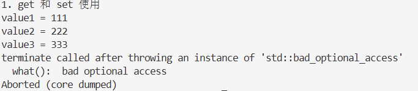

这里  key4 是不存在的，value4 其实是 optional 的非法状态，对于非法状态的 optional 进行取值操作，就会抛出异常，如何处理？catch！但是 C++ 中不太经常使用 try/catch，因为它会存在额外的运行时开销；且相比其他语言的异常功能有些弱。所以我们提前判断：optional 可以隐式转换成 bool 类型，可以直接在 if 中判定

```c++
// get set
void test1(Redis &redis)
{
    cout << "1. get 和 set 使用" << endl;
    // 清空数据库，避免之前的内容干扰
    redis.flushall();

    redis.set("key1", "111");
    redis.set("key2", "222");
    redis.set("key3", "333");

    auto value1 = redis.get("key1");
    auto value2 = redis.get("key2");
    auto value3 = redis.get("key3");
    auto value4 = redis.get("key4");
    if (value1)
        cout << "value1 = " << value1.value() << endl;
    if (value2)
        cout << "value2 = " << value2.value() << endl;
    if (value3)
        cout << "value3 = " << value3.value() << endl;
    if (value4)
        cout << "value4 = " << value4.value() << endl;
}
```

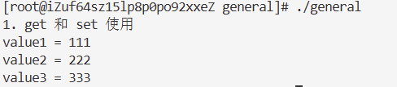

或者使用 value_or：

```c++
// get set
void test1(Redis &redis)
{
    cout << "1. get 和 set 使用" << endl;
    // 清空数据库，避免之前的内容干扰
    redis.flushall();

    redis.set("key1", "111");
    redis.set("key2", "222");
    redis.set("key3", "333");

    auto value1 = redis.get("key1");
    auto value2 = redis.get("key2");
    auto value3 = redis.get("key3");
    auto value4 = redis.get("key4");
    
    cout << "value1 = " << value1.value_or("(nil)") << endl;
    cout << "value2 = " << value2.value_or("(nil)") << endl;
    cout << "value3 = " << value3.value_or("(nil)") << endl;
    cout << "value4 = " << value4.value_or("(nil)") << endl;
}
```

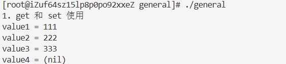

### 2.exist

```c++
// exists
void test2(Redis &redis)
{
    cout << "2. exists 的使用" << endl;
    redis.flushall();
    redis.set("key", "111");
    auto ret = redis.exists("key");
    cout << ret << endl;
    ret = redis.exists("key2");
    cout << ret << endl;
    cout << "多个 key：" << endl;
    redis.set("key2", "222");
    ret = redis.exists({"key", "key2", "key3"});
    cout << ret << endl;
}
```

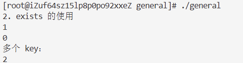

### 3.del

```c++
// del
void test3(Redis& redis){
    cout << "3. del 的使用" << endl;
    redis.flushall();
    redis.set("key1", "11");
    redis.set("key2", "22");
    redis.set("key3", "33");

    auto ret = redis.del({"key1", "key2", "key4"});
    cout << ret << endl;
}
```

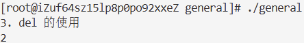

> 为什么 flushall() 这样的清理操作要放在开头，因为如果放在末尾，可能会执行不到

### 4.keys

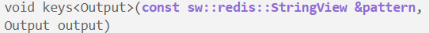

- 第一个参数 pattern，相当于匹配规则，如果填 `*` 就相当于执行 `keys*`
- 第二个参数是一个插入迭代器，需要先准备好一个保存结果的容器，接下来再创建一个插入迭代器指向容器的位置，就可以把获取到的结果依次通过刚才的插入迭代器放到容器的指定位置了

```c++
// keys
void test4(Redis &redis)
{
    cout << "4. keys 的使用" << endl;
    redis.flushall();
    redis.set("key1", "111");
    redis.set("key2", "222");
    redis.set("key3", "333");
    redis.set("key4", "444");
    redis.set("key5", "555");
    redis.set("key6", "666");
    vector<string> res;
    auto it = std::back_insert_iterator(res);
    redis.keys("*", it);
    printContainer(res);
}
```

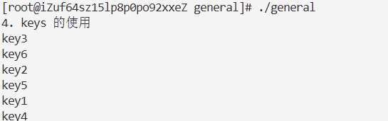

> STL 中的五种迭代器类型：
>
> - 输入迭代器
>
> - 输出迭代器
>
>   插入迭代器本质是输出迭代器，主要有三种：
>
>   - `font_insert_iterator`：区间的开头，往前面插入
>   - `back_insert_iterator`：区间的末尾，往后面插入
>   - `insert_iterator`：区间的任意位置，在对应位置插入
>
>   一般我们不会直接构造这几个对象，因为比较麻烦，常常使用一些辅助函数进行构造。对于插入迭代器来说，核心功能就是赋值，把另一个迭代器赋值给这个插入迭代器。it 是一个插入迭代器，it2 是一个普通迭代器，那么 it= it2 相当于是获取到 it2 指向的元素，然后把元素按照 it 当前插入迭代器的位置和动作来执行插入操作。比如 it 是一个 back_insert_iterator，就是把 it2 指向的元素插入到 it 指向的容器末尾（相当于调用了一次 push_back）
>
>   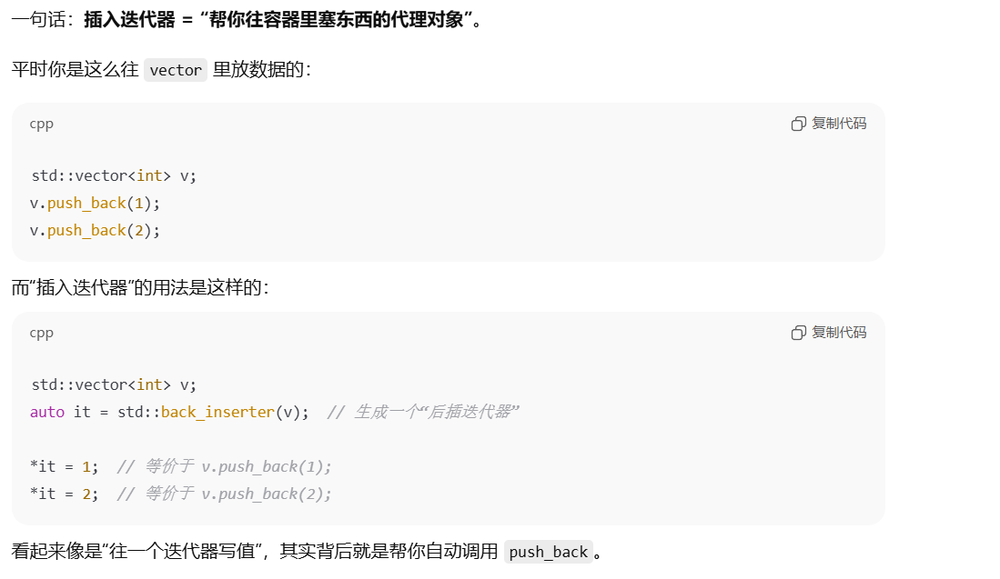
>
>   那为什么不直接把容器作为参数呢，keys 内部直接操作容器，为啥要通过迭代器绕一个大圈子？主要是为了解耦合！
>
>   <center class="half">    
>   	<center class="half">
>       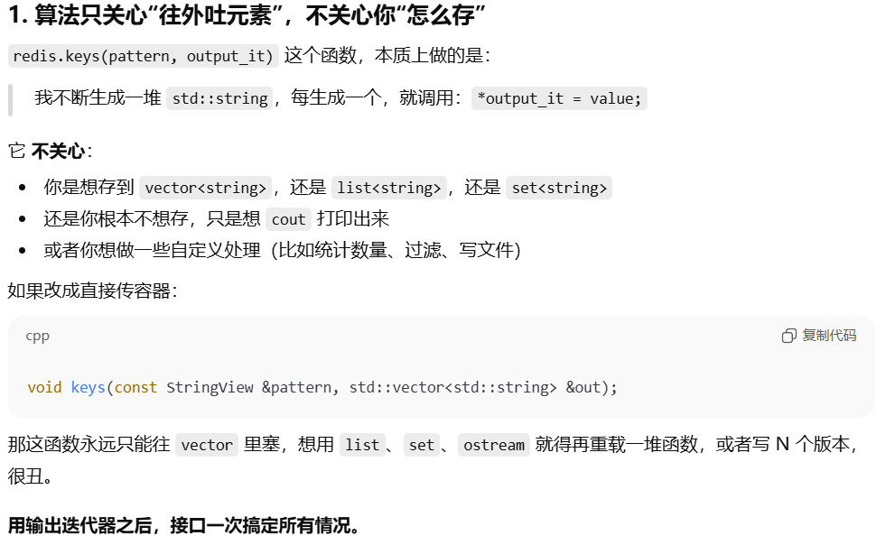
>       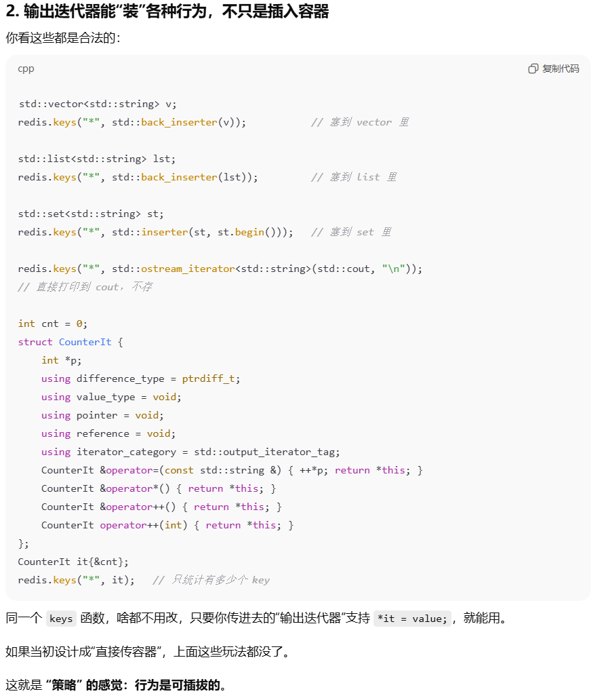
>   </center>
>
> - 前向迭代器
>
> - 双向迭代器
>
> - 随机访问迭代器
>
>   ```c++
>   std::sort(arr.begin(), arr.end());
>   ```
>
>   用其他类型的迭代器也不是不行，但是效率会大打折扣

### 5.expire

```c++
// expire
void test5(Redis &redis)
{
    cout << "5. expire and ttl" << endl;
    redis.flushall();
    redis.set("key1", "111");
    redis.expire("key1", chrono::seconds(10));
    // linux sleep(s)
    // windows Sleep(ms)
    // 两者不一样，最好还是使用标准库的函数
    std::this_thread::sleep_for(3s); // 此处的 3s 是字面值常量，毫秒就是 3ms

    auto time = redis.ttl("key1");
    cout << time << endl;
}
```

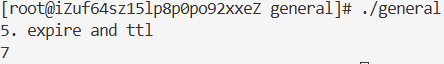

### 6.type

```c++
// type
void test6(Redis &redis)
{
    cout << "6. type 的使用" << endl;
    redis.flushall();
    redis.set("key1", "111");
    string res = redis.type("key");
    cout << "key1:" << res << endl;

    redis.lpush("key2", "222");
    res = redis.type("key2");
    cout << "key2:" << res << endl;

    redis.hset("key3", "ahwei", "male");
    res = redis.type("key3");
    cout << "key3:" << res << endl;

    redis.sadd("key4", "ahwei");
    res = redis.type("key4");
    cout << "key4:" << res << endl;

    redis.zadd("key5", "ahwei", 99);
    res = redis.type("key5");
    cout << "key5:" << res << endl;
}
```

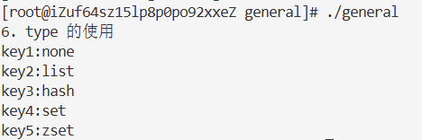

## 四、String 类型

[代码](code/string)

### 1.set/get

```c++
void test1(Redis &redis)
{
    cout << "get and set" << endl;
    redis.flushall();
    redis.set("key1", "111");
    redis.set("key2", "222");

    auto value1 = redis.get("key1");
    auto value2 = redis.get("key2");
    cout << "value1 = " << value1.value() << endl;
    cout << "value2 = " << value2.value() << endl;
}

void test2(Redis &redis)
{
    cout << "get and set(带超时时间)" << endl;
    redis.flushall();
    redis.set("key1", "111", std::chrono::seconds(10));

    long long time = redis.ttl("key1");
    cout << "time: " << time << endl;
}

void test3(Redis &redis)
{
    cout << "set NX and XX" << endl;
    redis.flushall();
    redis.set("key1", "111", 0s, sw::redis::UpdateType::NOT_EXIST);
    auto val = redis.get("key1");
    if (val)
    {
        cout << "value: " << val.value() << endl;
    }
    else
    {
        cout << "key 不存在" << endl;
    }
}
```

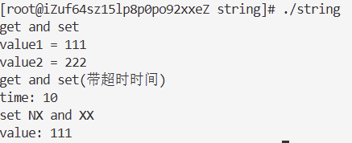

### 2.mset

```c++
// mset
void test4(Redis &redis)
{
    cout << "mset" << endl;
    redis.flushall();
    // redis.mset({ std::make_pair("key1", "111"), std::make_pair("key2", "222"), std::make_pair("key3", "333")});
    // 也可以用 vector<std::pair<string, string>>
    std::vector<std::pair<std::string, std::string>> keys = {
        {"key1", "111"},
        {"key2", "222"},
        {"key3", "333"},
    };
    redis.mset(keys.begin(), keys.end());
    auto value1 = redis.get("key1");
    auto value2 = redis.get("key2");
    auto value3 = redis.get("key3");
    cout << "value1 = " << value1.value() << endl;
    cout << "value2 = " << value2.value() << endl;
    cout << "value3 = " << value3.value() << endl;
}
```

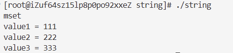

### 3.mget

```c++
// mget
void test5(Redis &redis)
{
    cout << "mget" << endl;
    redis.flushall();
    std::vector<std::pair<std::string, std::string>> keys = {
        {"key1", "111"},
        {"key2", "222"},
        {"key3", "333"},
    };
    redis.mset(keys.begin(), keys.end());
    std::vector<sw::redis::OptionalString> result;
    auto it = std::back_insert_iterator(result);
    redis.mget({"key1", "key2", "key3", "key4"}, it);
    printContainerOptional(result);
}
```

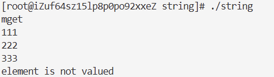

### 4.getrange/setrange

```c++
// getrange 和 setrange
void test6(Redis &redis)
{
    cout << "getrange and setrange" << endl;
    redis.flushall();
    redis.set("key", "abcdefghijk");
    std::string result = redis.getrange("key", 2, 5);
    cout << "result: " << result << endl;
    redis.setrange("key", 2, "xyz");
    auto value = redis.get("key");
    cout << "value: " << value.value() << endl;
}
```

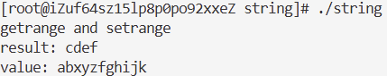

### 5.incr/decr

incr 和 decr 得到的都是 long long 类型

get 得到的是 OptionalString 类型

```c++
// incr 和 decr
void test7(Redis &redis)
{
    cout << "incr and decr" << endl;
    redis.flushall();
    redis.set("key", "100");
    cout << "incr: " << endl;
    long long result = redis.incr("key");
    cout << "result: " << result << endl;
    auto value = redis.get("key");
    cout << "value: " << value.value() << endl;

    cout << "decr: " << endl;
    result = redis.decr("key");
    cout << "result: " << result << endl;
    value = redis.get("key");
    cout << "value: " << value.value() << endl;
}
```

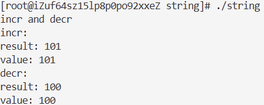

## 五、list

[代码](code/llen)

### 1.lpush 和 lrange

```c++
void test1(Redis &redis)
{
    cout << "lpush and lrange" << endl;
    redis.flushall();

    // 插入单个元素
    redis.lpush("key", "111");

    // 插入一组元素，基于初始化列表
    redis.lpush("key", {"222", "333", "444"});

    // 插入一组元素，基于迭代器
    VecStr values = {"555", "666", "777"};
    redis.lpush("key", values.begin(), values.end());

    // lrange 获取到列表中的元素
    VecStr results;
    auto it = std::back_insert_iterator(results);
    redis.lrange("key", 0, -1, it);

    printContainer(results);
}
```

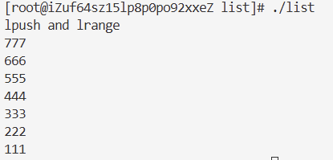

### 2.rpush

```c++
void test2(Redis &redis)
{
    cout << "rpush" << endl;
    redis.flushall();

    // 插入单个元素
    redis.rpush("key", "111");

    // 插入一组元素，基于初始化列表
    redis.rpush("key", {"222", "333", "444"});

    // 插入一组元素，基于迭代器
    VecStr values = {"555", "666", "777"};
    redis.rpush("key", values.begin(), values.end());

    // lrange 获取到列表中的元素
    VecStr results;
    auto it = std::back_insert_iterator(results);
    redis.lrange("key", 0, -1, it);

    printContainer(results);
}
```

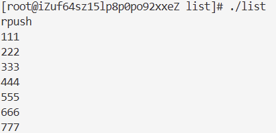

### 3.lpop 和 rpop

```c++
void test3(Redis &redis)
{
    cout << "lpop and rpop" << endl;
    redis.flushall();

    redis.rpush("key", {"1", "2", "3", "4"});

    auto result = redis.lpop("key");

    if (result)
    {
        cout << "lpop: " << result.value() << endl;
    }

    result = redis.rpop("key");

    if (result)
    {
        cout << "lpop: " << result.value() << endl;
    }
}
```

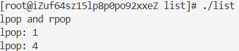

### 4.blpop 和 brpop

**不存在的 key 会阻塞：**

```c++
void test4(Redis &redis)
{
    cout << "blpop" << endl;
    redis.flushall();

    auto result = redis.blpop("key");

    if (result)
    {
        cout << "key: " << result.value().first << endl;
        cout << "elem: " << result.value().second << endl;
    }

    else
    {
        cout << "result 无效" << endl;
    }
}
```

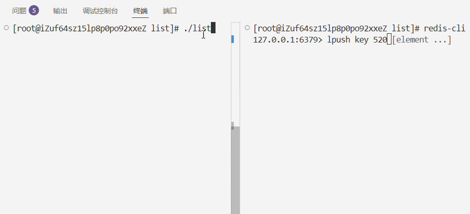

### 5.llen

```c++
void test5(Redis &redis)
{
    cout << "llen" << endl;
    redis.flushall();

    redis.rpush("key", {"1", "22", "333", "4444"});
    long long len = redis.llen("key");
    cout << "len = " << len << endl;
}
```

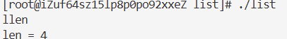

> - 当一个函数的参数需要传递多个值时，往往支持初始化列表或是一对迭代器
> - 当一个函数的返回值需要表示多个数据时，也往往会借助插入迭代器，来实现往一个容器中添加元素的效果
> - 当某些场景涉及无效值时，往往会搭配 std::optional 来进行使用
>
> 不仅是 redis-plus-plus，很多 C++ 的库都是这样设计的
