# Redis 持久化

redis 是一个内存数据库，是把数据存在内存中的，为了持久化，硬盘上也存一份数据（理论上两份数据相同）。Redis 支持 RDB 和 AOF 两种持久化机制，持久化功能有效地避免因进程退出造成的数据丢失问题，当下次重启时利用之前持久化的文件即可实现数据恢复。

## 一、RDB

RDB 持久化是把当前进程数据生成快照保存到硬盘的过程，触发 RDB 持久化过程分为手动触发和自动触发。

### 1.1 触发机制

- 手动触发：程序员通过 Redis 客户端执行特定的命令，触发快照生成，对应 save 和 bgsave 命令
  - save 命令：阻塞当前 Redis 服务器，直到 RDB  过程完成为止，对于内存比较大的实例造成较长时间的阻塞，基本没用（类似于 `keys *`）
  - bgsave 命令：Redis 进程执行 fork 操作创建子进程，RDB 持久化由子进程负责，完成后自动结束。阻塞只发生在 fork 阶段，一般时间很短。（Redis 采用多进程的方式来完成并发编程 bgsave 任务）
- 自动触发：在 Redis 配置文件中设置，让 Redis 每隔多长时间 / 每产生多少次修改就触发
  - 使用 save 配置，如 `save m n` 表示 m 秒内数据集发生了 n 次修改，自动 RDB 持久化
  - 从节点进行全量复制操作时，主节点自动进行 RDB 持久化，随后将 RDB 文件内容发送给从节点
  - 执行 shutdown 命令关闭 Redis 时，执行 RDB 持久化

### 1.2 bgsave 持久化流程

bgsave 是主流的 RDB 持久化方式，下图是它的运作流程：

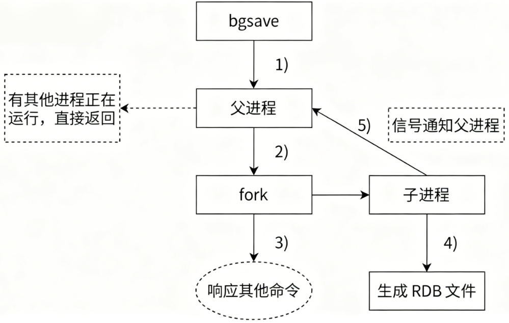

1. 执行 bgsave 命令，Redis 父进程判断当前是否存在其他正在执行的子进程，如 RDB/AOF 子进程，如果存在，bgsave 命令直接返回。

   > fork 创建子进程，直接把当前的进程（父）复制一份作为子进程，一旦复制完成了。父子就是两个独立的进程，各自执行各自的代码。这里的复制会复制 PCB，虚拟地址空间（内存中的数据），文件描述符表（父进程打开了一个文件，fork 了之后，子进程也是同样可以使用的）。
   >
   > 这里用到了 **写时拷贝** 的技术，当父子一方有数据修改时，才会真正触发物理上的拷贝。在进行 bgsave 的这个场景中，绝大部分的内存数据是不需要修改的（整体来说这个过程还执行得挺快的，这个短时间内，父进程不会有大批的内存数据变化）。因此写时拷贝不会触发很多次，整体的拷贝时间是可控的。
   >
   > 本来 redis server 中有若干变量，保存了一些键值对数据，随着这样的 fork 的进行，子进程的这个内存里也会存在和刚才父进程中一模一样的变量。因此，复制出来的子进程的内存中的数据和父进程的数据是一样的。接下来安排子进程进行持久化操作，也就相当于把父进程本体这里的内存数据给持久化了。

2. 父进程执行 fork 创建子进程，fork 过程中父进程会阻塞，通过 info stats 命令查看 latest_fork_usec 选项，可以获取最近一次 fork 操作的耗时，单位为微秒。

3. 父进程 fork 完成后，bgsave 命令返回 "Background saving started" 信息并不再阻塞父进程，可以继续响应其他命令。

4. 子进程创建 RDB 文件，根据父进程内存生成临时快照文件，完成后对原有文件进行原子替换。执行 lastsave 命令可以获取最后一次生成 RDB 的时间，对应 info 统计的 rdb_last_save_time 选项。

   > 执行生成 RDB 镜像操作的时候，会把要生成的快照数据先保存的一个临时文件中，当这个快照生成完毕之后，再删除之前的 RDB 文件，把临时文件改名为 dump.rdb

5. 进程发送信号给父进程表示完成，父进程更新统计信息。

### 1.3 RDB 文件的处理

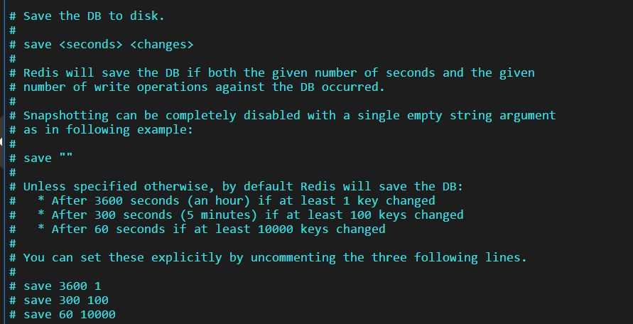

`save 3600 1` 的意思是 1h 且至少有 1 次修改，才会触发 rdb，虽然此处的这些数值都可以自由修改配置，但是修改时还是要遵守一个原则：生成一侧 rdb 快照的成本很高，不能让这个操作太频繁。正因为 rdb 生成的不能太频繁，这就导致快照里的数据和当前实时的数据情况可能有偏差。

> 如果设置为 save "" 则是关闭自动生成快照功能

**手动 save**

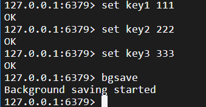

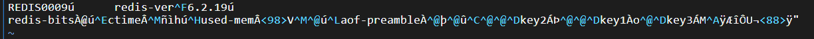

redis 生成快照操作，不仅仅时手动执行命令才会触发，也可以自动触发：

- 刚才的配置文件中，save 执行 M 时间内，修改 N 次
- 通过 shutdown 命令（redis 里的一个命令）关闭 redis 服务器，也会触发（service redis-server restart）
- redis 进行主从复制的时候，主节点也会自动生成 rdb 快照，然后把 rdb 快照文件内容传输给从节点

> 执行 flushall 的时候也会清空 rdb 文件

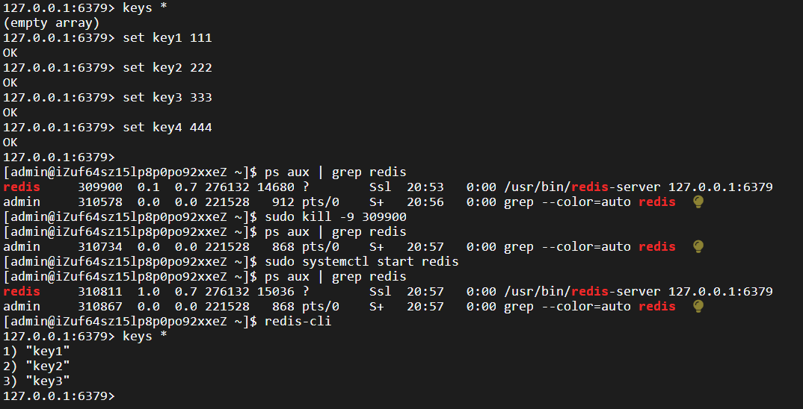

如果异常重启（kill -9 / 断电），此时 redis 服务器来不及生成 rdb。

**保存：**RDB 文件保存再 dir 配置指定的目录（默认 /var/lib/redis/ 下），文件名通过 dbfilename 配置（默认 dump.rdb）指定。可以通过执行 config set dir {newDir} 和 config set dbfilename {newFilename} 运行期间动态执行，当下次运行时 RDB 文件会保存到新目录。

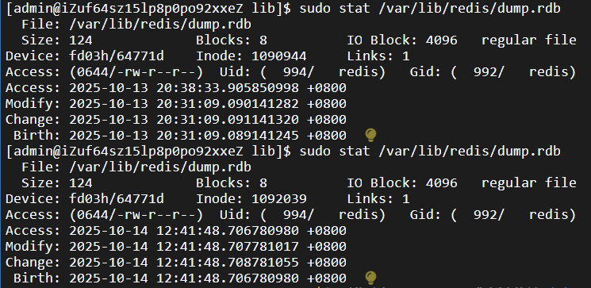

在使用 bgsave 前后，分别查看 dump.rdb 的 inode 编号，发现改变了

> Linux 文件系统
>
> 文件系统典型的组织方式（ext4）主要是把整个文件系统分成了三个大部分
>
> 1. 超级块（放的是一些管理信息）
> 2. inode 区（存放 inode 节点，每个文件都会分配一个 inode 数据结构，包含了文件的各种元数据）
> 3. block 区，存放文件的数据内容

如果使用 save 命令，是不会触发子进程&文件替换的逻辑的，它会直接在当前进程中，往刚才的同一个文件中写数据。

**压缩：**Redis 默认采用 LZF 算法对生成的 RDB 文件做压缩处理，压缩后的文件远远小于内存大小，默认开启，可以通过参数 config set rdbcompression {yes|no} 动态修改。

> 如果把 rdb 文件改坏了，会怎么样？
>
> 文件末尾可能没啥影响，如果是 rdb 文件中间坏了可能就出问题了（启动不了）
>
> rdb 文件检查工具
>
> 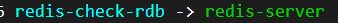
>
> 检查工具和服务器是同一个可执行程序，可以在运行的时候加入不同的选项从而实现不同的功能
>
> 

### 1.4 RDB 的优缺点

1. RDB 是一个紧凑压缩的二进制文件，代表 Redis 在某个时间点上的数据快照。 非常适用于备份、全量操作等场景，比如每 6 小时执行 bgsave 备份，并把 rdb 文件复制到远程机器或者文件系统中（如 hdfs）用于灾备

2. Redis 加载 RDB 恢复数据远远快于 AOF 的方式

   > RDB 使用二进制的方式来组织数据，直接把数据读取到内存，按照字节的格式读取出来放到结构体 / 对象中
   >
   > AOF 是使用文本的方式来组织数据的，则需要纪念性一系列字符切分操作

3. RDB 方式数据没办法做到 **实时持久化 / 秒级持久化**。因为 bgsave 每次运行都要 fork 创建子进程，属于重量级操作频繁执行成本过高

4. RDB 文件使用特定二进制格式保存，Redis 版本演进过程中有多个 RDB 版本，兼容性可能有风险

## 二、AOF

AOF（Append Only File）持久化：以独立日志的方式记录每次写命令，重启时再重新执行 AOF 文件中的命令达到恢复数据的目的。AOF   的主要作用是解决了数据持久化的实时性，目前已经是 Redis 持久化的主流方式。

> AOF 类似于 msyql 的 binlog，会把用户的每个操作都记录到文件中。当 Redis 重新启动的时候，就会读取这个 aof 文件中的内容，用来恢复数据。并且当开启 aof 的时候，rdb 就不生效了。

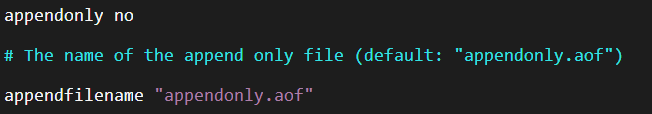

把这里改成 yes 就可以使用 AOF 的持久化方式了。

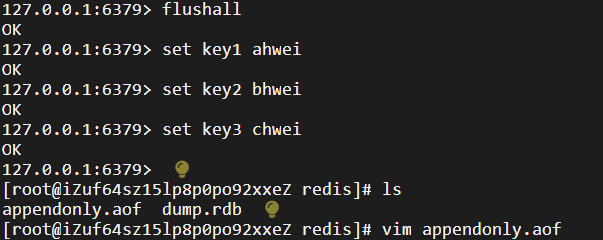

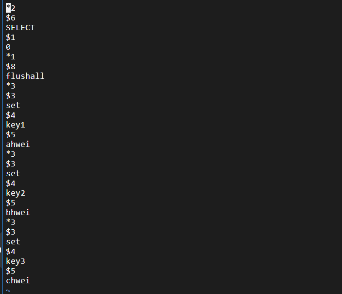

AOF 是一个文本文件，每次进行的操作都会被记录在这个文件中。

### 2.1 使用 AOF

开启 AOF 功能需要设置配置：appendonly yes，默认不开启。AOF 文件名通过 appendfilename 配置（默认是 appendonly.aof）设置。保存目录同 RDB 持久化方式一致，通过 dir 配置指定。AOF 的工作流程操作：命令写入（append）、文件同步（sync）、文件重写（rewrite）、重启加载（load）：

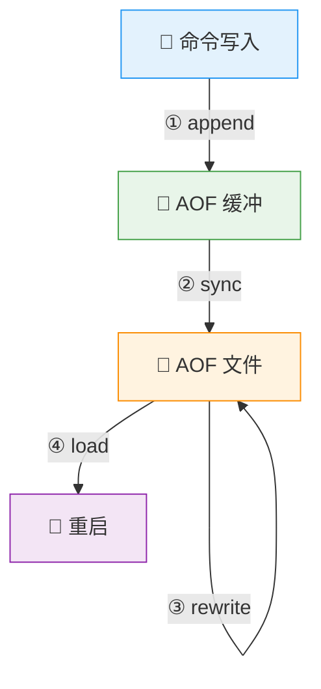

1. 所有写入的命令都会追加到 aof_buf （缓冲区）中

   > 顺序写（每次在文件末尾追加），但是引入缓冲区也有一定的代价，当缓冲区内的数据还没来得及写入磁盘时服务器掉电，这段数据就丢失了

2. AOF 缓冲区根据对应的策略向硬盘做同步操作

3. 随着 AOF 文件越来越大，需要定期对 AOF 文件进行重写，达到压缩的目的

4. 当 Redis 服务器启动的时候，可以加载 AOF 文件进行数据恢复

### 2.2 命令写入

AOF 命令写入的内容直接是文本协议格式，Redis 选择文本协议的可能原因：文本协议具备较好的兼容性；实现简单；具备可读性。

AOF 过程中为什么需要 aof_buf 这个缓冲区？Redis 使用单线程响应命令，如果每次写 AOF 命令都直接同步硬盘，性能从内存的读写变为 IO 的读写，必然会下降。先写入缓冲区可以有效减少 IO 次数，同时，Redis 还可以提供多种缓冲区同步策略，让用户根据自己的需求做出合理平衡。

### 2.3 文件同步

Redis 提供了多种 AOF 缓冲区同步文件策略，由参数 appendfsync 控制

| 可配置值  | 说明 | 频率 | 数据可靠性 | 性能 |
|-----------|------|------|------|------|
| always    | 命令写入 aof_buf 后调用 fsync 同步，完成后返回 | 最高 | 最高 | 最低 |
| everysec  | 命令写入 aof_buf 后只执行 write 操作，不进行 fsync。每秒由同步线程进行 fsync。 | 居中 | 居中 | 居中 |
| no        | 命令写入 aof_buf 后只执行 write 操作，由 OS 控制 fsync 频率。 | 最低 | 最低 | 最高 |

**系统调用 write 和 fsync 说明**

- **write 操作** 会触发延迟写（delayed write）机制。Linux 在内核提供页缓冲区用来提供硬盘 IO 性能。write 操作在写入系统缓冲区后立即返回。同步硬盘操作依赖于系统调度机制，例如：缓冲区页空间写满或达到特定时间周期。同步文件之前，如果此时系统故障宕机，缓冲区内数据将丢失。

- **Fsync** 针对单个文件操作，做强制硬盘同步，fsync 将阻塞直到数据写入到硬盘。

- **配置为 always** 时，每次写入都要同步 AOF 文件，性能很差，在一般的 SATA 硬盘上，只能支持大约几百 TPS 写入。除非是非常重要的数据，否则不建议配置。

- **配置为 no** 时，由于操作系统同步策略不可控，虽然提高了性能，但数据丢失风险大增，除非数据重要程度很低，一般不建议配置。

- **配置为 everysec**，是默认配置，也是推荐配置，兼顾了数据安全性和性能。理论上最多丢失 1 秒的数据。

### 2.4 重写机制

随着命令不断写入 AOF，文件会越来越大。


AOF 记录了中间的过程，但是实际上 redis 重新启动的时候并不关注中间过程，只关注最终结果。

为了解决这个问题，Redis 引入 AOF 重写机制来压缩文件体积。AOF 文件重写是将 Redis 进程内的数据转化为写命令，并同步到新的 AOF 文件。

**AOF 重写过程可以手动触发和自动触发：**

- 手动触发：调用 bgrewriteaof 命令
- 自动触发：根据 auto-aof-rewrite-min-size 和 auto-aof-rewrite-percentage 参数确定自动触发时机
  - auto-aof-rewrite-min-size：表示触发重写时 AOF 的最小文件大小，默认为 64MB
  - auto-aof-rewrite-percentage：代表当前 AOF 占用大小相比较上次重写时增加的比例

重写过程如下图：

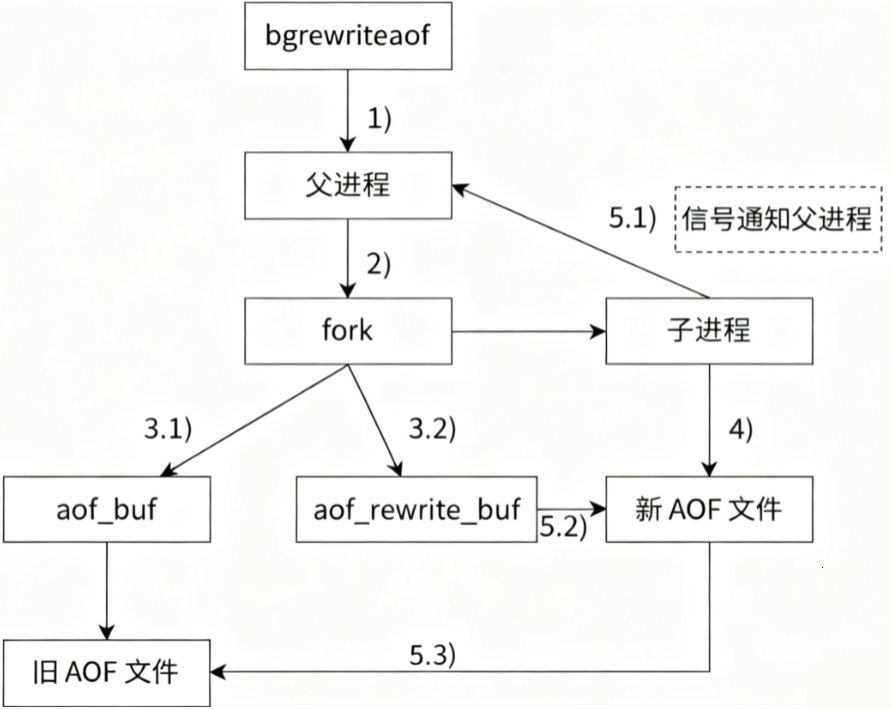

> 重写时，父进程负责接收请求，子进程负责重写。并且并不关心 AOF 文件中原来都有啥，只关心内存中的数据状态。因此，子进程只需要把内存中当前的数据获取出来，以 aof 的格式写入到一个新的 aof 文件中。
>
> 信号能表达的信息有限，并非像 socket 这样的方式可以传输任意的数据。因此像上述父子进程场景中，子进程表达“我干完了”这种简单的信息传递，使用信号就可以。

1. 执行 AOF 重写请求。
    - 如果当前进程正在执行 AOF 重写，请求不执行。如果当前进程正在执行 bgsave 操作，重写命令延迟到 bgsave 完成之后再执行。
2. 父进程执行 fork 创建子进程。 
3. 重写  
    - 主进程 fork 之后，继续响应其他命令。所有修改操作写入 AOF 缓冲区并根据 appendfsync 策略同步到硬盘，保证旧 AOF 文件机制正确。  
    - 子进程只有 fork 之前的所有内存信息，父进程中需要将 fork 之后这段时间的修改操作写入 AOF 重写缓冲区中。
4. 子进程根据内存快照，将命令合并到新的 AOF 文件中。 
5. 子进程完成重写   
    - 新文件写入后，子进程发送信号给父进程。   
    - 父进程把 AOF 重写缓冲区内临时保存的命令追加到新 AOF 文件中。   
    - 用新 AOF 文件替换老 AOF 文件。

> - 如果在执行 bgrewriteaof 的时候，当前 redis 已经正在 aof 重写了，此时不会再次执行 aof 重写，会直接返回
>
> - 如果在执行 bgrewriteaof 的时候，当前 redis 在生成 rdb 文件的快照，此时 aof 重写操作会等待 rdb 快照生成完毕之后，再次执行 aof 重写
>
> - 父进程 fork 完毕之后，就已经让子进程写新的 aof 文件了，并且随着时间的推移，子进程很快就写完了新的文件，要让新的 aof  文件代替旧的文件，那么此时父进程此时还在继续写这个即将消亡的 aof 文件是否还有意义？
>
>   考虑极端情况，假设在重新写的过程中，重写了一半，服务器就挂了，子进程内存的数据就会丢失，新的 aof 文件内容还不完整，如果父进程不坚持写旧的 aof 文件，重启就没办法保证数据的完整性了

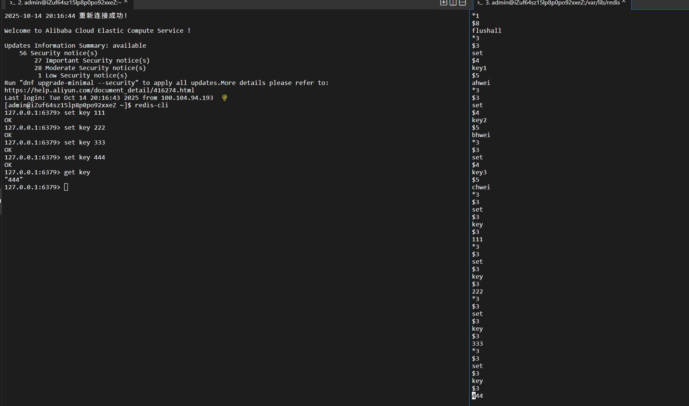

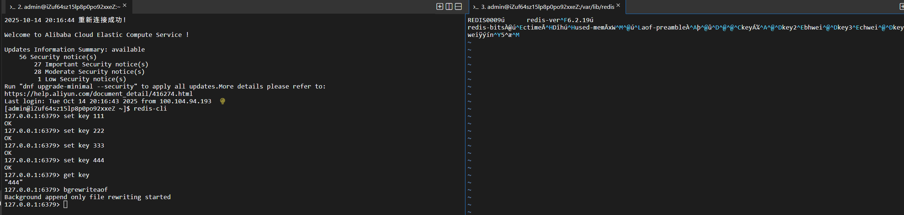

aof 本来是按照文本的方式来写入文件的，但是后续加载的成本比较高。所以 redis 引入了 **混合持久化**：

它结合了两种持久化方式的特点，按照 aof 的方式，每一个请求/操作，都记录文件。在触发 aof 重写之后，就会把当前内存的状态按照 rdb 的二进制格式写入新的 aof 文件中。后续再进行的操作，仍然是 aof 文本的方式追加到文件后面。

### 2.5 启动时数据恢复

当 Redis 启动时，会根据 RDB 和 AOF 文件内容，进行数据恢复：

**以 AOF 为主！**

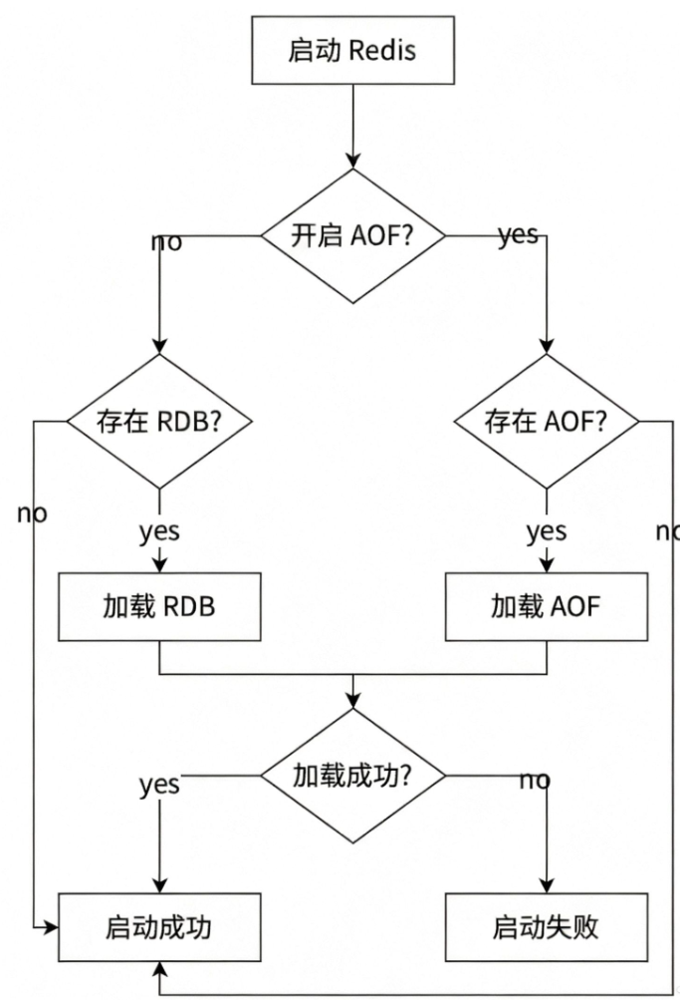

