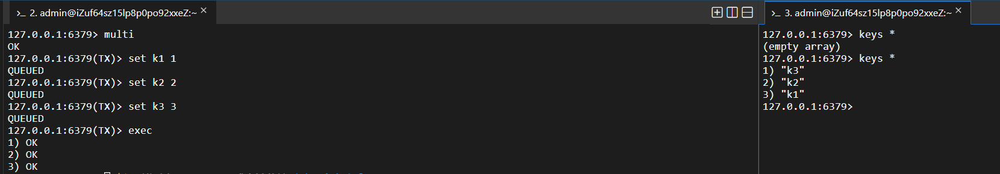
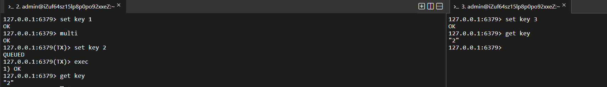
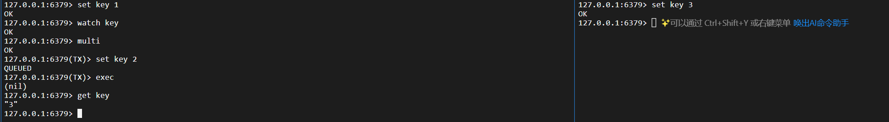
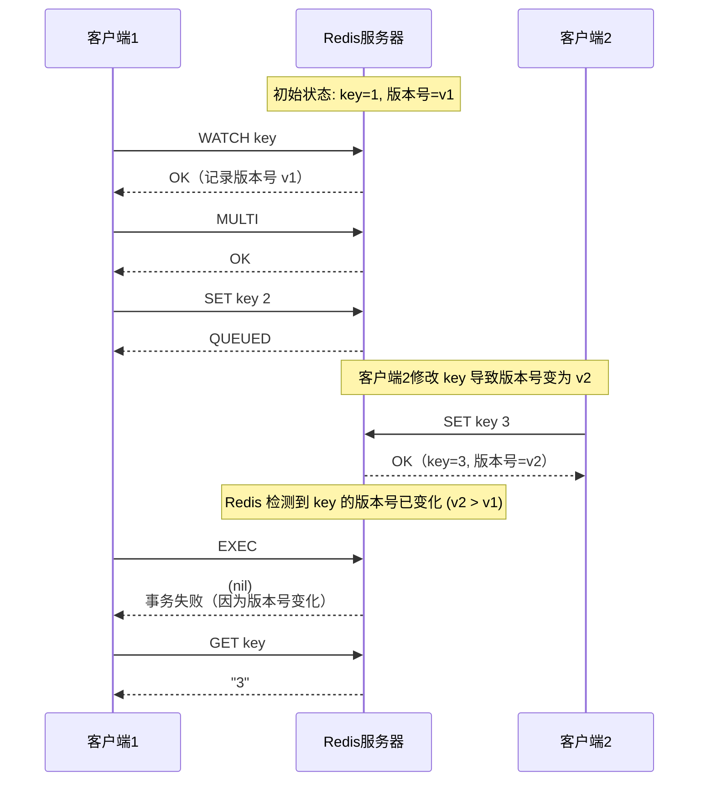

# Redis 事务

## 一、什么是事务

Redis 的事务和 Mysql 事务概念上是类似的，都是把一系列操作绑定成一组，让这一组能够批量执行。但是相比 Mysql 事务，Redis 事务：

- 弱化的原子性：redis 没有回滚机制，只能做到这些操作批量执行，不能做到一个失败就恢复到初始状态

  > Mysql 事务中有操作执行失败，要进行回滚；Redis 事务中如果有操作执行失败，什么也不做
  >
  > 官网原本有介绍 Redis 是具有原子性的，但是后来这句话被删了

- 不保证一致性：不涉及约束，也没有回滚。Mysql 事务的一致性体现的是运行事务前和运行后，结果都是合理有效的，不会出现中间非法状态

- 不涉及隔离性：也没有隔离级别，因为不会并发执行事务（Redis 多线程处理请求）

- 不需要持久性：是保存在内存的，是否开启持久化，是 Redis-server 自己的事情，和事务无关

Redis 中实现事务，是引入了队列（每个客户端都有一个）开启事务的时候，客户端输入的命令就会发给服务器并且进入这个队列中（不是立即执行）。当遇到了“执行事务”命令的时候，此时就会把队列中的这些任务都按照顺序依次执行（Redis 主线程中完成）

> 什么时候需要用到 Redis 事务？
>
> 如果我们需要把多个操作打包进行，使用事务是比较合适的

```c++
获取仓库中剩余的商品个数
if (个数 > 0) {
	下单成功
	商品个数--;
}
```

以前在多线程中，是使用加锁的方式来避免插队的，在 Redis 中就可以直接使用事务。

```c++
开启事务
get count 
if count > 0 // lua 脚本实现条件判定
    decr count
执行事务
```

redis 服务器收到执行事务操作的时候才会真正执行。

> redis 事务的应用场景，没有mysql 事务那么多。且 redis 如果是按照集群模式部署，则不支持事务。

## 二、事务操作

- MULTI 

  开启一个事务，执行成功返回 OK

- EXEC 

  真正执行事务

  

- DISCARD

  放弃当前事务，此时直接清空事务队列，之前读操作都不会真正执行到

- WATCH

  在执行事务的时候，如果某个事务中修改的值，被别的客户端修改了，此时就容易出现数据不一致的问题

  ```mermaid
  sequenceDiagram
      participant C1 as 客户端1
      participant Redis as Redis服务器
      participant C2 as 客户端2
  
      C1->>Redis: SET key 1
      Redis-->>C1: OK
  
      C1->>Redis: MULTI
      Redis-->>C1: OK
  
      C1->>Redis: SET key 2
      Redis-->>C1: QUEUED
  
      C2->>Redis: SET key 3
      Redis-->>C2: OK
  
      C1->>Redis: EXEC
      Redis-->>C1: OK（key 被设置为 2）
  
      C2->>Redis: GET key
      Redis-->>C2: "2"
  ```

  

  > 刚才的场景中，我们可以用 watch 命令来监控这个 key，看看这个 key 在事务的 multi 和 exec 之间，set key 之后，是否在外部被其他客户端修改了

  watch 监控：

  ```mermaid
  sequenceDiagram
      participant C1 as 客户端1
      participant Redis as Redis服务器
      participant C2 as 客户端2
  
      C1->>Redis: SET key 1
      Redis-->>C1: OK
  
      C1->>Redis: WATCH key
      Redis-->>C1: OK
  
      C1->>Redis: MULTI
      Redis-->>C1: OK
  
      C1->>Redis: SET key 2
      Redis-->>C1: QUEUED
  
      note over C2,Redis: 客户端2修改了被监视的 key
      C2->>Redis: SET key 3
      Redis-->>C2: OK
  
      C1->>Redis: EXEC
      Redis-->>C1: (nil)<br/>事务被取消（key 在执行前被修改）
  
      C1->>Redis: GET key
      Redis-->>C1: "3"
  ```

  

**watch 实现原理：**

类似于一个乐观锁。

> 乐观锁和悲观锁，不是某个具体的锁，而是指某一类锁的特性。乐观锁在加锁之前就有一个心理预期，预期接下来锁冲突的概率比较低；悲观锁在加锁之前预期接下来锁冲突的概率比较高。

redis 的 watch 就相当于是基于版本号机制实现了乐观锁

当执行 watch key 的时候，就会给这个 key 安排一个版本号，版本号可以理解成一个整数，在每次修改的时候，版本号都会变大。在 exec 时，会判定当前 key 的版本号是否和最初 watch 时候记录的版本号一致（watch 必须搭配事务使用，并且必须在 mutli 之前使用）



**unwatch**

取消对 key 的监控，相当于 watch 的逆操作。
