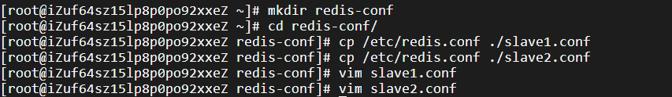
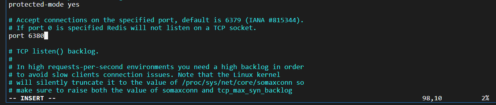
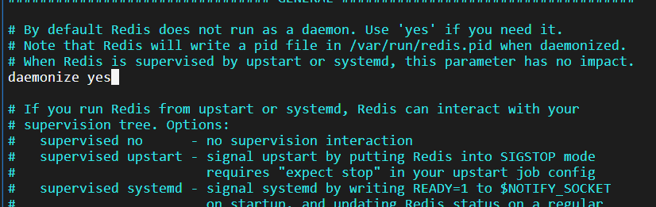
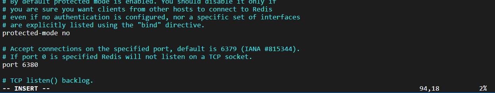
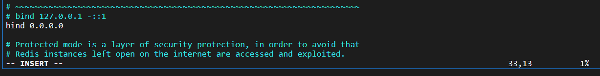
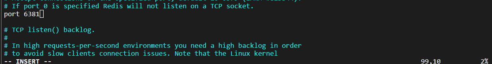
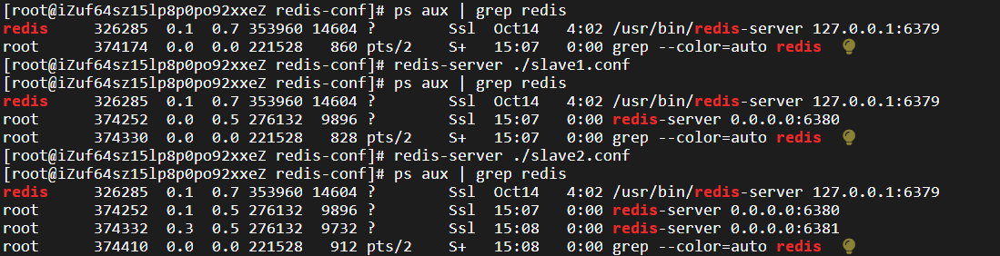
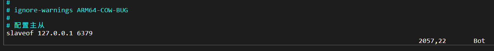
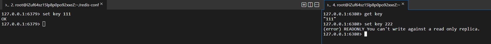

# 主从复制

分布式系统，涉及到一个非常关键的问题：单点问题。如果某个服务器程序只有一个节点（只有一个物理服务器）：

- 可用性问题：如果这个机器挂了，意味着服务就中断了。
- 性能 / 支持的并发量也是比较有限的

在分布式系统中，希望使用多个服务器来部署 redis，存在以下几种 redis 部署方式

1. 主从模式

   引入从节点后，把主节点上的数据复制出来放到从节点上。后续主节点对数据有任何修改，都会同步到从节点上。Redis 主从模式中，从节点上的数据不允许修改。

   **主从模式主要针对读操作的高并发和高可用，而写操作非常依赖主节点**

2. 主从 + 哨兵模式

3. 集群模式

## 一、配置

### 1.启动多个 redis-server

首先拷贝两份配置文件作为从节点的：

从节点1：

修改端口号为 6380：

修改 daemonize 为 yes，按照后台进程的方式来运行：

保护模式设置为 no：

bind 的 IP 改为 0.0.0.0：

从节点2：

端口号设置为 6381：

其他和从节点 1 一致。

启动两个从节点，发现多了两个进程：

### 2.配置主从

参与复制的 Redis 实例划分为主节点（master）和从节点（slave）。每个从结点只能有一个主节点， 而一个主节点可以同时具有多个从结点。复制的数据流是单向的，只能由主节点到从节点。 配置复制的方式有以下三种：

1. 在配置文件中加入 `slaveof {masterHost} {masterPort}` 随 Redis 启动生效。**更多使用！**

   

   **改配置文件后需要重新启动**

   

   kill -9 这种停止方式和之前直接运行 redis-server 命令的方式搭配使用

   而如果是 service redis-server start 启动，则必须 service redis-server stop 进行停止（kill -9 杀死进程后会自动启动）

   > 服务器就是要稳定性和高可用，但是服务器上的程序难免会有挂了的时候，这时候需要守护进程监控它的运行状态，对它进行自动重启。

2. 在 redis-server 启动命令时加入 `--slaveof {masterHost} {masterPort}` 生效。

3. 直接使用 redis 命令：`slaveof {masterHost} {masterPort}` 生效。

下图是主从复制效果，主节点的数据可以同步给从节点，而从节点只可读不可写：

