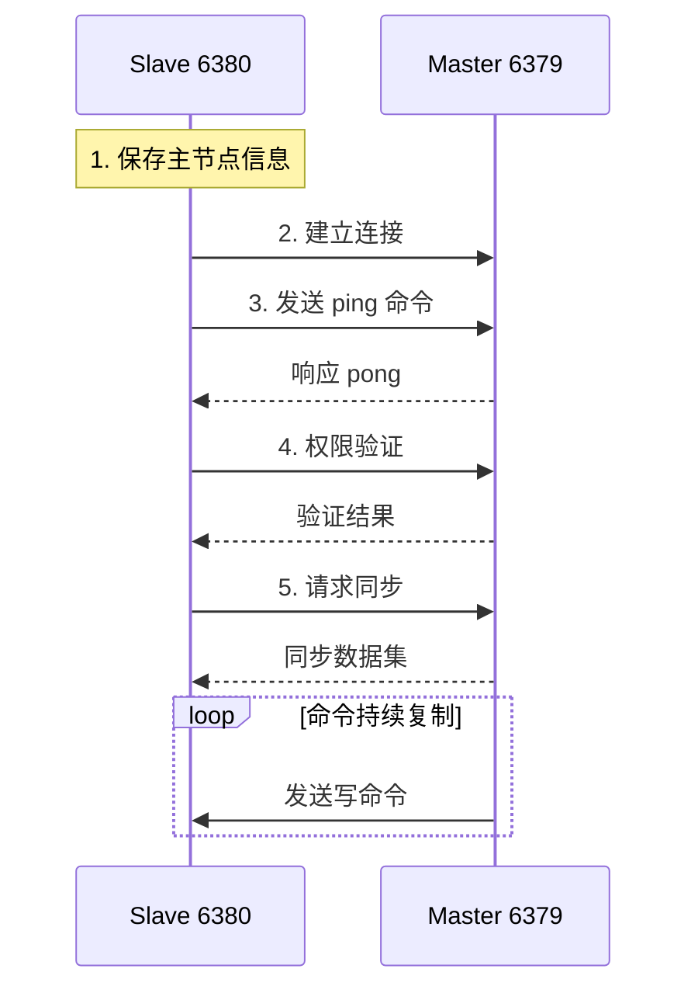
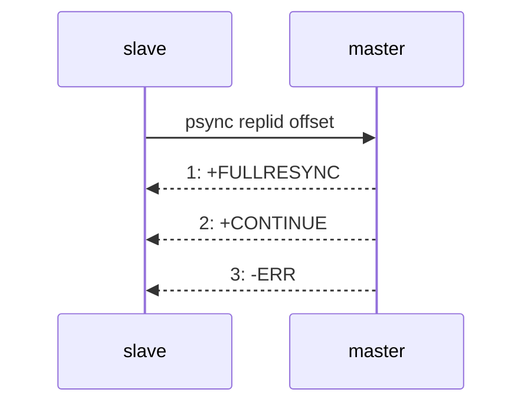

# 主从复制

分布式系统，涉及到一个非常关键的问题：单点问题。如果某个服务器程序只有一个节点（只有一个物理服务器）：

- 可用性问题：如果这个机器挂了，意味着服务就中断了。
- 性能 / 支持的并发量也是比较有限的

在分布式系统中，希望使用多个服务器来部署 redis，存在以下几种 redis 部署方式

1. 主从模式

   引入从节点后，把主节点上的数据复制出来放到从节点上。后续主节点对数据有任何修改，都会同步到从节点上。Redis 主从模式中，从节点上的数据不允许修改。

   **主从模式主要针对读操作的高并发和高可用，而写操作非常依赖主节点**

2. 主从 + 哨兵模式

3. 集群模式

## 一、配置

### 1.启动多个 redis-server

首先拷贝两份配置文件作为从节点的：


从节点1：

修改端口号为 6380：


修改 daemonize 为 yes，按照后台进程的方式来运行：


保护模式设置为 no：


bind 的 IP 改为 0.0.0.0：


从节点2：

端口号设置为 6381：


其他和从节点 1 一致。

启动两个从节点，发现多了两个进程：


### 2.配置主从

参与复制的 Redis 实例划分为主节点（master）和从节点（slave）。每个从结点只能有一个主节点， 而一个主节点可以同时具有多个从结点。复制的数据流是单向的，只能由主节点到从节点。 配置复制的方式有以下三种：

1. 在配置文件中加入 `slaveof {masterHost} {masterPort}` 随 Redis 启动生效。**更多使用！**

   

   **改配置文件后需要重新启动**

   

   kill -9 这种停止方式和之前直接运行 redis-server 命令的方式搭配使用

   而如果是 service redis-server start 启动，则必须 service redis-server stop 进行停止（kill -9 杀死进程后会自动启动）

   > 服务器就是要稳定性和高可用，但是服务器上的程序难免会有挂了的时候，这时候需要守护进程监控它的运行状态，对它进行自动重启。

2. 在 redis-server 启动命令时加入 `--slaveof {masterHost} {masterPort}` 生效。

3. 直接使用 redis 命令：`slaveof {masterHost} {masterPort}` 生效。

下图是主从复制效果，主节点的数据可以同步给从节点，而从节点只可读不可写：


查看配置的主从结构的信息：`info replication`

主节点上执行：


offset 是一个字节级别的计数器，记录主节点已经传播给从节点的写命令流的位置。

> 主节点上会收到源源不断的修改数据的请求，从节点就需要从主节点把这些修改后的数据做出同步，但是这个同步操作不是瞬间完成的。

lag 是 Redis 主从复制中从节点与主节点通信延迟的时间差，它衡量的是从节点上一次向主节点汇报自己复制进度（ACK）的时间与主节点当前时间的差值。

> 在 Redis 的复制协议中，从节点会定期（默认每秒一次）向主节点发送：
>
> ```shell
> REPLCONF ACK <replication_offset>
> ```
>
> 这条命令告诉主节点：
>
> > “我现在已经复制到了 offset = xxx。”
>
> 主节点收到后，会记录下从节点的最后 ACK 时间。
>  Redis 每秒检查一次，如果距离上次 ACK 超过 `1` 秒，就认为存在延迟，于是：
>
> ```shell
> lag = 当前时间 - 上次ACK时间
> ```
>
> | lag 值 | 含义                                                 |
> | ------ | ---------------------------------------------------- |
> | 0      | 从节点刚刚发过 ACK，主从连接健康、同步实时。         |
> | 1      | 有轻微延迟（通常网络或调度原因），一般无碍。         |
> | ≥2     | 表示从节点同步有明显延迟，可能网络问题或从节点卡顿。 |
>
> 当 `lag` 值持续变大，说明主从之间通信不畅，主节点无法确定从节点的最新进度，会在高可用机制（如 Sentinel）中被认为“不健康”。

```shell
repl_backlog_active:1
repl_backlog_size:1048576
repl_backlog_first_byte_offset:1
repl_backlog_histlen:237494
```

这些是 redis 主从复制的 **复制积压缓冲区** 的状态，支持 **部分同步** 机制的实现。

从节点上执行：


断开主从连接：`slaveof no one`


在 `Redis` 中，`SLAVEOF` 命令 **不是永久的**。它的效果是 **即时生效但非持久化**，想让它 “永久生效”，就要写进 `redis.conf`。

断开复制的主要流程：

1. 断开与主节点的复制关系
2. 从节点晋升为主节点

从节点断开复制后不会抛弃原有数据，只是无法再获取主节点上的数据变化

通过 `slaveof` 命令还可以实现切主操作，将当前从节点的数据源切换到另一个主节点。 

执行命令：

```bash
slaveof {newMasterIp} {newMasterPort}
```

**切主操作主要流程：**

1. 断开与旧主节点复制关系。
2. 与新主节点建立复制关系。
3. 删除从节点当前所有数据。
4. 从新主节点进行复制操作。

#### 2.1 安全性

对于数据比较重要的节点，主节点会通过设置 `requirepass` 参数进行密码验证，这时所有的客户端访问必须使用 `auth` 命令实行校验。 从节点与主节点的复制连接是通过一个特殊标识的客户端来完成，因此需要配置从节点的 `masterauth` 参数与主节点密码保持一致，这样从节点才可以正确地连接到主节点并发起复制流程。

#### 2.2 只读

默认情况下，从节点使用 `slave-read-only=yes` 配置为只读模式。  由于复制只能从主节点到从节点，对于从节点的任何修改主节点都是无感知的，修改从节点会造成主从数据不一致。  所以建议线上不要修改从节点的只读模式。

#### 2.3 传输延迟

主从节点一般部署在不同机器上，复制时的网络延迟就成为需要考虑的问题。 Redis 为我们提供了 `repl-disable-tcp-nodelay` 参数用于控制是否关闭 TCP_NODELAY，默认值为 `no`，即开启 `tcp-nodelay` 功能，说明如下：

- **当关闭时**：主节点产生的命令数据无论大小都会及时发送给从节点，这样主从之间延迟会变小，但增加了网络带宽的消耗。适用于主从之间网络环境良好的场景，如同机房部署。

- **当开启时**：主节点会合并较小的 TCP 数据包后再发送。默认发送时间间隔取决于 Linux 的内核，一般认为为 40 毫秒。这种配置节省了带宽但增加了主从之间的延迟。适用于主从网络环境较复杂的场景，如跨机房部署。

> TCP 内部支持了 nagle 算法，开启了就会增加 tcp 的传输延迟，但会节省网络带宽；关闭了就会减少 tcp 的网络延迟，但会增加网络带宽。这个算法默认开启，一般游戏开发需要关闭，尤其是即时性要求很高的（fps、moba）。目的和 tcp 的捎带应答是一样的，针对小的 tcp 数据报，进行合并。

## 二、拓扑

Redis 的复制拓扑结果可以支持单层或多层复制关系，根据拓扑复杂性可以分为以下三种：一主一从、一主多从、树状主从

### 1.一主一从结构


如果写数据请求太多，此时也会给主节点造成一些压力，可以关闭主节点的 `AOF`，只在从节点上开启 `AOF`，这样既可以保证数据的安全性，又能避免持久化对主节点的性能干扰。但是这种设定方式有一个严重的缺陷，主节点一旦挂了，不能让他自动重启（没有 `AOF` 文件），所以需要主节点从从节点拉取 `AOF` 文件，再启动。

### 2.一主多从结构


一主多从结构（星型结构）是的应用端可以利用多个从节点来实现读写分离。但是随着从节点个数的增加，同步一条数据，就需要传输多次。

### 3.树状主从结构


此时主节点不需要那么高的网卡带宽了，但是一旦数据修改了，同步的延时是更长的。

## 三、原理

如图所示，下面介绍建立复制的完整流程：



### 1.数据同步psync

`redis` 提供了 `psync` 命令，完成数据同步的过程，`psync` 不需要手动执行，`redis` 服务器会建立好主从同步关系之后，自动执行 `psync`。从节点负责执行 psync，从节点从主节点这边拉取数据。

#### 1.1 语法格式

```shell
 PSYNC replicationid offset
```

1. `replicationid / replid`（复制 `id`）

   主节点启动时候生成的复制 `id`（或从节点晋升为主节点），即使是同一个主节点，每次重启时生成的 `replicationid` 也是不同的。从节点和主节点建立了复制关系后，就会从主节点这边获取到 `replicationid`。

   通过 `info replication` 命令可以获取到 `replicationid` 的值

   

   `replid2` 是备份，一般情况下用不到。

   > 有一个主节点 A 和一个从节点 B，主节点生成 replid，从节点获取到 A 的 replid。如果 A 和 B 通信过程中出现了一些网络抖动，B 可能认为 A 挂了，此时 B 会成为主节点，自己生成一个 replid，但它也会记得之前旧的 replid，等后续网络稳定了，B 还可以根据 replid2 重新成为 A 的从节点（需要手动干预，哨兵机制可以自动完成）。

2. `offset`

   主节点和从节点上都会维护偏移量（整数）

   - 主节点的偏移量：主节点上会收到很多的修改操作的命令，每个命令都要占据几个字节。主节点会把这些修改命令的字节长度做累加。从节点每秒钟上报自身的复制的偏移量给主节点，因此主节点也会保存从节点的复制偏移量。
   - 从节点的偏移量：描述从节点这里的数据同步到哪里了。从节点接收到主节点发送的命令后，也会累加记录自身的偏移量。然后周期性的上报给主节点。

`replicationid` 和 `offset` 共同描述了一个数据集合，如果发现两台机器上 `replicationid` 和 `offset` 都完全一样，就可以认为这两个 `redis` 机器上存储的数据是完全一样的。

#### 1.2 运行流程



1. 从节点发送 `psync` 命令给主节点，`replid` 和 `offset` 的默认值分别是 ? 和 -1

   如果 `offset` 写 -1，则获取全量数据，如果 `offset` 是某个具体的正整数，则是从当前偏移量位置获取数据。并且主节点也会自行判定，看当前是否方便给部分数据，不方便就只能给全量了。

2. 主节点根据 `psync` 参数和自身数据情况决定响应结果：

   - 如果回复 `FULLRESYNC`，从节点则全量复制

   - 如果回复 `CONTINUE`，从节点则部分复制

   - 如果回复 `ERR`，说明 `Redis` 主节点版本过低，不支持 `psync` 命令。从节点可以使用老命令 `sync` 进行全量复制

     > - `psync` 一般不需要手动执行，`Redis` 会在主从复制模式下自动调用执行
     >
     > - `sync` 会阻塞 `redisserver` 处理其他请求，`psync` 则不会

#### 1.3 全量复制


> **有磁盘复制 vs 无磁盘复制（`diskless`）**
>
> 默认情况下，进行全量复制需要主节点生成 `RDB` 文件到主节点的磁盘中，再把磁盘上的 `RDB` 文件发送给从节点。
>
> 
>
> `Redis` 从 2.8.18 版本开始支持无磁盘复制。主节点在执行 `RDB` 生成流程时，不会生成 `RDB` 文件到磁盘中，而是直接把生成的 `RDB` 数据通过网络发送给从节点。这样就节省了一系列的写硬盘和读硬盘的操作开销。

> **`replid` vs `runid`**
>
> `runid` 是每个节点都不同的，标识一次 `redis` 的运行，主要用来支持哨兵机制，和主从复制没啥关系
>
> `replid` 具有主从关系的节点是相同的

#### 1.4 部分复制

从节点要从主节点这里进行全量复制，开销是很大的。有些时候，从节点本身已经持有了主节点的绝大部分数据，这个时候就不太需要进行全量复制了。

> 比如出现网络抖动时


> **复制积压缓冲区：**
>
> - **定义**：复制积压缓冲区是 Redis **主节点（master）** 维护的一个**固定长度、先进先出（FIFO）的队列**。
> - **默认大小**：1MB。
> - **创建时机**：当主节点连接了至少一个**从节点（slave）** 时创建。
> - **工作机制：**
>   - 主节点在处理写命令时，除了将命令发送给所有从节点，还会将命令写入复制积压缓冲区。
>   - 其结构类似于一个环形队列，保存的是最近已复制的数据。
> - **主要作用：**
>   - **实现部分复制：**当从节点短暂断开后重连，可以通过缓冲区直接获取断连期间缺失的命令，避免全量复制。
>   - **数据补救：**用于在复制过程中因网络问题导致命令丢失时的数据恢复。

#### 1.5 实时复制

主从节点在建立复制连接后，主节点会把自己收到的修改操作，通过 tcp 长连接的方式，源源不断的传输给从节点，从节点就会根据这些请求来同时修改自身的数据，从而保持和主节点数据的一致性。

这里的 tcp 长连接，需要通过心跳包的方式来维护连接状态（这里的心跳是指应用层自己实现的心跳，而不是 TCP 自带的心跳）

1. 主从节点彼此都有心跳检测机制，各自模拟成对方的客户端进行通信
2. 主节点默认每隔 10s 对从节点发送 ping 命令，判断从节点的存活性和连接状态
3. 从节点默认每 1s 向主节点发送 `replconf ack {offset}` 命令，给主节点上报自身当前的复制偏移量

如果主节点发现从节点通信延迟超过 `repl-timeout` 配置的值（默认 60s），则判定从节点下线，断开复制客户端连接。从节点恢复连接后，心跳机制继续进行。

### 2.主从断开连接的两种情况

- 从节点主动和主节点断开连接

  `slaveof no one`，这时候从节点能够晋升为主节点

- 主节点挂了

  这时从节点不会晋升主节点，必须通过人工干预的方式恢复主节点
