# 哨兵

redis 的主从复制模式下，一旦主节点由于故障不能提供服务，需要人工进行主从切换，同时，大量的客户端需要被通知切换到新的主节点上，对于上了一定规模的应用来说，这种方案是无法接受的，于是 redis 提供了哨兵来解决这个问题。

## 一、基本概念

哨兵机制，是通过独立的进程来体现的，和之前的 redis-server 是不同的进程，redis-sentinel 不负责存储数据只是对其他的 redis-server 进程起到监控的作用。

| 名词                   | 逻辑结构                  | 物理结构                       |
| ---------------------- | ------------------------- | ------------------------------ |
| 主节点                 | Redis 主服务              | 一个独立的 redis-server 进程   |
| 从节点                 | Redis 从服务              | 一个独立的 redis-server 进程   |
| Redis 数据节点         | 主从节点                  | 主节点和从节点的进程           |
| 哨兵节点               | 监控 Redis 数据节点的节点 | 一个独立的 redis-sentinel 进程 |
| 哨兵节点集合           | 若干哨兵节点的抽象组合    | 若干 redis-sentinel 进程       |
| Redis 哨兵（Sentinel） | Redis 提供的高可用方案    | 哨兵节点集合和 Redis 主从节点  |
| 应用方                 | 泛指一个或多个客户端      | 一个或多个连接 Redis 的进程    |

### 1.主从复制的问题

redis 的主从复制模式可以将主节点的数据改变同步给从节点，这样从节点就可以起到两个作用：

第一：作为主节点的一个备份，一旦主节点出了故障，从节点可以作为后备顶上来，并且保证数据尽量不丢失（主从复制表现为最终一致性）

第二：从节点可以分担主节点上的读压力，让主节点只承担写请求的处理，将所有的读请求负载均衡到各个从节点上

但是主从复制模式同样遗留了一些问题：

1. 主节点发生故障时，进行主备切换的过程是复杂的，完全需要人工参与，导致故障恢复时间无法保障
2. 主节点可以将读压力分散出去，但是写压力 / 存储压力是无法被分担的，还是受到单机的限制

其中第二个问题是分布式存储问题，留给 redis 集群去解决；第一个问题是高可用问题，即 redis 哨兵主要解决的问题。

### 2.人工恢复主节点故障

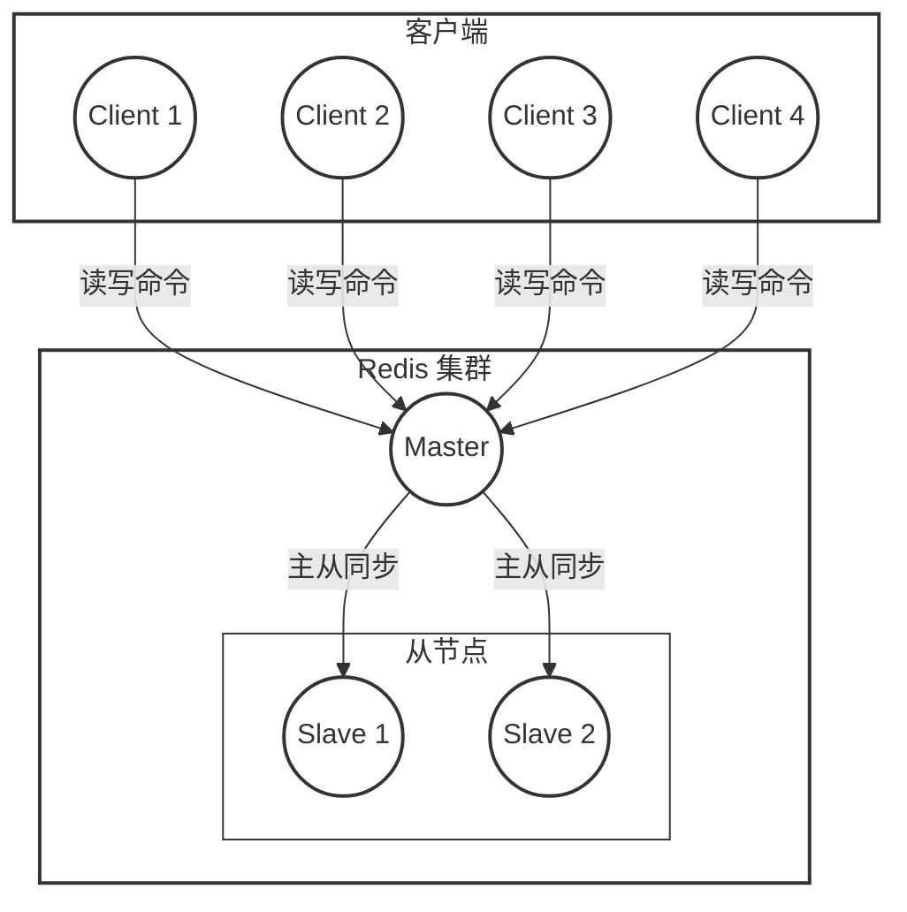

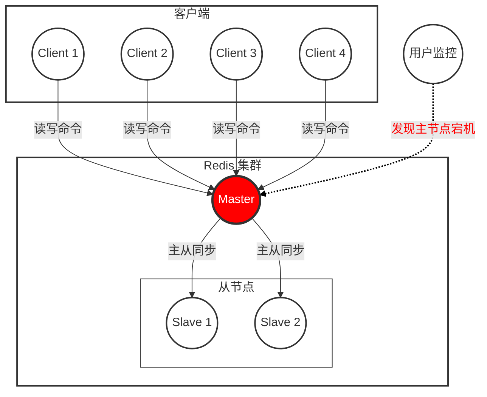

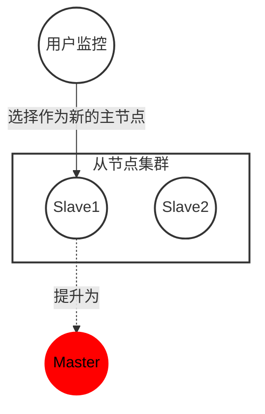

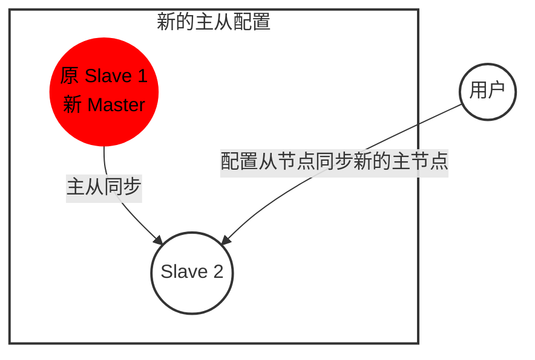

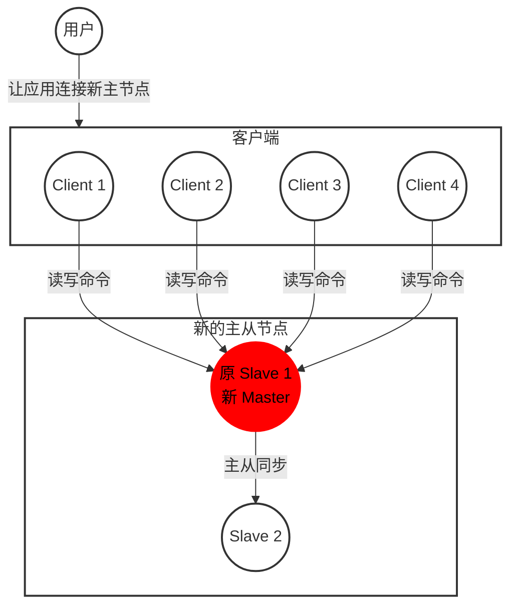

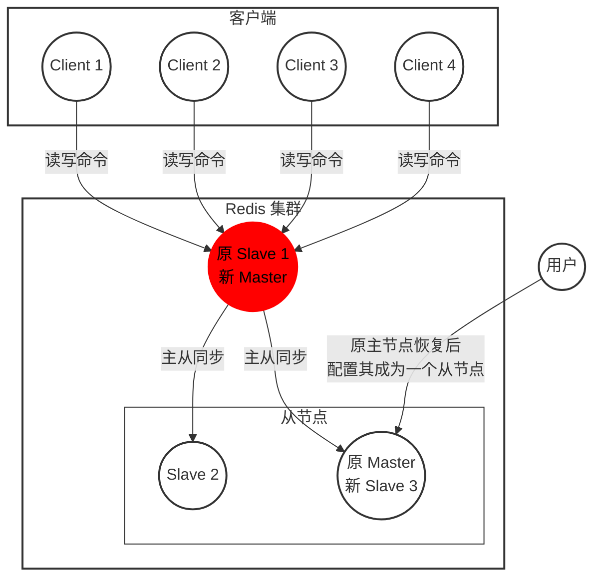

- 运维人员通过监控系统，发现 redis 主节点故障宕机
- 运维人员从所有节点中，选择一个（此处选择了 slave 1）执行 slaveof no one，使其作为新的主节点
- 运维人员让剩余从节点（此处为 slave 2）执行 `slaveof {newMasterIp} {newMasterPort}`，从新主节点开始数据同步
- 更新应用方连接的主节点信息到 `{newMasterIp}{newMasterPort}`
- 如果原来的主节点恢复，执行 `slaveof {newMasterIp} {newMasterPort}` 让其成为一个从节点

### 3.哨兵自动恢复主节点故障


这些哨兵都是单独的 redis sentinel 进程，他们会监控现有的 redis master 和 slave

> 监控：这些进程之间，会建立 tcp 长连接，定期发送心跳包
>
> 多个哨兵节点：单个节点可能误判（哨兵网络抖动），而且如果只有一个哨兵，如果这个哨兵挂了，就又成了之前的主从复制模式了

借助上述的监控机制，就可以及时发现某个主机是否挂了。如果是主节点挂了，其实没关系，如果是从节点挂了，哨兵就要发挥作用了

Redis Sentinel 相比于主从复制模式是多了若干（建议保持奇数）Sentinel 节点用于实现监控数据节点，哨兵节点会定期监控所有节点（包含数据节点和其他哨兵节点）。针对主节点故障的情况，故障转移流程大致如下：

1) 主节点故障，从节点同步连接中断，主从复制停止。

2) 哨兵节点通过定期监控发现主节点出现故障。哨兵节点与其他哨兵节点进行协商，达成多数认同主节点故障的共识。这步主要是防止该情况：出故障的不是主节点，而是发现故障的哨兵节点，该情况经常发生于哨兵节点的网络被孤立的场景下。

3) 哨兵节点之间使用 Raft 算法选举出一个领导角色，由该节点负责后续的故障转移工作。

4) 哨兵领导者开始执行故障转移：从节点中选择一个作为新主节点；让其他从节点同步新主节点；通知应用层转移到新主节点。

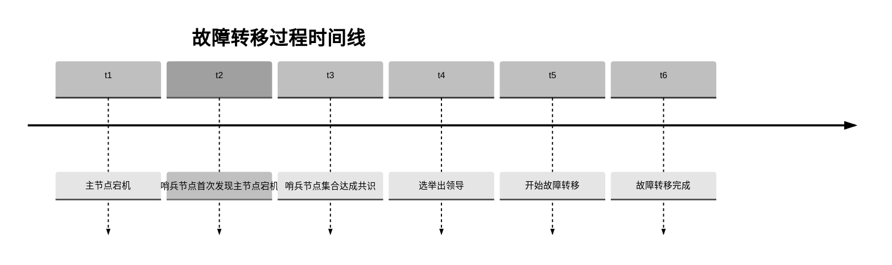

通过上面的介绍，可以看出 Redis Sentinel 具有以下几个功能：

- 监控: Sentinel 节点会定期检测 Redis 数据节点、其余哨兵节点是否可达。
- 故障转移: 实现从节点晋升（promotion）为主节点并维护后续正确的主从关系。
- 通知: Sentinel 节点会将故障转移的结果通知给应用方。

## 二、安装部署

<div>
  配置文件详见：<a href="Sentinel" style="text-decoration: none;">Sentinel</a>
</div>


按理说，这6个节点应该在6台主机上，此时我们在一台云服务器上完成环境搭建（在实际工作中，把上述节点放在一个服务器上没有意义），但是在一台机器上配置容易发生冲突，所以使用 docker 解决上述问题。

> 虚拟机：通过软件，在一个电脑上模拟出另外的一些硬件（构造了另一个虚拟的电脑），虚拟机这样的软件，就可以使用一个计算机来模拟出多个电脑的情况。但是虚拟机比较吃配置，6个主机比较困难。
>
> docker：可以认为是一个轻量级的虚拟机，既起到了虚拟机这样隔离环境的效果，又没有吃很多硬件资源。docker 中的一个容器可以看作一个轻量级的虚拟机。docker 中的“镜像”和“容器”类似于“可执行程序”和“进程”的关系。镜像可以自己构建，也可以直接拿别人已经构建好的

1. 停止之前的 redis 相关进程

2. 使用 docker 获取 redis 镜像

   ```shell
   [root@iZuf64sz15lp8p0po92xxeZ admin]# docker pull redis:5.0.9
   5.0.9: Pulling from library/redis
   bb79b6b2107f: Pull complete 
   1ed3521a5dcb: Pull complete 
   5999b99cee8f: Pull complete 
   bfee6cb5fdad: Pull complete 
   fd36a1ebc672: Pull complete 
   97481c7992eb: Pull complete 
   Digest: sha256:2a9865e55c37293b71df051922022898d8e4ec0f579c9b53a0caee1b170bc81c
   Status: Downloaded newer image for redis:5.0.9
   docker.io/library/redis:5.0.9
   [root@iZuf64sz15lp8p0po92xxeZ admin]# docker images
   REPOSITORY   TAG       IMAGE ID       CREATED       SIZE
   redis        5.0.9     987b553c835f   5 years ago   98.3MB
   ```

3. 使用 docker 进行容器编排

   - 编写数据节点的 docker-compose.yml

     ```shell
     [root@iZuf64sz15lp8p0po92xxeZ /]# cd ~
     [root@iZuf64sz15lp8p0po92xxeZ ~]# mkdir redis
     [root@iZuf64sz15lp8p0po92xxeZ ~]# cd redis
     [root@iZuf64sz15lp8p0po92xxeZ redis]# mkdir redis-data
     [root@iZuf64sz15lp8p0po92xxeZ redis]# mkdir redis-sentinel
     [root@iZuf64sz15lp8p0po92xxeZ redis]# cd redis-data/
     [root@iZuf64sz15lp8p0po92xxeZ redis-data]# vim docker-compose.yml
     ```

     docker-compose.yml：

     ```yaml
     version: '3.7'
     services:
       master:
         image: 'redis:5.0.9'
         container_name: redis-master
         restart: always
         command: redis-server --appendonly yes
         ports: 
           - 6379:6379
       slave1:
         image: 'redis:5.0.9'
         container_name: redis-slave1
         restart: always
         command: redis-server --appendonly yes --slaveof redis-master 6379
         ports: 
           - 6380:6379
       slave2:
         image: 'redis:5.0.9'
         container_name: redis-slave2
         restart: always
         command: redis-server --appendonly yes --slaveof redis-master 6379
         ports: 
           - 6381:6379
     ```

     > 经典的配置文件格式：
     >
     > - xml：标签格式，占用空间
     > - json：大括号 + 键值对
     > - yml：类似于 json，使用缩进 + 键值对

     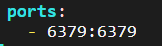

     docker 容器可以理解成一个轻量级的虚拟机，在这个容器里的端口号和外面宿主机的端口号是两个体系，所以即使使用同一端口也不会冲突。但是有的时候，我们希望容器外面能访问到容器里面的端口号，此时就可以把容器内部的端口映射成宿主机的端口。

     ```yaml
     ports:
       - 宿主机端口号:容器内部端口号
     ```

     ```shell
     [root@iZuf64sz15lp8p0po92xxeZ redis-data]# docker compose up -d
     WARN[0000] /root/redis/redis-data/docker-compose.yml: `version` is obsolete 
     [+] Running 4/4
      ✔ Network redis-data_default  Created                                                                                                                                                                                                              0.5s 
      ✔ Container redis-slave1      Started                                                                                                                                                                                                              3.1s 
      ✔ Container redis-slave2      Started                                                                                                                                                                                                              3.5s 
      ✔ Container redis-master      Started   
     [root@iZuf64sz15lp8p0po92xxeZ redis-data]# docker ps -a
     CONTAINER ID   IMAGE         COMMAND                  CREATED              STATUS              PORTS                                       NAMES
     b797275fce70   redis:5.0.9   "docker-entrypoint.s…"   About a minute ago   Up About a minute   0.0.0.0:6381->6379/tcp, :::6381->6379/tcp   redis-slave2
     66568d44d052   redis:5.0.9   "docker-entrypoint.s…"   About a minute ago   Up About a minute   0.0.0.0:6379->6379/tcp, :::6379->6379/tcp   redis-master
     9e693b7c6a82   redis:5.0.9   "docker-entrypoint.s…"   About a minute ago   Up About a minute   0.0.0.0:6380->6379/tcp, :::6380->6379/tcp   redis-slave1
     [root@iZuf64sz15lp8p0po92xxeZ redis-data]# netstat -anp | grep 6379
     tcp        0      0 0.0.0.0:6379            0.0.0.0:*               LISTEN      797321/docker-proxy 
     tcp6       0      0 :::6379                 :::*                    LISTEN      797331/docker-proxy 
     [root@iZuf64sz15lp8p0po92xxeZ redis-data]# netstat -anp | grep 6380
     tcp        0      0 0.0.0.0:6380            0.0.0.0:*               LISTEN      797241/docker-proxy 
     tcp6       0      0 :::6380                 :::*                    LISTEN      797247/docker-proxy 
     [root@iZuf64sz15lp8p0po92xxeZ redis-data]# netstat -anp | grep 6381
     tcp        0      0 0.0.0.0:6381            0.0.0.0:*               LISTEN      797262/docker-proxy 
     tcp6       0      0 :::6381                 :::*                    LISTEN      797269/docker-proxy
     ```

   - 编写哨兵节点的 docker-compose.yml

     ```yaml
     version: '3.7'
     services:
       sentinel1:
         image: 'redis:5.0.9'
         container_name: redis-sentinel-1
         restart: always
         command: redis-sentinel /etc/redis/sentinel.conf
         volumes:
           - ./sentinel1.conf:/etc/redis/sentinel.conf
         ports:
           - 26379:26379
       sentinel2:
         image: 'redis:5.0.9'
         container_name: redis-sentinel-2
         restart: always
         command: redis-sentinel /etc/redis/sentinel.conf
         volumes:
           - ./sentinel2.conf:/etc/redis/sentinel.conf
         ports:
           - 26380:26379
       sentinel3:
         image: 'redis:5.0.9'
         container_name: redis-sentinel-3
         restart: always
         command: redis-sentinel /etc/redis/sentinel.conf
         volumes:
           - ./sentinel3.conf:/etc/redis/sentinel.conf
         ports:
           - 26381:26379
     ```

     创建配置文件：

     放到 /redis-sentinel/ 下：

     ```conf
     bind 0.0.0.0
     port 26379
     sentinel monitor redis-master redis-master 6379 2
     sentinel down-after-milliseconds redis-master 1000
     ```

     - sentinel monitor

       ```conf
       sentinel monitor 主节点名 主节点ip 主节点端⼝ 法定票数
       ```

       - 主节点名：是哨兵内部自己取的名字。
       - 主节点 ip：部署 redis-master 的设备 ip。此处由于是使用 docker，可以直接写 docker 的容器名，会被自动 DNS 成对应的容器 ip。
       - 法定票数：票数 >= 法定票数，才会认为主节点真的挂了。

     - sentinel down-after-milliseconds

       主节点和哨兵之间通过心跳包进行沟通，如果心跳包在指定的时间内还没回来，就视为是节点出现故障

     docker 启动容器：

     ```shell
     [root@iZuf64sz15lp8p0po92xxeZ redis-sentinel]# docker compose up -d
     WARN[0000] /root/redis/redis-sentinel/docker-compose.yml: `version` is obsolete 
     [+] Running 4/4
      ✔ Network redis-sentinel_default  Created                                                                                                                                                                                                          0.5s 
      ✔ Container redis-sentinel-2      Started                                                                                                                                                                                                          4.0s 
      ✔ Container redis-sentinel-3      Started                                                                                                                                                                                                          5.4s 
      ✔ Container redis-sentinel-1      Started                                                                                                                                                                                                          4.8s 
     [root@iZuf64sz15lp8p0po92xxeZ redis-sentinel]# 
     ```

     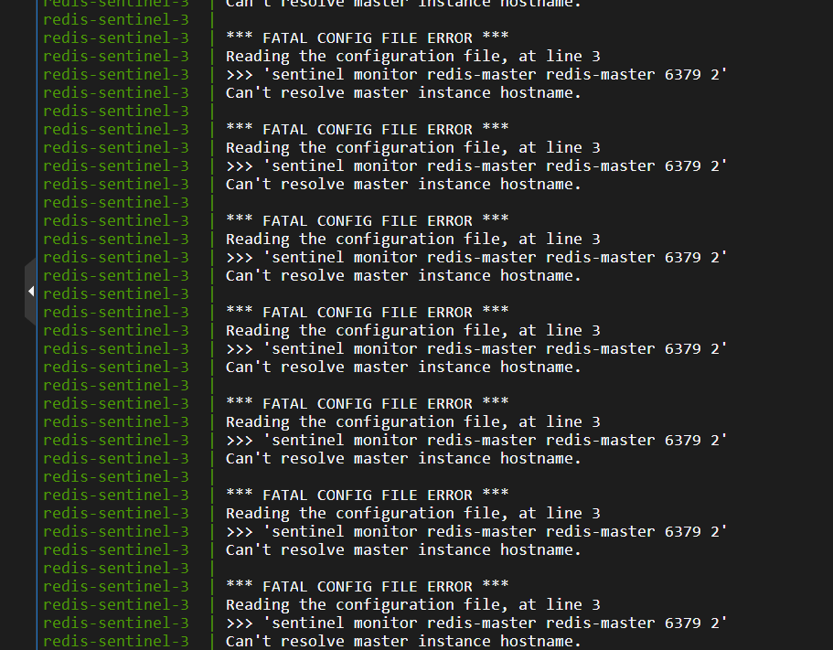

     此时报错，哨兵节点不认识 redis-master（redis-master 相当于域名，docker 会进行域名解析）。这是因为 docker compose 启动了 N 个容器形成了一个局域网，这 N 个容器之间可以互相访问，而三个 redis-server 节点是一个局域网，三个哨兵节点是另一个局域网，默认情况下，这两个网络不是互通的。

     **解决方案：**使用docker compose 把此处的两组服务放到同一个局域网中。

     ```shell
     # 列出当前 docker 中的局域网
     [root@iZuf64sz15lp8p0po92xxeZ redis-sentinel]# docker network ls
     NETWORK ID     NAME                     DRIVER    SCOPE
     7a5ebe52bd5e   bridge                   bridge    local
     e36e7f2d0e6b   host                     host      local
     2a5401e24825   none                     null      local
     e01558ccf332   redis-data_default       bridge    local
     8991371b7f68   redis-sentinel_default   bridge    local
     ```

     因此先启动三个 redis-server 节点，就相当于自动创建了第一个局域网，再启动后面三个哨兵节点，就直接让他们加入上面的局域网中，而不是创建新的。

     修改 docker-compose.yml 文件：

     ```yml
     version: '3.7'
     services:
       sentinel1:
         image: 'redis:5.0.9'
         container_name: redis-sentinel-1
         restart: always
         command: redis-sentinel /etc/redis/sentinel.conf
         volumes:
           - ./sentinel1.conf:/etc/redis/sentinel.conf
         ports:
           - 26379:26379
       sentinel2:
         image: 'redis:5.0.9'
         container_name: redis-sentinel-2
         restart: always
         command: redis-sentinel /etc/redis/sentinel.conf
         volumes:
           - ./sentinel2.conf:/etc/redis/sentinel.conf
         ports:
           - 26380:26379
       sentinel3:
         image: 'redis:5.0.9'
         container_name: redis-sentinel-3
         restart: always
         command: redis-sentinel /etc/redis/sentinel.conf
         volumes:
           - ./sentinel3.conf:/etc/redis/sentinel.conf
         ports:
           - 26381:26379
     networks:
       default:
         external:
           name: redis-data_default
     ```

     在最下方添加：

     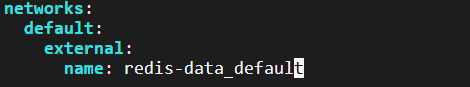

     再次启动容器：

     ```shell
     [root@iZuf64sz15lp8p0po92xxeZ redis-sentinel]# docker compose down
     
     WARN[0000] /root/redis/redis-sentinel/docker-compose.yml: `version` is obsolete 
     WARN[0000] networks.default: external.name is deprecated. Please set name and external: true 
     [+] Running 3/3
      ✔ Container redis-sentinel-2  Removed                                                                                                                                                                                                              0.2s 
      ✔ Container redis-sentinel-3  Removed                                                                                                                                                                                                              0.2s 
      ✔ Container redis-sentinel-1  Removed                                                                                                                                                                                                              0.7s 
     [root@iZuf64sz15lp8p0po92xxeZ redis-sentinel]# 
     [root@iZuf64sz15lp8p0po92xxeZ redis-sentinel]# docker compose up -d
     WARN[0000] /root/redis/redis-sentinel/docker-compose.yml: `version` is obsolete 
     WARN[0000] networks.default: external.name is deprecated. Please set name and external: true 
     [+] Running 3/3
      ✔ Container redis-sentinel-3  Started                                                                                                                                                                                                              3.8s 
      ✔ Container redis-sentinel-1  Started                                                                                                                                                                                                              3.3s 
      ✔ Container redis-sentinel-2  Started                       
     ```

     此时日志没有之前的报错了：

     ```shell
     [root@iZuf64sz15lp8p0po92xxeZ redis-sentinel]# docker compose logs
     WARN[0000] /root/redis/redis-sentinel/docker-compose.yml: `version` is obsolete 
     WARN[0000] networks.default: external.name is deprecated. Please set name and external: true 
     redis-sentinel-2  | 1:X 04 Nov 2025 09:17:43.245 # oO0OoO0OoO0Oo Redis is starting oO0OoO0OoO0Oo
     redis-sentinel-2  | 1:X 04 Nov 2025 09:17:43.245 # Redis version=5.0.9, bits=64, commit=00000000, modified=0, pid=1, just started
     redis-sentinel-2  | 1:X 04 Nov 2025 09:17:43.245 # Configuration loaded
     redis-sentinel-2  | 1:X 04 Nov 2025 09:17:43.250 * Running mode=sentinel, port=26379.
     redis-sentinel-2  | 1:X 04 Nov 2025 09:17:43.276 # Sentinel ID is a3b4255a93346829730651689090b9b18a718411
     redis-sentinel-2  | 1:X 04 Nov 2025 09:17:43.276 # +monitor master redis-master 172.18.0.4 6379 quorum 2
     redis-sentinel-2  | 1:X 04 Nov 2025 09:17:43.296 * +slave slave 172.18.0.2:6379 172.18.0.2 6379 @ redis-master 172.18.0.4 6379
     redis-sentinel-2  | 1:X 04 Nov 2025 09:17:43.300 * +slave slave 172.18.0.3:6379 172.18.0.3 6379 @ redis-master 172.18.0.4 6379
     redis-sentinel-2  | 1:X 04 Nov 2025 09:17:44.995 * +sentinel sentinel a5d03afc4604a4aedf9703f5e0195cc470f20ac3 172.18.0.5 26379 @ redis-master 172.18.0.4 6379
     redis-sentinel-2  | 1:X 04 Nov 2025 09:17:45.351 * +sentinel sentinel e52c4dfab0e57f7191175a44d9e572aceb49ac2c 172.18.0.7 26379 @ redis-master 172.18.0.4 6379
     redis-sentinel-3  | 1:X 04 Nov 2025 09:17:43.328 # oO0OoO0OoO0Oo Redis is starting oO0OoO0OoO0Oo
     redis-sentinel-1  | 1:X 04 Nov 2025 09:17:42.921 # oO0OoO0OoO0Oo Redis is starting oO0OoO0OoO0Oo
     redis-sentinel-1  | 1:X 04 Nov 2025 09:17:42.921 # Redis version=5.0.9, bits=64, commit=00000000, modified=0, pid=1, just started
     redis-sentinel-1  | 1:X 04 Nov 2025 09:17:42.921 # Configuration loaded
     redis-sentinel-1  | 1:X 04 Nov 2025 09:17:42.925 * Running mode=sentinel, port=26379.
     redis-sentinel-1  | 1:X 04 Nov 2025 09:17:42.947 # Sentinel ID is a5d03afc4604a4aedf9703f5e0195cc470f20ac3
     redis-sentinel-1  | 1:X 04 Nov 2025 09:17:42.947 # +monitor master redis-master 172.18.0.4 6379 quorum 2
     redis-sentinel-1  | 1:X 04 Nov 2025 09:17:42.953 * +slave slave 172.18.0.2:6379 172.18.0.2 6379 @ redis-master 172.18.0.4 6379
     redis-sentinel-1  | 1:X 04 Nov 2025 09:17:42.974 * +slave slave 172.18.0.3:6379 172.18.0.3 6379 @ redis-master 172.18.0.4 6379
     redis-sentinel-1  | 1:X 04 Nov 2025 09:17:45.289 * +sentinel sentinel a3b4255a93346829730651689090b9b18a718411 172.18.0.6 26379 @ redis-master 172.18.0.4 6379
     redis-sentinel-1  | 1:X 04 Nov 2025 09:17:45.354 * +sentinel sentinel e52c4dfab0e57f7191175a44d9e572aceb49ac2c 172.18.0.7 26379 @ redis-master 172.18.0.4 6379
     redis-sentinel-3  | 1:X 04 Nov 2025 09:17:43.328 # Redis version=5.0.9, bits=64, commit=00000000, modified=0, pid=1, just started
     redis-sentinel-3  | 1:X 04 Nov 2025 09:17:43.328 # Configuration loaded
     redis-sentinel-3  | 1:X 04 Nov 2025 09:17:43.332 * Running mode=sentinel, port=26379.
     redis-sentinel-3  | 1:X 04 Nov 2025 09:17:43.337 # Sentinel ID is e52c4dfab0e57f7191175a44d9e572aceb49ac2c
     redis-sentinel-3  | 1:X 04 Nov 2025 09:17:43.337 # +monitor master redis-master 172.18.0.4 6379 quorum 2
     redis-sentinel-3  | 1:X 04 Nov 2025 09:17:43.343 * +slave slave 172.18.0.2:6379 172.18.0.2 6379 @ redis-master 172.18.0.4 6379
     redis-sentinel-3  | 1:X 04 Nov 2025 09:17:43.346 * +slave slave 172.18.0.3:6379 172.18.0.3 6379 @ redis-master 172.18.0.4 6379
     redis-sentinel-3  | 1:X 04 Nov 2025 09:17:44.995 * +sentinel sentinel a5d03afc4604a4aedf9703f5e0195cc470f20ac3 172.18.0.5 26379 @ redis-master 172.18.0.4 6379
     redis-sentinel-3  | 1:X 04 Nov 2025 09:17:45.294 * +sentinel sentinel a3b4255a93346829730651689090b9b18a718411 172.18.0.6 26379 @ redis-master 172.18.0.4 6379
     ```

     再次打开哨兵的配置文件，发现它们已经被自动修改了

     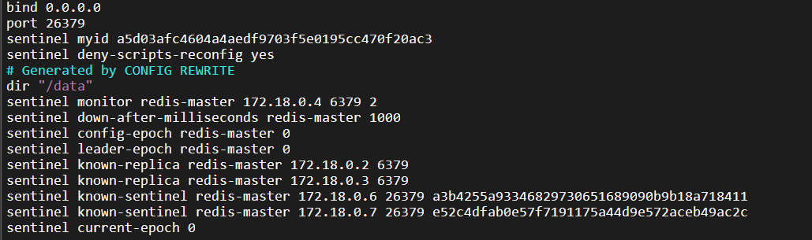


## 三、重新选举

手动把 redis-master 干掉：

```shell
 docker stop redis-master
```

观察哨兵的日志：

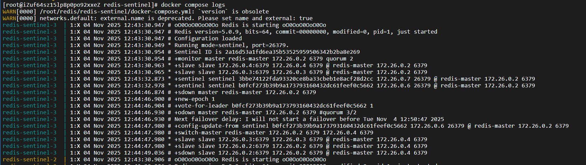

可以看到哨兵节点发现了主节点 sdown，进一步由于主节点宕机的票达到 $\frac{2}{3}$，达到法定票数，于是 master 被判定为 odown

- 主观下线（sdown）：哨兵感知到主节点没心跳了，判定为主观下线
- 客观下线（odown）：多个哨兵达成一致意见，才能认为 master 确实下线了

```shell
redis-sentinel-3  | 1:X 04 Nov 2025 12:44:47.980 # +switch-master redis-master 172.26.0.2 6379 172.26.0.4 6379
```

接下来，哨兵们挑选出了⼀个新的 master。在上图中，是 172.26.0.4:6379  这个节点

redis-master 重启后（`docker start redis-master`），就变成从节点了：

此时查看哨兵日志就会发现：刚才启动的 redis-master 被当作从节点了


## 四、选举原理

1. 主观下线：redis-master 宕机，三个哨兵都没有心跳包了，均会判定为主观下线

2. 客观下线：投票，故障得票数 >= 法定票数，客观下线

3. 选出 leader：多个哨兵节点选出一个 leader

   1. 发起拉票请求

       每个哨兵节点都会向其他节点发送“拉票请求”。

   2. 收到请求后的响应

       被请求的节点会根据当前状态选择“投票”或“不投票”。

      - 每个哨兵节点一轮中只能投一票。
      - 如果收到第一个拉票请求，就会投给它。

   3. 选举结果判断

      - 若某个节点获得了超过半数的票（即多数派），则当选为 leader。

      - 若出现平票（例如每人投自己），则重新发起新一轮投票。

   4. 选出 Leader 后

      leader 负责发起故障转移流程。

   > **选举核心思想**
   >
   > - “先下手为强”：越早发起投票请求的哨兵越容易成为 leader。
   > - 选举的随机性：由于网络延时和随机超时机制，不同节点的触发时间不同，保证不会长期僵持。
   >
   > 基本上谁先发现 master 挂了，谁就基本上是 leader 了，它发现后先给自己投票，然后其他节点发现有人竞选，就给那个人投票。

4. leader 选出新的 master

   当 leader 被选出后，它会从剩余的 slave 节点中挑选一个新的 master，规则如下：

   1. 优先级比较
       配置项：`slave-priority` 或 `replica-priority`
      - 数值越小，优先级越高。
   2. 数据偏移量
      - 同步的数据越多（越接近原 master），优先级越高。
   3. run id
      - 若以上都相同，选择运行 ID 较小的节点

5. 当某个 slave 被选为新的 master 后：

   1. leader 指定该节点执行：

      ```
      SLAVEOF NO ONE
      ```

      使其成为新的 master。

   2. leader 指定剩余的 slave 节点重新附属到新 master：

      ```
      SLAVEOF <new_master_ip> <port>
      ```
