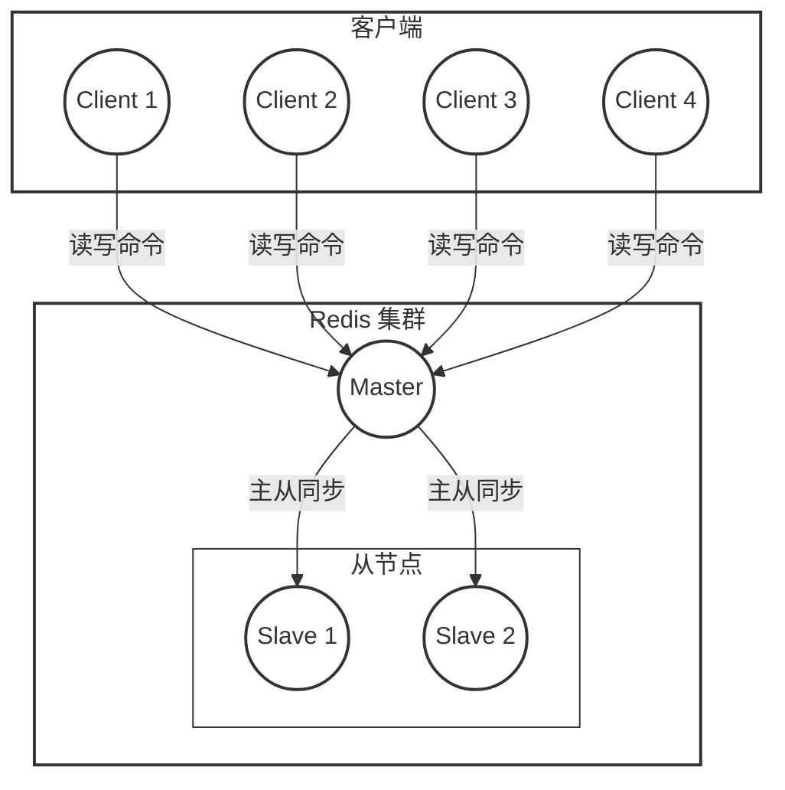
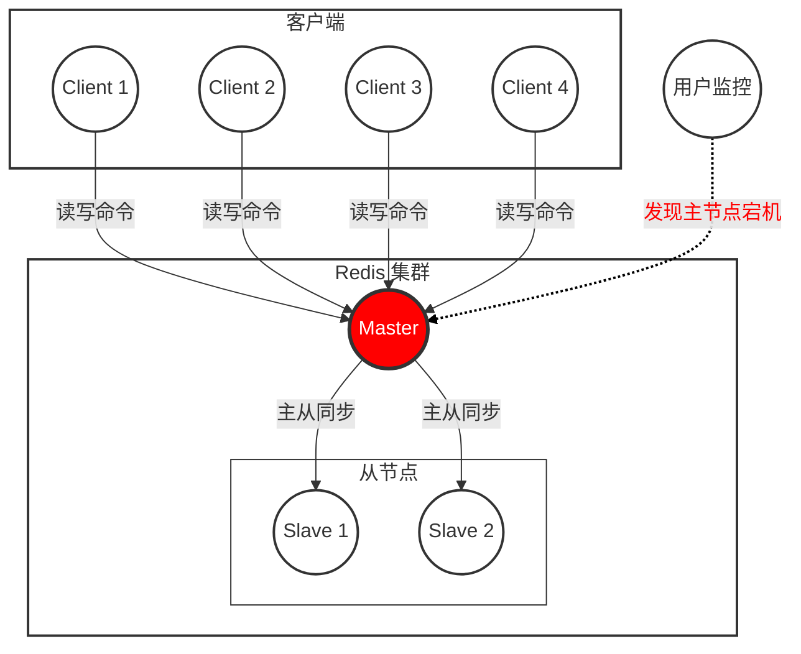
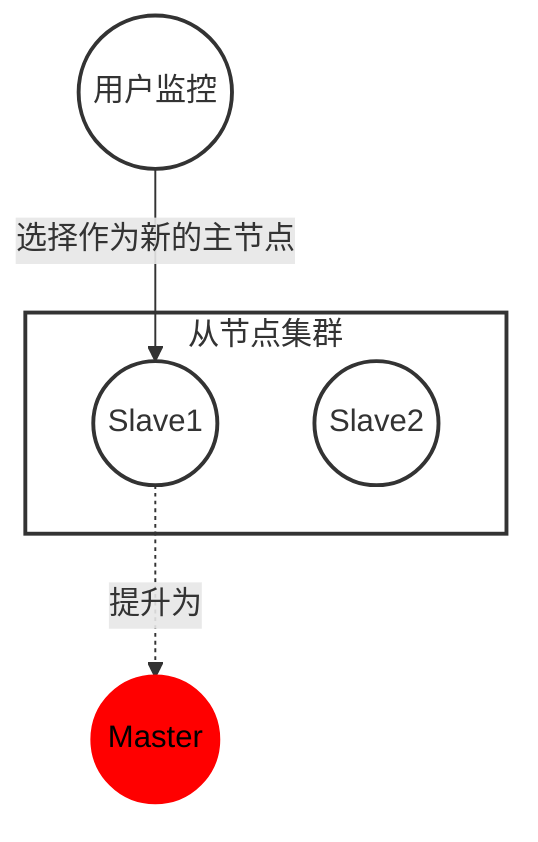
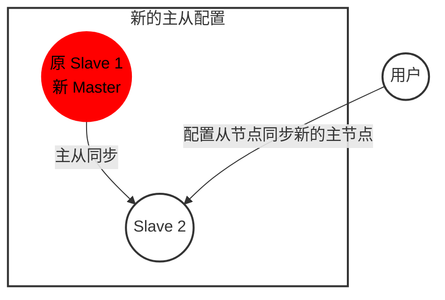
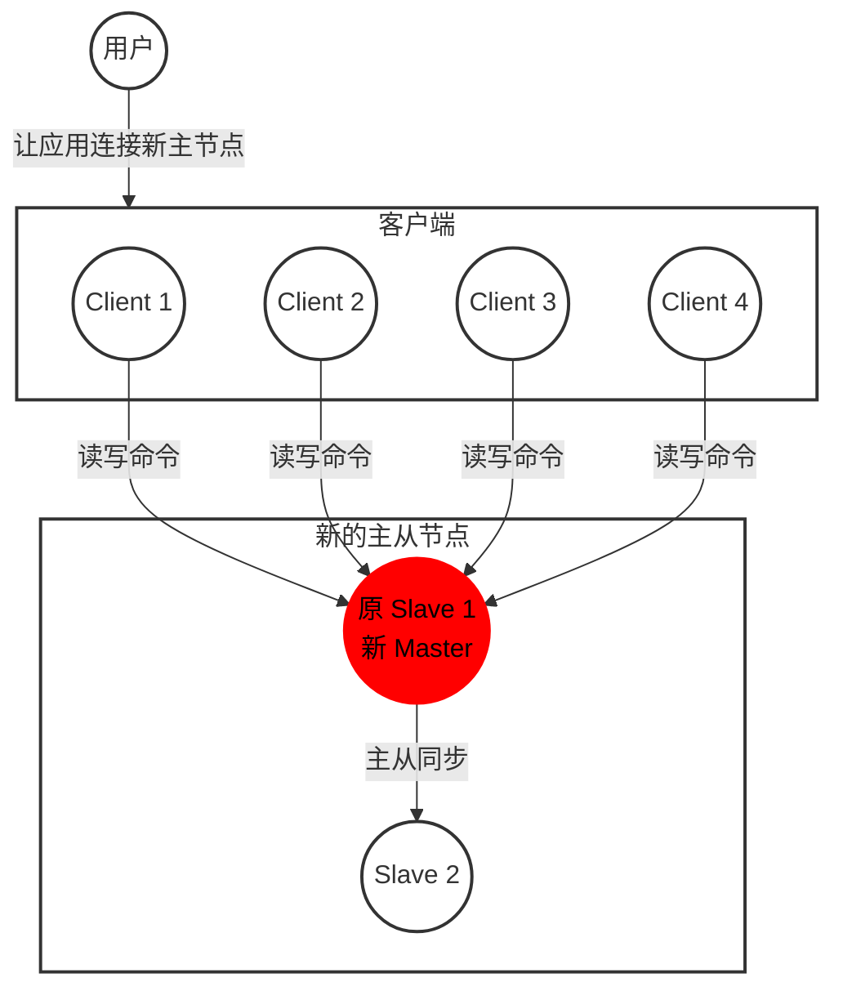
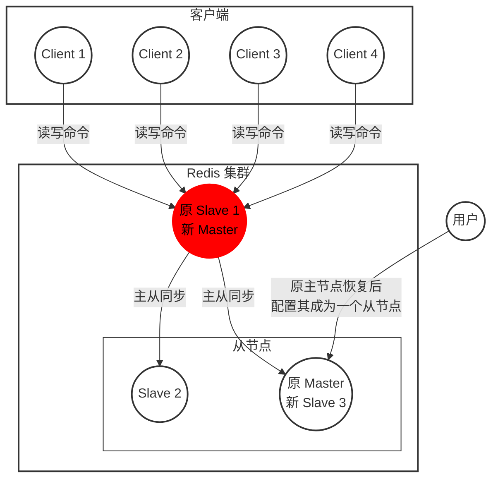
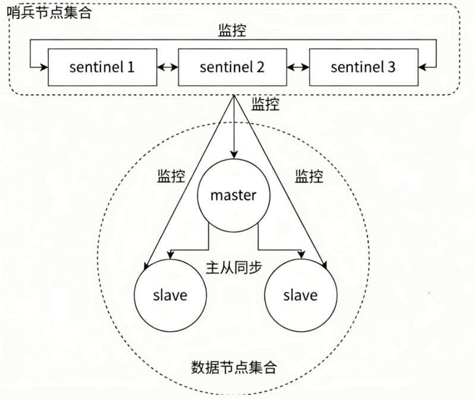
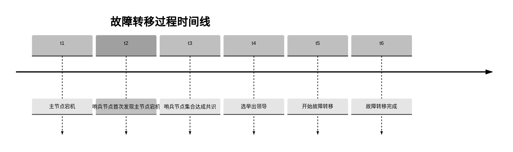

# 哨兵

redis 的主从复制模式下，一旦主节点由于故障不能提供服务，需要人工进行主从切换，同时，大量的客户端需要被通知切换到新的主节点上，对于上了一定规模的应用来说，这种方案是无法接受的，于是 redis 提供了哨兵来解决这个问题。

## 一、基本概念

哨兵机制，是通过独立的进程来体现的，和之前的 redis-server 是不同的进程，redis-sentinel 不负责存储数据只是对其他的 redis-server 进程起到监控的作用。

| 名词                   | 逻辑结构                  | 物理结构                       |
| ---------------------- | ------------------------- | ------------------------------ |
| 主节点                 | Redis 主服务              | 一个独立的 redis-server 进程   |
| 从节点                 | Redis 从服务              | 一个独立的 redis-server 进程   |
| Redis 数据节点         | 主从节点                  | 主节点和从节点的进程           |
| 哨兵节点               | 监控 Redis 数据节点的节点 | 一个独立的 redis-sentinel 进程 |
| 哨兵节点集合           | 若干哨兵节点的抽象组合    | 若干 redis-sentinel 进程       |
| Redis 哨兵（Sentinel） | Redis 提供的高可用方案    | 哨兵节点集合和 Redis 主从节点  |
| 应用方                 | 泛指一个或多个客户端      | 一个或多个连接 Redis 的进程    |

### 1.主从复制的问题

redis 的主从复制模式可以将主节点的数据改变同步给从节点，这样从节点就可以起到两个作用：

第一：作为主节点的一个备份，一旦主节点出了故障，从节点可以作为后备顶上来，并且保证数据尽量不丢失（主从复制表现为最终一致性）

第二：从节点可以分担主节点上的读压力，让主节点只承担写请求的处理，将所有的读请求负载均衡到各个从节点上

但是主从复制模式同样遗留了一些问题：

1. 主节点发生故障时，进行主备切换的过程是复杂的，完全需要人工参与，导致故障恢复时间无法保障
2. 主节点可以将读压力分散出去，但是写压力 / 存储压力是无法被分担的，还是受到单机的限制

其中第二个问题是分布式存储问题，留给 redis 集群去解决；第一个问题是高可用问题，即 redis 哨兵主要解决的问题。

### 2.人工恢复主节点故障

- 运维人员通过监控系统，发现 redis 主节点故障宕机
- 运维人员从所有节点中，选择一个（此处选择了 slave 1）执行 slaveof no one，使其作为新的主节点
- 运维人员让剩余从节点（此处为 slave 2）执行 `slaveof {newMasterIp} {newMasterPort}`，从新主节点开始数据同步
- 更新应用方连接的主节点信息到 `{newMasterIp}{newMasterPort}`
- 如果原来的主节点恢复，执行 `slaveof {newMasterIp} {newMasterPort}` 让其成为一个从节点

### 3.哨兵自动恢复主节点故障

这些哨兵都是单独的 redis sentinel 进程，他们会监控现有的 redis master 和 slave

> 监控：这些进程之间，会建立 tcp 长连接，定期发送心跳包
>
> 多个哨兵节点：单个节点可能误判（哨兵网络抖动），而且如果只有一个哨兵，如果这个哨兵挂了，就又成了之前的主从复制模式了

借助上述的监控机制，就可以及时发现某个主机是否挂了。如果是主节点挂了，其实没关系，如果是从节点挂了，哨兵就要发挥作用了

Redis Sentinel 相比于主从复制模式是多了若干（建议保持奇数）Sentinel 节点用于实现监控数据节点，哨兵节点会定期监控所有节点（包含数据节点和其他哨兵节点）。针对主节点故障的情况，故障转移流程大致如下：

1) 主节点故障，从节点同步连接中断，主从复制停止。

2) 哨兵节点通过定期监控发现主节点出现故障。哨兵节点与其他哨兵节点进行协商，达成多数认同主节点故障的共识。这步主要是防止该情况：出故障的不是主节点，而是发现故障的哨兵节点，该情况经常发生于哨兵节点的网络被孤立的场景下。

3) 哨兵节点之间使用 Raft 算法选举出一个领导角色，由该节点负责后续的故障转移工作。

4) 哨兵领导者开始执行故障转移：从节点中选择一个作为新主节点；让其他从节点同步新主节点；通知应用层转移到新主节点。

通过上面的介绍，可以看出 Redis Sentinel 具有以下几个功能：

- 监控: Sentinel 节点会定期检测 Redis 数据节点、其余哨兵节点是否可达。
- 故障转移: 实现从节点晋升（promotion）为主节点并维护后续正确的主从关系。
- 通知: Sentinel 节点会将故障转移的结果通知给应用方。

