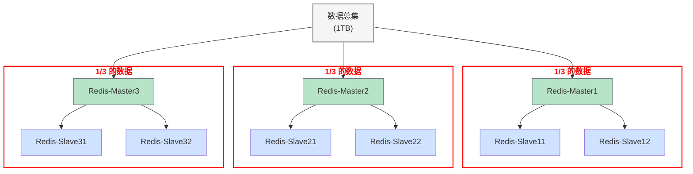
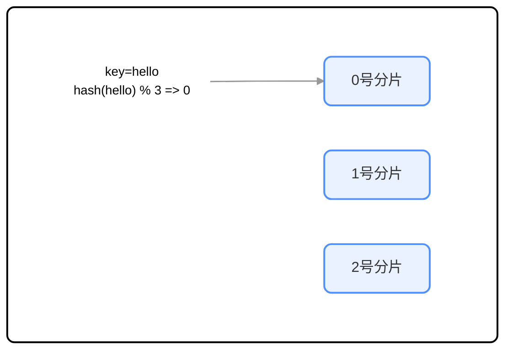

# 集群

## 一、基本概念



上图中，每个 slave 都是对应的 master 的备份，每个红框可以称为一个分片。

## 二、数据分片算法

### 1.哈希求余

设有 N 个分片，使用 [0, N-1] 这样的序号进行编号，针对某个给定的 key，先计算 hash 值，再把得到的结果 % N 即为分片编号。

> MD5：
>
> - 计算结果定长：方便比较，以及密文不应该和长度关联，以免泄露信息
> - 计算结果分散
> - 单向不可逆：网上的一些 md5 破解工具是查表



优点：简单高效，数据分配均匀

缺点：一旦需要进行扩容，N 改变，原有的映射规则被破坏，就需要让节点之间的数据互相传输，重新排列，此时 **开销很大**。

```mermaid
%% ================================
%% 扩容前后分片示意图（含外框）
%% ================================
graph TD

    %% ===== 外层黑色边框 =====
    subgraph 外框[" "]
      direction TB

	  
	  %% ===== 扩容后 =====
      subgraph 扩容后["扩容后"]
        direction LR
        B0["0号分片<br>100 104 108 112 116 120<br><span style='font-size:12px'>0号分片上只有108和120是之前的数据，其他数据都是通过搬运得到的</span>"]
        B1["1号分片<br>101 105 109 113 117<br><span style='font-size:12px'>1号分片上没有之前的数据，都是通过搬运得到的</span>"]
        B2["2号分片<br>102 106 110 114 118<br><span style='font-size:12px'>2号分片上只有110是之前的数据，其他都是搬运得到的</span>"]
        B3["3号分片<br>103 107 111 115 119<br><span style='font-size:12px'>3号分片是扩容得到的新分片，数据都是搬运得到的</span>"]
      end
      
      subgraph 箭头["<span style='font-size:36px'>&#x27F6;</span>"]
      	direction TB
      end
      
      %% ===== 扩容前 =====
      subgraph 扩容前["扩容前"]
        direction LR
        A0["0号分片<br>102 105 108 111<br>114 117 120"]
        A1["1号分片<br>100 103 106 109<br>112 115 118"]
        A2["2号分片<br>101 104 107 110<br>113 116 119"]
      end
    end

    %% ===== 样式 =====
    %% 外框：黑边透明背景
    style 外框 fill:none,stroke:#000,stroke-width:2px,rx:8px,ry:8px

    %% 扩容前分片：浅蓝底 蓝边
    style A0 fill:#eaf1ff,stroke:#4d90fe,stroke-width:2px,rx:8px,ry:8px
    style A1 fill:#eaf1ff,stroke:#4d90fe,stroke-width:2px,rx:8px,ry:8px
    style A2 fill:#eaf1ff,stroke:#4d90fe,stroke-width:2px,rx:8px,ry:8px

    %% 扩容后分片：浅橙底 橙边
    style B0 fill:#ffefd7,stroke:#ffa64d,stroke-width:2px,rx:8px,ry:8px
    style B1 fill:#ffefd7,stroke:#ffa64d,stroke-width:2px,rx:8px,ry:8px
    style B2 fill:#ffefd7,stroke:#ffa64d,stroke-width:2px,rx:8px,ry:8px
    style B3 fill:#ffefd7,stroke:#ffa64d,stroke-width:2px,rx:8px,ry:8px

    %% 去掉扩容前后边框背景
    style 扩容前 fill:none,stroke:none,color:#000,font-weight:bold
    style 扩容后 fill:none,stroke:none,color:#000,font-weight:bold
    style 箭头 fill:none,stroke:none,color:#000,font-weight:bold
    

```



如上图可以看到，整个扩容一共 21 个 key，只有 3 个 key 是没有经过搬运的，其他的 key 都是经过搬运的。

### 2.一致性哈希算法

<div style="display: flex; justify-content: center; gap: 20px;">
  <div style="border:2px solid black;">
    
  </div>
  <div style="border:2px solid black;">
    
  </div>
  <div style="border:2px solid black;">
    
  </div>
</div>

1. 把 $0\rightarrow 2^{32}-1$ 这个数据空间，映射到一个圆环上，数据按照顺时针方向增长

2. 假设当前存在三个分片，就把分片放在圆环的某个位置上

3. 假定有一个 key，计算出哈希值 H，从 H 所在位置，顺时针往下找，找到的第一个分片就是所属分片，相当于 N 个分片的位置把圆环分成了 N 个管辖区间。

4. 如何扩容？

   

   原有分片在环上位置不动，在环上重新安排一个分片即可，此时只需要把0号分片的部分数据搬运给3号分片，1、2号分片管理的区间不变

   - 优点：大大降低了扩容时的搬运的规模，提高了扩容操作的效率
   - 缺点：数据分配不均匀（有的多有的少，数据倾斜）

### 3.哈希槽分区算法（Redis 使用）

为了解决上述搬运成本高或数据分配不均匀的问题，Redis cluster 引入了哈希槽算法

```bash
hash_slot = crc16(key) % 16384
# 其中crc16也是⼀种hash算法 16384 = 16 * 1024 = 2^14 = 16k
```

相当于是把整个哈希值，映射到 16384 个槽位上，也就是 [0, 16383]，然后再把这些槽位比较均匀地分配给每个分片。

假设当前三个分片，一种可能的分配方式：

- 0号分片：`[0, 5461]`，共 5462 个槽位  
- 1号分片：`[5462, 10923]`，共 5462 个槽位  
- 2号分片：`[10924, 16383]`，共 5460 个槽位

> 这里的分片规则是很灵活的。每个分片持有的槽位也不一定连续。
>
> 每个分片的节点使用 **位图** 来表示自己持有哪些槽位。对于 `16384` 个槽位来说，需要 `2048` 个字节（`2KB`）大小的内存空间表示。

如果需要进行扩容，比如新增一个 3 号分片，就可以针对原有的槽位进行重新分配。 比如可以把之前每个分片持有的槽位，各拿出一点，分给新分片。

一种可能的分配方式：

- 0 号分片: [0, 4095]，共 4096 个槽位  
- 1 号分片: [5462, 9557]，共 4096 个槽位  
- 2 号分片: [10924, 15019]，共 4096 个槽位  
- 3 号分片: [4096, 5461] + [9558, 10923] + [15019, 16383]，共 4096 个槽位

#### 3.1 Redis 集群最多有 16384 个分片吗

不是，如果一个分片所拥有的槽位过少，集群的数据均衡难以保证，实际上 Redis 作者建议集群分片数不应该超过 1000

#### 3.2 为什么是 16384 个槽位

- 节点之间通过心跳包通信。心跳包中包含了该节点持有哪些 slots。这个是使用位图这样的数据结构表示的。表示 16384 (16k) 个 slots，需要的位图大小是 2KB。如果给定的 slots 数更多了，比如 65536 个了，此时就需要消耗更多的空间，8KB 位图表示。8KB，对于内存来说不算什么，但是在频繁的网络心跳包中，还是一个不小的开销的。

- 另一方面，Redis 集群一般不建议超过 1000 个分片。所以 16k 对于最大 1000 个分片来说是足够用的，同时也会使对应的槽位配置位图体积不至于很大。
