# 集群

## 一、基本概念

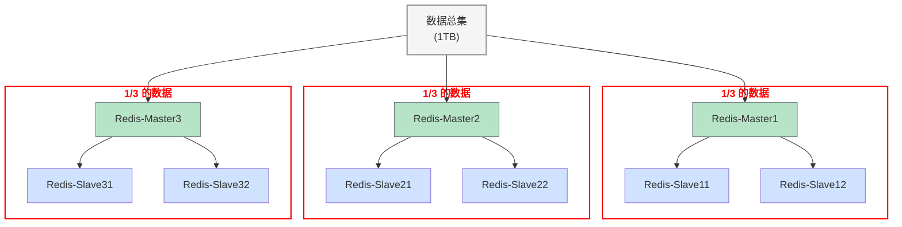

上图中，每个 slave 都是对应的 master 的备份，每个红框可以称为一个分片。

## 二、数据分片算法

### 1.哈希求余

设有 N 个分片，使用 [0, N-1] 这样的序号进行编号，针对某个给定的 key，先计算 hash 值，再把得到的结果 % N 即为分片编号。

> MD5：
>
> - 计算结果定长：方便比较，以及密文不应该和长度关联，以免泄露信息
> - 计算结果分散
> - 单向不可逆：网上的一些 md5 破解工具是查表

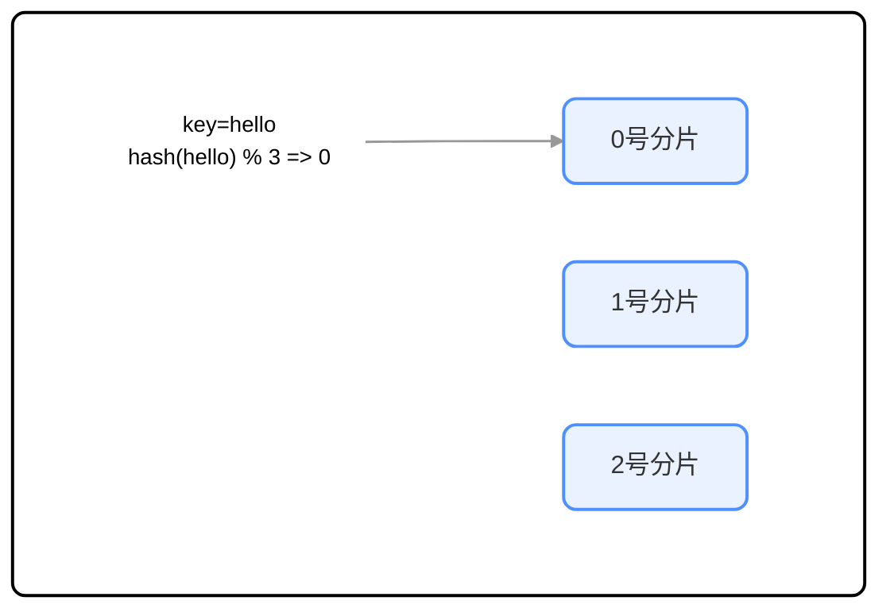

优点：简单高效，数据分配均匀

缺点：一旦需要进行扩容，N 改变，原有的映射规则被破坏，就需要让节点之间的数据互相传输，重新排列，此时 **开销很大**。

```mermaid
%% ================================
%% 扩容前后分片示意图（含外框）
%% ================================
graph TD

    %% ===== 外层黑色边框 =====
    subgraph 外框[" "]
      direction TB

	  
	  %% ===== 扩容后 =====
      subgraph 扩容后["扩容后"]
        direction LR
        B0["0号分片<br>100 104 108 112 116 120<br><span style='font-size:12px'>0号分片上只有108和120是之前的数据，其他数据都是通过搬运得到的</span>"]
        B1["1号分片<br>101 105 109 113 117<br><span style='font-size:12px'>1号分片上没有之前的数据，都是通过搬运得到的</span>"]
        B2["2号分片<br>102 106 110 114 118<br><span style='font-size:12px'>2号分片上只有110是之前的数据，其他都是搬运得到的</span>"]
        B3["3号分片<br>103 107 111 115 119<br><span style='font-size:12px'>3号分片是扩容得到的新分片，数据都是搬运得到的</span>"]
      end
      
      subgraph 箭头["<span style='font-size:36px'>&#x27F6;</span>"]
      	direction TB
      end
      
      %% ===== 扩容前 =====
      subgraph 扩容前["扩容前"]
        direction LR
        A0["0号分片<br>102 105 108 111<br>114 117 120"]
        A1["1号分片<br>100 103 106 109<br>112 115 118"]
        A2["2号分片<br>101 104 107 110<br>113 116 119"]
      end
    end

    %% ===== 样式 =====
    %% 外框：黑边透明背景
    style 外框 fill:none,stroke:#000,stroke-width:2px,rx:8px,ry:8px

    %% 扩容前分片：浅蓝底 蓝边
    style A0 fill:#eaf1ff,stroke:#4d90fe,stroke-width:2px,rx:8px,ry:8px
    style A1 fill:#eaf1ff,stroke:#4d90fe,stroke-width:2px,rx:8px,ry:8px
    style A2 fill:#eaf1ff,stroke:#4d90fe,stroke-width:2px,rx:8px,ry:8px

    %% 扩容后分片：浅橙底 橙边
    style B0 fill:#ffefd7,stroke:#ffa64d,stroke-width:2px,rx:8px,ry:8px
    style B1 fill:#ffefd7,stroke:#ffa64d,stroke-width:2px,rx:8px,ry:8px
    style B2 fill:#ffefd7,stroke:#ffa64d,stroke-width:2px,rx:8px,ry:8px
    style B3 fill:#ffefd7,stroke:#ffa64d,stroke-width:2px,rx:8px,ry:8px

    %% 去掉扩容前后边框背景
    style 扩容前 fill:none,stroke:none,color:#000,font-weight:bold
    style 扩容后 fill:none,stroke:none,color:#000,font-weight:bold
    style 箭头 fill:none,stroke:none,color:#000,font-weight:bold
    

```

如上图可以看到，整个扩容一共 21 个 key，只有 3 个 key 是没有经过搬运的，其他的 key 都是经过搬运的。

### 2.一致性哈希算法

<div style="display: flex; justify-content: center; gap: 20px;">
  <div style="border:2px solid black;">
    
  </div>
  <div style="border:2px solid black;">
    
  </div>
  <div style="border:2px solid black;">
    
  </div>
</div>

1. 把 $0\rightarrow 2^{32}-1$ 这个数据空间，映射到一个圆环上，数据按照顺时针方向增长

2. 假设当前存在三个分片，就把分片放在圆环的某个位置上

3. 假定有一个 key，计算出哈希值 H，从 H 所在位置，顺时针往下找，找到的第一个分片就是所属分片，相当于 N 个分片的位置把圆环分成了 N 个管辖区间。

4. 如何扩容？

   

   原有分片在环上位置不动，在环上重新安排一个分片即可，此时只需要把0号分片的部分数据搬运给3号分片，1、2号分片管理的区间不变

   - 优点：大大降低了扩容时的搬运的规模，提高了扩容操作的效率
   - 缺点：数据分配不均匀（有的多有的少，数据倾斜）

### 3.哈希槽分区算法（Redis 使用）

为了解决上述搬运成本高或数据分配不均匀的问题，Redis cluster 引入了哈希槽算法

```bash
hash_slot = crc16(key) % 16384
# 其中crc16也是⼀种hash算法 16384 = 16 * 1024 = 2^14 = 16k
```

相当于是把整个哈希值，映射到 16384 个槽位上，也就是 [0, 16383]，然后再把这些槽位比较均匀地分配给每个分片。

假设当前三个分片，一种可能的分配方式：

- 0号分片：`[0, 5461]`，共 5462 个槽位  
- 1号分片：`[5462, 10923]`，共 5462 个槽位  
- 2号分片：`[10924, 16383]`，共 5460 个槽位

> 这里的分片规则是很灵活的。每个分片持有的槽位也不一定连续。
>
> 每个分片的节点使用 **位图** 来表示自己持有哪些槽位。对于 `16384` 个槽位来说，需要 `2048` 个字节（`2KB`）大小的内存空间表示。

如果需要进行扩容，比如新增一个 3 号分片，就可以针对原有的槽位进行重新分配。 比如可以把之前每个分片持有的槽位，各拿出一点，分给新分片。

一种可能的分配方式：

- 0 号分片: [0, 4095]，共 4096 个槽位  
- 1 号分片: [5462, 9557]，共 4096 个槽位  
- 2 号分片: [10924, 15019]，共 4096 个槽位  
- 3 号分片: [4096, 5461] + [9558, 10923] + [15019, 16383]，共 4096 个槽位

#### 3.1 Redis 集群最多有 16384 个分片吗

不是，如果一个分片所拥有的槽位过少，集群的数据均衡难以保证，实际上 Redis 作者建议集群分片数不应该超过 1000

#### 3.2 为什么是 16384 个槽位

- 节点之间通过心跳包通信。心跳包中包含了该节点持有哪些 slots。这个是使用位图这样的数据结构表示的。表示 16384 (16k) 个 slots，需要的位图大小是 2KB。如果给定的 slots 数更多了，比如 65536 个了，此时就需要消耗更多的空间，8KB 位图表示。8KB，对于内存来说不算什么，但是在频繁的网络心跳包中，还是一个不小的开销的。

- 另一方面，Redis 集群一般不建议超过 1000 个分片。所以 16k 对于最大 1000 个分片来说是足够用的，同时也会使对应的槽位配置位图体积不至于很大。

## 三、集群搭建

接下来基于 docker 搭建一个集群，每个节点都是一个容器。拓扑结构如下：

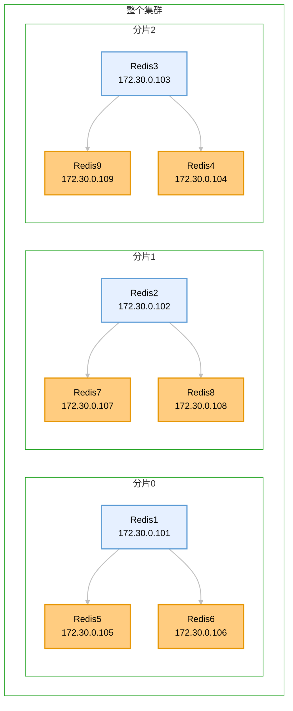

> 我们先创建出 11 个redis 节点，其中前 9 个用来演示集群的搭建，后两个用来演示集群扩容。

### 1.创建目录和配置

在创建目录前，先把之前哨兵的 docker 停掉，以免出现端口号冲突之类的情况。

创建 redis 目录，内部创建两个文件

```shell
redis-cluster/
├── docker-compose.yml
└── generate.sh
```

- generate.sh：

  > 在使用 Linux 的时候，都是通过一些命令来操作的，这些操作命令非常适合写到一个文件中批量化执行，同时还能加入函数，循环，条件等机制，因此，就可以完成更复杂的工作了。

  - `cluster-enabled yes`：启用集群。
    
  - `cluster-config-file nodes.conf`：集群节点生成的配置。

  - `cluster-node-timeout 5000`：节点失联的超时时间。
    
  - `cluster-announce-ip 172.30.0.101`：节点自身 IP。
    
  - `cluster-announce-port 6379`：节点自身的业务端口。
    
  - `cluster-announce-bus-port 16379`：节点自身的总线端口。集群管理的信息交互是通过这个端口进行的。

  ```shell
  # 预期效果：
  # 得到11个目录，每个目录里都有一个配置文件，配置文件中 ip 地址各不相同
  
  # 生成 redis1 ~ redis9 的配置
  for port in $(seq 1 9); do
    mkdir -p redis${port}/
    cat << EOF > redis${port}/redis.conf
  port 6379
  bind 0.0.0.0
  protected-mode no
  appendonly yes
  cluster-enabled yes
  cluster-config-file nodes.conf
  cluster-node-timeout 5000
  cluster-announce-ip 172.30.0.10${port}
  cluster-announce-port 6379
  cluster-announce-bus-port 16379
  EOF
  done
  
  
  # 生成 redis10 ~ redis11 的配置
  for port in $(seq 10 11); do
    mkdir -p redis${port}/
    cat << EOF > redis${port}/redis.conf
  port 6379
  bind 0.0.0.0
  protected-mode no
  appendonly yes
  cluster-enabled yes
  cluster-config-file nodes.conf
  cluster-node-timeout 5000
  cluster-announce-ip 172.30.0.1${port}
  cluster-announce-port 6379
  cluster-announce-bus-port 16379
  EOF
  done
  ```

  - shell 中 seq 也是一个命令：

    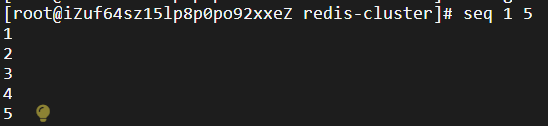

  - shell 中 {} 用来表示变量，不是代码块。对于 for，就是使用 do 和 done 来表示代码块的开始和结束的。

  - \ 是续行符，把下一行的命令和当前行的命令合并成一行。shell 默认情况下，要求把所有的代码都写到一行里。

  - shell 中字符串拼接是直接写到一起，不需要使用 +

- 执行命令：

  ```bash
  bash generate.sh
  ```

  ```shell
  -rw-r--r-- 1 root root  738 Nov  8 09:18 generate.sh
  drwxr-xr-x 2 root root 4096 Nov  8 09:46 redis1
  drwxr-xr-x 2 root root 4096 Nov  8 09:46 redis10
  drwxr-xr-x 2 root root 4096 Nov  8 09:46 redis11
  drwxr-xr-x 2 root root 4096 Nov  8 09:46 redis2
  drwxr-xr-x 2 root root 4096 Nov  8 09:46 redis3
  drwxr-xr-x 2 root root 4096 Nov  8 09:46 redis4
  drwxr-xr-x 2 root root 4096 Nov  8 09:46 redis5
  drwxr-xr-x 2 root root 4096 Nov  8 09:46 redis6
  drwxr-xr-x 2 root root 4096 Nov  8 09:46 redis7
  drwxr-xr-x 2 root root 4096 Nov  8 09:46 redis8
  drwxr-xr-x 2 root root 4096 Nov  8 09:46 redis9
  ```

### 2.编写 docker-compose.yml

- 先创建 networks，并分配网段为 172.30.0.0/24

  > 此处为了后续创建静态 ip，此时要先手动创建出网络，同时给这个网段也分配 ip。IP 地址 = 网络号 + 主机号，网络号来标识网段，主机号则是区分是当前网段中的哪一台主机。使用子网掩码的方式区分网络号和主机号，“24” 表示子网掩码左边24位是1，右边8位是0：255.255.255.0
  >
  > 网络号：172.30.0 
  >
  > - ip 是内网 ip，`10.*`、`172.16.*-172.31.*`、`192.168.*`
  >
  > - 不能和你当前主机上现有的其他网段冲突，我这里没有冲突
  >
  >   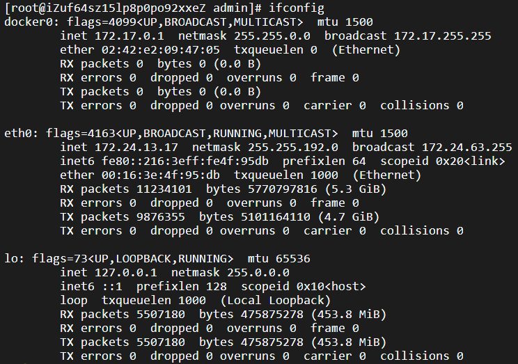
  >
  > 静态 ip：网络号要和前面的网段一致，主机号部分可以在1-255范围内随便配置且保证不重复。
  >
  > ```yaml
  > ipv4_address: 172.30.0.101
  > ```

- 配置每个节点，注意配置文件映射，端口映射，以及容器的 ip 地址。设置成固定 ip 方便后续的观察和操作

  > 此处端口映射不配置也可以，配置的目的是可以通过宿主机 ip + 映射的端口进行访问。通过容器自身 ip:6379 也可以访问

- docker-compose.yml：

  ```yaml
  version: '3.7'
  
  networks:
    mynet:
      ipam:
        config:
          - subnet: 172.30.0.0/24
  
  services:
    redis1:
      image: 'redis:5.0.9'
      container_name: redis1
      restart: always
      volumes:
        - ./redis1/:/etc/redis/
      ports:
        - 6371:6379
        - 16371:16379
      command: redis-server /etc/redis/redis.conf
      networks:
        mynet:
          ipv4_address: 172.30.0.101
  
    redis2:
      image: 'redis:5.0.9'
      container_name: redis2
      restart: always
      volumes:
        - ./redis2/:/etc/redis/
      ports:
        - 6372:6379
        - 16372:16379
      command: redis-server /etc/redis/redis.conf
      networks:
        mynet:
          ipv4_address: 172.30.0.102
  
    redis3:
      image: 'redis:5.0.9'
      container_name: redis3
      restart: always
      volumes:
        - ./redis3/:/etc/redis/
      ports:
        - 6373:6379
        - 16373:16379
      command: redis-server /etc/redis/redis.conf
      networks:
        mynet:
          ipv4_address: 172.30.0.103
  
    redis4:
      image: 'redis:5.0.9'
      container_name: redis4
      restart: always
      volumes:
        - ./redis4/:/etc/redis/
      ports:
        - 6374:6379
        - 16374:16379
      command: redis-server /etc/redis/redis.conf
      networks:
        mynet:
          ipv4_address: 172.30.0.104
  
    redis5:
      image: 'redis:5.0.9'
      container_name: redis5
      restart: always
      volumes:
        - ./redis5/:/etc/redis/
      ports:
        - 6375:6379
        - 16375:16379
      command: redis-server /etc/redis/redis.conf
      networks:
        mynet:
          ipv4_address: 172.30.0.105
  
    redis6:
      image: 'redis:5.0.9'
      container_name: redis6
      restart: always
      volumes:
        - ./redis6/:/etc/redis/
      ports:
        - 6376:6379
        - 16376:16379
      command: redis-server /etc/redis/redis.conf
      networks:
        mynet:
          ipv4_address: 172.30.0.106
  
    redis7:
      image: 'redis:5.0.9'
      container_name: redis7
      restart: always
      volumes:
        - ./redis7/:/etc/redis/
      ports:
        - 6377:6379
        - 16377:16379
      command: redis-server /etc/redis/redis.conf
      networks:
        mynet:
          ipv4_address: 172.30.0.107
  
    redis8:
      image: 'redis:5.0.9'
      container_name: redis8
      restart: always
      volumes:
        - ./redis8/:/etc/redis/
      ports:
        - 6378:6379
        - 16378:16379
      command: redis-server /etc/redis/redis.conf
      networks:
        mynet:
          ipv4_address: 172.30.0.108
  
    redis9:
      image: 'redis:5.0.9'
      container_name: redis9
      restart: always
      volumes:
        - ./redis9/:/etc/redis/
      ports:
        - 6379:6379
        - 16379:16379
      command: redis-server /etc/redis/redis.conf
      networks:
        mynet:
          ipv4_address: 172.30.0.109
  
    redis10:
      image: 'redis:5.0.9'
      container_name: redis10
      restart: always
      volumes:
        - ./redis10/:/etc/redis/
      ports:
        - 6380:6379
        - 16380:16379
      command: redis-server /etc/redis/redis.conf
      networks:
        mynet:
          ipv4_address: 172.30.0.110
  
    redis11:
      image: 'redis:5.0.9'
      container_name: redis11
      restart: always
      volumes:
        - ./redis11/:/etc/redis/
      ports:
        - 6381:6379
        - 16381:16379
      command: redis-server /etc/redis/redis.conf
      networks:
        mynet:
          ipv4_address: 172.30.0.111
  ```

  redis.conf 中的内容必须和 docker-compose.yml 中的内容匹配

  <div style="display: flex; justify-content: center; gap: 20px;">
    <div>
      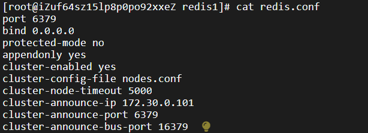
    </div>
    <div>
      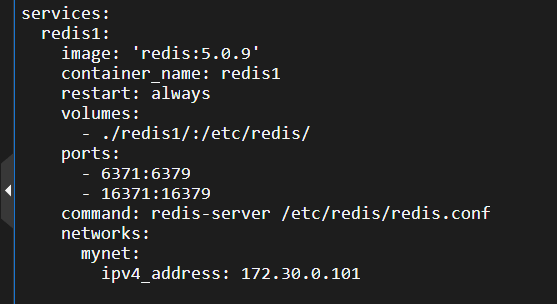
    </div>
  </div>

### 3.启动容器

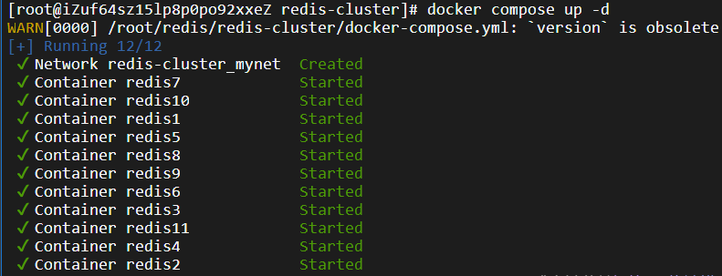

### 4.构建集群

```shell
redis-cli --cluster create \
172.30.0.101:6379 \
172.30.0.102:6379 \
172.30.0.103:6379 \
172.30.0.104:6379 \
172.30.0.105:6379 \
172.30.0.106:6379 \
172.30.0.107:6379 \
172.30.0.108:6379 \
172.30.0.109:6379 \
--cluster-replicas 2
```

- `--cluster create`：表示建立集群，后面填写每个节点的 ip 和地址
- `--cluster-replicas`：表示每个主节点需要两个从节点备份

> 谁主谁从，分片内都有谁，都不固定

执行命令后：

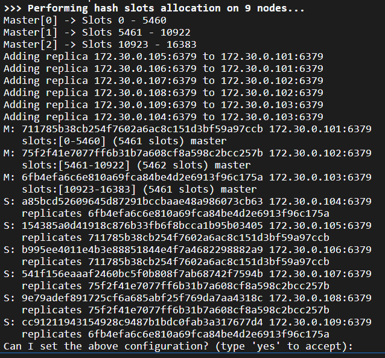

输入 yes 后见到下方的 OK 说明集群建立完成：

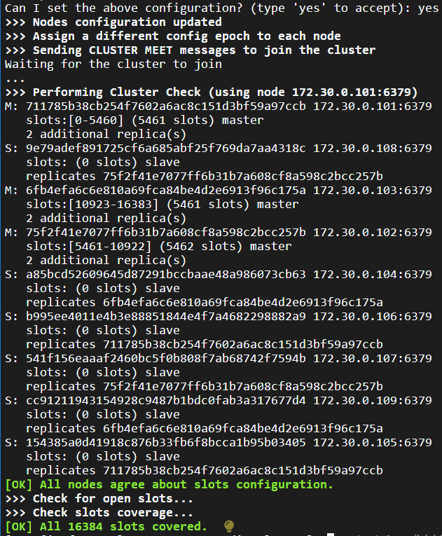

此时，使用客户端连接上集群中的任意一个节点，都相当于连上了整个集群

```shell
redis-cli -h 172.30.0.101 -p 6379 -c
```

- 客户端后面要加上 -c 选项，否则如果 key 没有落到当前节点上，是不能操作的。-c 会自动把请求重定向到对应节点

  由于数据分片，不加 -c  选项，key 不在当前节点上的时候会报错：

  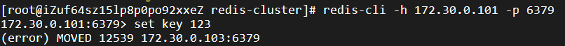

  加上 -c 选项可以操作，会触发重定向，可以发现101自动切换到103了：

  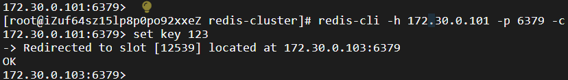

- 使用 cluster 可以查看到整个集群的情况

  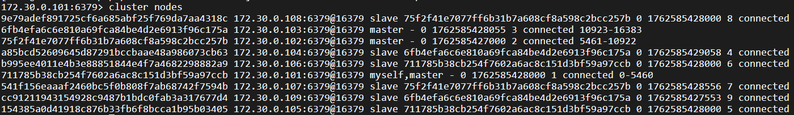

## 四、主节点宕机
