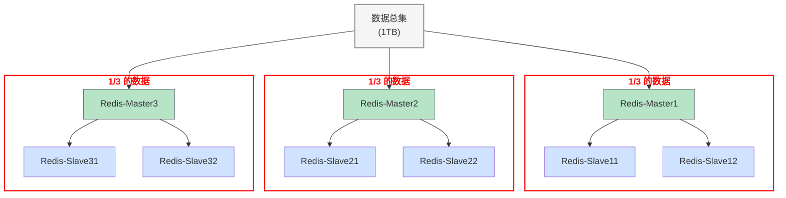

## 集群

```mermaid
graph TD
    A["数据总集<br>(1TB)"] --> B1[Redis-Master1]
    A --> B2[Redis-Master2]
    A --> B3[Redis-Master3]

    %% 分片1
    subgraph 分片1["<b><font color='red'>1/3 的数据</font></b>"]
        direction TB
        B1 --> C11[Redis-Slave11]
        B1 --> C12[Redis-Slave12]
    end

    %% 分片2
    subgraph 分片2["<b><font color='red'>1/3 的数据</font></b>"]
        direction TB
        B2 --> C21[Redis-Slave21]
        B2 --> C22[Redis-Slave22]
    end

    %% 分片3
    subgraph 分片3["<b><font color='red'>1/3 的数据</font></b>"]
        direction TB
        B3 --> C31[Redis-Slave31]
        B3 --> C32[Redis-Slave32]
    end

    %% 样式定义
    style 分片1 stroke:red,fill:none,stroke-width:2px
    style 分片2 stroke:red,fill:none,stroke-width:2px
    style 分片3 stroke:red,fill:none,stroke-width:2px

    style A fill:#f5f5f5,stroke:#999,stroke-width:2px
    style B1 fill:#b7e4c7,stroke:#6c757d
    style B2 fill:#b7e4c7,stroke:#6c757d
    style B3 fill:#b7e4c7,stroke:#6c757d
    style C11 fill:#cfe2ff,strok
    style C12 fill:#cfe2ff,strok
    style C21 fill:#cfe2ff,strok
    style C22 fill:#cfe2ff,strok
    style C31 fill:#cfe2ff,strok
    style C32 fill:#cfe2ff,strok

```

