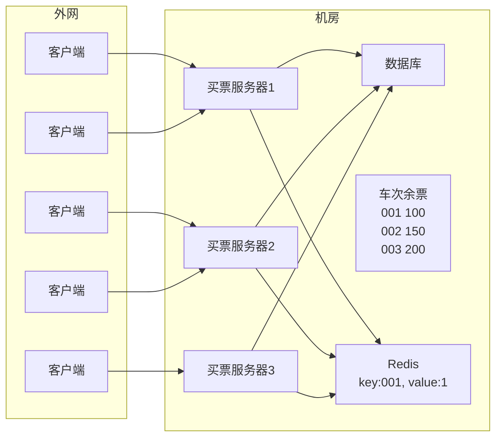
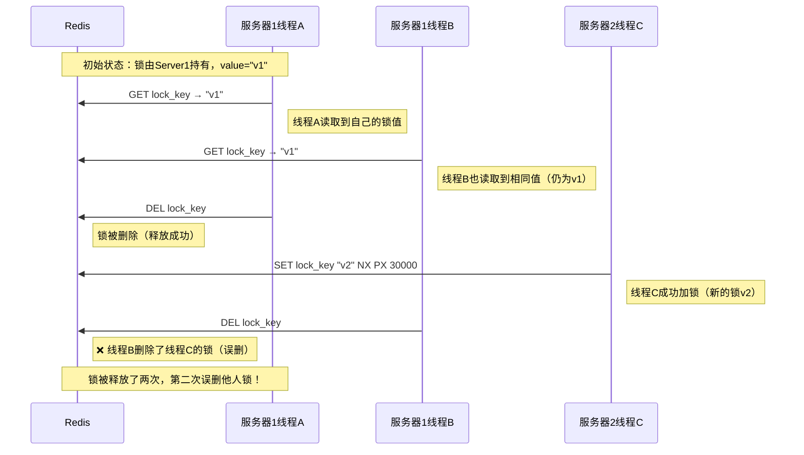
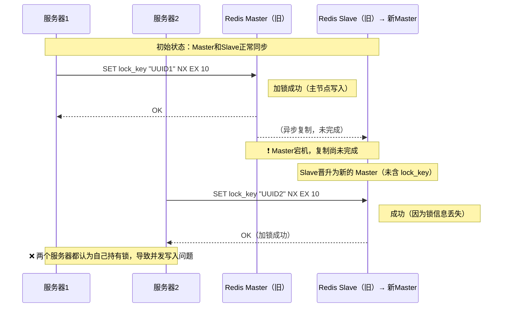
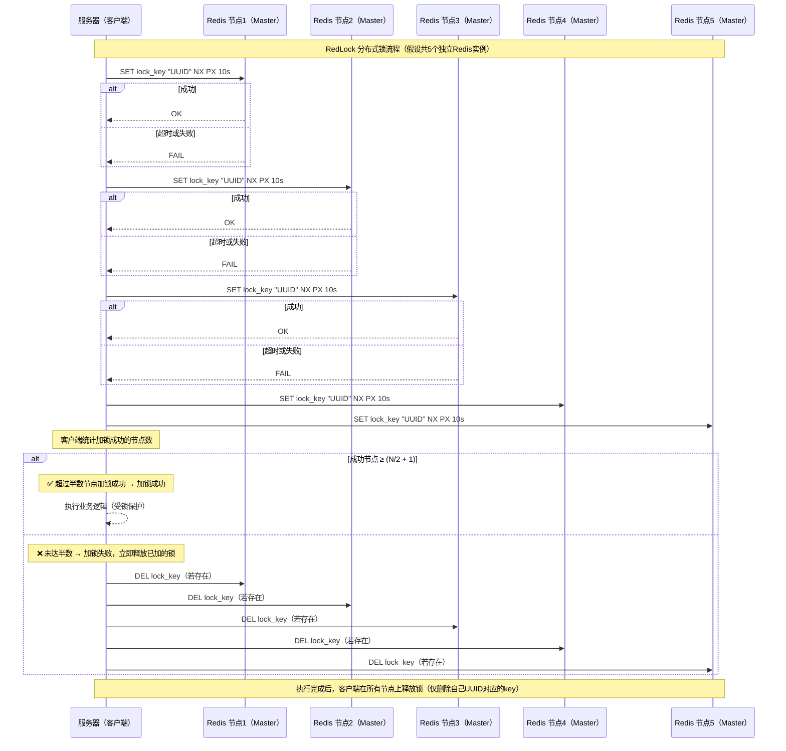

# Redis 典型应用

## 一、缓存

### 1.1 什么是缓存

缓存的核心思路就是把一些常用的数据放在触手可及（访问速度更快）的地方，方便随时读取。

> 缓存是一个相对概念，在计算机中，对于硬件的访问速度来说，通常情况如下：
>
> `CPU` 寄存器 > 内存 > 硬盘 > 网络
>
> - 硬盘相对于网络是触手可及的，就可以使用硬盘作为网络的缓存。
>
>   浏览器通过 `http/https` 从服务器（网络）上获取到数据并展示，像图片、音视频、字体等这些体积大，又不经常改变的数据就可以保存到浏览器本地，即浏览器所在主机的硬盘上，后续打开这个页面，就不必从网络上重新获取上述数据了。
>
> - 内存相对于硬盘是触手可及的，就可以使用内存作为硬盘的缓存。
>
>   `redis` 作为 `MySQL`的缓存
>
> - `CPU` 寄存器相对于内存是触手可及的，就可以使用 `CPU` 寄存器作为内存的缓存。

### 1.2 使用 Redis 作为缓存

- 为什么关系数据库性能不高？
  1. 数据库把数据存储在硬盘上，硬盘的 IO 速度并不快，尤其是随机访问
  2. 如果查询不能命中索引，就需要进行表的遍历，这就会大大增加硬盘 IO 次数
  3. 关系型数据库对于 SQL 的执行会做一系列的解析，校验和优化工作
  4. 如果是一些复杂查询，比如联合查询，需要进行笛卡尔积操作，效率更是降低很多

- 为什么并发量提高了就会宕机？

  1. 服务器每次处理一个请求，都是需要消耗一定硬件资源的，所谓的硬件资源包括不限于 CPU，内存，硬盘，网络带宽……
  2. 一个服务器的硬件资源本身是有限的，一个请求消耗一份资源，请求多了，自然把资源就耗尽了。后续的请求没有资源可用，自然无法正确处理。更严重的还会导致服务器代码出现崩溃。

  > 如何提高数据库能承担的并发量？
  >
  > - 开源：引入更多机器，构成数据库集群
  > - 节流：引入缓存
  >
  > 实际开发中，这两种方案往往是会搭配使用的

- 注意缓存是用来加快 **读操作** 的，**写操作** 不能由缓存提高性能

### 1.3 缓存的更新策略

哪些数据才是热点数据？

#### 1.3.1 定期生成

每隔一定周期，对于访问的数据频次进行统计，挑选出访问频次最高的前 N% 的数据。

> 写一套离线的流程，往往使用 python，shell 写脚本代码，可以通过定时任务来触发

- 优点：简单可控

- 缺点：实时性较低，对于一些突发情况应对并不好

  > 例如春节期间，春晚就会成为热词，而平时则很少有人会搜索

#### 1.3.2 实时生成

先给缓存设定容量上限（可以通过 Redis 配置文件的 maxmemory 参数确定）

接下来把用户每次查询：

- 如果在 Redis 中查到了，就直接返回
- 如果在 Redis 中不存在，就从数据库中查，把查到的结果同时也写入 Redis

如果缓存已经满了，就触发缓存淘汰策略，把一些相对不热门的数据淘汰掉。

按照上述过程，持续一段时间后，Redis 中的数据自然就是热门数据了

通用的淘汰策略主要有以下几种：

- FIFO 先进先出

- LRU 淘汰最久未使用

  记录每个 key 的最近访问时间，把最近访问时间最老的 key 淘汰掉

- LFU 淘汰访问次数最少的

  记录每个 key 最近一段时间的访问次数，把访问次数最少的淘汰掉

- Random 随机淘汰

Redis 内置的淘汰策略：

|      策略名       |    范围    | 算法类型 |          说明          |
| :---------------: | :--------: | :------: | :--------------------: |
|  `volatile-lru`   | 仅过期 key |   LRU    | 淘汰最近最少使用的 key |
|   `allkeys-lru`   |  所有 key  |   LRU    | 淘汰最近最少使用的 key |
|  `volatile-lfu`   | 仅过期 key |   LFU    | 淘汰最少使用频率的 key |
|   `allkeys-lfu`   |  所有 key  |   LFU    | 淘汰最少使用频率的 key |
| `volatile-random` | 仅过期 key |   随机   |        随机淘汰        |
| `allkeys-random`  |  所有 key  |   随机   |        随机淘汰        |
|  `volatile-ttl`   | 仅过期 key | TTL/FIFO |   按过期时间先后淘汰   |
|   `noeviction`    |  所有 key  |    无    |    不淘汰，写入报错    |

### 1.4 缓存常见问题

#### 1.4.1 缓存预热

缓存预热针对实时生成的数据，定期生成的数据不涉及预热。

- **概念**：  
  
  缓存预热是指在系统启动或缓存大量失效后，**提前将热点数据加载到缓存（如 Redis）中**，以避免数据库（如 MySQL）在缓存为空的情况下被大量请求直接访问，从而引发性能瓶颈或宕机风险。

- **应用场景**：  
  
  当 Redis 刚启动、或大量 key 同时过期失效时，缓存中可能没有可用数据，此时所有请求都会直接打到 MySQL，造成数据库压力激增。

- **解决思路**：  
  
  在系统启动或关键业务时段前，**提前将热点数据写入 Redis**，让 Redis 能立即提供服务， 充当 MySQL 的“保护伞”。热点数据可通过历史访问日志、统计分析等方式获取热点数据， 数据无需绝对精确，只要能覆盖大部分高频访问请求即可。

#### 1.4.2 缓存穿透

- **概念**：  
  
  缓存穿透是指访问的 **key 在 Redis 和数据库中都不存在** 的情况。 由于查询结果为空，这类 key **不会被写入缓存**，因此每次请求都会直接访问数据库， 导致数据库承受大量无效请求压力，严重时可能引发系统崩溃。

- **产生原因**：
  - 业务设计不合理：缺乏必要的参数校验，导致非法或无效 key 被直接查询。
  - 开发或运维误操作：例如误删了数据库中的部分数据。
  - 恶意攻击：黑客利用不存在的 key 进行频繁请求，造成数据库压力过大。

- **解决方案**：
  - **参数合法性校验**：  
    
    在查询前严格校验 key 的合法性。 例如查询手机号时，应先判断其格式是否符合合法手机号规则。

  - **缓存空结果**：  
    
    对数据库中确实不存在的 key，也将结果（如空字符串 `""` 或特殊标记）写入 Redis， 并设置较短的过期时间，避免重复访问数据库。

  - **使用布隆过滤器（Bloom Filter）**：  
    
    在查询前，先通过布隆过滤器判断 key 是否可能存在。 若判定为“不存在”，则直接拦截请求，避免访问数据库。 布隆过滤器结合了 **hash** 与 **bitmap** 的思想，能以较小空间和较快的速度高效判断元素存在性。

#### 1.4.3 缓存雪崩

- **概念**：  
  
  缓存雪崩是指 **短时间内大量缓存 key 同时失效**， 导致所有请求直接打到数据库，使数据库压力骤增甚至宕机的情况。 本来 Redis 是 MySQL 的“护盾”，当缓存突然失效时，MySQL 将独自承受所有请求压力。

- **产生原因**：
  - **Redis 故障或宕机**，导致缓存系统整体不可用。  
  - **大量 key 同时过期**，通常是因为在同一时间段内批量写入了缓存，并且设置了相同的过期时间。

- **解决方案**：
  - **部署高可用 Redis 集群**：  
    
    通过主从架构、哨兵模式或集群模式，提升 Redis 的可用性和容错能力。 同时建立 **完善的监控与报警机制**，及时发现和修复 Redis 故障。

  - **错峰设置过期时间**：  
    
    为缓存 key 的过期时间 **添加随机因子**， 避免大量 key 在同一时刻同时失效。 例如：  
    
  - **必要时避免设置过期时间**：  
    
    对部分重要、稳定的数据，可不设置过期时间，而通过异步更新机制维护缓存数据。

#### 1.4.4 缓存击穿

- **概念**：  
  
  缓存击穿（也称缓存“瘫痪”或“崩溃”）是指某个 **热点 key（被高频访问的缓存数据）在过期瞬间**， 大量请求同时访问该 key，发现缓存失效后 **并发地去请求数据库**， 导致数据库压力骤增，甚至宕机。 它可以看作是 **缓存雪崩的特殊情况**，但只针对单个或少量“热点 key”。

- **产生原因**：  
  - 热点 key 设置了过期时间，但在高并发访问下突然过期。  
  - 所有访问线程在缓存更新前同时穿透到数据库，造成数据库瞬时过载。

- **解决方案**：
  - **热点 key 永不过期**：  
    
    通过统计访问频率，识别热点 key，并设置为 **永不过期**， 由后台任务定期更新缓存内容，而非依赖自动过期。

  - **服务降级与分布式锁控制并发**：  
    
    当缓存失效、请求需要访问数据库时，可使用 **分布式锁** 限制并发， 只允许一个线程查询数据库并更新缓存，其他线程等待或返回默认数据。 这样可有效防止数据库被同时打爆。

## 二、分布式锁

### 2.1 分布式锁是什么

在分布式系统中，也会涉及到多个节点访问同一个公共资源的情况，需要用**锁**来做互斥控制，避免出现类似于线程安全的问题。

> 锁：保证程序在任意执行顺序下，执行逻辑都是正确的

此时需要用到分布式锁，分布式锁本质上是一个公共的服务器，来记录加锁的状态。这个公共服务器可以是 `Redis`，也可以是其他组件（比如 `Mysql` 或者 `ZooKeeper` 等），还可以是我们自己写的一个服务。

### 2.2 分布式锁的基础实现

**本质上通过一个键值对来标识锁的状态**

我们考虑一个买票系统，多个服务器节点都需要处理这个买票逻辑：先查询指定车次的余票，如果余票 > 0，则设置余票值 -1。



此时，如果买票服务器1尝试买票，就需要先访问 `Redis`，在`Redis` 上设置一个键值对，比如 `key` 是车次，`value` 随便设个值。这个操作设置成功视为加锁成功，买票过程结束后再把这个键值对删掉。在上述持有锁的过程中，如果服务器2也想买票，则也会尝试给 `Redis` 上写一个键值对，`key` 同样是车次，但此时发现该车次的 `key` 已经存在了，则服务器 2 需要阻塞或者放弃。

`Redis` 中提供了 `setnx` 操作，刚好适合这个场景，`key` 不存在就设置，存在则直接失败。解锁使用 `del` 命令。

> 上述的买票场景，使用 `Mysql` 的事务也可以，但是在分布式系统中要访问的共享资源不一定是 `Mysql`，也可能是其他没有事务的存储介质，也可能是执行一段特定的操作，通过统一的服务器来完成执行动作

### 2.3 引入过期时间

在服务器加锁后，处理买票的过程中，如果服务器1意外宕机了就会导致解锁操作（删除改 `key`）不能执行，就可能引起其他服务器始终无法获取到锁的情况。

> 这个问题无法像进程内锁的解决思路那样，用 RAII 解决，因为服务器进程异常， redis 服务器还是好的，不会像 RAII 那样，锁随着进程一起消亡。

所以使用 `set ex nx` 的方式，在设置锁的同时把过期时间也设置进去。

> 注意此处必须用一条命令来执行，如果分开操作，比如 setnx 之后，再来一个单独的 expire，由于 redis 的多个指令之间不存在关联，并且即使使用了事务也无法保证这两个操作一定都成功，即无法保证原子性，所以仍然会出现无法正确释放锁的问题。

### 2.4 引入校验 id

对于 redis 中写入的加锁键值对，其他的节点也是可以删除的。

> 比如服务器写入一个 “001”：1 这样的键值对，服务器2是完全可以把 “001” 给删除掉的。
>
> 当然服务器2也不会去恶意删除，不过不能保证因为一些 bug 导致的服务器2把锁误删除的情况。

为了解决上述问题，我们可以引入一个校验 id，比如可以把设置的键值对的值，设置为服务器的编号。形如 “001”：“服务器1”

**key：针对哪个资源加锁**

**value：服务器编号**（这里假定服务器是善意的，不会乱写一个编号）

这样可以在删除 `key` 解锁的时候，先校验当前删除 `key` 的服务器是否是当初加锁的服务器，如果是，才能真正删除；不是，则不能删除。

在解锁的时候，先查询判定，再执行 `del`，这样做并非是原子的。

因为一个服务器内部也是多线程的，所以可能存在以下状况：



| 时刻 | 操作           | 锁状态      | 说明                 |
| ---- | -------------- | ----------- | -------------------- |
| ①    | A `GET` → "v1" | 锁存在 (v1) | A 读取锁值           |
| ②    | B `GET` → "v1" | 锁仍是 (v1) | B 也读取锁值         |
| ③    | A `DEL`        | 锁被删除    | A 正常释放锁         |
| ④    | C `SET NX PX`  | 锁重建 (v2) | 另一台服务器获取新锁 |
| ⑤    | B `DEL`        | 锁被误删    | B 删除了 C 的锁 ❌    |

### 2.5 引入 Lua

为了使解锁操作有原子性，可以使用 `Redis` 的 `Lua` 脚本功能。

> Lua 语法类似于 JS，是一个动态弱类型语言。Lua 解释器一般使用 C 语言实现。Lua 语法简单精炼，执行速度快，解释器也比较轻量（Lua 解释器的可执行程序体积只有 200KB 左右）。
>
> 因此，Lua 经常作为其他程序内部嵌入的脚本语言，Redis 本身就支持 Lua 作为内嵌脚本。

使用 Lua 脚本实现上述解锁功能：

```lua
if redis.call('get', KEYS[1]) == ARGV[1] then
    return redis.call('del', KEYS[1])
else 
    return 0
end;
```

上述代码可以编写成一个 `.lua` 后缀的文件，由 `redis-cli` 或者 `redis-plus-plus` 或者 `jedis` 等客户端加载，并发送给 `redis` 服务器，由 `redis` 服务器来执行这段逻辑。

**一个 `lua` 脚本会被 `Redis` 服务器以原子的方式执行。**

### 2.6 引入看门狗

上述方案仍存在一个重要问题：当我们设置了 `key` 的过期时间之后（比如10s），可能任务还没执行完，`key` 就先过期了，这会导致锁提前失效。

设置的时间太短，可能不够，太长，可能释放锁不及时。因此相比于设置一个固定的时间，不如 **动态的调整时间** 更为合适。

所谓 `watch dog`，本质上是加锁服务器上的一个单独的线程，通过这个线程来对锁过期时间进行“续约”。**注意这个线程是业务服务器上的，不是 Redis 服务器的。**

举个例子：

初始情况下设置过期时间为 10s，同时设置看门狗线程每隔 3s 检测一次。

那么当 3s 时间到了的时候，看门狗线程就会判定当前任务是否完成：

- 如果任务已经完成，则直接通过 `lua` 脚本的方式，释放锁（删除 `key`)
- 如果任务未完成，则把过期时间重新设置为 10s （续约）

这样就不用担心锁提前失效的问题了。而且另一方面，如果该服务器挂了，看门狗线程也就随之挂了，此时无人续约，这个 `key` 自然就可以迅速过期，让其他服务器能够获取到锁了。

### 2.7 引入 Redlock 算法

实际工程中 Redis 一般是以集群方式部署的（至少是主从方式，而不是单机）。那么可能出现以下状况：



**Redlock 算法：**



| 步骤                             | 机制                              | 作用                                 |
| -------------------------------- | --------------------------------- | ------------------------------------ |
| 1️⃣ 多节点独立部署                 | 每个节点都是一个独立的 Redis 实例 | 避免主从复制延迟带来的锁丢失         |
| 2️⃣ 顺序尝试加锁                   | 设置较短超时时间（如 50ms）       | 防止单节点延迟导致整体阻塞           |
| 3️⃣ 超过半数节点成功即视为加锁成功 | 满足分布式一致性原则              | 即使部分节点宕机也不影响锁的安全性   |
| 4️⃣ 未达半数立即回滚               | 删除已加成功的锁                  | 避免“半锁”状态残留                   |
| 5️⃣ 使用 UUID 验证释放             | 仅能释放自己加的锁                | 防止误删其他客户端的锁（保证安全性） |
