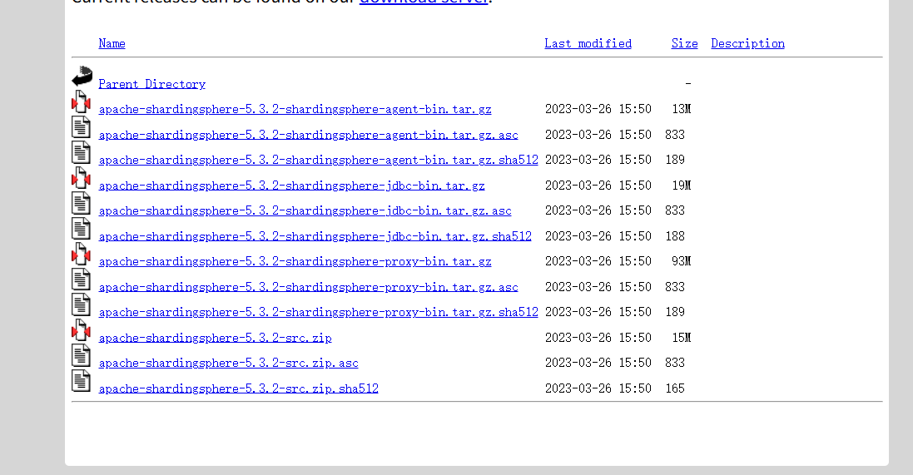
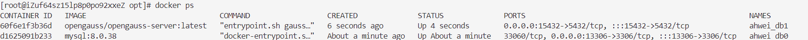
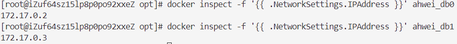
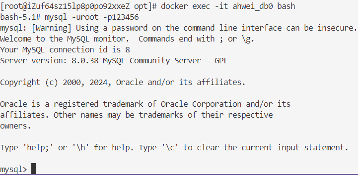
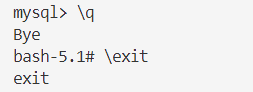
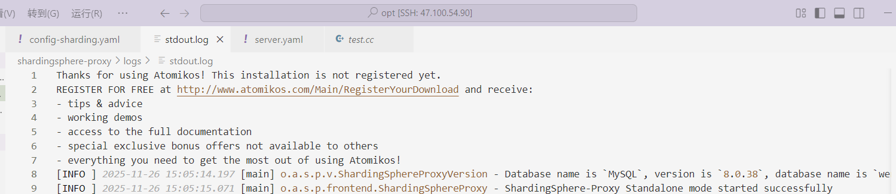
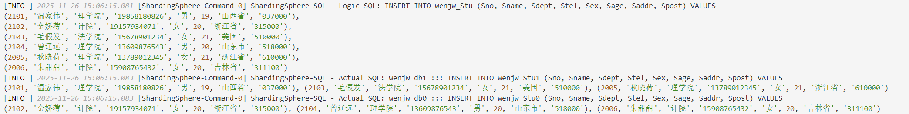
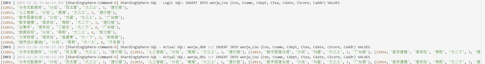
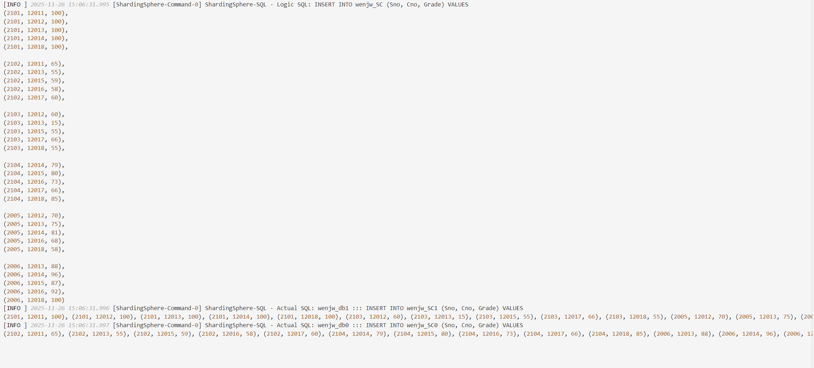

# 分布式数据库配置垂直分片

## 一、实验方案

shardingsphere 作为逻辑数据库，实际的物理数据库由 MySQL 和 openGauss 组成。其中，shardingsphere 安装在宿主机上，两个物理数据库由 docker 来构建。

## 二、搭建

### 1.安装 ShardingSphere-Proxy

我们通过二进制发布包的方式安装，我下载的是5.3.2，注意版本号，不同版本之间的配置不同：

点击 [链接](https://archive.apache.org/dist/shardingsphere/5.3.2/) 后，选择93M那个：



上传至服务器解压安装：

```shell
# 解压
tar -zxvf apache-shardingsphere-5.3.2-shardingsphere-proxy-bin.tar.gz
# 重命名⽬录
mv apache-shardingsphere-5.3.2-shardingsphere-proxy-bin shardingsphere-proxy
# 如果没有 java 运行时环境，这里要安装一下
```

进入 bin/ 目录：

```shell
# 启动
./start.sh
# 停止
./stop.sh
```

### 2.docker 启动 MySQL和 openGauss 数据库

#### 2.1 换源

如果下面的步骤 2.1、2.2 拉取超时，可以换国内的源：

```shell
vim /etc/docker/daemon.json
```

vim 打开 `daemon.json`，按 `i` 进入插入模式，把里面的内容替换为下面的：

```json
{
  "registry-mirrors": [
    "https://docker.1ms.run",
    "https://docker.mybacc.com",
    "https://dytt.online",
    "https://lispy.org",
    "https://docker.xiaogenban1993.com",
    "https://docker.yomansunter.com",
    "https://aicarbon.xyz",
    "https://666860.xyz",
    "https://docker.zhai.cm",
    "https://a.ussh.net",
    "https://hub.littlediary.cn",
    "https://hub.rat.dev",
    "https://docker.m.daocloud.io"
  ]
}
```

按 `Esc` 切换到普通模式，按 `:` 切换到底行模式，输入 `wq` 保存并退出。

#### 2.1 启动 MySQL

> 注意先启动 docker
>
> ```shell
> systemctl start docker
> ```

```shell
docker run -d \
  -p 13306:3306 \
  -v /ahwei/mysql/order0/conf:/etc/mysql/conf.d \
  -v /ahwei/mysql/order0/mysql:/var/lib/mysql \
  -e MYSQL_ROOT_PASSWORD=123456 \
  --name ahwei_db0 \
  --restart always \
  mysql:8.0.38
```

#### 2.2 启动 openGauss

```shell
docker run -d \
  -p 15432:5432 \
  -v /ahwei/opengauss/order1/data:/var/lib/opengauss \
  -e GS_PASSWORD=Ahwei@123 \
  -e GS_NODENAME=ahwei_db1 \
  -e GS_USER=omm \
  -e GS_DB=postgres \
  --name ahwei_db1 \
  --privileged=true \
  --restart=always \
  opengauss/opengauss-server:latest
```

此时，命令行输入 `docker ps`，发现两个容器都在正常运行：



### 3. 配置水平分片

配置水平分片时，仅需要配置 config-sharding.yaml 和 server.yaml。

#### 3.1 配置 config-sharding.yaml

```yaml
authority:
  users:
    - user: root@%
      password: 123456
  privilege:
    type: ALL_PERMITTED

props:
  sql-show: true
```

#### 3.2 配置 server.yaml

> `ip` 地址需要查询：
>
> ```shell
> docker inspect -f '{{ .NetworkSettings.IPAddress }}' ahwei_db0
> docker inspect -f '{{ .NetworkSettings.IPAddress }}' ahwei_db1
> ```
>
> 

```yaml
# 逻辑数据库
databaseName: wenjw_db

# 数据源配置：1个MySQL + 1个OpenGauss
dataSources:
  # MySQL数据源
  wenjw_db0:
    url: jdbc:mysql://172.17.0.2:3306/wenjw_db0?serverTimezone=UTC&useSSL=false&characterEncoding=utf8&allowPublicKeyRetrieval=true
    username: root
    password: 123456
    connectionTimeoutMilliseconds: 30000
    idleTimeoutMilliseconds: 60000
    maxLifetimeMilliseconds: 1800000
    maxPoolSize: 50
    minPoolSize: 1
  
  # OpenGauss数据源
  wenjw_db1:
    url: jdbc:postgresql://172.17.0.3:5432/wenjw_db1?useSSL=false&serverTimezone=UTC&characterEncoding=utf-8&allowPublicKeyRetrieval=true
    username: ahwei
    password: Ahwei@123
    connectionTimeoutMilliseconds: 30000
    idleTimeoutMilliseconds: 60000
    maxLifetimeMilliseconds: 1800000
    maxPoolSize: 50
    minPoolSize: 1

# 分片规则
rules:
  - !SHARDING
    tables:
      wenjw_Stu:
        # 逻辑表 wenjw_Stu 划分为以下两个实际表
        actualDataNodes: wenjw_db0.wenjw_Stu0, wenjw_db1.wenjw_Stu1
        tableStrategy:
          standard:
            shardingColumn: Sno
            shardingAlgorithmName: wenjw_Stu_inline
        keyGenerateStrategy:
          column: Sno
          keyGeneratorName: snowflake
      wenjw_SC:
        # 逻辑表 wenjw_SC 划分为以下两个实际表
        actualDataNodes: wenjw_db0.wenjw_SC0, wenjw_db1.wenjw_SC1
        tableStrategy:
          standard:
            shardingColumn: Sno
            shardingAlgorithmName: wenjw_SC_inline
        keyGenerateStrategy:
          column: Sno
          keyGeneratorName: snowflake

    # 配置绑定表
    bindingTables:
      - wenjw_Stu
      - wenjw_SC

    # 配置广播表
    broadcastTables:
      - wenjw_Cou

    # 默认的分库策略
    defaultDatabaseStrategy:
      standard:
        shardingColumn: Sno
        shardingAlgorithmName: database_inline

    defaultTableStrategy:
      none: {}

    # 配置分库分表算法
    shardingAlgorithms:
      database_inline:
        type: INLINE
        props:
          algorithm-expression: wenjw_db${Sno % 2}
          allow-range-query-with-inline-sharding: true
      wenjw_Stu_inline:
        type: INLINE
        props:
          algorithm-expression: wenjw_Stu${Sno % 2}
          allow-range-query-with-inline-sharding: true
      wenjw_SC_inline:
        type: INLINE
        props:
          algorithm-expression: wenjw_SC${Sno % 2}
          allow-range-query-with-inline-sharding: true

    # 配置主键生成器
    keyGenerators:
      snowflake:
        type: SNOWFLAKE

    # 配置审计器
    auditors:
      sharding_key_required_auditor:
        type: DML_SHARDING_CONDITIONS
```

### 4.数据库建库建表

#### 4.1 MySQL

1. 进入 mysql 客户端：

   - 进入 docker 容器：

     ```shell
     docker exec -it ahwei_db0 bash
     ```

   - 连接 MySQL 客户端：

     ```shell
     mysql -uroot -p123456
     ```

   

2. 建库

   ```mysql
   create database wenjw_db0 charset = 'utf8';
   use wenjw_db0;
   ```

3. 建表

   ```mysql
   CREATE TABLE wenjw_Stu0 (
       Sno INT PRIMARY KEY,
       Sname VARCHAR(100),
       Sdept VARCHAR(100),
       Stel VARCHAR(20),
       Sex VARCHAR(10),
       Sage INT,
       Saddr VARCHAR(200),
       Spost VARCHAR(10)
   );
   
   CREATE TABLE wenjw_Cou (
       Cno INT PRIMARY KEY,
       Cname VARCHAR(100),
       Cdept VARCHAR(100),
       Ctea VARCHAR(100),
       Cdate VARCHAR(20),
       CScore INT,
       Caddr VARCHAR(200)
   );
   
   CREATE TABLE wenjw_SC0 (
       Sno INT,
       Cno INT,
       Grade DECIMAL(4, 1) NOT NULL CHECK (Grade BETWEEN 0 AND 100),
       PRIMARY KEY (Sno, Cno),
       FOREIGN KEY (Sno) REFERENCES wenjw_Stu0(Sno),
       FOREIGN KEY (Cno) REFERENCES wenjw_Cou(Cno)
   );
   ```

4. 退出

   `\q` 退出 MySQL，`exit` 退出容器：

   

#### 4.2 openGauss

1. 进入 openGauss 客户端：

   ```
   docker exec -it ahwei_db1 bash
   gsql -d postgres -U omm
   ```

2. 新建用户

   ```sql
   CREATE USER ahwei WITH PASSWORD 'Ahwei@123';
   GRANT CONNECT ON DATABASE postgres TO ahwei;
   GRANT ALL PRIVILEGES ON SCHEMA public TO ahwei;
   ALTER USER ahwei WITH SYSADMIN;
   ```

   退出后用 ahwei 连接：

   ```shell
   gsql -d postgres -U ahwei
   ```

3. 建库

   ```sql
   CREATE DATABASE wenjw_db1 WITH ENCODING 'UTF8';
   \c wenjw_db1
   ```

4. 建表

   ```sql
   CREATE TABLE wenjw_Stu1 (
       Sno INT PRIMARY KEY,
       Sname VARCHAR(100),
       Sdept VARCHAR(100),
       Stel VARCHAR(20),
       Sex VARCHAR(10),
       Sage INT,
       Saddr VARCHAR(200),
       Spost VARCHAR(10)
   );
   
   CREATE TABLE wenjw_Cou (
       Cno INT PRIMARY KEY,
       Cname VARCHAR(100),
       Cdept VARCHAR(100),
       Ctea VARCHAR(100),
       Cdate VARCHAR(20),
       CScore INT,
       Caddr VARCHAR(200)
   );
   
   CREATE TABLE wenjw_SC1 (
       Sno INT,
       Cno INT,
       Grade DECIMAL(4, 1) NOT NULL CHECK (Grade BETWEEN 0 AND 100),
       PRIMARY KEY (Sno, Cno),
       FOREIGN KEY (Sno) REFERENCES wenjw_Stu1(Sno),
       FOREIGN KEY (Cno) REFERENCES wenjw_Cou(Cno)
   );
   ```

5. 退出

### 5.插入数据

在shardingsphere 文件夹的 bin/ 目录下，启动这个中间件：

```shell
./start.sh
```

如果看到如下日志就说明成功了：



用 MySQL 客户端连接：

```shell
mysql -h127.0.0.1 -P3307 -uroot -p123456
```

进入数据库后，插入数据：

```sql
use wenjw_db;
```

```sql
INSERT INTO wenjw_Stu (Sno, Sname, Sdept, Stel, Sex, Sage, Saddr, Spost) VALUES 
(2101, '温家伟', '理学院', '19858180826', '男', 19, '山西省', '037000'),
(2102, '金娇薄', '计院', '19157934071', '女', 20, '浙江省', '315000'),
(2103, '毛假发', '法学院', '15678901234', '女', 21, '美国', '510000'),
(2104, '曾辽远', '理学院', '13609876543', '男', 20, '山东市', '518000'),
(2005, '秋晓荷', '理学院', '13789012345', '女', 21, '浙江省', '610000'),
(2006, '朱甜甜', '计院', '15908765432', '女', 20, '吉林省', '311100');
```



```sql
INSERT INTO wenjw_Cou (Cno, Cname, Cdept, Ctea, Cdate, CScore, Caddr) VALUES 
(12011, '分布式数据库', '计院', '范玉雷', '大三上', 3, '健行楼'),
(12012, '人工智能', '计院', '高楠', '大三上', 3, '健行楼'),
(12013, '数字图像处理', '计院', '刘盛', '大三上', 2, '广知楼'),
(12014, '数学建模', '理学院', '周凯', '大二下', 3, '健行楼'),
(12015, '运筹学', '理学院', '丁晓东', '大二下', 4, '广知楼'),
(12016, '数据结构', '计院', '蒋莉', '大二上', 4, '郁文楼'),
(12017, '大学物理', '理学院', '施建青', '大一下', 3, '新教楼'),
(12018, '程序设计基础C', '计院', '蒋莉', '大一上', 4, '子良楼');
```



```sql
INSERT INTO wenjw_SC (Sno, Cno, Grade) VALUES 
(2101, 12011, 100),
(2101, 12012, 100),
(2101, 12013, 100),
(2101, 12014, 100),
(2101, 12018, 100),

(2102, 12011, 65),
(2102, 12013, 55),
(2102, 12015, 59),
(2102, 12016, 58),
(2102, 12017, 60),

(2103, 12012, 60),
(2103, 12013, 15),
(2103, 12015, 55),
(2103, 12017, 66),
(2103, 12018, 55),

(2104, 12014, 79),
(2104, 12015, 80),
(2104, 12016, 73),
(2104, 12017, 66),
(2104, 12018, 85),

(2005, 12012, 70),
(2005, 12013, 75),
(2005, 12014, 81),
(2005, 12016, 68),
(2005, 12018, 58),

(2006, 12013, 88),
(2006, 12014, 96),
(2006, 12015, 87),
(2006, 12016, 92),
(2006, 12018, 100);
```



其实每一条逻辑 SQL 都被转换成了对应的实际 SQL 在各自的数据库中执行。

## 三、注意

1. 我这里实际上是一台机器上模拟出两个节点配置的分布式数据库，实际如果是多台服务器（或服务器 + 虚拟机，参考我大三那次的 [文档](https://github.com/ahhhhwei/Big-Data-Course-Repository/blob/master/大三上/分布式数据库/实验/实验1.pdf)），应注意端口号开放问题
2. 我的服务器是阿里云的学生服务器，2核2G，因为开了两个 docker 容器，加上我用 vscode 连接的服务器，以及我下载过很多插件等等，服务器出现过死机的情况，我是在控制台重启后解决的
3. 日志文件中详细记录了 shardingsphere 的运行情况
