# 01.mysql的安装

## 一、Windows环境下安装

https://dev.mysql.com/downloads/


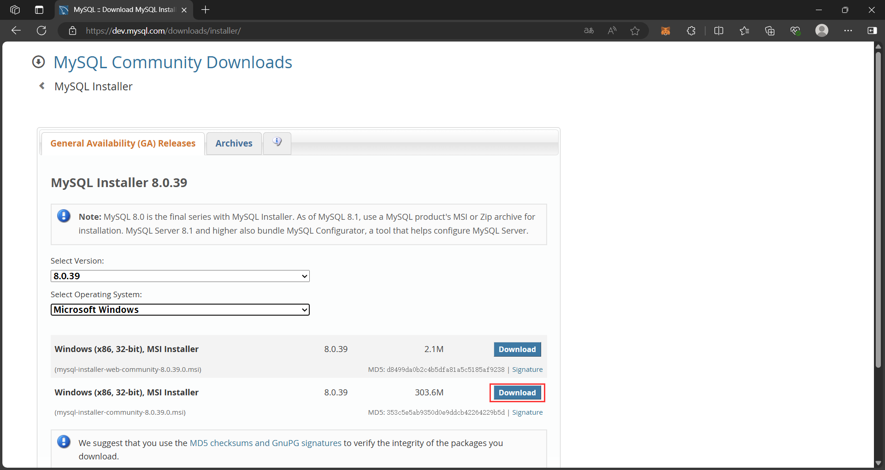


下载后点击，按照提示安装即可。


 选中MySQL Server,点击下方options设置安装目录以及数据存放位置（不要包含中文以及中文空格）


接下来都按照默认配置进行，然后设置密码：

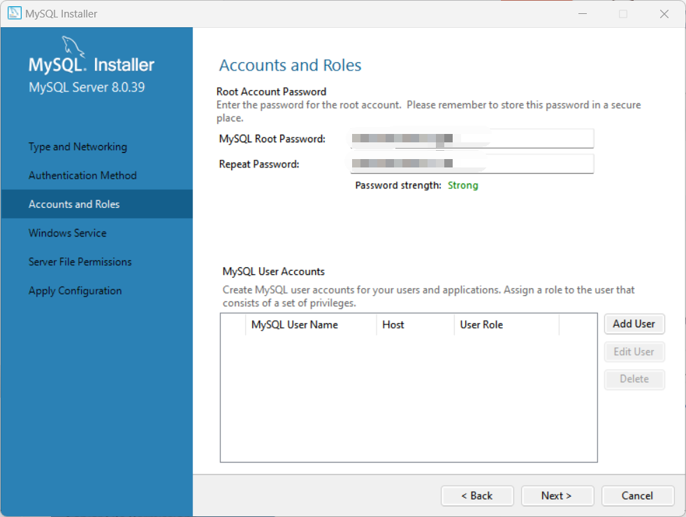

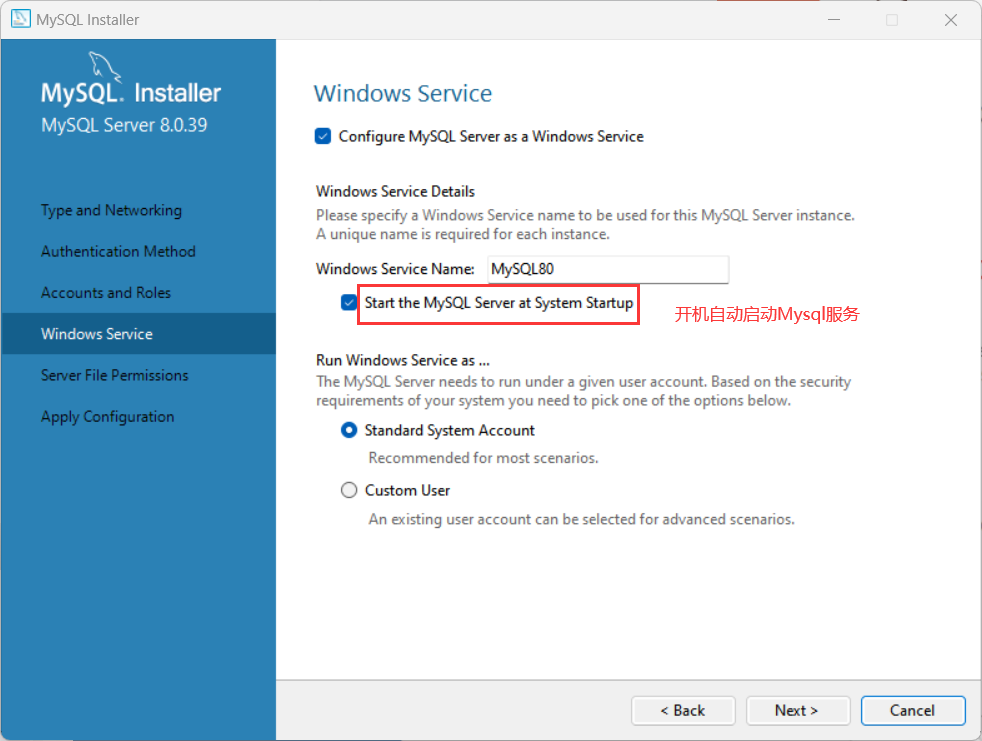

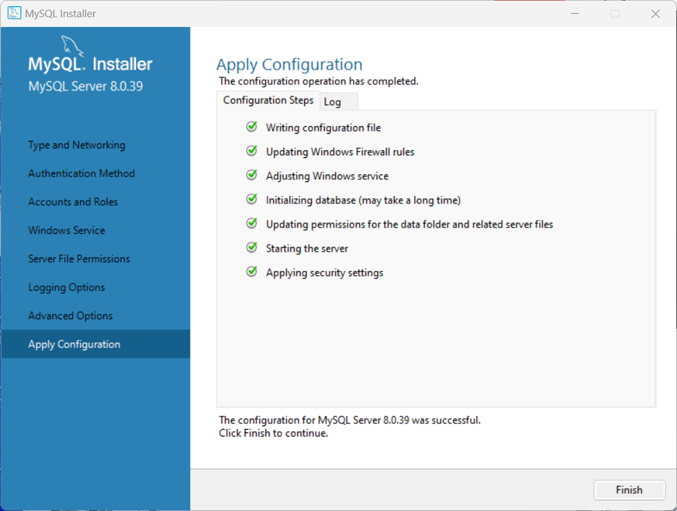

中间可能的报错：[MYSQL8.0.26安装出现initializing database安装失败解决 - 西七里 - 博客园 (cnblogs.com)](https://www.cnblogs.com/Yuanat/articles/15994908.html)

**配置环境变量：**

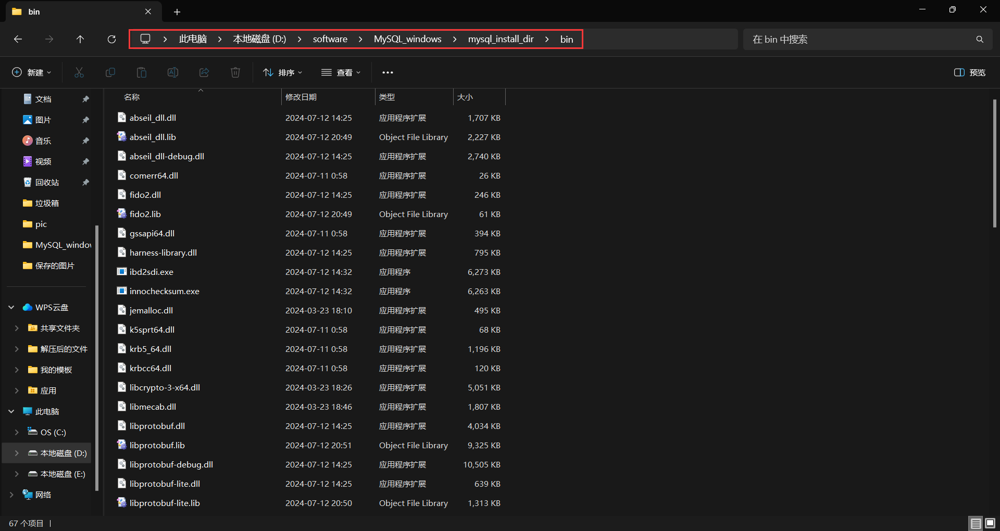

添加到环境变量的**PATH**中。

打开`cmd`，输入：

```shell
mysql --version
```

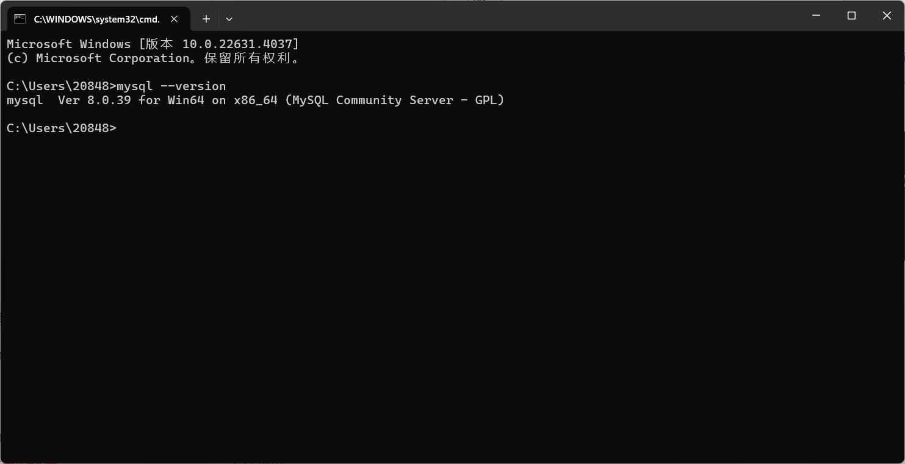

然后登录：

```shell
mysql -uroot -p
```

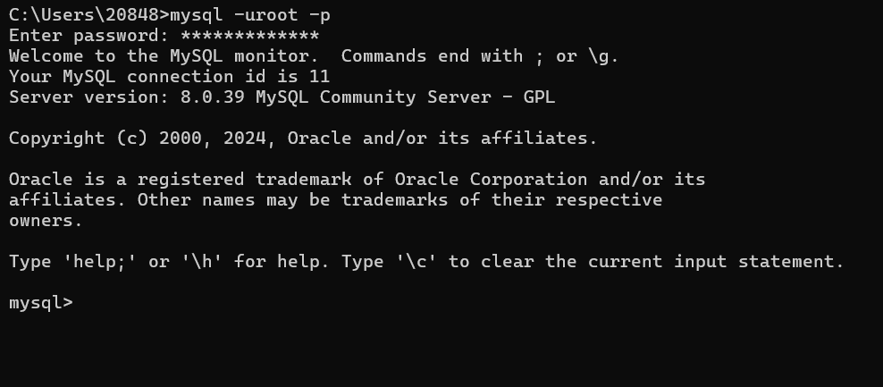

## 二、Linux环境下安装

### 1.centos安装Mysql

安装之前先确保没有MySQL服务正在运⾏，建议在没有安装过MySQL的机器上进⾏全新的安装。

> 操作系统版本为CentOS 7
>
> 使⽤ MySQL Yum仓库在 Linux 上安装 MySQL

#### 1.1 确认当前的系统版本

登录系统并切换⾄`root`账号，否则执⾏命令时需要⽤`sudo`命令，并按提⽰输⼊密码：

```shell
[ahwei@localhost ~]$ su -
Password: 
[root@localhost ~]# 
```

在终端中运⾏以下命令，查看系统版本。

```shell
cat /etc/redhat-release
```

如下所⽰，当前系统版本为CentOS Linux release7.9.2009

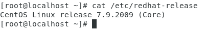

#### 1.2 添加 MySQL Yum 源

##### 1.2.1 访问MySQL开发者专区

https://dev.mysql.com/downloads/repo/yum

##### 1.2.2 根据当前系统选择对应的发布包

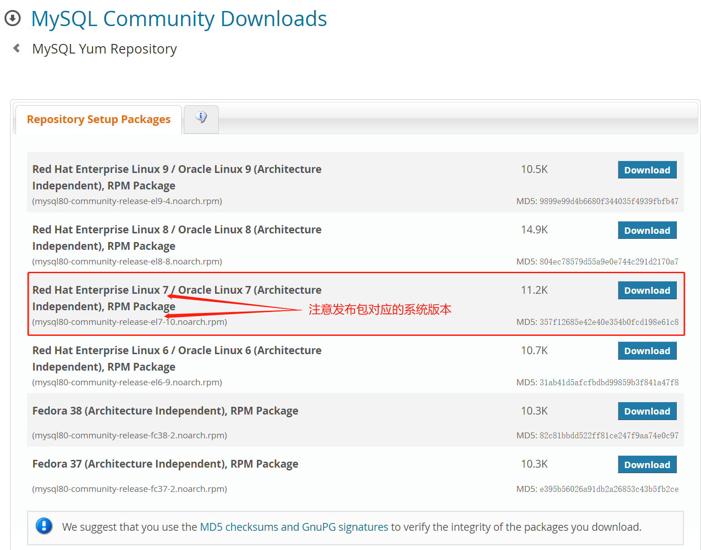

下载后拖入虚拟机中。

##### TIPS:

###### 1.发布包命名规则：

`{mysql80}-community-release`

`{platform}-{version-number}.noarch.rpm{mysql80}`：MySQL版本号

`{platform}`：平台(系统)号，⽤来描述系统的版本

`{version-number}`：MySQL仓库配置RPM包的版本号

###### 2.如下所示：

`mysql80-community-release-el7-10.noarch.rpm`

`mysql80`: MySQL版本号，默认是MySQL8.0版本

`el7` : 其中el 是 Enterprise Linux的编写，7表⽰ Linux⼤版本号，⽐如el6 表⽰ Linux6，el7表⽰Linux7，e8表⽰Linux8，el9表⽰Linux9，'fc' 则表⽰ Fedora

`el7-10`：表⽰MySQL仓库配置RPM包的第10次更新

###### 3.选择方式：

针对当前演示系统版本Linux7，以及我们要安装的MySQL数据库版本8.0，选择对应RPM包的最近⼀次更新，所以下载`mysql80-community-release-el7-10.noarch.rpm`即可

###### 4.其他版本

如果默认下载⻚⾯没有你所需要的RPM包，可以通过http://repo.mysql.com/查找

##### 1.2.3 安装发布包

在终端输入：

```shell
yum -y install mysql84-community-release-el7-1.noarch.rpm
```


**通过以下命令检查是否已成功添加 MySQL Yum 源：**

```shell
yum repolist enabled | grep mysql.*-community
```

```shell
[root@localhost mysql_setup]# yum repolist enabled | grep mysql.*-community
mysql-8.4-lts-community/x86_64          MySQL 8.4 LTS Community Server    0
mysql-connectors-community/x86_64       MySQL Connectors Community        0
mysql-tools-8.4-lts-community/x86_64    MySQL Tools 8.4 LTS Community     0
```

#### 1.3 安装 MySQL

在终端执⾏：

```shell
yum install mysql-community-server
```

> 若有报错：Cannot find a valid baseurl for repo: base/7/x86_64
>
> 参考以下链接：[已解决centos7 yum报错：cannot find a valid baseurl for repo:base/7/x86_64的解决方案_cannot find a valid baseurl for repo: base-CSDN博客](https://blog.csdn.net/g310773517/article/details/140321025?ops_request_misc=%7B%22request%5Fid%22%3A%22061AF803-21E6-490B-A789-5BA0E03DEFB1%22%2C%22scm%22%3A%2220140713.130102334..%22%7D&request_id=061AF803-21E6-490B-A789-5BA0E03DEFB1&biz_id=0&utm_medium=distribute.pc_search_result.none-task-blog-2~all~top_positive~default-1-140321025-null-null.142^v100^pc_search_result_base1&utm_term=Cannot find a valid baseurl for repo%3A base%2F7%2Fx86_64&spm=1018.2226.3001.4187)

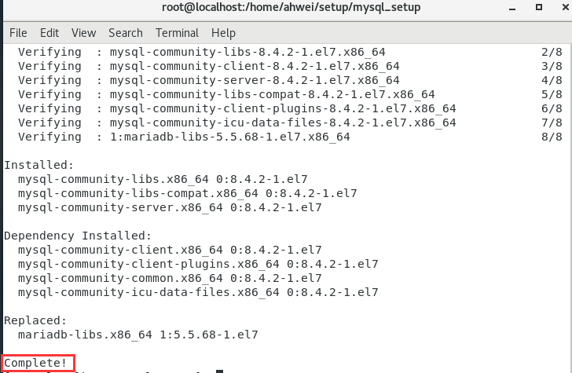

#### 1.4 启动 MySQL 服务器

在终端执行：

```shell
systemctl start mysqld
```


不报错即成功！

#### 1.5 查看MySQL 服务状态

在终端执行：

```shell
systemctl status mysqld
```

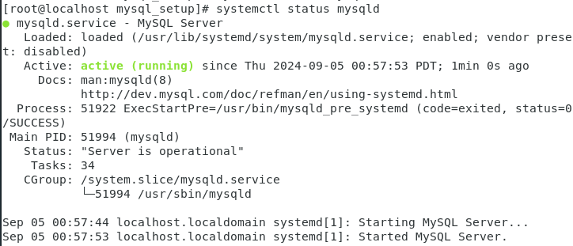

> [!NOTE]
>
> 可以使⽤ `systemctl [stop| start| restart| status] mysqld`, 命令对MySQL服务进⾏[停⽌| 启动|重启|查看服务状态]操作

#### 1.6 开启自启动

在终端执行：

```shell
systemctl enable mysqld
```

查看自启动状态：

```shell
systemctl list-unit-files|grep mysqld
```

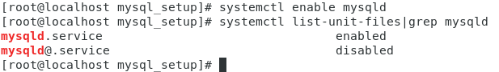

#### 1.7 登录MySQL

首次安装成功，MySQL把root用户的默认密码保存在错误⽇志中，这个密码是一个随机的字符串。

在终端执行以下命令查看：

```shell
grep 'temporary password' /var/log/mysqld.log 
```


使用密码登录：

```shell
mysql -uroot -p
```


#### 1.8 修改密码

> [!NOTE]
>
> `validate_password` 组件是默认安装的，实现的默认密码策略，要求密码⾄少包含1个⼤写字⺟、1个⼩写字⺟、1个数字和1个特殊字符，密码总⻓度⾄少为8个字符。

在执行任何SQL语句前必须先修改密码：

```mysql
ALTER USER 'root'@'localhost' IDENTIFIED BY 'Qq123*-.1';
```


##### 1.8.1 默认密码策略

密码策略分为 `LOW` 、 `MEDIUM` (默认)和 `STRONG` ，分别⽤0，1(默认)，2表⽰。0表示只校验密码⻓度，⻓度最⼩为8，所以以后要设置简单密码时还需要修改密码的⻓度限制。他们分别⽤两个系统变量`validate-password.policy`和`validate_password.length`表示在MySQL客户端运行以下命令查看当前设置：

```mysql
show variables like 'validate_password.policy';
```


```mysql
show variables like 'validate_password.length'; 
```


##### 1.8.2 设置简单密码

如果我们要在开发环境设置如123456的简单密码那么就要修改默认密码策略，我们只需要设置`validate-password.policy`和`validate_password.length`对应的值即可。

```mysql
set global validate_password.policy=0;
```


```mysql
set global validate_password.length=4;
```

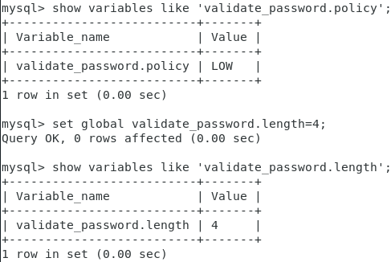

设置新密码：

```mysql
ALTER USER 'root'@'localhost' IDENTIFIED BY '123456';
```

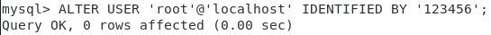

### 2.ubuntu安装MySQL

#### 2.1 查看操作系统版本

```shell
lsb_release -a
```


#### 2.2 添加 MySQL APT 源

##### 2.2.1 访问下载页面并下载发布包

https://dev.mysql.com/downloads/repo/apt/


下载好后用xftp传入虚拟机。

##### 2.2.2 安装发布包

> [!NOTE]
>
> 发布包的命名格式：`mysql-apt-config_w.x.y-z_all.deb`
> 可以在⽀持APT打包⼯具的`Debian`和`Ubuntu`系统中使⽤相同的发布包

切换到root用户，并查看：

```shell
sudo su
ls
```

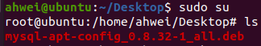

#### 2.3 安装发布包

**执行安装命令：**

```shell
dpkg -i mysql-apt-config_0.8.32-1_all.deb
```

按照下图选择：

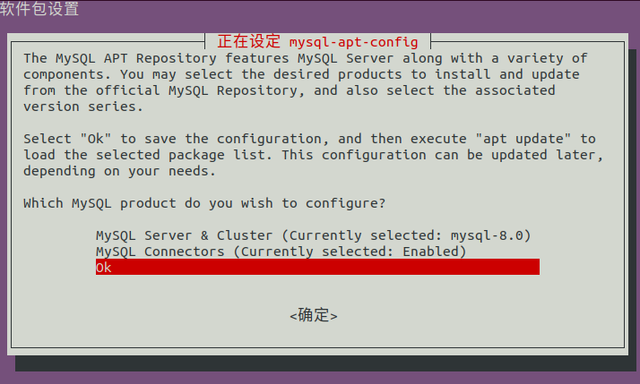

选择OK后，安装包安装成功：

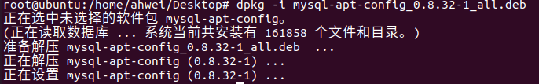

**从MySQL APT 源更新包信息：**

```shell
apt-get update
```

#### 2.4 安装Mysql

```shell
apt-get install mysql-server #这里最好不要加-y，之后手动确认就行
```

设置密码，可以设置简单密码：


重复输入密码后，确定。

选择密码策略：


安装成功：


#### 2.5 查看MySQL状态

```shell
systemctl status mysql # 这里和MySQL不同，只是mysql
```

看到`active (running)`就说明正常运行。

> [!NOTE]
>
> 可以使⽤ `systemctl [stop| start| restart| status] mysql`, 命令对MySQL服务进⾏[停⽌| 启动|重启|查看服务状态]操作

#### 2.6 开启⾃启动

设置自启动：

```shell
systemctl enable mysql
```

查看状态：

```
systemctl list-unit-files|grep mysql
```


#### 2.7 登录MySQL

```shell
mysql -uroot -p
```


